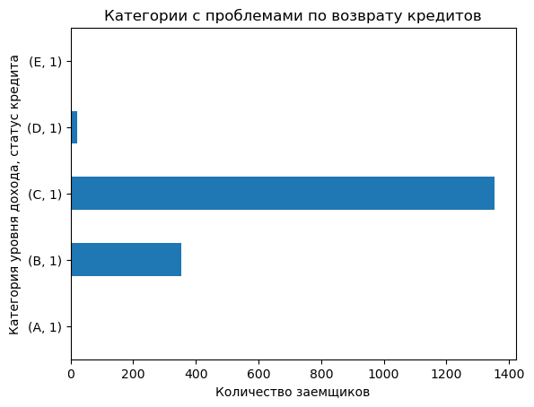

# Исследование надежности заемщиков

**Цель:** \
Исследовать влияние семейного положения и количества детей на факт возврата кредита в срок. 

**Данные:** \
Статистика о платёжеспособности клиентов.

<h1>Содержание<span class="tocSkip"></span></h1>
<div class="toc"><ul class="toc-item"><li><span><a href="#Откроем-таблицу-и-изучим-общую-информацию-о-данных" data-toc-modified-id="Откроем-таблицу-и-изучим-общую-информацию-о-данных-1"><span class="toc-item-num">1&nbsp;&nbsp;</span>Откроем таблицу и изучим общую информацию о данных</a></span></li><li><span><a href="#Предобработка-данных" data-toc-modified-id="Предобработка-данных-2"><span class="toc-item-num">2&nbsp;&nbsp;</span>Предобработка данных</a></span><ul class="toc-item"><li><span><a href="#Удаление-пропусков" data-toc-modified-id="Удаление-пропусков-2.1"><span class="toc-item-num">2.1&nbsp;&nbsp;</span>Удаление пропусков</a></span></li><li><span><a href="#Обработка-аномальных-значений" data-toc-modified-id="Обработка-аномальных-значений-2.2"><span class="toc-item-num">2.2&nbsp;&nbsp;</span>Обработка аномальных значений</a></span></li><li><span><a href="#Удаление-пропусков-(продолжение)" data-toc-modified-id="Удаление-пропусков-(продолжение)-2.3"><span class="toc-item-num">2.3&nbsp;&nbsp;</span>Удаление пропусков (продолжение)</a></span></li><li><span><a href="#Изменение-типов-данных" data-toc-modified-id="Изменение-типов-данных-2.4"><span class="toc-item-num">2.4&nbsp;&nbsp;</span>Изменение типов данных</a></span></li><li><span><a href="#Обработка-дубликатов" data-toc-modified-id="Обработка-дубликатов-2.5"><span class="toc-item-num">2.5&nbsp;&nbsp;</span>Обработка дубликатов</a></span></li><li><span><a href="#Категоризация-данных" data-toc-modified-id="Категоризация-данных-2.6"><span class="toc-item-num">2.6&nbsp;&nbsp;</span>Категоризация данных</a></span></li><li><span><a href="#Исследуем-данные" data-toc-modified-id="Исследуем-данные-2.7"><span class="toc-item-num">2.7&nbsp;&nbsp;</span>Исследуем данные</a></span><ul class="toc-item"><li><span><a href="#Гипотеза-№1" data-toc-modified-id="Гипотеза-№1-2.7.1"><span class="toc-item-num">2.7.1&nbsp;&nbsp;</span>Гипотеза №1</a></span></li><li><span><a href="#Рассмотрим-группу-людей-с-детьми" data-toc-modified-id="Рассмотрим-группу-людей-с-детьми-2.7.2"><span class="toc-item-num">2.7.2&nbsp;&nbsp;</span>Рассмотрим группу людей с детьми</a></span></li><li><span><a href="#Есть-ли-зависимость-между-семейным-положением-и-возвратом-кредита-в-срок?" data-toc-modified-id="Есть-ли-зависимость-между-семейным-положением-и-возвратом-кредита-в-срок?-2.7.3"><span class="toc-item-num">2.7.3&nbsp;&nbsp;</span>Есть ли зависимость между семейным положением и возвратом кредита в срок?</a></span></li><li><span><a href="#Есть-ли-зависимость-между-уровнем-дохода-и-возвратом-кредита-в-срок?" data-toc-modified-id="Есть-ли-зависимость-между-уровнем-дохода-и-возвратом-кредита-в-срок?-2.7.4"><span class="toc-item-num">2.7.4&nbsp;&nbsp;</span>Есть ли зависимость между уровнем дохода и возвратом кредита в срок?</a></span></li><li><span><a href="#Как-разные-цели-кредита-влияют-на-его-возврат-в-срок?" data-toc-modified-id="Как-разные-цели-кредита-влияют-на-его-возврат-в-срок?-2.7.5"><span class="toc-item-num">2.7.5&nbsp;&nbsp;</span>Как разные цели кредита влияют на его возврат в срок?</a></span></li><li><span><a href="#Возможные-причины-появления-пропусков-в-исходных-данных." data-toc-modified-id="Возможные-причины-появления-пропусков-в-исходных-данных.-2.7.6"><span class="toc-item-num">2.7.6&nbsp;&nbsp;</span>Возможные причины появления пропусков в исходных данных.</a></span></li><li><span><a href="#Заполнение-пропусков-медианным-значением---это-лучшее-решение-для-количественных-переменных" data-toc-modified-id="Заполнение-пропусков-медианным-значением---это-лучшее-решение-для-количественных-переменных-2.7.7"><span class="toc-item-num">2.7.7&nbsp;&nbsp;</span>Заполнение пропусков медианным значением - это лучшее решение для количественных переменных</a></span></li></ul></li><li><span><a href="#Общий-вывод:" data-toc-modified-id="Общий-вывод:-2.8"><span class="toc-item-num">2.8&nbsp;&nbsp;</span>Общий вывод:</a></span></li></ul></li></ul></div>

## Откроем таблицу и изучим общую информацию о данных

**Импортируем библиотеку pandas. Считаем данные из csv-файла в датафрейм и сохраним в переменную `data`.**


```python
import pandas as pd

try:
    data = pd.read_csv('/datasets/data.csv')
except:
    data = pd.read_csv('datasets/data.csv')
```

**Выведем первые 20 строчек датафрейма `data` на экран.**


```python
data_old = data.copy()
data.head(20)
```


<div>
<style scoped>
    .dataframe tbody tr th:only-of-type {
        vertical-align: middle;
    }

    .dataframe tbody tr th {
        vertical-align: top;
    }

    .dataframe thead th {
        text-align: right;
    }
</style>
<table border="1" class="dataframe">
  <thead>
    <tr style="text-align: right;">
      <th></th>
      <th>children</th>
      <th>days_employed</th>
      <th>dob_years</th>
      <th>education</th>
      <th>education_id</th>
      <th>family_status</th>
      <th>family_status_id</th>
      <th>gender</th>
      <th>income_type</th>
      <th>debt</th>
      <th>total_income</th>
      <th>purpose</th>
    </tr>
  </thead>
  <tbody>
    <tr>
      <th>0</th>
      <td>1</td>
      <td>-8437.673028</td>
      <td>42</td>
      <td>высшее</td>
      <td>0</td>
      <td>женат / замужем</td>
      <td>0</td>
      <td>F</td>
      <td>сотрудник</td>
      <td>0</td>
      <td>253875.639453</td>
      <td>покупка жилья</td>
    </tr>
    <tr>
      <th>1</th>
      <td>1</td>
      <td>-4024.803754</td>
      <td>36</td>
      <td>среднее</td>
      <td>1</td>
      <td>женат / замужем</td>
      <td>0</td>
      <td>F</td>
      <td>сотрудник</td>
      <td>0</td>
      <td>112080.014102</td>
      <td>приобретение автомобиля</td>
    </tr>
    <tr>
      <th>2</th>
      <td>0</td>
      <td>-5623.422610</td>
      <td>33</td>
      <td>Среднее</td>
      <td>1</td>
      <td>женат / замужем</td>
      <td>0</td>
      <td>M</td>
      <td>сотрудник</td>
      <td>0</td>
      <td>145885.952297</td>
      <td>покупка жилья</td>
    </tr>
    <tr>
      <th>3</th>
      <td>3</td>
      <td>-4124.747207</td>
      <td>32</td>
      <td>среднее</td>
      <td>1</td>
      <td>женат / замужем</td>
      <td>0</td>
      <td>M</td>
      <td>сотрудник</td>
      <td>0</td>
      <td>267628.550329</td>
      <td>дополнительное образование</td>
    </tr>
    <tr>
      <th>4</th>
      <td>0</td>
      <td>340266.072047</td>
      <td>53</td>
      <td>среднее</td>
      <td>1</td>
      <td>гражданский брак</td>
      <td>1</td>
      <td>F</td>
      <td>пенсионер</td>
      <td>0</td>
      <td>158616.077870</td>
      <td>сыграть свадьбу</td>
    </tr>
    <tr>
      <th>5</th>
      <td>0</td>
      <td>-926.185831</td>
      <td>27</td>
      <td>высшее</td>
      <td>0</td>
      <td>гражданский брак</td>
      <td>1</td>
      <td>M</td>
      <td>компаньон</td>
      <td>0</td>
      <td>255763.565419</td>
      <td>покупка жилья</td>
    </tr>
    <tr>
      <th>6</th>
      <td>0</td>
      <td>-2879.202052</td>
      <td>43</td>
      <td>высшее</td>
      <td>0</td>
      <td>женат / замужем</td>
      <td>0</td>
      <td>F</td>
      <td>компаньон</td>
      <td>0</td>
      <td>240525.971920</td>
      <td>операции с жильем</td>
    </tr>
    <tr>
      <th>7</th>
      <td>0</td>
      <td>-152.779569</td>
      <td>50</td>
      <td>СРЕДНЕЕ</td>
      <td>1</td>
      <td>женат / замужем</td>
      <td>0</td>
      <td>M</td>
      <td>сотрудник</td>
      <td>0</td>
      <td>135823.934197</td>
      <td>образование</td>
    </tr>
    <tr>
      <th>8</th>
      <td>2</td>
      <td>-6929.865299</td>
      <td>35</td>
      <td>ВЫСШЕЕ</td>
      <td>0</td>
      <td>гражданский брак</td>
      <td>1</td>
      <td>F</td>
      <td>сотрудник</td>
      <td>0</td>
      <td>95856.832424</td>
      <td>на проведение свадьбы</td>
    </tr>
    <tr>
      <th>9</th>
      <td>0</td>
      <td>-2188.756445</td>
      <td>41</td>
      <td>среднее</td>
      <td>1</td>
      <td>женат / замужем</td>
      <td>0</td>
      <td>M</td>
      <td>сотрудник</td>
      <td>0</td>
      <td>144425.938277</td>
      <td>покупка жилья для семьи</td>
    </tr>
    <tr>
      <th>10</th>
      <td>2</td>
      <td>-4171.483647</td>
      <td>36</td>
      <td>высшее</td>
      <td>0</td>
      <td>женат / замужем</td>
      <td>0</td>
      <td>M</td>
      <td>компаньон</td>
      <td>0</td>
      <td>113943.491460</td>
      <td>покупка недвижимости</td>
    </tr>
    <tr>
      <th>11</th>
      <td>0</td>
      <td>-792.701887</td>
      <td>40</td>
      <td>среднее</td>
      <td>1</td>
      <td>женат / замужем</td>
      <td>0</td>
      <td>F</td>
      <td>сотрудник</td>
      <td>0</td>
      <td>77069.234271</td>
      <td>покупка коммерческой недвижимости</td>
    </tr>
    <tr>
      <th>12</th>
      <td>0</td>
      <td>NaN</td>
      <td>65</td>
      <td>среднее</td>
      <td>1</td>
      <td>гражданский брак</td>
      <td>1</td>
      <td>M</td>
      <td>пенсионер</td>
      <td>0</td>
      <td>NaN</td>
      <td>сыграть свадьбу</td>
    </tr>
    <tr>
      <th>13</th>
      <td>0</td>
      <td>-1846.641941</td>
      <td>54</td>
      <td>неоконченное высшее</td>
      <td>2</td>
      <td>женат / замужем</td>
      <td>0</td>
      <td>F</td>
      <td>сотрудник</td>
      <td>0</td>
      <td>130458.228857</td>
      <td>приобретение автомобиля</td>
    </tr>
    <tr>
      <th>14</th>
      <td>0</td>
      <td>-1844.956182</td>
      <td>56</td>
      <td>высшее</td>
      <td>0</td>
      <td>гражданский брак</td>
      <td>1</td>
      <td>F</td>
      <td>компаньон</td>
      <td>1</td>
      <td>165127.911772</td>
      <td>покупка жилой недвижимости</td>
    </tr>
    <tr>
      <th>15</th>
      <td>1</td>
      <td>-972.364419</td>
      <td>26</td>
      <td>среднее</td>
      <td>1</td>
      <td>женат / замужем</td>
      <td>0</td>
      <td>F</td>
      <td>сотрудник</td>
      <td>0</td>
      <td>116820.904450</td>
      <td>строительство собственной недвижимости</td>
    </tr>
    <tr>
      <th>16</th>
      <td>0</td>
      <td>-1719.934226</td>
      <td>35</td>
      <td>среднее</td>
      <td>1</td>
      <td>женат / замужем</td>
      <td>0</td>
      <td>F</td>
      <td>сотрудник</td>
      <td>0</td>
      <td>289202.704229</td>
      <td>недвижимость</td>
    </tr>
    <tr>
      <th>17</th>
      <td>0</td>
      <td>-2369.999720</td>
      <td>33</td>
      <td>высшее</td>
      <td>0</td>
      <td>гражданский брак</td>
      <td>1</td>
      <td>M</td>
      <td>сотрудник</td>
      <td>0</td>
      <td>90410.586745</td>
      <td>строительство недвижимости</td>
    </tr>
    <tr>
      <th>18</th>
      <td>0</td>
      <td>400281.136913</td>
      <td>53</td>
      <td>среднее</td>
      <td>1</td>
      <td>вдовец / вдова</td>
      <td>2</td>
      <td>F</td>
      <td>пенсионер</td>
      <td>0</td>
      <td>56823.777243</td>
      <td>на покупку подержанного автомобиля</td>
    </tr>
    <tr>
      <th>19</th>
      <td>0</td>
      <td>-10038.818549</td>
      <td>48</td>
      <td>СРЕДНЕЕ</td>
      <td>1</td>
      <td>в разводе</td>
      <td>3</td>
      <td>F</td>
      <td>сотрудник</td>
      <td>0</td>
      <td>242831.107982</td>
      <td>на покупку своего автомобиля</td>
    </tr>
  </tbody>
</table>
</div>


**Выведем основную информацию о датафрейме с помощью метода `info()`.**


```python
data.info()
```

    <class 'pandas.core.frame.DataFrame'>
    RangeIndex: 21525 entries, 0 to 21524
    Data columns (total 12 columns):
     #   Column            Non-Null Count  Dtype  
    ---  ------            --------------  -----  
     0   children          21525 non-null  int64  
     1   days_employed     19351 non-null  float64
     2   dob_years         21525 non-null  int64  
     3   education         21525 non-null  object 
     4   education_id      21525 non-null  int64  
     5   family_status     21525 non-null  object 
     6   family_status_id  21525 non-null  int64  
     7   gender            21525 non-null  object 
     8   income_type       21525 non-null  object 
     9   debt              21525 non-null  int64  
     10  total_income      19351 non-null  float64
     11  purpose           21525 non-null  object 
    dtypes: float64(2), int64(5), object(5)
    memory usage: 2.0+ MB
    

## Предобработка данных

### Удаление пропусков

**Выведем количество пропущенных значений для каждого столбца.**


```python
data.isna().sum()
```


    children               0
    days_employed       2174
    dob_years              0
    education              0
    education_id           0
    family_status          0
    family_status_id       0
    gender                 0
    income_type            0
    debt                   0
    total_income        2174
    purpose                0
    dtype: int64


**В двух столбцах есть пропущенные значения. Один из них — `days_employed`. Пропуски в этом столбце обработаем на следующем этапе. Другой столбец с пропущенными значениями — `total_income` — хранит данные о доходах. На сумму дохода сильнее всего влияет тип занятости, поэтому заполнить пропуски в этом столбце нужно медианным значением по каждому типу из столбца `income_type`.**


```python
for t in data['income_type'].unique():
    data.loc[(data['income_type'] == t) & (data['total_income'].isna()), 'total_income'] = \
    data.loc[(data['income_type'] == t), 'total_income'].median()
```

### Обработка аномальных значений

**Заменим все отрицательные значения положительными с помощью метода `abs()`.**


```python
data['days_employed'] = data['days_employed'].abs()
```

**Для каждого типа занятости выведем медианное значение трудового стажа `days_employed` в днях.**


```python
data.groupby('income_type')['days_employed'].agg('median')
```


    income_type
    безработный        366413.652744
    в декрете            3296.759962
    госслужащий          2689.368353
    компаньон            1547.382223
    пенсионер          365213.306266
    предприниматель       520.848083
    сотрудник            1574.202821
    студент               578.751554
    Name: days_employed, dtype: float64


У двух типов (безработные и пенсионеры) получатся аномально большие значения. Исправить такие значения сложно, поэтому оставим их как есть.

**Выведем перечень уникальных значений столбца `children`.**


```python
data['children'].unique()
```


    array([ 1,  0,  3,  2, -1,  4, 20,  5], dtype=int64)


**В столбце `children` есть два аномальных значения. Удалим строки, в которых встречаются такие аномальные значения из датафрейма `data`.**


```python
data = data[(data['children'] != -1) & (data['children'] != 20)]
```

**Ещё раз выведем перечень уникальных значений столбца `children`, чтобы убедиться, что артефакты удалены.**


```python
data['children'].unique()
```


    array([1, 0, 3, 2, 4, 5], dtype=int64)


### Удаление пропусков (продолжение)

**Заполним пропуски в столбце `days_employed` медианными значениями по каждого типа занятости `income_type`.**


```python
for t in data['income_type'].unique():
    data.loc[(data['income_type'] == t) & (data['days_employed'].isna()), 'days_employed'] = \
    data.loc[(data['income_type'] == t), 'days_employed'].median()
```

**Убедимся, что все пропуски заполнены. Для проверки выведем ещё раз количество пропущенных значений для каждого столбца.**


```python
data.isna().sum()
```


    children            0
    days_employed       0
    dob_years           0
    education           0
    education_id        0
    family_status       0
    family_status_id    0
    gender              0
    income_type         0
    debt                0
    total_income        0
    purpose             0
    dtype: int64


### Изменение типов данных

**Заменим вещественный тип данных в столбце `total_income` на целочисленный с помощью метода `astype()`.**


```python
data['total_income'] = data['total_income'].astype(int)
```

### Обработка дубликатов

**Обработаем неявные дубликаты в столбце `education`. В этом столбце есть одни и те же значения, но записанные по-разному: с использованием заглавных и строчных букв. Приведем их к нижнему регистру.**


```python
data['education'] = data['education'].str.lower()
```

**Выведем на экран количество строк-дубликатов в данных, удалим их.**


```python
data.duplicated().sum()
```


    71


```python
data = data.drop_duplicates()
```

### Категоризация данных

**На основании диапазонов, указанных ниже, создадим в датафрейме `data` столбец `total_income_category` с категориями:**

- 0–30000 — `'E'`;
- 30001–50000 — `'D'`;
- 50001–200000 — `'C'`;
- 200001–1000000 — `'B'`;
- 1000001 и выше — `'A'`.


**Создадим функцию с именем `categorize_income()` и вызовем методом `apply()`.**


```python
def categorize_income(income):
    try:
        if 0 <= income <= 30000:
            return 'E'
        elif 30001 <= income <= 50000:
            return 'D'
        elif 50001 <= income <= 200000:
            return 'C'
        elif 200001 <= income <= 1000000:
            return 'B'
        elif income >= 1000001:
            return 'A'
    except:
        pass
```


```python
data['total_income_category'] = data['total_income'].apply(categorize_income)
```

**Выведем на экран перечень уникальных целей взятия кредита из столбца `purpose`.**


```python
data['purpose'].unique()
```


    array(['покупка жилья', 'приобретение автомобиля',
           'дополнительное образование', 'сыграть свадьбу',
           'операции с жильем', 'образование', 'на проведение свадьбы',
           'покупка жилья для семьи', 'покупка недвижимости',
           'покупка коммерческой недвижимости', 'покупка жилой недвижимости',
           'строительство собственной недвижимости', 'недвижимость',
           'строительство недвижимости', 'на покупку подержанного автомобиля',
           'на покупку своего автомобиля',
           'операции с коммерческой недвижимостью',
           'строительство жилой недвижимости', 'жилье',
           'операции со своей недвижимостью', 'автомобили',
           'заняться образованием', 'сделка с подержанным автомобилем',
           'получение образования', 'автомобиль', 'свадьба',
           'получение дополнительного образования', 'покупка своего жилья',
           'операции с недвижимостью', 'получение высшего образования',
           'свой автомобиль', 'сделка с автомобилем',
           'профильное образование', 'высшее образование',
           'покупка жилья для сдачи', 'на покупку автомобиля', 'ремонт жилью',
           'заняться высшим образованием'], dtype=object)


Создадим функцию, которая на основании данных из столбца `purpose` сформирует новый столбец `purpose_category`, в который войдут следующие категории:

- `'операции с автомобилем'`,
- `'операции с недвижимостью'`,
- `'проведение свадьбы'`,
- `'получение образования'`.

Например, если в столбце `purpose` находится подстрока `'на покупку автомобиля'`, то в столбце `purpose_category` должна появиться строка `'операции с автомобилем'`.

Создадим функцию с именем `categorize_purpose()` и применим метод `apply()`.


```python
def categorize_purpose(row):
    try:
        if 'автом' in row:
            return 'операции с автомобилем'
        elif 'жил' in row or 'недвиж' in row:
            return 'операции с недвижимостью'
        elif 'свад' in row:
            return 'проведение свадьбы'
        elif 'образов' in row:
            return 'получение образования'
    except:
        return 'нет категории'
```


```python
data['purpose_category'] = data['purpose'].apply(categorize_purpose)
```

### Исследуем данные

#### Гипотеза №1
**Проверим гипотезу:**
при наличии детей возврат кредитов происходит чаще.


```python
import seaborn as sb # импорт библиотеки seaborn для barplot

import matplotlib.pyplot as plt # для настройки параметров графика
```


```python
print(data.groupby('debt')['children'].count()) # кол-во людей (не)имевших задолженность

sb.barplot(x=['Без проблем','С проблемами'], y=data.groupby('debt')['children'].count())
plt.ylabel('Количество заемщиков')
plt.title('Частота проблем у заемщиков с детьми');
```

    debt
    0    19599
    1     1732
    Name: children, dtype: int64
    


    

    


**Вывод:** \
Случаев задолженности по кредитам *в целом* меньше (без учета наличия детей).


```python
# выделим в отдельные датафреймы людей с детьми и без

# с детьми
data_with_child = data.loc[data['children'] != 0] 

# без детей
data_without_child = data.loc[data['children'] == 0] 

# Диаграмма
sb.barplot(x=['С детьми', 'Без детей'],y=[data_with_child['children'].count(), data_without_child['children'].count()])
plt.ylabel('Количество заемщиков')
plt.title('Сравнение числа заемщиков с детьми и без');

#Вывод численных значений
len(data_with_child), len(data_without_child)
```


    (7240, 14091)


    

    


**Вывод:** людей с детьми меньше, чем людей без детей.


```python
# Рассмотрим ситуацию для людей с детьми
# количество заёмщиков с детьми

print(
    'Количество заёмщиков с задолженностью по возврату кредитов:', 
      data_with_child.loc[data_with_child['debt'] != 0]['debt'].count()
     )

# Диаграмма

sb.barplot(
    x=['Нет задоженности', 'Есть задолженность'], 
           y=[data_with_child.loc[data_with_child['debt'] == 0]['debt'].count(), 
              data_with_child.loc[data_with_child['debt'] != 0]['debt'].count()]
          )
plt.ylabel('Количество заемщиков ')
plt.title('Количество заёмщиков с детьми с задолженностью по возврату кредитов');
```

    Количество заёмщиков с задолженностью по возврату кредитов: 669
    


    

    


```python
# Рассмотрим ситуацию для людей БЕЗ детей

print(
    'Количество заёмщиков с задолженностью по возврату кредитов:', 
    data_without_child.loc[data_without_child['debt'] != 0]['debt'].count()
) 

# Диаграмма

sb.barplot(x=['Нет задоженности', 'Есть задолженность'], 
           y=[data_without_child.loc[data_without_child['debt'] == 0]['debt'].count(), 
              data_without_child.loc[data_without_child['debt'] != 0]['debt'].count()]
          )
plt.ylabel('Количество заемщиков ')
plt.title('Количество заёмщиков БЕЗ детей с задолженностью по возврату кредитов');
```

    Количество заёмщиков с задолженностью по возврату кредитов: 1063
    


    

    


```python
# Сравним в процентном соотношении
# С задолженность с детьми / все с детьми
# Нам необходимы первые два значения

print('Люди с задолженностью с детьми:', 
      '{:.2%}'.format((data_with_child.loc[data_with_child['debt'] != 0]['debt'].count()) 
                      / data_with_child['debt'].count())
     )

# С задолженность без детей / все без детей

print('Люди с задолженностью без детей:', 
      '{:.2%}'.format((data_without_child.loc[data_without_child['debt'] != 0]['debt'].count()) 
                      / data_without_child['debt'].count())
     )

print()

# С задолженность с детьми / все

print('Люди с задолженностью с детьми ко всем заёмшикам:', 
      '{:.2%}'.format((data_with_child.loc[data_with_child['debt'] != 0]['debt'].count()) 
                      / data['debt'].count())
     )

# С задолженность без детей / все

print('Люди с задолженностью без детей ко всем заёмшикам:', 
      '{:.2%}'.format((data_without_child.loc[data_without_child['debt'] != 0]['debt'].count()) 
                      / data['debt'].count())
     )
```

    Люди с задолженностью с детьми: 9.24%
    Люди с задолженностью без детей: 7.54%
    
    Люди с задолженностью с детьми ко всем заёмшикам: 3.14%
    Люди с задолженностью без детей ко всем заёмшикам: 4.98%
    

**Вывод:** \
В процентном соотношении внутри своих групп процент невозвратов невелик - до 9,24% и 7,54%. Можно было бы сделать вывод, что при наличии детей риск невозврата выше, однако если пересмотреть проценты на всех заемщиков, то это число уменьшится вследствие того, что кредиты чаще берут люди без детей.

#### Рассмотрим группу людей с детьми


```python
data_with_child.describe()
```


<div>
<style scoped>
    .dataframe tbody tr th:only-of-type {
        vertical-align: middle;
    }

    .dataframe tbody tr th {
        vertical-align: top;
    }

    .dataframe thead th {
        text-align: right;
    }
</style>
<table border="1" class="dataframe">
  <thead>
    <tr style="text-align: right;">
      <th></th>
      <th>children</th>
      <th>days_employed</th>
      <th>dob_years</th>
      <th>education_id</th>
      <th>family_status_id</th>
      <th>debt</th>
      <th>total_income</th>
    </tr>
  </thead>
  <tbody>
    <tr>
      <th>count</th>
      <td>7240.000000</td>
      <td>7240.000000</td>
      <td>7240.000000</td>
      <td>7240.000000</td>
      <td>7240.000000</td>
      <td>7240.000000</td>
      <td>7.240000e+03</td>
    </tr>
    <tr>
      <th>mean</th>
      <td>1.396547</td>
      <td>17172.649957</td>
      <td>37.528315</td>
      <td>0.789917</td>
      <td>0.685497</td>
      <td>0.092403</td>
      <td>1.698010e+05</td>
    </tr>
    <tr>
      <th>std</th>
      <td>0.615959</td>
      <td>72260.497028</td>
      <td>9.069502</td>
      <td>0.562868</td>
      <td>1.210471</td>
      <td>0.289614</td>
      <td>1.043018e+05</td>
    </tr>
    <tr>
      <th>min</th>
      <td>1.000000</td>
      <td>24.141633</td>
      <td>0.000000</td>
      <td>0.000000</td>
      <td>0.000000</td>
      <td>0.000000</td>
      <td>2.136700e+04</td>
    </tr>
    <tr>
      <th>25%</th>
      <td>1.000000</td>
      <td>868.612373</td>
      <td>31.000000</td>
      <td>0.000000</td>
      <td>0.000000</td>
      <td>0.000000</td>
      <td>1.103995e+05</td>
    </tr>
    <tr>
      <th>50%</th>
      <td>1.000000</td>
      <td>1572.328285</td>
      <td>37.000000</td>
      <td>1.000000</td>
      <td>0.000000</td>
      <td>0.000000</td>
      <td>1.443620e+05</td>
    </tr>
    <tr>
      <th>75%</th>
      <td>2.000000</td>
      <td>3039.834142</td>
      <td>42.000000</td>
      <td>1.000000</td>
      <td>1.000000</td>
      <td>0.000000</td>
      <td>1.987085e+05</td>
    </tr>
    <tr>
      <th>max</th>
      <td>5.000000</td>
      <td>401675.093434</td>
      <td>73.000000</td>
      <td>4.000000</td>
      <td>4.000000</td>
      <td>1.000000</td>
      <td>2.200852e+06</td>
    </tr>
  </tbody>
</table>
</div>


**Выводы:** 
- максимум 5 детей;
- в среднем 1,4 ребенка;
- минимум 1 ребенок.


```python
print('Количество человек с n-ым количеством детей:')
data_with_child['children'].value_counts()
```

    Количество человек с n-ым количеством детей:
    


    1    4808
    2    2052
    3     330
    4      41
    5       9
    Name: children, dtype: int64


```python
# количесвто заёмщиков по категориям

data_with_child.groupby('children')['debt'].value_counts()
```


    children  debt
    1         0       4364
              1        444
    2         0       1858
              1        194
    3         0        303
              1         27
    4         0         37
              1          4
    5         0          9
    Name: debt, dtype: int64


```python
# Проценты по группам

round(data_with_child.groupby('children')['debt'].sum()
      / data_with_child.groupby('children')['debt'].count() * 100, 2)
```


    children
    1    9.23
    2    9.45
    3    8.18
    4    9.76
    5    0.00
    Name: debt, dtype: float64


```python
# Построим сводную таблицу и напишем вывод

data_with_child_pivot = data_with_child.pivot_table(index='children', values='debt', aggfunc=['count', 'sum'])
data_with_child_pivot['%'] = round(data_with_child_pivot['sum'] / data_with_child_pivot['count'] * 100, 2)
data_with_child_pivot
```


<div>
<style scoped>
    .dataframe tbody tr th:only-of-type {
        vertical-align: middle;
    }

    .dataframe tbody tr th {
        vertical-align: top;
    }

    .dataframe thead tr th {
        text-align: left;
    }

    .dataframe thead tr:last-of-type th {
        text-align: right;
    }
</style>
<table border="1" class="dataframe">
  <thead>
    <tr>
      <th></th>
      <th>count</th>
      <th>sum</th>
      <th>%</th>
    </tr>
    <tr>
      <th></th>
      <th>debt</th>
      <th>debt</th>
      <th></th>
    </tr>
    <tr>
      <th>children</th>
      <th></th>
      <th></th>
      <th></th>
    </tr>
  </thead>
  <tbody>
    <tr>
      <th>1</th>
      <td>4808</td>
      <td>444</td>
      <td>9.23</td>
    </tr>
    <tr>
      <th>2</th>
      <td>2052</td>
      <td>194</td>
      <td>9.45</td>
    </tr>
    <tr>
      <th>3</th>
      <td>330</td>
      <td>27</td>
      <td>8.18</td>
    </tr>
    <tr>
      <th>4</th>
      <td>41</td>
      <td>4</td>
      <td>9.76</td>
    </tr>
    <tr>
      <th>5</th>
      <td>9</td>
      <td>0</td>
      <td>0.00</td>
    </tr>
  </tbody>
</table>
</div>


**Выводы:** <a id='pivot_table_children'></a> \
Нельзя однозначно утверждать, что есть зависимость между количеством детей и возвратом кредита в срок, так как количества таких людей весьма разнятся, проценты в этих категориях несильно изменяются и находятся в пределах 8-10%. Стоит отметить, что у людей с 5-ю детьми отсутствует статистика по невозвратам, но таких людей, взявших кредит, всего 9 человек.

#### Есть ли зависимость между семейным положением и возвратом кредита в срок?


```python
# Статусы семейного положения

data.groupby('family_status')['family_status_id'].value_counts().sort_values(ascending=False)
```


    family_status          family_status_id
    женат / замужем        0                   12261
    гражданский брак       1                    4134
    Не женат / не замужем  4                    2796
    в разводе              3                    1189
    вдовец / вдова         2                     951
    Name: family_status_id, dtype: int64


```python
data.groupby('family_status')['debt'].value_counts()#.sort_values(ascending=False)
```


    family_status          debt
    Не женат / не замужем  0        2523
                           1         273
    в разводе              0        1105
                           1          84
    вдовец / вдова         0         888
                           1          63
    гражданский брак       0        3749
                           1         385
    женат / замужем        0       11334
                           1         927
    Name: debt, dtype: int64


```python
# общее сравнение
print('статус кредита 0 = нет задолженности')

data.groupby('family_status')['debt'].value_counts().plot.barh()
plt.xlabel('Количество заемщиков')
plt.ylabel('Семейный статус, статус кредита')
plt.title('Общая диаграмма сравнения');
```

    статус кредита 0 = нет задолженности
    


    

    


```python
# сравнение тех, у кого нет проблем

data[data['debt'] == 0].groupby('family_status')['debt'].count()\
.plot.barh()

plt.xlabel('Количество заемщиков')
plt.ylabel('Семейный статус')
plt.title('Диаграмма сравнения людей, БЕЗ задолженностей');
```


    

    


```python
# сравнение тех, у кого есть проблемы

data[data['debt'] != 0].groupby('family_status')['debt'].count().plot.barh()

plt.xlabel('Количество заемщиков')
plt.ylabel('Семейный статус, статус кредита')
plt.title('Диаграмма сравнения людей с задолженностями по возврату кредитов');
```


    

    


```python
# Процент своей группы людей с проблемами по выплате кредитов

for status in data['family_status'].unique():
    print(status, ':', '{:.2%}'.format(data.loc[data['family_status'] == status, 'debt'].sum() 
                                       / data.loc[data['family_status'] == status, 'debt'].count()))
```

    женат / замужем : 7.56%
    гражданский брак : 9.31%
    вдовец / вдова : 6.62%
    в разводе : 7.06%
    Не женат / не замужем : 9.76%
    


```python
# Процент людей с проблемами по выплате кредитов ко всей массе

for status in data['family_status'].unique():
    print(status, ':', '{:.2%}'.format(data.loc[data['family_status'] == status, 'debt'].sum() / data['debt'].count()))
```

    женат / замужем : 4.35%
    гражданский брак : 1.80%
    вдовец / вдова : 0.30%
    в разводе : 0.39%
    Не женат / не замужем : 1.28%
    


```python
# Сводная таблица

data_pivot = data.pivot_table(index='family_status', values='debt', aggfunc=['count', 'sum'])
data_pivot['%'] = round(data_pivot['sum'] / data_pivot['count'] * 100 , 2)
data_pivot
```


<div>
<style scoped>
    .dataframe tbody tr th:only-of-type {
        vertical-align: middle;
    }

    .dataframe tbody tr th {
        vertical-align: top;
    }

    .dataframe thead tr th {
        text-align: left;
    }

    .dataframe thead tr:last-of-type th {
        text-align: right;
    }
</style>
<table border="1" class="dataframe">
  <thead>
    <tr>
      <th></th>
      <th>count</th>
      <th>sum</th>
      <th>%</th>
    </tr>
    <tr>
      <th></th>
      <th>debt</th>
      <th>debt</th>
      <th></th>
    </tr>
    <tr>
      <th>family_status</th>
      <th></th>
      <th></th>
      <th></th>
    </tr>
  </thead>
  <tbody>
    <tr>
      <th>Не женат / не замужем</th>
      <td>2796</td>
      <td>273</td>
      <td>9.76</td>
    </tr>
    <tr>
      <th>в разводе</th>
      <td>1189</td>
      <td>84</td>
      <td>7.06</td>
    </tr>
    <tr>
      <th>вдовец / вдова</th>
      <td>951</td>
      <td>63</td>
      <td>6.62</td>
    </tr>
    <tr>
      <th>гражданский брак</th>
      <td>4134</td>
      <td>385</td>
      <td>9.31</td>
    </tr>
    <tr>
      <th>женат / замужем</th>
      <td>12261</td>
      <td>927</td>
      <td>7.56</td>
    </tr>
  </tbody>
</table>
</div>


**Вывод:** <a id='pivot_family_status'></a> \
Наибольший процент проблемных клиентов в группе "не женат / не замужем". Однако при пересчете на всю массу кредитов это количество становится менее значительным, но по-прежнему рискованным.\
\
Существует зависимость между семейным положением и возвратом кредита в срок. Наименее подвержены риску люди из категорий *\"вдовец / вдова"* и *\"в разводе"* . \
Наибольшее число выдаваемых кредитов приходится на категорию *\"женат / замужем"*. Однако в этой группе процент невозвартов не является наибольшим. Наиболее рискованной является группа *\"Не женат / не замужем"*.

#### Есть ли зависимость между уровнем дохода и возвратом кредита в срок?


```python
#создадим для работы датафрейм с тремя колонками
debt_and_income = data.loc[:,['debt', 'total_income', 'total_income_category']]
```


```python
# Рассмотрим по категориям доходов ситуацию с кредитами
debt_and_income.groupby('total_income_category')['debt'].value_counts()
```


    total_income_category  debt
    A                      0          23
                           1           2
    B                      0        4660
                           1         354
    C                      0       14568
                           1        1353
    D                      0         328
                           1          21
    E                      0          20
                           1           2
    Name: debt, dtype: int64


```python
debt_and_income.groupby('total_income_category')['debt'].value_counts().plot.barh()

plt.xlabel('Количество заемщиков')
plt.ylabel('Категория уровня дохода, статус кредита')
plt.title('Общая диаграмма сравнения');
```


    

    


```python
debt_and_income.loc[debt_and_income['debt'] == 0].groupby('total_income_category')['debt'].value_counts().plot.barh()

plt.xlabel('Количество заемщиков')
plt.ylabel('Категория уровня дохода, статус кредита')
plt.title('Категории берущие кредиты и возвращают без проблем');
```


    

    


```python
debt_and_income.loc[debt_and_income['debt'] != 0].groupby('total_income_category'
)['debt'].value_counts().plot.barh()

plt.xlabel('Количество заемщиков')
plt.ylabel('Категория уровня дохода, статус кредита')
plt.title('Категории с проблемами по возврату кредитов');
```


    

    


Но данное отображение сложно назвать корректным. Переведем данные в проценты.


```python
# Процентное соотношение по проблемам с возвратами (по-отношению к своей категории) 
round(debt_and_income.loc[debt_and_income['debt'] != 0].groupby('total_income_category')['debt'].count() 
      / debt_and_income.groupby('total_income_category')['debt'].count() * 100, 2)
```


    total_income_category
    A    8.00
    B    7.06
    C    8.50
    D    6.02
    E    9.09
    Name: debt, dtype: float64


```python
(debt_and_income.loc[debt_and_income['debt'] != 0].groupby('total_income_category')['debt'].count() 
 / debt_and_income.groupby('total_income_category')['debt'].count() * 100).plot.barh()

plt.xlabel('Проценты заемщиков')
plt.ylabel('Категория уровня дохода')
plt.title('Проценты "проблемных" клиентов к своим группам');
```


    

    


Здесь видно, что в каждой группе *есть* процент "проблемных" клиентов, что больше похоже на реальность.\
**Стоит отметить:** независимо от уровня зарплаты риск более 6%, но наименьший в категории D.


```python
(debt_and_income.loc[debt_and_income['debt'] != 0].groupby('total_income_category')['debt'].count() 
 / debt_and_income['debt'].count() * 100).plot.barh()

plt.xlabel('Проценты заемщиков')
plt.ylabel('Категория уровня дохода')
plt.title('Проценты "проблемных" клиентов ко всем клиентам');
```


    

    


```python
debt_and_income_pivot = debt_and_income.pivot_table(index='total_income_category', values='debt', aggfunc=['count', 'sum'])
debt_and_income_pivot['%'] = round(debt_and_income_pivot['sum'] / debt_and_income_pivot['count'] * 100, 2)
debt_and_income_pivot
```


<div>
<style scoped>
    .dataframe tbody tr th:only-of-type {
        vertical-align: middle;
    }

    .dataframe tbody tr th {
        vertical-align: top;
    }

    .dataframe thead tr th {
        text-align: left;
    }

    .dataframe thead tr:last-of-type th {
        text-align: right;
    }
</style>
<table border="1" class="dataframe">
  <thead>
    <tr>
      <th></th>
      <th>count</th>
      <th>sum</th>
      <th>%</th>
    </tr>
    <tr>
      <th></th>
      <th>debt</th>
      <th>debt</th>
      <th></th>
    </tr>
    <tr>
      <th>total_income_category</th>
      <th></th>
      <th></th>
      <th></th>
    </tr>
  </thead>
  <tbody>
    <tr>
      <th>A</th>
      <td>25</td>
      <td>2</td>
      <td>8.00</td>
    </tr>
    <tr>
      <th>B</th>
      <td>5014</td>
      <td>354</td>
      <td>7.06</td>
    </tr>
    <tr>
      <th>C</th>
      <td>15921</td>
      <td>1353</td>
      <td>8.50</td>
    </tr>
    <tr>
      <th>D</th>
      <td>349</td>
      <td>21</td>
      <td>6.02</td>
    </tr>
    <tr>
      <th>E</th>
      <td>22</td>
      <td>2</td>
      <td>9.09</td>
    </tr>
  </tbody>
</table>
</div>


**Вывод:** \
Корректнее смотреть по показателям внутри групп по доходам.

Наибольшее количество людей, имевших задолженность по возврату кредитов находится в категории С, однако стоит учесть и то, что в данной категории выдано наибольшее число кредитов.

В более маленьких категориях A, E, D - число кредитов минимально. Но, как ни странно, принцип "чем больше зарплата, тем больше вероятность выплаты кредита" не работает. Это видно из диаграммы *\"Проценты "проблемных" клиентов к своим группам"*. \
Наиболее надежной оказалась категория D. Худший показатель имеет группа E.
Однако количества заемщиков нельзя назвать *\"сопоставимыми"*, поэтому вывод корректным назвать нельзя - необходимо расширить выборку.

Если сравнивать категории B и C (у них наибольшее число записей), то можно заключить: люди с большим доходом тщательно следят за своими финансами.

#### Как разные цели кредита влияют на его возврат в срок?


```python
data_purpose = data.loc[:,['purpose_category', 'purpose', 'debt']]
data_purpose.groupby('purpose_category')['debt'].value_counts() #числовые значения
```


    purpose_category          debt
    операции с автомобилем    0       3879
                              1        400
    операции с недвижимостью  0       9971
                              1        780
    получение образования     0       3619
                              1        369
    проведение свадьбы        0       2130
                              1        183
    Name: debt, dtype: int64


```python
data_purpose.groupby('purpose_category')['debt'].count().plot.barh() # найдем наибольшее число операций

plt.xlabel('Количество заемщиков')
plt.ylabel('Причина')
plt.title('Цели кредита');
```


    

    


Чаще всего встречаются операции с недвижимостью.


```python
# Проценты "проблемных" клиентов в зависимости от целей
(data_purpose.loc[data_purpose['debt'] != 0].groupby('purpose_category')['debt'].count() 
 / data_purpose.groupby('purpose_category')['debt'].count() 
 * 100).plot.barh()

plt.xlabel('Процент заемщиков')
plt.ylabel('Причина')
plt.title('Проценты "проблемных" клиентов в зависимости от целей');
```


    

    


```python
# Проценты "проблемных" клиентов в зависимости от целей по отношению ко всем операциям
(data_purpose.loc[data_purpose['debt'] != 0].groupby('purpose_category')['debt'].count() 
 / data_purpose['debt'].count() 
 * 100).plot.barh()

plt.xlabel('Процент заемщиков')
plt.ylabel('Причина')
plt.title('Проценты "проблемных" клиентов в зависимости от целей по отношению ко всем операциям');
```


    

    


```python
data_purpose_pivot = data_purpose.pivot_table(index='purpose_category', values='debt', aggfunc=['count', 'sum'])
data_purpose_pivot['%'] = round(data_purpose_pivot['sum'] / data_purpose_pivot['count'] * 100, 2)
data_purpose_pivot
```


<div>
<style scoped>
    .dataframe tbody tr th:only-of-type {
        vertical-align: middle;
    }

    .dataframe tbody tr th {
        vertical-align: top;
    }

    .dataframe thead tr th {
        text-align: left;
    }

    .dataframe thead tr:last-of-type th {
        text-align: right;
    }
</style>
<table border="1" class="dataframe">
  <thead>
    <tr>
      <th></th>
      <th>count</th>
      <th>sum</th>
      <th>%</th>
    </tr>
    <tr>
      <th></th>
      <th>debt</th>
      <th>debt</th>
      <th></th>
    </tr>
    <tr>
      <th>purpose_category</th>
      <th></th>
      <th></th>
      <th></th>
    </tr>
  </thead>
  <tbody>
    <tr>
      <th>операции с автомобилем</th>
      <td>4279</td>
      <td>400</td>
      <td>9.35</td>
    </tr>
    <tr>
      <th>операции с недвижимостью</th>
      <td>10751</td>
      <td>780</td>
      <td>7.26</td>
    </tr>
    <tr>
      <th>получение образования</th>
      <td>3988</td>
      <td>369</td>
      <td>9.25</td>
    </tr>
    <tr>
      <th>проведение свадьбы</th>
      <td>2313</td>
      <td>183</td>
      <td>7.91</td>
    </tr>
  </tbody>
</table>
</div>


**Вывод:** \
Наименьшее число кредитов выдано по категории *\"проведение свадьбы"*, эта же категория имеет небольшой процент "проблемных" заёмщиков.\
Наиболее рискованными являются операции с автомобилями и получение образования.\
Более *стабильной* группой являются кредиты с целью *\"операции с недвижимостью"*.


#### Возможные причины появления пропусков в исходных данных.

Значения пропущены в одних и тех же столбцах: "days_employed"=стаж и "total_income"=ежемесячный доход в одинаковых строках. Можно сделать вывод: столбцы *стаж* и *доход* взаимосвсязаны. Эти данные могли быть упущены из-за непредоставления их банку.

Также можно рассмотреть как ошибку выгрузки, либо ошибку при **заполнении данных**. Тип данных NaN - типа float, что также может указывать на автозаполнение или ошибку в выгрузке, ведь он подразумевает работу с этим значением **без вызова ошибок**.


```python
data_old.head(40)
```


<div>
<style scoped>
    .dataframe tbody tr th:only-of-type {
        vertical-align: middle;
    }

    .dataframe tbody tr th {
        vertical-align: top;
    }

    .dataframe thead th {
        text-align: right;
    }
</style>
<table border="1" class="dataframe">
  <thead>
    <tr style="text-align: right;">
      <th></th>
      <th>children</th>
      <th>days_employed</th>
      <th>dob_years</th>
      <th>education</th>
      <th>education_id</th>
      <th>family_status</th>
      <th>family_status_id</th>
      <th>gender</th>
      <th>income_type</th>
      <th>debt</th>
      <th>total_income</th>
      <th>purpose</th>
    </tr>
  </thead>
  <tbody>
    <tr>
      <th>0</th>
      <td>1</td>
      <td>-8437.673028</td>
      <td>42</td>
      <td>высшее</td>
      <td>0</td>
      <td>женат / замужем</td>
      <td>0</td>
      <td>F</td>
      <td>сотрудник</td>
      <td>0</td>
      <td>253875.639453</td>
      <td>покупка жилья</td>
    </tr>
    <tr>
      <th>1</th>
      <td>1</td>
      <td>-4024.803754</td>
      <td>36</td>
      <td>среднее</td>
      <td>1</td>
      <td>женат / замужем</td>
      <td>0</td>
      <td>F</td>
      <td>сотрудник</td>
      <td>0</td>
      <td>112080.014102</td>
      <td>приобретение автомобиля</td>
    </tr>
    <tr>
      <th>2</th>
      <td>0</td>
      <td>-5623.422610</td>
      <td>33</td>
      <td>Среднее</td>
      <td>1</td>
      <td>женат / замужем</td>
      <td>0</td>
      <td>M</td>
      <td>сотрудник</td>
      <td>0</td>
      <td>145885.952297</td>
      <td>покупка жилья</td>
    </tr>
    <tr>
      <th>3</th>
      <td>3</td>
      <td>-4124.747207</td>
      <td>32</td>
      <td>среднее</td>
      <td>1</td>
      <td>женат / замужем</td>
      <td>0</td>
      <td>M</td>
      <td>сотрудник</td>
      <td>0</td>
      <td>267628.550329</td>
      <td>дополнительное образование</td>
    </tr>
    <tr>
      <th>4</th>
      <td>0</td>
      <td>340266.072047</td>
      <td>53</td>
      <td>среднее</td>
      <td>1</td>
      <td>гражданский брак</td>
      <td>1</td>
      <td>F</td>
      <td>пенсионер</td>
      <td>0</td>
      <td>158616.077870</td>
      <td>сыграть свадьбу</td>
    </tr>
    <tr>
      <th>5</th>
      <td>0</td>
      <td>-926.185831</td>
      <td>27</td>
      <td>высшее</td>
      <td>0</td>
      <td>гражданский брак</td>
      <td>1</td>
      <td>M</td>
      <td>компаньон</td>
      <td>0</td>
      <td>255763.565419</td>
      <td>покупка жилья</td>
    </tr>
    <tr>
      <th>6</th>
      <td>0</td>
      <td>-2879.202052</td>
      <td>43</td>
      <td>высшее</td>
      <td>0</td>
      <td>женат / замужем</td>
      <td>0</td>
      <td>F</td>
      <td>компаньон</td>
      <td>0</td>
      <td>240525.971920</td>
      <td>операции с жильем</td>
    </tr>
    <tr>
      <th>7</th>
      <td>0</td>
      <td>-152.779569</td>
      <td>50</td>
      <td>СРЕДНЕЕ</td>
      <td>1</td>
      <td>женат / замужем</td>
      <td>0</td>
      <td>M</td>
      <td>сотрудник</td>
      <td>0</td>
      <td>135823.934197</td>
      <td>образование</td>
    </tr>
    <tr>
      <th>8</th>
      <td>2</td>
      <td>-6929.865299</td>
      <td>35</td>
      <td>ВЫСШЕЕ</td>
      <td>0</td>
      <td>гражданский брак</td>
      <td>1</td>
      <td>F</td>
      <td>сотрудник</td>
      <td>0</td>
      <td>95856.832424</td>
      <td>на проведение свадьбы</td>
    </tr>
    <tr>
      <th>9</th>
      <td>0</td>
      <td>-2188.756445</td>
      <td>41</td>
      <td>среднее</td>
      <td>1</td>
      <td>женат / замужем</td>
      <td>0</td>
      <td>M</td>
      <td>сотрудник</td>
      <td>0</td>
      <td>144425.938277</td>
      <td>покупка жилья для семьи</td>
    </tr>
    <tr>
      <th>10</th>
      <td>2</td>
      <td>-4171.483647</td>
      <td>36</td>
      <td>высшее</td>
      <td>0</td>
      <td>женат / замужем</td>
      <td>0</td>
      <td>M</td>
      <td>компаньон</td>
      <td>0</td>
      <td>113943.491460</td>
      <td>покупка недвижимости</td>
    </tr>
    <tr>
      <th>11</th>
      <td>0</td>
      <td>-792.701887</td>
      <td>40</td>
      <td>среднее</td>
      <td>1</td>
      <td>женат / замужем</td>
      <td>0</td>
      <td>F</td>
      <td>сотрудник</td>
      <td>0</td>
      <td>77069.234271</td>
      <td>покупка коммерческой недвижимости</td>
    </tr>
    <tr>
      <th>12</th>
      <td>0</td>
      <td>NaN</td>
      <td>65</td>
      <td>среднее</td>
      <td>1</td>
      <td>гражданский брак</td>
      <td>1</td>
      <td>M</td>
      <td>пенсионер</td>
      <td>0</td>
      <td>NaN</td>
      <td>сыграть свадьбу</td>
    </tr>
    <tr>
      <th>13</th>
      <td>0</td>
      <td>-1846.641941</td>
      <td>54</td>
      <td>неоконченное высшее</td>
      <td>2</td>
      <td>женат / замужем</td>
      <td>0</td>
      <td>F</td>
      <td>сотрудник</td>
      <td>0</td>
      <td>130458.228857</td>
      <td>приобретение автомобиля</td>
    </tr>
    <tr>
      <th>14</th>
      <td>0</td>
      <td>-1844.956182</td>
      <td>56</td>
      <td>высшее</td>
      <td>0</td>
      <td>гражданский брак</td>
      <td>1</td>
      <td>F</td>
      <td>компаньон</td>
      <td>1</td>
      <td>165127.911772</td>
      <td>покупка жилой недвижимости</td>
    </tr>
    <tr>
      <th>15</th>
      <td>1</td>
      <td>-972.364419</td>
      <td>26</td>
      <td>среднее</td>
      <td>1</td>
      <td>женат / замужем</td>
      <td>0</td>
      <td>F</td>
      <td>сотрудник</td>
      <td>0</td>
      <td>116820.904450</td>
      <td>строительство собственной недвижимости</td>
    </tr>
    <tr>
      <th>16</th>
      <td>0</td>
      <td>-1719.934226</td>
      <td>35</td>
      <td>среднее</td>
      <td>1</td>
      <td>женат / замужем</td>
      <td>0</td>
      <td>F</td>
      <td>сотрудник</td>
      <td>0</td>
      <td>289202.704229</td>
      <td>недвижимость</td>
    </tr>
    <tr>
      <th>17</th>
      <td>0</td>
      <td>-2369.999720</td>
      <td>33</td>
      <td>высшее</td>
      <td>0</td>
      <td>гражданский брак</td>
      <td>1</td>
      <td>M</td>
      <td>сотрудник</td>
      <td>0</td>
      <td>90410.586745</td>
      <td>строительство недвижимости</td>
    </tr>
    <tr>
      <th>18</th>
      <td>0</td>
      <td>400281.136913</td>
      <td>53</td>
      <td>среднее</td>
      <td>1</td>
      <td>вдовец / вдова</td>
      <td>2</td>
      <td>F</td>
      <td>пенсионер</td>
      <td>0</td>
      <td>56823.777243</td>
      <td>на покупку подержанного автомобиля</td>
    </tr>
    <tr>
      <th>19</th>
      <td>0</td>
      <td>-10038.818549</td>
      <td>48</td>
      <td>СРЕДНЕЕ</td>
      <td>1</td>
      <td>в разводе</td>
      <td>3</td>
      <td>F</td>
      <td>сотрудник</td>
      <td>0</td>
      <td>242831.107982</td>
      <td>на покупку своего автомобиля</td>
    </tr>
    <tr>
      <th>20</th>
      <td>1</td>
      <td>-1311.604166</td>
      <td>36</td>
      <td>среднее</td>
      <td>1</td>
      <td>женат / замужем</td>
      <td>0</td>
      <td>M</td>
      <td>сотрудник</td>
      <td>0</td>
      <td>209552.644578</td>
      <td>недвижимость</td>
    </tr>
    <tr>
      <th>21</th>
      <td>1</td>
      <td>-253.685166</td>
      <td>33</td>
      <td>среднее</td>
      <td>1</td>
      <td>гражданский брак</td>
      <td>1</td>
      <td>F</td>
      <td>сотрудник</td>
      <td>0</td>
      <td>131812.203909</td>
      <td>приобретение автомобиля</td>
    </tr>
    <tr>
      <th>22</th>
      <td>1</td>
      <td>-1766.644138</td>
      <td>24</td>
      <td>среднее</td>
      <td>1</td>
      <td>гражданский брак</td>
      <td>1</td>
      <td>F</td>
      <td>сотрудник</td>
      <td>0</td>
      <td>149681.140731</td>
      <td>на покупку подержанного автомобиля</td>
    </tr>
    <tr>
      <th>23</th>
      <td>0</td>
      <td>-272.981385</td>
      <td>21</td>
      <td>высшее</td>
      <td>0</td>
      <td>гражданский брак</td>
      <td>1</td>
      <td>M</td>
      <td>сотрудник</td>
      <td>0</td>
      <td>128265.720871</td>
      <td>сыграть свадьбу</td>
    </tr>
    <tr>
      <th>24</th>
      <td>1</td>
      <td>338551.952911</td>
      <td>57</td>
      <td>среднее</td>
      <td>1</td>
      <td>Не женат / не замужем</td>
      <td>4</td>
      <td>F</td>
      <td>пенсионер</td>
      <td>0</td>
      <td>290547.235997</td>
      <td>операции с коммерческой недвижимостью</td>
    </tr>
    <tr>
      <th>25</th>
      <td>0</td>
      <td>363548.489348</td>
      <td>67</td>
      <td>среднее</td>
      <td>1</td>
      <td>женат / замужем</td>
      <td>0</td>
      <td>M</td>
      <td>пенсионер</td>
      <td>0</td>
      <td>55112.757732</td>
      <td>покупка недвижимости</td>
    </tr>
    <tr>
      <th>26</th>
      <td>0</td>
      <td>NaN</td>
      <td>41</td>
      <td>среднее</td>
      <td>1</td>
      <td>женат / замужем</td>
      <td>0</td>
      <td>M</td>
      <td>госслужащий</td>
      <td>0</td>
      <td>NaN</td>
      <td>образование</td>
    </tr>
    <tr>
      <th>27</th>
      <td>0</td>
      <td>-529.191635</td>
      <td>28</td>
      <td>высшее</td>
      <td>0</td>
      <td>женат / замужем</td>
      <td>0</td>
      <td>M</td>
      <td>сотрудник</td>
      <td>0</td>
      <td>308848.983691</td>
      <td>строительство собственной недвижимости</td>
    </tr>
    <tr>
      <th>28</th>
      <td>1</td>
      <td>-717.274324</td>
      <td>26</td>
      <td>высшее</td>
      <td>0</td>
      <td>женат / замужем</td>
      <td>0</td>
      <td>F</td>
      <td>сотрудник</td>
      <td>0</td>
      <td>187863.237306</td>
      <td>строительство собственной недвижимости</td>
    </tr>
    <tr>
      <th>29</th>
      <td>0</td>
      <td>NaN</td>
      <td>63</td>
      <td>среднее</td>
      <td>1</td>
      <td>Не женат / не замужем</td>
      <td>4</td>
      <td>F</td>
      <td>пенсионер</td>
      <td>0</td>
      <td>NaN</td>
      <td>строительство жилой недвижимости</td>
    </tr>
    <tr>
      <th>30</th>
      <td>1</td>
      <td>335581.668515</td>
      <td>62</td>
      <td>среднее</td>
      <td>1</td>
      <td>женат / замужем</td>
      <td>0</td>
      <td>F</td>
      <td>пенсионер</td>
      <td>0</td>
      <td>171456.067993</td>
      <td>операции с коммерческой недвижимостью</td>
    </tr>
    <tr>
      <th>31</th>
      <td>0</td>
      <td>-1682.083438</td>
      <td>47</td>
      <td>начальное</td>
      <td>3</td>
      <td>женат / замужем</td>
      <td>0</td>
      <td>F</td>
      <td>сотрудник</td>
      <td>0</td>
      <td>275485.684538</td>
      <td>жилье</td>
    </tr>
    <tr>
      <th>32</th>
      <td>0</td>
      <td>-4649.910832</td>
      <td>34</td>
      <td>СРЕДНЕЕ</td>
      <td>1</td>
      <td>гражданский брак</td>
      <td>1</td>
      <td>F</td>
      <td>сотрудник</td>
      <td>1</td>
      <td>139057.464207</td>
      <td>на проведение свадьбы</td>
    </tr>
    <tr>
      <th>33</th>
      <td>0</td>
      <td>-1548.637544</td>
      <td>48</td>
      <td>среднее</td>
      <td>1</td>
      <td>женат / замужем</td>
      <td>0</td>
      <td>F</td>
      <td>компаньон</td>
      <td>0</td>
      <td>157245.786233</td>
      <td>покупка жилья</td>
    </tr>
    <tr>
      <th>34</th>
      <td>0</td>
      <td>-4488.067031</td>
      <td>35</td>
      <td>среднее</td>
      <td>1</td>
      <td>женат / замужем</td>
      <td>0</td>
      <td>F</td>
      <td>сотрудник</td>
      <td>0</td>
      <td>104660.449203</td>
      <td>операции со своей недвижимостью</td>
    </tr>
    <tr>
      <th>35</th>
      <td>0</td>
      <td>394021.072184</td>
      <td>68</td>
      <td>среднее</td>
      <td>1</td>
      <td>гражданский брак</td>
      <td>1</td>
      <td>M</td>
      <td>пенсионер</td>
      <td>0</td>
      <td>77805.677436</td>
      <td>на проведение свадьбы</td>
    </tr>
    <tr>
      <th>36</th>
      <td>0</td>
      <td>-176.216688</td>
      <td>33</td>
      <td>среднее</td>
      <td>1</td>
      <td>Не женат / не замужем</td>
      <td>4</td>
      <td>M</td>
      <td>сотрудник</td>
      <td>0</td>
      <td>138830.650734</td>
      <td>автомобили</td>
    </tr>
    <tr>
      <th>37</th>
      <td>0</td>
      <td>-6448.810860</td>
      <td>43</td>
      <td>ВЫСШЕЕ</td>
      <td>0</td>
      <td>гражданский брак</td>
      <td>1</td>
      <td>F</td>
      <td>компаньон</td>
      <td>0</td>
      <td>154128.878672</td>
      <td>приобретение автомобиля</td>
    </tr>
    <tr>
      <th>38</th>
      <td>0</td>
      <td>-597.881827</td>
      <td>25</td>
      <td>высшее</td>
      <td>0</td>
      <td>Не женат / не замужем</td>
      <td>4</td>
      <td>M</td>
      <td>сотрудник</td>
      <td>1</td>
      <td>192247.298639</td>
      <td>образование</td>
    </tr>
    <tr>
      <th>39</th>
      <td>0</td>
      <td>-650.587796</td>
      <td>31</td>
      <td>высшее</td>
      <td>0</td>
      <td>гражданский брак</td>
      <td>1</td>
      <td>F</td>
      <td>компаньон</td>
      <td>0</td>
      <td>754240.797248</td>
      <td>заняться образованием</td>
    </tr>
  </tbody>
</table>
</div>


```python
# Количество пропусков в столбцах
data_old.isna().sum() # метод .copy создает независимый дубликат
```


    children               0
    days_employed       2174
    dob_years              0
    education              0
    education_id           0
    family_status          0
    family_status_id       0
    gender                 0
    income_type            0
    debt                   0
    total_income        2174
    purpose                0
    dtype: int64


```python
# Количество "клонов"
data_old.duplicated().sum()
```


    54


Количество двойников и количество строк не совпадают, значит предположение о взаимосвязи значений в строках в выгрузке ошибочно.


```python
data_old[data_old['days_employed'].isna()].head(40)
```


<div>
<style scoped>
    .dataframe tbody tr th:only-of-type {
        vertical-align: middle;
    }

    .dataframe tbody tr th {
        vertical-align: top;
    }

    .dataframe thead th {
        text-align: right;
    }
</style>
<table border="1" class="dataframe">
  <thead>
    <tr style="text-align: right;">
      <th></th>
      <th>children</th>
      <th>days_employed</th>
      <th>dob_years</th>
      <th>education</th>
      <th>education_id</th>
      <th>family_status</th>
      <th>family_status_id</th>
      <th>gender</th>
      <th>income_type</th>
      <th>debt</th>
      <th>total_income</th>
      <th>purpose</th>
    </tr>
  </thead>
  <tbody>
    <tr>
      <th>12</th>
      <td>0</td>
      <td>NaN</td>
      <td>65</td>
      <td>среднее</td>
      <td>1</td>
      <td>гражданский брак</td>
      <td>1</td>
      <td>M</td>
      <td>пенсионер</td>
      <td>0</td>
      <td>NaN</td>
      <td>сыграть свадьбу</td>
    </tr>
    <tr>
      <th>26</th>
      <td>0</td>
      <td>NaN</td>
      <td>41</td>
      <td>среднее</td>
      <td>1</td>
      <td>женат / замужем</td>
      <td>0</td>
      <td>M</td>
      <td>госслужащий</td>
      <td>0</td>
      <td>NaN</td>
      <td>образование</td>
    </tr>
    <tr>
      <th>29</th>
      <td>0</td>
      <td>NaN</td>
      <td>63</td>
      <td>среднее</td>
      <td>1</td>
      <td>Не женат / не замужем</td>
      <td>4</td>
      <td>F</td>
      <td>пенсионер</td>
      <td>0</td>
      <td>NaN</td>
      <td>строительство жилой недвижимости</td>
    </tr>
    <tr>
      <th>41</th>
      <td>0</td>
      <td>NaN</td>
      <td>50</td>
      <td>среднее</td>
      <td>1</td>
      <td>женат / замужем</td>
      <td>0</td>
      <td>F</td>
      <td>госслужащий</td>
      <td>0</td>
      <td>NaN</td>
      <td>сделка с подержанным автомобилем</td>
    </tr>
    <tr>
      <th>55</th>
      <td>0</td>
      <td>NaN</td>
      <td>54</td>
      <td>среднее</td>
      <td>1</td>
      <td>гражданский брак</td>
      <td>1</td>
      <td>F</td>
      <td>пенсионер</td>
      <td>1</td>
      <td>NaN</td>
      <td>сыграть свадьбу</td>
    </tr>
    <tr>
      <th>65</th>
      <td>0</td>
      <td>NaN</td>
      <td>21</td>
      <td>среднее</td>
      <td>1</td>
      <td>Не женат / не замужем</td>
      <td>4</td>
      <td>M</td>
      <td>компаньон</td>
      <td>0</td>
      <td>NaN</td>
      <td>операции с коммерческой недвижимостью</td>
    </tr>
    <tr>
      <th>67</th>
      <td>0</td>
      <td>NaN</td>
      <td>52</td>
      <td>высшее</td>
      <td>0</td>
      <td>женат / замужем</td>
      <td>0</td>
      <td>F</td>
      <td>пенсионер</td>
      <td>0</td>
      <td>NaN</td>
      <td>покупка жилья для семьи</td>
    </tr>
    <tr>
      <th>72</th>
      <td>1</td>
      <td>NaN</td>
      <td>32</td>
      <td>высшее</td>
      <td>0</td>
      <td>женат / замужем</td>
      <td>0</td>
      <td>M</td>
      <td>госслужащий</td>
      <td>0</td>
      <td>NaN</td>
      <td>операции с коммерческой недвижимостью</td>
    </tr>
    <tr>
      <th>82</th>
      <td>2</td>
      <td>NaN</td>
      <td>50</td>
      <td>высшее</td>
      <td>0</td>
      <td>женат / замужем</td>
      <td>0</td>
      <td>F</td>
      <td>сотрудник</td>
      <td>0</td>
      <td>NaN</td>
      <td>жилье</td>
    </tr>
    <tr>
      <th>83</th>
      <td>0</td>
      <td>NaN</td>
      <td>52</td>
      <td>среднее</td>
      <td>1</td>
      <td>женат / замужем</td>
      <td>0</td>
      <td>M</td>
      <td>сотрудник</td>
      <td>0</td>
      <td>NaN</td>
      <td>жилье</td>
    </tr>
    <tr>
      <th>90</th>
      <td>2</td>
      <td>NaN</td>
      <td>35</td>
      <td>высшее</td>
      <td>0</td>
      <td>женат / замужем</td>
      <td>0</td>
      <td>F</td>
      <td>сотрудник</td>
      <td>0</td>
      <td>NaN</td>
      <td>операции с жильем</td>
    </tr>
    <tr>
      <th>94</th>
      <td>1</td>
      <td>NaN</td>
      <td>34</td>
      <td>высшее</td>
      <td>0</td>
      <td>гражданский брак</td>
      <td>1</td>
      <td>F</td>
      <td>компаньон</td>
      <td>0</td>
      <td>NaN</td>
      <td>на проведение свадьбы</td>
    </tr>
    <tr>
      <th>96</th>
      <td>0</td>
      <td>NaN</td>
      <td>44</td>
      <td>СРЕДНЕЕ</td>
      <td>1</td>
      <td>женат / замужем</td>
      <td>0</td>
      <td>F</td>
      <td>сотрудник</td>
      <td>0</td>
      <td>NaN</td>
      <td>покупка жилой недвижимости</td>
    </tr>
    <tr>
      <th>97</th>
      <td>0</td>
      <td>NaN</td>
      <td>47</td>
      <td>высшее</td>
      <td>0</td>
      <td>женат / замужем</td>
      <td>0</td>
      <td>F</td>
      <td>сотрудник</td>
      <td>0</td>
      <td>NaN</td>
      <td>профильное образование</td>
    </tr>
    <tr>
      <th>120</th>
      <td>0</td>
      <td>NaN</td>
      <td>46</td>
      <td>среднее</td>
      <td>1</td>
      <td>женат / замужем</td>
      <td>0</td>
      <td>F</td>
      <td>сотрудник</td>
      <td>0</td>
      <td>NaN</td>
      <td>высшее образование</td>
    </tr>
    <tr>
      <th>121</th>
      <td>0</td>
      <td>NaN</td>
      <td>29</td>
      <td>высшее</td>
      <td>0</td>
      <td>женат / замужем</td>
      <td>0</td>
      <td>F</td>
      <td>компаньон</td>
      <td>0</td>
      <td>NaN</td>
      <td>автомобиль</td>
    </tr>
    <tr>
      <th>135</th>
      <td>0</td>
      <td>NaN</td>
      <td>27</td>
      <td>среднее</td>
      <td>1</td>
      <td>женат / замужем</td>
      <td>0</td>
      <td>M</td>
      <td>компаньон</td>
      <td>0</td>
      <td>NaN</td>
      <td>жилье</td>
    </tr>
    <tr>
      <th>141</th>
      <td>0</td>
      <td>NaN</td>
      <td>39</td>
      <td>среднее</td>
      <td>1</td>
      <td>гражданский брак</td>
      <td>1</td>
      <td>M</td>
      <td>сотрудник</td>
      <td>0</td>
      <td>NaN</td>
      <td>свадьба</td>
    </tr>
    <tr>
      <th>145</th>
      <td>0</td>
      <td>NaN</td>
      <td>62</td>
      <td>среднее</td>
      <td>1</td>
      <td>женат / замужем</td>
      <td>0</td>
      <td>M</td>
      <td>пенсионер</td>
      <td>0</td>
      <td>NaN</td>
      <td>строительство недвижимости</td>
    </tr>
    <tr>
      <th>174</th>
      <td>0</td>
      <td>NaN</td>
      <td>55</td>
      <td>высшее</td>
      <td>0</td>
      <td>вдовец / вдова</td>
      <td>2</td>
      <td>F</td>
      <td>компаньон</td>
      <td>0</td>
      <td>NaN</td>
      <td>свой автомобиль</td>
    </tr>
    <tr>
      <th>181</th>
      <td>0</td>
      <td>NaN</td>
      <td>26</td>
      <td>среднее</td>
      <td>1</td>
      <td>гражданский брак</td>
      <td>1</td>
      <td>F</td>
      <td>компаньон</td>
      <td>1</td>
      <td>NaN</td>
      <td>покупка жилья для семьи</td>
    </tr>
    <tr>
      <th>189</th>
      <td>1</td>
      <td>NaN</td>
      <td>30</td>
      <td>среднее</td>
      <td>1</td>
      <td>Не женат / не замужем</td>
      <td>4</td>
      <td>F</td>
      <td>сотрудник</td>
      <td>0</td>
      <td>NaN</td>
      <td>свой автомобиль</td>
    </tr>
    <tr>
      <th>205</th>
      <td>1</td>
      <td>NaN</td>
      <td>31</td>
      <td>высшее</td>
      <td>0</td>
      <td>женат / замужем</td>
      <td>0</td>
      <td>F</td>
      <td>сотрудник</td>
      <td>0</td>
      <td>NaN</td>
      <td>на покупку подержанного автомобиля</td>
    </tr>
    <tr>
      <th>220</th>
      <td>1</td>
      <td>NaN</td>
      <td>23</td>
      <td>неоконченное высшее</td>
      <td>2</td>
      <td>гражданский брак</td>
      <td>1</td>
      <td>F</td>
      <td>компаньон</td>
      <td>0</td>
      <td>NaN</td>
      <td>сыграть свадьбу</td>
    </tr>
    <tr>
      <th>241</th>
      <td>0</td>
      <td>NaN</td>
      <td>47</td>
      <td>среднее</td>
      <td>1</td>
      <td>женат / замужем</td>
      <td>0</td>
      <td>M</td>
      <td>сотрудник</td>
      <td>0</td>
      <td>NaN</td>
      <td>строительство собственной недвижимости</td>
    </tr>
    <tr>
      <th>242</th>
      <td>0</td>
      <td>NaN</td>
      <td>58</td>
      <td>среднее</td>
      <td>1</td>
      <td>женат / замужем</td>
      <td>0</td>
      <td>F</td>
      <td>госслужащий</td>
      <td>0</td>
      <td>NaN</td>
      <td>покупка своего жилья</td>
    </tr>
    <tr>
      <th>247</th>
      <td>1</td>
      <td>NaN</td>
      <td>60</td>
      <td>высшее</td>
      <td>0</td>
      <td>женат / замужем</td>
      <td>0</td>
      <td>F</td>
      <td>пенсионер</td>
      <td>1</td>
      <td>NaN</td>
      <td>заняться высшим образованием</td>
    </tr>
    <tr>
      <th>250</th>
      <td>0</td>
      <td>NaN</td>
      <td>54</td>
      <td>высшее</td>
      <td>0</td>
      <td>женат / замужем</td>
      <td>0</td>
      <td>F</td>
      <td>сотрудник</td>
      <td>0</td>
      <td>NaN</td>
      <td>сделка с подержанным автомобилем</td>
    </tr>
    <tr>
      <th>264</th>
      <td>2</td>
      <td>NaN</td>
      <td>40</td>
      <td>среднее</td>
      <td>1</td>
      <td>в разводе</td>
      <td>3</td>
      <td>F</td>
      <td>сотрудник</td>
      <td>0</td>
      <td>NaN</td>
      <td>недвижимость</td>
    </tr>
    <tr>
      <th>278</th>
      <td>1</td>
      <td>NaN</td>
      <td>23</td>
      <td>Среднее</td>
      <td>1</td>
      <td>гражданский брак</td>
      <td>1</td>
      <td>F</td>
      <td>сотрудник</td>
      <td>1</td>
      <td>NaN</td>
      <td>автомобиль</td>
    </tr>
    <tr>
      <th>279</th>
      <td>0</td>
      <td>NaN</td>
      <td>44</td>
      <td>Среднее</td>
      <td>1</td>
      <td>гражданский брак</td>
      <td>1</td>
      <td>F</td>
      <td>сотрудник</td>
      <td>0</td>
      <td>NaN</td>
      <td>операции со своей недвижимостью</td>
    </tr>
    <tr>
      <th>280</th>
      <td>0</td>
      <td>NaN</td>
      <td>66</td>
      <td>среднее</td>
      <td>1</td>
      <td>женат / замужем</td>
      <td>0</td>
      <td>F</td>
      <td>пенсионер</td>
      <td>0</td>
      <td>NaN</td>
      <td>операции с жильем</td>
    </tr>
    <tr>
      <th>312</th>
      <td>1</td>
      <td>NaN</td>
      <td>33</td>
      <td>среднее</td>
      <td>1</td>
      <td>гражданский брак</td>
      <td>1</td>
      <td>M</td>
      <td>сотрудник</td>
      <td>1</td>
      <td>NaN</td>
      <td>покупка жилья для сдачи</td>
    </tr>
    <tr>
      <th>317</th>
      <td>0</td>
      <td>NaN</td>
      <td>21</td>
      <td>высшее</td>
      <td>0</td>
      <td>Не женат / не замужем</td>
      <td>4</td>
      <td>M</td>
      <td>сотрудник</td>
      <td>0</td>
      <td>NaN</td>
      <td>сделка с автомобилем</td>
    </tr>
    <tr>
      <th>320</th>
      <td>0</td>
      <td>NaN</td>
      <td>63</td>
      <td>среднее</td>
      <td>1</td>
      <td>вдовец / вдова</td>
      <td>2</td>
      <td>F</td>
      <td>сотрудник</td>
      <td>0</td>
      <td>NaN</td>
      <td>на покупку подержанного автомобиля</td>
    </tr>
    <tr>
      <th>321</th>
      <td>1</td>
      <td>NaN</td>
      <td>34</td>
      <td>высшее</td>
      <td>0</td>
      <td>гражданский брак</td>
      <td>1</td>
      <td>M</td>
      <td>компаньон</td>
      <td>0</td>
      <td>NaN</td>
      <td>на проведение свадьбы</td>
    </tr>
    <tr>
      <th>322</th>
      <td>0</td>
      <td>NaN</td>
      <td>56</td>
      <td>СРЕДНЕЕ</td>
      <td>1</td>
      <td>гражданский брак</td>
      <td>1</td>
      <td>F</td>
      <td>пенсионер</td>
      <td>1</td>
      <td>NaN</td>
      <td>сыграть свадьбу</td>
    </tr>
    <tr>
      <th>328</th>
      <td>0</td>
      <td>NaN</td>
      <td>69</td>
      <td>среднее</td>
      <td>1</td>
      <td>вдовец / вдова</td>
      <td>2</td>
      <td>F</td>
      <td>сотрудник</td>
      <td>0</td>
      <td>NaN</td>
      <td>приобретение автомобиля</td>
    </tr>
    <tr>
      <th>360</th>
      <td>0</td>
      <td>NaN</td>
      <td>27</td>
      <td>среднее</td>
      <td>1</td>
      <td>женат / замужем</td>
      <td>0</td>
      <td>M</td>
      <td>компаньон</td>
      <td>0</td>
      <td>NaN</td>
      <td>покупка жилья для сдачи</td>
    </tr>
    <tr>
      <th>361</th>
      <td>0</td>
      <td>NaN</td>
      <td>59</td>
      <td>среднее</td>
      <td>1</td>
      <td>вдовец / вдова</td>
      <td>2</td>
      <td>F</td>
      <td>пенсионер</td>
      <td>0</td>
      <td>NaN</td>
      <td>жилье</td>
    </tr>
  </tbody>
</table>
</div>


```python
# "Образование" в строках с пропусками
data_old[data_old['days_employed'].isna()].groupby('education')['education'].count()
```


    education
    ВЫСШЕЕ                   23
    Высшее                   25
    НАЧАЛЬНОЕ                 1
    НЕОКОНЧЕННОЕ ВЫСШЕЕ       7
    Начальное                 1
    Неоконченное высшее       7
    СРЕДНЕЕ                  67
    Среднее                  65
    высшее                  496
    начальное                19
    неоконченное высшее      55
    среднее                1408
    Name: education, dtype: int64


```python
# Сравнение количества стажа при вводе со знаком "-" и без
a = data_old.loc[data_old['days_employed'] < 0, 'days_employed'].count() / data_old.shape[0] * 100
b = data_old.loc[data_old['days_employed'] == 0, 'days_employed'].count() / data_old.shape[0] * 100
c = data_old.loc[data_old['days_employed'] > 0, 'days_employed'].count() / data_old.shape[0] * 100
d = data_old['days_employed'].isna().sum() / data_old.shape[0] * 100

sb.barplot(x=['<0', '=0', '>0', 'NaN'], y=[a, b, c, d])
'В процентах:', a, b, c, d # вывод значений

plt.ylabel('Проценты, %')
plt.title('Сравнение стажа');
```


    

    


Пропуски составляют 10,1% от данных - достаточно много  

#### Заполнение пропусков медианным значением - это лучшее решение для количественных переменных

Если говорить о выборе между *медианой* и *средним значением*, то оптимальным будет выбор **медианы**, так как она **не зависит от *\"выбросов"* в данных, не подвержена всплескам**. Однако в некоторых случаях лучше воспользоваться удалением или обнулением.

Возможный кандидат на худшую роль


```python
# Поиск по композитному портрету
print('Согласно заданным параметрам найдено:',
data.loc[(data['children'] != 0 )
         & (data['family_status'] == 'Не женат / не замужем' )
         & (data['total_income_category'] == 'E' )
         & (data['purpose_category'] == 'операции с автомобилем')
        , 'purpose_category'].count(),
      'чел.')
```

    Согласно заданным параметрам найдено: 0 чел.
    

### Общий вывод:
Было проведено исследование надежности заемщиков, чтобы выявить влияние разных факторов на возвращение кредита в установленные сроки. Входные данные от заказчика — статистика о платёжеспособности клиентов. Результаты исследования будут учтены при построении модели кредитного скоринга — специальной системы, которая оценивает способность потенциального заёмщика вернуть кредит банку.

Были выдвинуты несколько ***гипотез***:

***1. Существует зависимость между количеством детей и возвратом кредита в срок.***

Внутри этой гипотезы было рассмотрена два пункта. 
    
1. Влияение наличия детей на возвращение кредита в срок.  
    ```
    Количество людей с задолженностью с детьми: 9.24%
    Количество людей с задолженностью без детей: 7.54%
    ```
    Однако видно, что выборка неравномерна - не сбалансирована, классы в выборке имеют разные размеры.
    
    <div>
    
    </div>


   Основываясь на предоставленных данных, можно заключить: **кредитополучатели без детей являются более ответственными, чем клиенты, у которых есть дети**, однако для уточнения данного пункта **необходимо расширить выборку**. 

2. Влияние количества детей на возвращение кредита в срок.
Данный фактор также нельзя назвать «надежным», так как [выборка недостаточна](#pivot_table_children) – необходимо расширить выборку по заемщикам с 3-5 детьми.

    **Вывод:** необходимо расширить выборку.

**Общий вывод по пункту:** \
Люди без детей являются более ответственными, однако данные соответствуют времени получения ими кредита. Если у таких людей появятся дети, то их способность возвратить кредит в срок ухудшится, то есть они перейдут в другую группу заемщиков. 

**Рекомендации:** 
1. расширить выборку;
2. провести дополнительный анализ того, как часто рождаются дети в период возвращения потребителями кредитов.

***2. Существует зависимость между семейным положением и возвратом кредита в срок.***

**Наименее подвержены риску** люди из категорий "вдовец / вдова" (6,62%) и "в разводе"(7,06%).

**Наиболее рискованной является группа** "не женат / не замужем".

<div>

</div>


Есть две «похожие» категории: «гражданский брак» и «женат / замужем», но при детальном рассмотрении выясняется, что люди состоящие в законном браке чаще возвращают кредиты в срок [(7,56% против 9,31%)](#pivot_family_status).

***3. Существует зависимость между уровнем дохода и возвратом кредита в срок.***

Принцип "чем больше зарплата, тем больше вероятность выплаты кредита" не работает. Это видно из диаграммы "Проценты "проблемных" клиентов к своим группам".

<div>

</div>

Наиболее надежной оказалась категория D (6,02%). Худший показатель имеет группа E (9,09%). Однако количества заемщиков нельзя назвать "сопоставимыми", поэтому **вывод корректным назвать нельзя - необходимо расширить выборку**.
Если сравнивать категории B (7,06%) и C (8,50%) (у них наибольшее число записей), то можно заключить: **люди с большим доходом тщательнее следят за своими финансами**.

**Рекомендации:** расширить выборку по категориям A, D, E и провести повторный анализ.

***4. Разные цели кредита влияют на его возврат в срок.***

Наименьшее число кредитов выдано по категории "проведение свадьбы", эта же категория имеет небольшой процент "проблемных" заёмщиков (7,91%). 
Наиболее рискованными являются операции с автомобилями (9,35%) и получение образования (9,25%).
Более стабильной группой являются кредиты с целью "операции с недвижимостью" (7,26%).

<div>

</div>

 
**Рекомендации:** при выдаче кредитов обратить большее внимание на клиентов с операциями с автомобилями, так как их стоимость чаще выше стоимости получения образования.


**Общие рекомендации:** 
1. При построении модели кредитного скоринга можно использовать зависимости из 2-ой и 4-ой гипотез;
2. Для достижения лучшего эффекта необходимо расширить выборку в соответствии с вышеперечисленными рекомендациями.


```python

```
