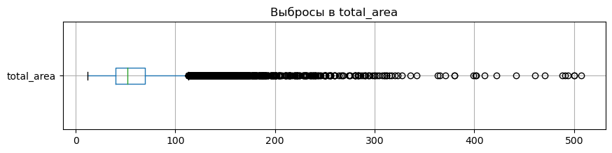
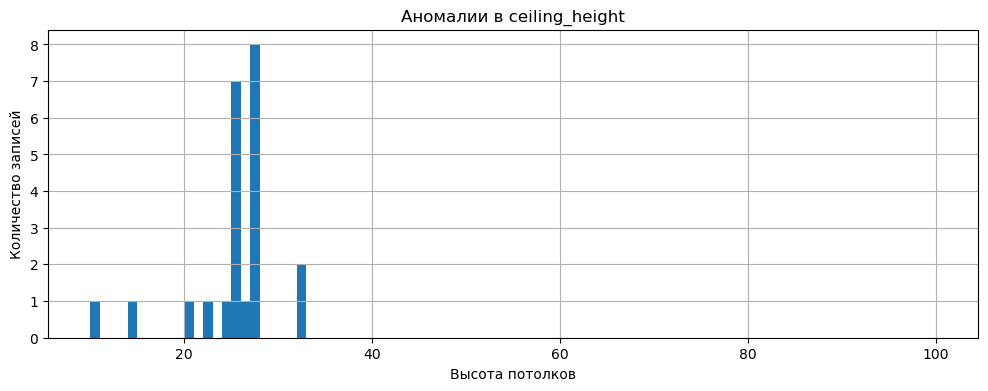
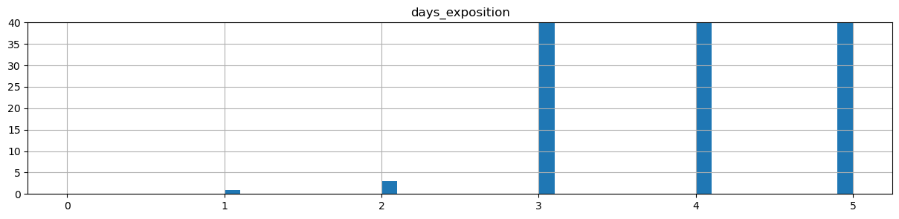
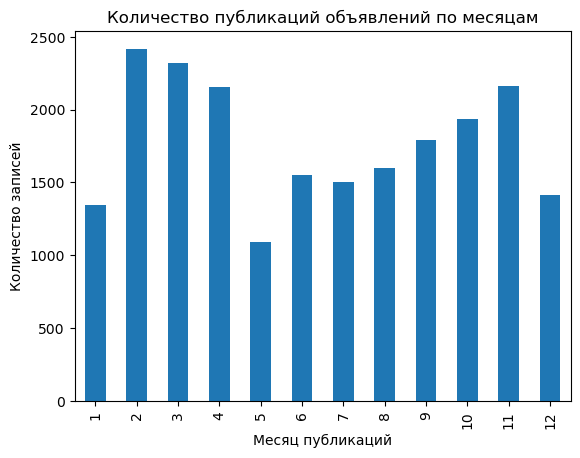
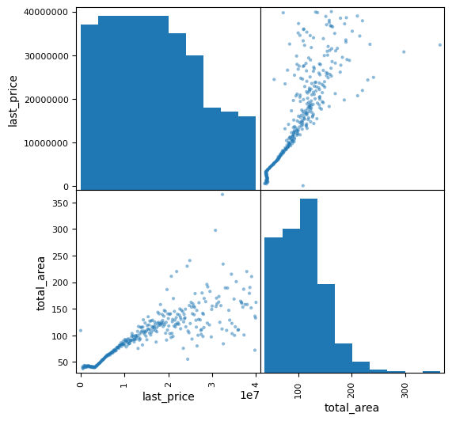

# Исследование объявлений о продаже квартир

**Задача:** установить параметры для автоматизированной системы, которая отслеживает аномалии и мошенническую деятельность. 

**Данные:** \
Данные сервиса Яндекс.Недвижимость — архив объявлений **о продаже квартир** в Санкт-Петербурге и соседних населённых пунктов за несколько лет. \
По каждой квартире на продажу доступны два вида данных: вписанные пользователем, полученные автоматически на основе картографических данных.

<h1>Содержание<span class="tocSkip"></span></h1>
<div class="toc"><ul class="toc-item"><li><span><a href="#Откроем-файл-с-данными-и-изучим-общую-информацию" data-toc-modified-id="Откроем-файл-с-данными-и-изучим-общую-информацию-1"><span class="toc-item-num">1&nbsp;&nbsp;</span>Откроем файл с данными и изучим общую информацию</a></span></li><li><span><a href="#Предобработка-данных" data-toc-modified-id="Предобработка-данных-2"><span class="toc-item-num">2&nbsp;&nbsp;</span>Предобработка данных</a></span><ul class="toc-item"><li><span><a href="#Аномалии-и-выбросы" data-toc-modified-id="Аномалии-и-выбросы-2.1"><span class="toc-item-num">2.1&nbsp;&nbsp;</span>Аномалии и выбросы</a></span><ul class="toc-item"><li><span><a href="#is_apartment" data-toc-modified-id="is_apartment-2.1.1"><span class="toc-item-num">2.1.1&nbsp;&nbsp;</span>is_apartment</a></span></li><li><span><a href="#locality_name" data-toc-modified-id="locality_name-2.1.2"><span class="toc-item-num">2.1.2&nbsp;&nbsp;</span>locality_name</a></span></li><li><span><a href="#parks_-and-ponds_" data-toc-modified-id="parks_-and-ponds_-2.1.3"><span class="toc-item-num">2.1.3&nbsp;&nbsp;</span>parks_ and ponds_</a></span></li><li><span><a href="#rooms" data-toc-modified-id="rooms-2.1.4"><span class="toc-item-num">2.1.4&nbsp;&nbsp;</span>rooms</a></span></li><li><span><a href="#toral_area" data-toc-modified-id="toral_area-2.1.5"><span class="toc-item-num">2.1.5&nbsp;&nbsp;</span>toral_area</a></span></li><li><span><a href="#balcony" data-toc-modified-id="balcony-2.1.6"><span class="toc-item-num">2.1.6&nbsp;&nbsp;</span>balcony</a></span></li><li><span><a href="#ceiling_height" data-toc-modified-id="ceiling_height-2.1.7"><span class="toc-item-num">2.1.7&nbsp;&nbsp;</span>ceiling_height</a></span></li><li><span><a href="#airports_nearest" data-toc-modified-id="airports_nearest-2.1.8"><span class="toc-item-num">2.1.8&nbsp;&nbsp;</span>airports_nearest</a></span></li><li><span><a href="#cityCenters_nearest" data-toc-modified-id="cityCenters_nearest-2.1.9"><span class="toc-item-num">2.1.9&nbsp;&nbsp;</span>cityCenters_nearest</a></span></li><li><span><a href="#days_exposition" data-toc-modified-id="days_exposition-2.1.10"><span class="toc-item-num">2.1.10&nbsp;&nbsp;</span>days_exposition</a></span></li><li><span><a href="#living_area" data-toc-modified-id="living_area-2.1.11"><span class="toc-item-num">2.1.11&nbsp;&nbsp;</span>living_area</a></span></li><li><span><a href="#!!!-kitchen_area" data-toc-modified-id="!!!-kitchen_area-2.1.12"><span class="toc-item-num">2.1.12&nbsp;&nbsp;</span>!!! kitchen_area</a></span></li></ul></li><li><span><a href="#check-gap" data-toc-modified-id="check-gap-2.2"><span class="toc-item-num">2.2&nbsp;&nbsp;</span>check gap</a></span></li></ul></li><li><span><a href="#Посчитайте-и-добавьте-в-таблицу-новые-столбцы" data-toc-modified-id="Посчитайте-и-добавьте-в-таблицу-новые-столбцы-3"><span class="toc-item-num">3&nbsp;&nbsp;</span>Посчитайте и добавьте в таблицу новые столбцы</a></span><ul class="toc-item"><li><span><a href="#Цена-одного-квадратного-метра" data-toc-modified-id="Цена-одного-квадратного-метра-3.1"><span class="toc-item-num">3.1&nbsp;&nbsp;</span>Цена одного квадратного метра</a></span></li><li><span><a href="#Номер-дня-в-неделе" data-toc-modified-id="Номер-дня-в-неделе-3.2"><span class="toc-item-num">3.2&nbsp;&nbsp;</span>Номер дня в неделе</a></span></li><li><span><a href="#Месяц-публикации-объявления" data-toc-modified-id="Месяц-публикации-объявления-3.3"><span class="toc-item-num">3.3&nbsp;&nbsp;</span>Месяц публикации объявления</a></span></li><li><span><a href="#Год-публикации" data-toc-modified-id="Год-публикации-3.4"><span class="toc-item-num">3.4&nbsp;&nbsp;</span>Год публикации</a></span></li><li><span><a href="#Тип-этажа-квартиры" data-toc-modified-id="Тип-этажа-квартиры-3.5"><span class="toc-item-num">3.5&nbsp;&nbsp;</span>Тип этажа квартиры</a></span></li><li><span><a href="#Расстояние-в-км-до-центра-города" data-toc-modified-id="Расстояние-в-км-до-центра-города-3.6"><span class="toc-item-num">3.6&nbsp;&nbsp;</span>Расстояние в км до центра города</a></span></li></ul></li><li><span><a href="#Проведите-исследовательский-анализ-данных" data-toc-modified-id="Проведите-исследовательский-анализ-данных-4"><span class="toc-item-num">4&nbsp;&nbsp;</span>Проведите исследовательский анализ данных</a></span><ul class="toc-item"><li><span><a href="#Общая-площадь" data-toc-modified-id="Общая-площадь-4.1"><span class="toc-item-num">4.1&nbsp;&nbsp;</span>Общая площадь</a></span></li><li><span><a href="#Жилая-площадь" data-toc-modified-id="Жилая-площадь-4.2"><span class="toc-item-num">4.2&nbsp;&nbsp;</span>Жилая площадь</a></span></li><li><span><a href="#Площадь-кухни" data-toc-modified-id="Площадь-кухни-4.3"><span class="toc-item-num">4.3&nbsp;&nbsp;</span>Площадь кухни</a></span></li><li><span><a href="#Цена-объекта" data-toc-modified-id="Цена-объекта-4.4"><span class="toc-item-num">4.4&nbsp;&nbsp;</span>Цена объекта</a></span></li><li><span><a href="#Количество-комнат" data-toc-modified-id="Количество-комнат-4.5"><span class="toc-item-num">4.5&nbsp;&nbsp;</span>Количество комнат</a></span></li><li><span><a href="#Высота-потолков" data-toc-modified-id="Высота-потолков-4.6"><span class="toc-item-num">4.6&nbsp;&nbsp;</span>Высота потолков</a></span></li><li><span><a href="#Этаж-квартиры" data-toc-modified-id="Этаж-квартиры-4.7"><span class="toc-item-num">4.7&nbsp;&nbsp;</span>Этаж квартиры</a></span></li><li><span><a href="#Тип-этажа-квартиры" data-toc-modified-id="Тип-этажа-квартиры-4.8"><span class="toc-item-num">4.8&nbsp;&nbsp;</span>Тип этажа квартиры</a></span></li><li><span><a href="#Общее-количество-этажей-в-доме" data-toc-modified-id="Общее-количество-этажей-в-доме-4.9"><span class="toc-item-num">4.9&nbsp;&nbsp;</span>Общее количество этажей в доме</a></span></li><li><span><a href="#Расстояние-до-центра-города-в-метрах" data-toc-modified-id="Расстояние-до-центра-города-в-метрах-4.10"><span class="toc-item-num">4.10&nbsp;&nbsp;</span>Расстояние до центра города в метрах</a></span></li><li><span><a href="#Расстояние-до-ближайшего-аэропорта" data-toc-modified-id="Расстояние-до-ближайшего-аэропорта-4.11"><span class="toc-item-num">4.11&nbsp;&nbsp;</span>Расстояние до ближайшего аэропорта</a></span></li><li><span><a href="#Расстояние-до-ближайшего-парка" data-toc-modified-id="Расстояние-до-ближайшего-парка-4.12"><span class="toc-item-num">4.12&nbsp;&nbsp;</span>Расстояние до ближайшего парка</a></span></li><li><span><a href="#День-и-месяц-публикации-объявления" data-toc-modified-id="День-и-месяц-публикации-объявления-4.13"><span class="toc-item-num">4.13&nbsp;&nbsp;</span>День и месяц публикации объявления</a></span></li><li><span><a href="#Как-быстро-продавались-квартиры-(столбец-days_exposition)" data-toc-modified-id="Как-быстро-продавались-квартиры-(столбец-days_exposition)-4.14"><span class="toc-item-num">4.14&nbsp;&nbsp;</span>Как быстро продавались квартиры (столбец days_exposition)</a></span></li><li><span><a href="#Факторы,-имеющие-наибольшее-влияние-на-общую-(полную)-стоимость-объекта" data-toc-modified-id="Факторы,-имеющие-наибольшее-влияние-на-общую-(полную)-стоимость-объекта-4.15"><span class="toc-item-num">4.15&nbsp;&nbsp;</span>Факторы, имеющие наибольшее влияние на общую (полную) стоимость объекта</a></span><ul class="toc-item"><li><span><a href="#Общие-площади" data-toc-modified-id="Общие-площади-4.15.1"><span class="toc-item-num">4.15.1&nbsp;&nbsp;</span>Общие площади</a></span></li><li><span><a href="#Жилые-площади" data-toc-modified-id="Жилые-площади-4.15.2"><span class="toc-item-num">4.15.2&nbsp;&nbsp;</span>Жилые площади</a></span></li><li><span><a href="#Площади-кухни" data-toc-modified-id="Площади-кухни-4.15.3"><span class="toc-item-num">4.15.3&nbsp;&nbsp;</span>Площади кухни</a></span></li><li><span><a href="#Количество-комнат" data-toc-modified-id="Количество-комнат-4.15.4"><span class="toc-item-num">4.15.4&nbsp;&nbsp;</span>Количество комнат</a></span></li><li><span><a href="#Тип-этажа,-на-котором-расположена-квартира-(первый,-последний,-другой)" data-toc-modified-id="Тип-этажа,-на-котором-расположена-квартира-(первый,-последний,-другой)-4.15.5"><span class="toc-item-num">4.15.5&nbsp;&nbsp;</span>Тип этажа, на котором расположена квартира (первый, последний, другой)</a></span></li><li><span><a href="#Даты-размещения-(день-недели,-месяц,-год)" data-toc-modified-id="Даты-размещения-(день-недели,-месяц,-год)-4.15.6"><span class="toc-item-num">4.15.6&nbsp;&nbsp;</span>Даты размещения (день недели, месяц, год)</a></span></li></ul></li><li><span><a href="#Средняя-цена-одного-квадратного-метра-в-10-населённых-пунктах" data-toc-modified-id="Средняя-цена-одного-квадратного-метра-в-10-населённых-пунктах-4.16"><span class="toc-item-num">4.16&nbsp;&nbsp;</span>Средняя цена одного квадратного метра в 10 населённых пунктах</a></span></li><li><span><a href="#Средняя-цена-каждого-километра" data-toc-modified-id="Средняя-цена-каждого-километра-4.17"><span class="toc-item-num">4.17&nbsp;&nbsp;</span>Средняя цена каждого километра</a></span></li></ul></li><li><span><a href="#Общий-вывод" data-toc-modified-id="Общий-вывод-5"><span class="toc-item-num">5&nbsp;&nbsp;</span>Общий вывод</a></span></li></ul></div>

### Откроем файл с данными и изучим общую информацию

**Библиотеки**


```python
# импорт pandas
import pandas as pd

# импорт matplotlib для построения графиков 
import matplotlib.pyplot as plt

# импорт seaborn для построения графиков
import seaborn as sns

# импорт tqdm для строки прогресса выполнения
from tqdm import tqdm

import warnings
warnings.simplefilter("ignore")

# импорт NumPy
import numpy as np
```

**Загрузка данных**


```python
# записываем датафрейм в переменную
try:
    df = pd.read_csv('/datasets/real_estate_data.csv', sep='\t')
# если не получилось прочитать файл из локальной папки, то загружаем данные из сети
except:
    df = pd.read_csv('datasets/real_estate_data.csv', sep='\t')

# Создаем копию датафрейма
df_old = df.copy()

# Разрешаем показ всех столбцов
pd.set_option('display.max_columns', None)
```


```python
df.head(10)
```


<div>
<style scoped>
    .dataframe tbody tr th:only-of-type {
        vertical-align: middle;
    }

    .dataframe tbody tr th {
        vertical-align: top;
    }

    .dataframe thead th {
        text-align: right;
    }
</style>
<table border="1" class="dataframe">
  <thead>
    <tr style="text-align: right;">
      <th></th>
      <th>total_images</th>
      <th>last_price</th>
      <th>total_area</th>
      <th>first_day_exposition</th>
      <th>rooms</th>
      <th>ceiling_height</th>
      <th>floors_total</th>
      <th>living_area</th>
      <th>floor</th>
      <th>is_apartment</th>
      <th>studio</th>
      <th>open_plan</th>
      <th>kitchen_area</th>
      <th>balcony</th>
      <th>locality_name</th>
      <th>airports_nearest</th>
      <th>cityCenters_nearest</th>
      <th>parks_around3000</th>
      <th>parks_nearest</th>
      <th>ponds_around3000</th>
      <th>ponds_nearest</th>
      <th>days_exposition</th>
    </tr>
  </thead>
  <tbody>
    <tr>
      <th>0</th>
      <td>20</td>
      <td>13000000.0</td>
      <td>108.00</td>
      <td>2019-03-07T00:00:00</td>
      <td>3</td>
      <td>2.70</td>
      <td>16.0</td>
      <td>51.00</td>
      <td>8</td>
      <td>NaN</td>
      <td>False</td>
      <td>False</td>
      <td>25.00</td>
      <td>NaN</td>
      <td>Санкт-Петербург</td>
      <td>18863.0</td>
      <td>16028.0</td>
      <td>1.0</td>
      <td>482.0</td>
      <td>2.0</td>
      <td>755.0</td>
      <td>NaN</td>
    </tr>
    <tr>
      <th>1</th>
      <td>7</td>
      <td>3350000.0</td>
      <td>40.40</td>
      <td>2018-12-04T00:00:00</td>
      <td>1</td>
      <td>NaN</td>
      <td>11.0</td>
      <td>18.60</td>
      <td>1</td>
      <td>NaN</td>
      <td>False</td>
      <td>False</td>
      <td>11.00</td>
      <td>2.0</td>
      <td>посёлок Шушары</td>
      <td>12817.0</td>
      <td>18603.0</td>
      <td>0.0</td>
      <td>NaN</td>
      <td>0.0</td>
      <td>NaN</td>
      <td>81.0</td>
    </tr>
    <tr>
      <th>2</th>
      <td>10</td>
      <td>5196000.0</td>
      <td>56.00</td>
      <td>2015-08-20T00:00:00</td>
      <td>2</td>
      <td>NaN</td>
      <td>5.0</td>
      <td>34.30</td>
      <td>4</td>
      <td>NaN</td>
      <td>False</td>
      <td>False</td>
      <td>8.30</td>
      <td>0.0</td>
      <td>Санкт-Петербург</td>
      <td>21741.0</td>
      <td>13933.0</td>
      <td>1.0</td>
      <td>90.0</td>
      <td>2.0</td>
      <td>574.0</td>
      <td>558.0</td>
    </tr>
    <tr>
      <th>3</th>
      <td>0</td>
      <td>64900000.0</td>
      <td>159.00</td>
      <td>2015-07-24T00:00:00</td>
      <td>3</td>
      <td>NaN</td>
      <td>14.0</td>
      <td>NaN</td>
      <td>9</td>
      <td>NaN</td>
      <td>False</td>
      <td>False</td>
      <td>NaN</td>
      <td>0.0</td>
      <td>Санкт-Петербург</td>
      <td>28098.0</td>
      <td>6800.0</td>
      <td>2.0</td>
      <td>84.0</td>
      <td>3.0</td>
      <td>234.0</td>
      <td>424.0</td>
    </tr>
    <tr>
      <th>4</th>
      <td>2</td>
      <td>10000000.0</td>
      <td>100.00</td>
      <td>2018-06-19T00:00:00</td>
      <td>2</td>
      <td>3.03</td>
      <td>14.0</td>
      <td>32.00</td>
      <td>13</td>
      <td>NaN</td>
      <td>False</td>
      <td>False</td>
      <td>41.00</td>
      <td>NaN</td>
      <td>Санкт-Петербург</td>
      <td>31856.0</td>
      <td>8098.0</td>
      <td>2.0</td>
      <td>112.0</td>
      <td>1.0</td>
      <td>48.0</td>
      <td>121.0</td>
    </tr>
    <tr>
      <th>5</th>
      <td>10</td>
      <td>2890000.0</td>
      <td>30.40</td>
      <td>2018-09-10T00:00:00</td>
      <td>1</td>
      <td>NaN</td>
      <td>12.0</td>
      <td>14.40</td>
      <td>5</td>
      <td>NaN</td>
      <td>False</td>
      <td>False</td>
      <td>9.10</td>
      <td>NaN</td>
      <td>городской посёлок Янино-1</td>
      <td>NaN</td>
      <td>NaN</td>
      <td>NaN</td>
      <td>NaN</td>
      <td>NaN</td>
      <td>NaN</td>
      <td>55.0</td>
    </tr>
    <tr>
      <th>6</th>
      <td>6</td>
      <td>3700000.0</td>
      <td>37.30</td>
      <td>2017-11-02T00:00:00</td>
      <td>1</td>
      <td>NaN</td>
      <td>26.0</td>
      <td>10.60</td>
      <td>6</td>
      <td>NaN</td>
      <td>False</td>
      <td>False</td>
      <td>14.40</td>
      <td>1.0</td>
      <td>посёлок Парголово</td>
      <td>52996.0</td>
      <td>19143.0</td>
      <td>0.0</td>
      <td>NaN</td>
      <td>0.0</td>
      <td>NaN</td>
      <td>155.0</td>
    </tr>
    <tr>
      <th>7</th>
      <td>5</td>
      <td>7915000.0</td>
      <td>71.60</td>
      <td>2019-04-18T00:00:00</td>
      <td>2</td>
      <td>NaN</td>
      <td>24.0</td>
      <td>NaN</td>
      <td>22</td>
      <td>NaN</td>
      <td>False</td>
      <td>False</td>
      <td>18.90</td>
      <td>2.0</td>
      <td>Санкт-Петербург</td>
      <td>23982.0</td>
      <td>11634.0</td>
      <td>0.0</td>
      <td>NaN</td>
      <td>0.0</td>
      <td>NaN</td>
      <td>NaN</td>
    </tr>
    <tr>
      <th>8</th>
      <td>20</td>
      <td>2900000.0</td>
      <td>33.16</td>
      <td>2018-05-23T00:00:00</td>
      <td>1</td>
      <td>NaN</td>
      <td>27.0</td>
      <td>15.43</td>
      <td>26</td>
      <td>NaN</td>
      <td>False</td>
      <td>False</td>
      <td>8.81</td>
      <td>NaN</td>
      <td>посёлок Мурино</td>
      <td>NaN</td>
      <td>NaN</td>
      <td>NaN</td>
      <td>NaN</td>
      <td>NaN</td>
      <td>NaN</td>
      <td>189.0</td>
    </tr>
    <tr>
      <th>9</th>
      <td>18</td>
      <td>5400000.0</td>
      <td>61.00</td>
      <td>2017-02-26T00:00:00</td>
      <td>3</td>
      <td>2.50</td>
      <td>9.0</td>
      <td>43.60</td>
      <td>7</td>
      <td>NaN</td>
      <td>False</td>
      <td>False</td>
      <td>6.50</td>
      <td>2.0</td>
      <td>Санкт-Петербург</td>
      <td>50898.0</td>
      <td>15008.0</td>
      <td>0.0</td>
      <td>NaN</td>
      <td>0.0</td>
      <td>NaN</td>
      <td>289.0</td>
    </tr>
  </tbody>
</table>
</div>


```python
# Проверим типы данных
df.info()
```

    <class 'pandas.core.frame.DataFrame'>
    RangeIndex: 23699 entries, 0 to 23698
    Data columns (total 22 columns):
     #   Column                Non-Null Count  Dtype  
    ---  ------                --------------  -----  
     0   total_images          23699 non-null  int64  
     1   last_price            23699 non-null  float64
     2   total_area            23699 non-null  float64
     3   first_day_exposition  23699 non-null  object 
     4   rooms                 23699 non-null  int64  
     5   ceiling_height        14504 non-null  float64
     6   floors_total          23613 non-null  float64
     7   living_area           21796 non-null  float64
     8   floor                 23699 non-null  int64  
     9   is_apartment          2775 non-null   object 
     10  studio                23699 non-null  bool   
     11  open_plan             23699 non-null  bool   
     12  kitchen_area          21421 non-null  float64
     13  balcony               12180 non-null  float64
     14  locality_name         23650 non-null  object 
     15  airports_nearest      18157 non-null  float64
     16  cityCenters_nearest   18180 non-null  float64
     17  parks_around3000      18181 non-null  float64
     18  parks_nearest         8079 non-null   float64
     19  ponds_around3000      18181 non-null  float64
     20  ponds_nearest         9110 non-null   float64
     21  days_exposition       20518 non-null  float64
    dtypes: bool(2), float64(14), int64(3), object(3)
    memory usage: 3.7+ MB
    

**Необходимо перевести в другой тип:**
- floors_total в int;
- first_day_exposition в дату;
- rooms в int;
- is_apartment в bool;
- balcony в int;
- airports_nearest в int;
- parks_around3000 в int;
- ponds_around3000 в int;
- days_exposition в int;


```python
# Найдем столбцы с пропусками
df.isna().sum().sort_values()[df.isna().sum() != 0].plot(kind='barh')

plt.xlabel('Количество пропусков')
plt.ylabel('Столбец')
plt.title('Количество пропусков в столбцах');
```


    

    


```python
# Пропуски в "числах" 
df.isna().sum().sort_values(ascending=False)
```


    is_apartment            20924
    parks_nearest           15620
    ponds_nearest           14589
    balcony                 11519
    ceiling_height           9195
    airports_nearest         5542
    cityCenters_nearest      5519
    ponds_around3000         5518
    parks_around3000         5518
    days_exposition          3181
    kitchen_area             2278
    living_area              1903
    floors_total               86
    locality_name              49
    total_images                0
    last_price                  0
    studio                      0
    floor                       0
    rooms                       0
    first_day_exposition        0
    total_area                  0
    open_plan                   0
    dtype: int64


```python
# Пропуски в процентах 
round((df.isna().sum()/df.shape[0])*100, 1).sort_values(ascending=False)
```


    is_apartment            88.3
    parks_nearest           65.9
    ponds_nearest           61.6
    balcony                 48.6
    ceiling_height          38.8
    airports_nearest        23.4
    ponds_around3000        23.3
    parks_around3000        23.3
    cityCenters_nearest     23.3
    days_exposition         13.4
    kitchen_area             9.6
    living_area              8.0
    floors_total             0.4
    locality_name            0.2
    total_images             0.0
    last_price               0.0
    studio                   0.0
    floor                    0.0
    rooms                    0.0
    first_day_exposition     0.0
    total_area               0.0
    open_plan                0.0
    dtype: float64


**ИТОГ:** \
Пропусков много, они в разных столбцах. Наибольшее количество находится в столбце *\"is_apartment"*: 20924 из 23699. Необходимо проверить наличие связи столбцов *\"airports_nearest", "cityCenters_nearest", "ponds_around3000", "parks_around3000"*, так как их количества практически одинаковы.


```python
# Количество локаций
# Возьмём столбец "floor" так как в нем отсутствуют пропуски
print(
    "Всего локаций:",
    df.groupby(by='locality_name')['floor'].count().count()
)    
```

    Всего локаций: 364
    


```python
# 15 локаций с наибольшим количеством объявлений
df.groupby(by='locality_name')['floor'].count().sort_values(ascending=False).head(15)
```


    locality_name
    Санкт-Петербург            15721
    посёлок Мурино               522
    посёлок Шушары               440
    Всеволожск                   398
    Пушкин                       369
    Колпино                      338
    посёлок Парголово            327
    Гатчина                      307
    деревня Кудрово              299
    Выборг                       237
    Петергоф                     201
    Сестрорецк                   183
    Красное Село                 178
    Кудрово                      173
    деревня Новое Девяткино      144
    Name: floor, dtype: int64


Наибольшее число объявлений в **Санкт-Петербурге и его пригороде**, однако здесь **не учтены дубликаты**.


```python
# Переведем first_day_exposition в формат даты
df['first_day_exposition'] = pd.to_datetime(df['first_day_exposition'], format='%Y-%m-%dT%H:%M:%S')
```


```python
# Найдем распределение появления новых объявлений по годам
df.groupby(df['first_day_exposition'].dt.year)['floor'].count().plot(kind='bar', figsize=(4,4))
```


    <Axes: xlabel='first_day_exposition'>


    

    


Пики приходятся на 2018 и 2017 годы.


```python
df.hist(figsize=(15, 20), bins=50);
```


    

    


Данная гистограмма позволит определить последующее влияние на данные.

### Предобработка данных

#### Аномалии и выбросы


```python
print('Количество столбцов:', len(df.columns))
```

    Количество столбцов: 22
    


```python
df.head()
```


<div>
<style scoped>
    .dataframe tbody tr th:only-of-type {
        vertical-align: middle;
    }

    .dataframe tbody tr th {
        vertical-align: top;
    }

    .dataframe thead th {
        text-align: right;
    }
</style>
<table border="1" class="dataframe">
  <thead>
    <tr style="text-align: right;">
      <th></th>
      <th>total_images</th>
      <th>last_price</th>
      <th>total_area</th>
      <th>first_day_exposition</th>
      <th>rooms</th>
      <th>ceiling_height</th>
      <th>floors_total</th>
      <th>living_area</th>
      <th>floor</th>
      <th>is_apartment</th>
      <th>studio</th>
      <th>open_plan</th>
      <th>kitchen_area</th>
      <th>balcony</th>
      <th>locality_name</th>
      <th>airports_nearest</th>
      <th>cityCenters_nearest</th>
      <th>parks_around3000</th>
      <th>parks_nearest</th>
      <th>ponds_around3000</th>
      <th>ponds_nearest</th>
      <th>days_exposition</th>
    </tr>
  </thead>
  <tbody>
    <tr>
      <th>0</th>
      <td>20</td>
      <td>13000000.0</td>
      <td>108.0</td>
      <td>2019-03-07</td>
      <td>3</td>
      <td>2.70</td>
      <td>16.0</td>
      <td>51.0</td>
      <td>8</td>
      <td>NaN</td>
      <td>False</td>
      <td>False</td>
      <td>25.0</td>
      <td>NaN</td>
      <td>Санкт-Петербург</td>
      <td>18863.0</td>
      <td>16028.0</td>
      <td>1.0</td>
      <td>482.0</td>
      <td>2.0</td>
      <td>755.0</td>
      <td>NaN</td>
    </tr>
    <tr>
      <th>1</th>
      <td>7</td>
      <td>3350000.0</td>
      <td>40.4</td>
      <td>2018-12-04</td>
      <td>1</td>
      <td>NaN</td>
      <td>11.0</td>
      <td>18.6</td>
      <td>1</td>
      <td>NaN</td>
      <td>False</td>
      <td>False</td>
      <td>11.0</td>
      <td>2.0</td>
      <td>посёлок Шушары</td>
      <td>12817.0</td>
      <td>18603.0</td>
      <td>0.0</td>
      <td>NaN</td>
      <td>0.0</td>
      <td>NaN</td>
      <td>81.0</td>
    </tr>
    <tr>
      <th>2</th>
      <td>10</td>
      <td>5196000.0</td>
      <td>56.0</td>
      <td>2015-08-20</td>
      <td>2</td>
      <td>NaN</td>
      <td>5.0</td>
      <td>34.3</td>
      <td>4</td>
      <td>NaN</td>
      <td>False</td>
      <td>False</td>
      <td>8.3</td>
      <td>0.0</td>
      <td>Санкт-Петербург</td>
      <td>21741.0</td>
      <td>13933.0</td>
      <td>1.0</td>
      <td>90.0</td>
      <td>2.0</td>
      <td>574.0</td>
      <td>558.0</td>
    </tr>
    <tr>
      <th>3</th>
      <td>0</td>
      <td>64900000.0</td>
      <td>159.0</td>
      <td>2015-07-24</td>
      <td>3</td>
      <td>NaN</td>
      <td>14.0</td>
      <td>NaN</td>
      <td>9</td>
      <td>NaN</td>
      <td>False</td>
      <td>False</td>
      <td>NaN</td>
      <td>0.0</td>
      <td>Санкт-Петербург</td>
      <td>28098.0</td>
      <td>6800.0</td>
      <td>2.0</td>
      <td>84.0</td>
      <td>3.0</td>
      <td>234.0</td>
      <td>424.0</td>
    </tr>
    <tr>
      <th>4</th>
      <td>2</td>
      <td>10000000.0</td>
      <td>100.0</td>
      <td>2018-06-19</td>
      <td>2</td>
      <td>3.03</td>
      <td>14.0</td>
      <td>32.0</td>
      <td>13</td>
      <td>NaN</td>
      <td>False</td>
      <td>False</td>
      <td>41.0</td>
      <td>NaN</td>
      <td>Санкт-Петербург</td>
      <td>31856.0</td>
      <td>8098.0</td>
      <td>2.0</td>
      <td>112.0</td>
      <td>1.0</td>
      <td>48.0</td>
      <td>121.0</td>
    </tr>
  </tbody>
</table>
</div>


```python
# Колонки (= столбцы) - список
df.columns
```


    Index(['total_images', 'last_price', 'total_area', 'first_day_exposition',
           'rooms', 'ceiling_height', 'floors_total', 'living_area', 'floor',
           'is_apartment', 'studio', 'open_plan', 'kitchen_area', 'balcony',
           'locality_name', 'airports_nearest', 'cityCenters_nearest',
           'parks_around3000', 'parks_nearest', 'ponds_around3000',
           'ponds_nearest', 'days_exposition'],
          dtype='object')


```python
# check
# для примера горизонтальный вид диаграммы размаха

fig, ax = plt.subplots(figsize = (17,2))
ax = df[['total_area']].boxplot(vert = False, ax =ax)
ax.set_title('Диаграмма размаха значений площади')
ax.set_xlim(0, 400);
```


    

    


Рассмотрим по колонкам наличие выбросов методом boxplot().


```python
# Колонки для построения boxplot
columns = ['total_area',
       'rooms', 'ceiling_height', 'floors_total', 'living_area', 'floor',
       'kitchen_area', 'balcony',
       'parks_around3000', 'parks_nearest', 'ponds_around3000',
       'ponds_nearest', 'days_exposition']

# Цикл для построения boxplot
for column in columns:
    df.boxplot(column=column, figsize=(17,2), vert=False).set_title('Диаграмма размаха значений '+ column)
    plt.show()
```


    

    


    

    


    

    


    

    


    

    


    

    


    

    


    

    


    

    


    

    


    

    


    

    


    

    


Методом boxplot (диаграмма размаха) мы наблюдаем медиану и квартили из нормального распределения.

Видим, что для начала нужно разообраться с выбросами, так как они есть во всех рассматриваемых колонках.

##### is_apartment
Наибольшее число пропусков в столбце *\"is_apartment"*. Рассмотрим его подробнее.


```python
# Значения в данном столбце
df['is_apartment'].value_counts()
```


    False    2725
    True       50
    Name: is_apartment, dtype: int64


Больше всего значений *\"False"*.


```python
# Пропуски
print('Количество пропусков в столбце "is_apartment": {}'.format(df['is_apartment'].isna().sum()))
```

    Количество пропусков в столбце "is_apartment": 20924
    


```python
# Мода в столбце /очевидно что будет "False"/
df['is_apartment'].mode(dropna=True)
```


    0    False
    Name: is_apartment, dtype: object


**Решение:** \
Будем заполнять данный столбец значением моды, так как вероятнее всего отсутствие значения связано с человеческим фактором. Заполняя данные, владелец не указывал значение, предполагая: у меня квартира - не апартаменты.


```python
df['is_apartment'] = df['is_apartment'].fillna(False)
```


```python
# Обновленные значения в данном столбце
display(
    'Значения столбца:', df['is_apartment'].value_counts(),
    'Количество пропусков в столбце: {}'.format(df['is_apartment'].isna().sum())
)
```


    'Значения столбца:'


    False    23649
    True        50
    Name: is_apartment, dtype: int64


    'Количество пропусков в столбце: 0'


##### locality_name
Рассмотрим следующий столбец: *\"locality_name"* — название населённого пункта.

Удалим неявные дубликаты.


```python
# Приведем к нижнему регистру
df['locality_name'] = df['locality_name'].str.lower()
```


```python
print('Число элементов:', len(df['locality_name'].unique()))
```

    Число элементов: 365
    


```python
# Замена 'посёлок' на 'поселок'
df['locality_name'] = df['locality_name'].str.replace('посёлок', 'поселок')
print('Число элементов:', len(df['locality_name'].unique()))
```

    Число элементов: 331
    


```python
# Замена 'поселок городского типа'' на 'посёлок городского типа'
df['locality_name'] = df['locality_name'].str.replace('поселок городского типа', 'посёлок городского типа')
print('Число элементов:', len(df['locality_name'].unique()))
```

    Число элементов: 331
    


```python
# Замена 'городской поселок' на 'посёлок городского типа'
df['locality_name'] = df['locality_name'].str.replace('городской поселок', 'посёлок городского типа')
print('Число элементов:', len(df['locality_name'].unique()))
```

    Число элементов: 324
    


```python
# Замена 'тёсово' на 'тесово'
df['locality_name'] = df['locality_name'].str.replace('тёсово', 'тесово')
print('Число элементов:', len(df['locality_name'].unique()))
```

    Число элементов: 324
    


```python
# Замена 'поселок мурино' на 'мурино'
df['locality_name'] = df['locality_name'].str.replace('поселок мурино', 'мурино')
print('Число элементов:', len(df['locality_name'].unique()))
```

    Число элементов: 323
    


```python
# Замена 'деревня кудрово' на 'кудрово'
df['locality_name'] = df['locality_name'].str.replace('деревня кудрово', 'кудрово')
print('Число элементов:', len(df['locality_name'].unique()))
```

    Число элементов: 322
    


```python
# Замена 'садоводческое некоммерческое товарищество' на 'садовое товарищество'
df['locality_name'] = df['locality_name'].str.replace('садоводческое некоммерческое товарищество', 'садовое товарищество')
print('Число элементов:', len(df['locality_name'].unique()))
```

    Число элементов: 322
    


```python
# check
df.locality_name.nunique()
```


    321


```python
# Но здесь есть пропуски
df['locality_name'].nunique(dropna=False)
```


    322


Проверим наличие явных дубликатов.


```python
# Наличие явных дубликатов
df[df.duplicated(keep='first')]
```


<div>
<style scoped>
    .dataframe tbody tr th:only-of-type {
        vertical-align: middle;
    }

    .dataframe tbody tr th {
        vertical-align: top;
    }

    .dataframe thead th {
        text-align: right;
    }
</style>
<table border="1" class="dataframe">
  <thead>
    <tr style="text-align: right;">
      <th></th>
      <th>total_images</th>
      <th>last_price</th>
      <th>total_area</th>
      <th>first_day_exposition</th>
      <th>rooms</th>
      <th>ceiling_height</th>
      <th>floors_total</th>
      <th>living_area</th>
      <th>floor</th>
      <th>is_apartment</th>
      <th>studio</th>
      <th>open_plan</th>
      <th>kitchen_area</th>
      <th>balcony</th>
      <th>locality_name</th>
      <th>airports_nearest</th>
      <th>cityCenters_nearest</th>
      <th>parks_around3000</th>
      <th>parks_nearest</th>
      <th>ponds_around3000</th>
      <th>ponds_nearest</th>
      <th>days_exposition</th>
    </tr>
  </thead>
  <tbody>
  </tbody>
</table>
</div>


```python
# По умолчанию заполяем столбец типом "город" 
df['locality_group_name'] = 'город'
```


```python
# Заполнение пропусков NaN
df.loc[df['locality_name'].isna() == True, 'locality_group_name'] = 'NaN'
```


```python
# Массив типов мест
type_loc_group= ['село','поселок', 'садовое товарищество', 'деревня',
                 'коттеджный поселок', 'посёлок городского типа',
                ]
```


```python
# Цикл выставляющий отметки типа места
for type_loc in type_loc_group:
    df.loc[df['locality_name'].str.contains(type_loc) == True, 'locality_group_name'] = type_loc
```


```python
# Цикл показывает количество элементов по отметкам типа места
for type_loc in type_loc_group:    
    print('Число элементов типа', type_loc,
          ':', 
          df.loc[df['locality_group_name'] == type_loc, 'locality_group_name'].count()
         )
```

    Число элементов типа село : 210
    Число элементов типа поселок : 1551
    Число элементов типа садовое товарищество : 5
    Число элементов типа деревня : 646
    Число элементов типа коттеджный поселок : 3
    Число элементов типа посёлок городского типа : 550
    


```python
# Элементы после новой группировки
pd.pivot_table(df, index='locality_group_name', 
               values='floor',
               aggfunc=('count'),
              ).rename(columns = {'floor': 'Количество'}
                      ).sort_values(by='Количество', ascending=False)
```


<div>
<style scoped>
    .dataframe tbody tr th:only-of-type {
        vertical-align: middle;
    }

    .dataframe tbody tr th {
        vertical-align: top;
    }

    .dataframe thead th {
        text-align: right;
    }
</style>
<table border="1" class="dataframe">
  <thead>
    <tr style="text-align: right;">
      <th></th>
      <th>Количество</th>
    </tr>
    <tr>
      <th>locality_group_name</th>
      <th></th>
    </tr>
  </thead>
  <tbody>
    <tr>
      <th>город</th>
      <td>20685</td>
    </tr>
    <tr>
      <th>поселок</th>
      <td>1551</td>
    </tr>
    <tr>
      <th>деревня</th>
      <td>646</td>
    </tr>
    <tr>
      <th>посёлок городского типа</th>
      <td>550</td>
    </tr>
    <tr>
      <th>село</th>
      <td>210</td>
    </tr>
    <tr>
      <th>NaN</th>
      <td>49</td>
    </tr>
    <tr>
      <th>садовое товарищество</th>
      <td>5</td>
    </tr>
    <tr>
      <th>коттеджный поселок</th>
      <td>3</td>
    </tr>
  </tbody>
</table>
</div>


##### parks_ and ponds_
Рассмотрим следующие столбцы:

	• parks_around3000 — число парков в радиусе 3 км;
	• parks_nearest — расстояние до ближайшего парка (м);
	• ponds_around3000 — число водоёмов в радиусе 3 км;
    • ponds_nearest — расстояние до ближайшего водоёма (м).


```python
# Выбросы в parks_around3000
df.boxplot(column='parks_around3000', figsize=(10,2), vert=False)
```


    <Axes: >


    

    


Случаи с "3" не являются выбросами, это скорее аномалия.


```python
# Аномальные значения parks_around3000
df.query('parks_around3000 == 3')[['locality_name', 
                                   'cityCenters_nearest',
                                   'parks_around3000',
                                   'parks_nearest',
                                   'ponds_around3000',
                                   'ponds_nearest',
                                   'locality_group_name'
                                  ]]
```


<div>
<style scoped>
    .dataframe tbody tr th:only-of-type {
        vertical-align: middle;
    }

    .dataframe tbody tr th {
        vertical-align: top;
    }

    .dataframe thead th {
        text-align: right;
    }
</style>
<table border="1" class="dataframe">
  <thead>
    <tr style="text-align: right;">
      <th></th>
      <th>locality_name</th>
      <th>cityCenters_nearest</th>
      <th>parks_around3000</th>
      <th>parks_nearest</th>
      <th>ponds_around3000</th>
      <th>ponds_nearest</th>
      <th>locality_group_name</th>
    </tr>
  </thead>
  <tbody>
    <tr>
      <th>16</th>
      <td>санкт-петербург</td>
      <td>10698.0</td>
      <td>3.0</td>
      <td>420.0</td>
      <td>0.0</td>
      <td>NaN</td>
      <td>город</td>
    </tr>
    <tr>
      <th>24</th>
      <td>санкт-петербург</td>
      <td>2336.0</td>
      <td>3.0</td>
      <td>411.0</td>
      <td>3.0</td>
      <td>124.0</td>
      <td>город</td>
    </tr>
    <tr>
      <th>72</th>
      <td>кронштадт</td>
      <td>49984.0</td>
      <td>3.0</td>
      <td>167.0</td>
      <td>3.0</td>
      <td>118.0</td>
      <td>город</td>
    </tr>
    <tr>
      <th>107</th>
      <td>павловск</td>
      <td>32900.0</td>
      <td>3.0</td>
      <td>127.0</td>
      <td>3.0</td>
      <td>405.0</td>
      <td>город</td>
    </tr>
    <tr>
      <th>140</th>
      <td>пушкин</td>
      <td>26506.0</td>
      <td>3.0</td>
      <td>366.0</td>
      <td>3.0</td>
      <td>179.0</td>
      <td>город</td>
    </tr>
    <tr>
      <th>...</th>
      <td>...</td>
      <td>...</td>
      <td>...</td>
      <td>...</td>
      <td>...</td>
      <td>...</td>
      <td>...</td>
    </tr>
    <tr>
      <th>23499</th>
      <td>санкт-петербург</td>
      <td>11002.0</td>
      <td>3.0</td>
      <td>403.0</td>
      <td>0.0</td>
      <td>NaN</td>
      <td>город</td>
    </tr>
    <tr>
      <th>23546</th>
      <td>санкт-петербург</td>
      <td>10927.0</td>
      <td>3.0</td>
      <td>363.0</td>
      <td>0.0</td>
      <td>NaN</td>
      <td>город</td>
    </tr>
    <tr>
      <th>23618</th>
      <td>санкт-петербург</td>
      <td>14939.0</td>
      <td>3.0</td>
      <td>186.0</td>
      <td>1.0</td>
      <td>582.0</td>
      <td>город</td>
    </tr>
    <tr>
      <th>23620</th>
      <td>петергоф</td>
      <td>31318.0</td>
      <td>3.0</td>
      <td>233.0</td>
      <td>1.0</td>
      <td>760.0</td>
      <td>город</td>
    </tr>
    <tr>
      <th>23664</th>
      <td>санкт-петербург</td>
      <td>5016.0</td>
      <td>3.0</td>
      <td>417.0</td>
      <td>1.0</td>
      <td>118.0</td>
      <td>город</td>
    </tr>
  </tbody>
</table>
<p>647 rows × 7 columns</p>
</div>


```python
# Где находятся - по категориям
(df
 .query('parks_around3000 == 3')[['locality_group_name','floor']]
 .groupby('locality_group_name')[['floor']]
 .count()
 .rename(columns={'floor':'count'})
)
```


<div>
<style scoped>
    .dataframe tbody tr th:only-of-type {
        vertical-align: middle;
    }

    .dataframe tbody tr th {
        vertical-align: top;
    }

    .dataframe thead th {
        text-align: right;
    }
</style>
<table border="1" class="dataframe">
  <thead>
    <tr style="text-align: right;">
      <th></th>
      <th>count</th>
    </tr>
    <tr>
      <th>locality_group_name</th>
      <th></th>
    </tr>
  </thead>
  <tbody>
    <tr>
      <th>NaN</th>
      <td>2</td>
    </tr>
    <tr>
      <th>город</th>
      <td>629</td>
    </tr>
    <tr>
      <th>село</th>
      <td>16</td>
    </tr>
  </tbody>
</table>
</div>


В основном эти случаи в городах, поэтому считать аномалией не стоит.


```python
# Выбросы в parks_nearest
df.boxplot(column='parks_nearest', vert=False, figsize=(10,2)).set_title('Выбросы в parks_nearest')
```


    Text(0.5, 1.0, 'Выбросы в parks_nearest')


    

    


Насторожить может только то, что дальность до ближайшего парка местами более 3-х км - остальные в пределах нормы.


```python
# Выбросы в ponds_around3000
df.boxplot(column='ponds_around3000', vert=False, figsize=(10,2)).set_title('Выбросы в ponds_around3000')
```


    Text(0.5, 1.0, 'Выбросы в ponds_around3000')


    

    


```python
# Где находятся - по категориям
(df
 .query('ponds_around3000 == 3')[['locality_group_name','floor']]
 .groupby('locality_group_name')[['floor']]
 .count()
 .rename(columns={'floor':'count'})
)
```


<div>
<style scoped>
    .dataframe tbody tr th:only-of-type {
        vertical-align: middle;
    }

    .dataframe tbody tr th {
        vertical-align: top;
    }

    .dataframe thead th {
        text-align: right;
    }
</style>
<table border="1" class="dataframe">
  <thead>
    <tr style="text-align: right;">
      <th></th>
      <th>count</th>
    </tr>
    <tr>
      <th>locality_group_name</th>
      <th></th>
    </tr>
  </thead>
  <tbody>
    <tr>
      <th>NaN</th>
      <td>7</td>
    </tr>
    <tr>
      <th>город</th>
      <td>1473</td>
    </tr>
    <tr>
      <th>поселок</th>
      <td>21</td>
    </tr>
  </tbody>
</table>
</div>


Аналогично с парками. Не являются выбросами, так как водоёмы могут находиться в парках.


```python
# Выбросы в ponds_nearest
df.boxplot(column='ponds_nearest', vert=False, figsize=(10,2)).set_title('Выбросы в ponds_nearest')
```


    Text(0.5, 1.0, 'Выбросы в ponds_nearest')


    

    


Здесь выбросов нет.

Перейдем к заполнению пропусков.


```python
# Количество парков по группам
df.pivot_table(index='locality_group_name', 
               values='parks_nearest', 
               aggfunc=('count')
              ).sort_values(by='parks_nearest', ascending=False)
```


<div>
<style scoped>
    .dataframe tbody tr th:only-of-type {
        vertical-align: middle;
    }

    .dataframe tbody tr th {
        vertical-align: top;
    }

    .dataframe thead th {
        text-align: right;
    }
</style>
<table border="1" class="dataframe">
  <thead>
    <tr style="text-align: right;">
      <th></th>
      <th>parks_nearest</th>
    </tr>
    <tr>
      <th>locality_group_name</th>
      <th></th>
    </tr>
  </thead>
  <tbody>
    <tr>
      <th>город</th>
      <td>7989</td>
    </tr>
    <tr>
      <th>село</th>
      <td>46</td>
    </tr>
    <tr>
      <th>поселок</th>
      <td>29</td>
    </tr>
    <tr>
      <th>NaN</th>
      <td>15</td>
    </tr>
    <tr>
      <th>деревня</th>
      <td>0</td>
    </tr>
    <tr>
      <th>коттеджный поселок</th>
      <td>0</td>
    </tr>
    <tr>
      <th>посёлок городского типа</th>
      <td>0</td>
    </tr>
    <tr>
      <th>садовое товарищество</th>
      <td>0</td>
    </tr>
  </tbody>
</table>
</div>


```python
# Вывод таблицы (15 строк)
df[df['locality_group_name'] == 'город'].head(15)
```


<div>
<style scoped>
    .dataframe tbody tr th:only-of-type {
        vertical-align: middle;
    }

    .dataframe tbody tr th {
        vertical-align: top;
    }

    .dataframe thead th {
        text-align: right;
    }
</style>
<table border="1" class="dataframe">
  <thead>
    <tr style="text-align: right;">
      <th></th>
      <th>total_images</th>
      <th>last_price</th>
      <th>total_area</th>
      <th>first_day_exposition</th>
      <th>rooms</th>
      <th>ceiling_height</th>
      <th>floors_total</th>
      <th>living_area</th>
      <th>floor</th>
      <th>is_apartment</th>
      <th>studio</th>
      <th>open_plan</th>
      <th>kitchen_area</th>
      <th>balcony</th>
      <th>locality_name</th>
      <th>airports_nearest</th>
      <th>cityCenters_nearest</th>
      <th>parks_around3000</th>
      <th>parks_nearest</th>
      <th>ponds_around3000</th>
      <th>ponds_nearest</th>
      <th>days_exposition</th>
      <th>locality_group_name</th>
    </tr>
  </thead>
  <tbody>
    <tr>
      <th>0</th>
      <td>20</td>
      <td>13000000.0</td>
      <td>108.00</td>
      <td>2019-03-07</td>
      <td>3</td>
      <td>2.70</td>
      <td>16.0</td>
      <td>51.00</td>
      <td>8</td>
      <td>False</td>
      <td>False</td>
      <td>False</td>
      <td>25.00</td>
      <td>NaN</td>
      <td>санкт-петербург</td>
      <td>18863.0</td>
      <td>16028.0</td>
      <td>1.0</td>
      <td>482.0</td>
      <td>2.0</td>
      <td>755.0</td>
      <td>NaN</td>
      <td>город</td>
    </tr>
    <tr>
      <th>2</th>
      <td>10</td>
      <td>5196000.0</td>
      <td>56.00</td>
      <td>2015-08-20</td>
      <td>2</td>
      <td>NaN</td>
      <td>5.0</td>
      <td>34.30</td>
      <td>4</td>
      <td>False</td>
      <td>False</td>
      <td>False</td>
      <td>8.30</td>
      <td>0.0</td>
      <td>санкт-петербург</td>
      <td>21741.0</td>
      <td>13933.0</td>
      <td>1.0</td>
      <td>90.0</td>
      <td>2.0</td>
      <td>574.0</td>
      <td>558.0</td>
      <td>город</td>
    </tr>
    <tr>
      <th>3</th>
      <td>0</td>
      <td>64900000.0</td>
      <td>159.00</td>
      <td>2015-07-24</td>
      <td>3</td>
      <td>NaN</td>
      <td>14.0</td>
      <td>NaN</td>
      <td>9</td>
      <td>False</td>
      <td>False</td>
      <td>False</td>
      <td>NaN</td>
      <td>0.0</td>
      <td>санкт-петербург</td>
      <td>28098.0</td>
      <td>6800.0</td>
      <td>2.0</td>
      <td>84.0</td>
      <td>3.0</td>
      <td>234.0</td>
      <td>424.0</td>
      <td>город</td>
    </tr>
    <tr>
      <th>4</th>
      <td>2</td>
      <td>10000000.0</td>
      <td>100.00</td>
      <td>2018-06-19</td>
      <td>2</td>
      <td>3.03</td>
      <td>14.0</td>
      <td>32.00</td>
      <td>13</td>
      <td>False</td>
      <td>False</td>
      <td>False</td>
      <td>41.00</td>
      <td>NaN</td>
      <td>санкт-петербург</td>
      <td>31856.0</td>
      <td>8098.0</td>
      <td>2.0</td>
      <td>112.0</td>
      <td>1.0</td>
      <td>48.0</td>
      <td>121.0</td>
      <td>город</td>
    </tr>
    <tr>
      <th>7</th>
      <td>5</td>
      <td>7915000.0</td>
      <td>71.60</td>
      <td>2019-04-18</td>
      <td>2</td>
      <td>NaN</td>
      <td>24.0</td>
      <td>NaN</td>
      <td>22</td>
      <td>False</td>
      <td>False</td>
      <td>False</td>
      <td>18.90</td>
      <td>2.0</td>
      <td>санкт-петербург</td>
      <td>23982.0</td>
      <td>11634.0</td>
      <td>0.0</td>
      <td>NaN</td>
      <td>0.0</td>
      <td>NaN</td>
      <td>NaN</td>
      <td>город</td>
    </tr>
    <tr>
      <th>8</th>
      <td>20</td>
      <td>2900000.0</td>
      <td>33.16</td>
      <td>2018-05-23</td>
      <td>1</td>
      <td>NaN</td>
      <td>27.0</td>
      <td>15.43</td>
      <td>26</td>
      <td>False</td>
      <td>False</td>
      <td>False</td>
      <td>8.81</td>
      <td>NaN</td>
      <td>мурино</td>
      <td>NaN</td>
      <td>NaN</td>
      <td>NaN</td>
      <td>NaN</td>
      <td>NaN</td>
      <td>NaN</td>
      <td>189.0</td>
      <td>город</td>
    </tr>
    <tr>
      <th>9</th>
      <td>18</td>
      <td>5400000.0</td>
      <td>61.00</td>
      <td>2017-02-26</td>
      <td>3</td>
      <td>2.50</td>
      <td>9.0</td>
      <td>43.60</td>
      <td>7</td>
      <td>False</td>
      <td>False</td>
      <td>False</td>
      <td>6.50</td>
      <td>2.0</td>
      <td>санкт-петербург</td>
      <td>50898.0</td>
      <td>15008.0</td>
      <td>0.0</td>
      <td>NaN</td>
      <td>0.0</td>
      <td>NaN</td>
      <td>289.0</td>
      <td>город</td>
    </tr>
    <tr>
      <th>10</th>
      <td>5</td>
      <td>5050000.0</td>
      <td>39.60</td>
      <td>2017-11-16</td>
      <td>1</td>
      <td>2.67</td>
      <td>12.0</td>
      <td>20.30</td>
      <td>3</td>
      <td>False</td>
      <td>False</td>
      <td>False</td>
      <td>8.50</td>
      <td>NaN</td>
      <td>санкт-петербург</td>
      <td>38357.0</td>
      <td>13878.0</td>
      <td>1.0</td>
      <td>310.0</td>
      <td>2.0</td>
      <td>553.0</td>
      <td>137.0</td>
      <td>город</td>
    </tr>
    <tr>
      <th>11</th>
      <td>9</td>
      <td>3300000.0</td>
      <td>44.00</td>
      <td>2018-08-27</td>
      <td>2</td>
      <td>NaN</td>
      <td>5.0</td>
      <td>31.00</td>
      <td>4</td>
      <td>False</td>
      <td>False</td>
      <td>False</td>
      <td>6.00</td>
      <td>1.0</td>
      <td>ломоносов</td>
      <td>48252.0</td>
      <td>51677.0</td>
      <td>0.0</td>
      <td>NaN</td>
      <td>0.0</td>
      <td>NaN</td>
      <td>7.0</td>
      <td>город</td>
    </tr>
    <tr>
      <th>12</th>
      <td>10</td>
      <td>3890000.0</td>
      <td>54.00</td>
      <td>2016-06-30</td>
      <td>2</td>
      <td>NaN</td>
      <td>5.0</td>
      <td>30.00</td>
      <td>5</td>
      <td>False</td>
      <td>False</td>
      <td>False</td>
      <td>9.00</td>
      <td>0.0</td>
      <td>сертолово</td>
      <td>NaN</td>
      <td>NaN</td>
      <td>NaN</td>
      <td>NaN</td>
      <td>NaN</td>
      <td>NaN</td>
      <td>90.0</td>
      <td>город</td>
    </tr>
    <tr>
      <th>13</th>
      <td>20</td>
      <td>3550000.0</td>
      <td>42.80</td>
      <td>2017-07-01</td>
      <td>2</td>
      <td>2.56</td>
      <td>5.0</td>
      <td>27.00</td>
      <td>5</td>
      <td>False</td>
      <td>False</td>
      <td>False</td>
      <td>5.20</td>
      <td>1.0</td>
      <td>петергоф</td>
      <td>37868.0</td>
      <td>33058.0</td>
      <td>1.0</td>
      <td>294.0</td>
      <td>3.0</td>
      <td>298.0</td>
      <td>366.0</td>
      <td>город</td>
    </tr>
    <tr>
      <th>14</th>
      <td>1</td>
      <td>4400000.0</td>
      <td>36.00</td>
      <td>2016-06-23</td>
      <td>1</td>
      <td>NaN</td>
      <td>6.0</td>
      <td>17.00</td>
      <td>1</td>
      <td>False</td>
      <td>False</td>
      <td>False</td>
      <td>8.00</td>
      <td>0.0</td>
      <td>пушкин</td>
      <td>20782.0</td>
      <td>30759.0</td>
      <td>0.0</td>
      <td>NaN</td>
      <td>1.0</td>
      <td>96.0</td>
      <td>203.0</td>
      <td>город</td>
    </tr>
    <tr>
      <th>15</th>
      <td>16</td>
      <td>4650000.0</td>
      <td>39.00</td>
      <td>2017-11-18</td>
      <td>1</td>
      <td>NaN</td>
      <td>14.0</td>
      <td>20.50</td>
      <td>5</td>
      <td>False</td>
      <td>False</td>
      <td>False</td>
      <td>7.60</td>
      <td>1.0</td>
      <td>санкт-петербург</td>
      <td>12900.0</td>
      <td>14259.0</td>
      <td>1.0</td>
      <td>590.0</td>
      <td>1.0</td>
      <td>296.0</td>
      <td>19.0</td>
      <td>город</td>
    </tr>
    <tr>
      <th>16</th>
      <td>11</td>
      <td>6700000.0</td>
      <td>82.00</td>
      <td>2017-11-23</td>
      <td>3</td>
      <td>3.05</td>
      <td>5.0</td>
      <td>55.60</td>
      <td>1</td>
      <td>False</td>
      <td>False</td>
      <td>False</td>
      <td>9.00</td>
      <td>NaN</td>
      <td>санкт-петербург</td>
      <td>22108.0</td>
      <td>10698.0</td>
      <td>3.0</td>
      <td>420.0</td>
      <td>0.0</td>
      <td>NaN</td>
      <td>397.0</td>
      <td>город</td>
    </tr>
    <tr>
      <th>17</th>
      <td>6</td>
      <td>4180000.0</td>
      <td>36.00</td>
      <td>2016-09-09</td>
      <td>1</td>
      <td>NaN</td>
      <td>17.0</td>
      <td>16.50</td>
      <td>7</td>
      <td>False</td>
      <td>False</td>
      <td>False</td>
      <td>11.00</td>
      <td>1.0</td>
      <td>санкт-петербург</td>
      <td>33564.0</td>
      <td>14616.0</td>
      <td>0.0</td>
      <td>NaN</td>
      <td>1.0</td>
      <td>859.0</td>
      <td>571.0</td>
      <td>город</td>
    </tr>
  </tbody>
</table>
</div>


Стоит отметить, что некоторые города (к примеру, Сертолово - ind=12) и группы имеют малую площадь или окружены лесным массивом так, что парки не нужны. Это может быть причиной, по которой произошел сбой в добавлении информации в автоматическом порядке, однако данное утверждение не объясняет причины отсутствия данных об озёрах.

Рассмотрим такой вариант:
*если в радиусе 3-х км нет парка/озера (стоит 0 или NaN), то графа ближайший парк/озеро заполняется "NaN"*


```python
# Возьмем dataframe с нужными данными
df_park_pond = df[['locality_group_name', 'locality_name',
                   'parks_around3000', 'parks_nearest',
                   'ponds_around3000', 'ponds_nearest']]
df_park_pond.head(15)
```


<div>
<style scoped>
    .dataframe tbody tr th:only-of-type {
        vertical-align: middle;
    }

    .dataframe tbody tr th {
        vertical-align: top;
    }

    .dataframe thead th {
        text-align: right;
    }
</style>
<table border="1" class="dataframe">
  <thead>
    <tr style="text-align: right;">
      <th></th>
      <th>locality_group_name</th>
      <th>locality_name</th>
      <th>parks_around3000</th>
      <th>parks_nearest</th>
      <th>ponds_around3000</th>
      <th>ponds_nearest</th>
    </tr>
  </thead>
  <tbody>
    <tr>
      <th>0</th>
      <td>город</td>
      <td>санкт-петербург</td>
      <td>1.0</td>
      <td>482.0</td>
      <td>2.0</td>
      <td>755.0</td>
    </tr>
    <tr>
      <th>1</th>
      <td>поселок</td>
      <td>поселок шушары</td>
      <td>0.0</td>
      <td>NaN</td>
      <td>0.0</td>
      <td>NaN</td>
    </tr>
    <tr>
      <th>2</th>
      <td>город</td>
      <td>санкт-петербург</td>
      <td>1.0</td>
      <td>90.0</td>
      <td>2.0</td>
      <td>574.0</td>
    </tr>
    <tr>
      <th>3</th>
      <td>город</td>
      <td>санкт-петербург</td>
      <td>2.0</td>
      <td>84.0</td>
      <td>3.0</td>
      <td>234.0</td>
    </tr>
    <tr>
      <th>4</th>
      <td>город</td>
      <td>санкт-петербург</td>
      <td>2.0</td>
      <td>112.0</td>
      <td>1.0</td>
      <td>48.0</td>
    </tr>
    <tr>
      <th>5</th>
      <td>посёлок городского типа</td>
      <td>посёлок городского типа янино-1</td>
      <td>NaN</td>
      <td>NaN</td>
      <td>NaN</td>
      <td>NaN</td>
    </tr>
    <tr>
      <th>6</th>
      <td>поселок</td>
      <td>поселок парголово</td>
      <td>0.0</td>
      <td>NaN</td>
      <td>0.0</td>
      <td>NaN</td>
    </tr>
    <tr>
      <th>7</th>
      <td>город</td>
      <td>санкт-петербург</td>
      <td>0.0</td>
      <td>NaN</td>
      <td>0.0</td>
      <td>NaN</td>
    </tr>
    <tr>
      <th>8</th>
      <td>город</td>
      <td>мурино</td>
      <td>NaN</td>
      <td>NaN</td>
      <td>NaN</td>
      <td>NaN</td>
    </tr>
    <tr>
      <th>9</th>
      <td>город</td>
      <td>санкт-петербург</td>
      <td>0.0</td>
      <td>NaN</td>
      <td>0.0</td>
      <td>NaN</td>
    </tr>
    <tr>
      <th>10</th>
      <td>город</td>
      <td>санкт-петербург</td>
      <td>1.0</td>
      <td>310.0</td>
      <td>2.0</td>
      <td>553.0</td>
    </tr>
    <tr>
      <th>11</th>
      <td>город</td>
      <td>ломоносов</td>
      <td>0.0</td>
      <td>NaN</td>
      <td>0.0</td>
      <td>NaN</td>
    </tr>
    <tr>
      <th>12</th>
      <td>город</td>
      <td>сертолово</td>
      <td>NaN</td>
      <td>NaN</td>
      <td>NaN</td>
      <td>NaN</td>
    </tr>
    <tr>
      <th>13</th>
      <td>город</td>
      <td>петергоф</td>
      <td>1.0</td>
      <td>294.0</td>
      <td>3.0</td>
      <td>298.0</td>
    </tr>
    <tr>
      <th>14</th>
      <td>город</td>
      <td>пушкин</td>
      <td>0.0</td>
      <td>NaN</td>
      <td>1.0</td>
      <td>96.0</td>
    </tr>
  </tbody>
</table>
</div>


```python
# Есть ли данные, при parks_around3000 = 0
print('Данные, при parks_around3000 = 0:')
df_park_pond.query('(parks_around3000 == 0)')[['parks_around3000','parks_nearest']].value_counts()
```

    Данные, при parks_around3000 = 0:
    


    parks_around3000  parks_nearest
    0.0               3190.0           2
                      3013.0           1
                      3064.0           1
    dtype: int64


Данные о парках **есть, но** при этом дальность **более 3 км**.


```python
# Количество пропусков в parks_nearest при parks_around3000 > 0
print('Количество пропусков при parks_around3000 > 0:')
df_park_pond.query('(parks_around3000 > 0)')[['parks_around3000','parks_nearest']].isna().sum()
```

    Количество пропусков при parks_around3000 > 0:
    


    parks_around3000    0
    parks_nearest       0
    dtype: int64


Если указано **количество парков более 0**, то **пропуски отсутствуют**.

Для парков гипотеза подтвердилась: \
*если в радиусе 3-х км нет парка (стоит 0 или NaN), то графа ближайший парк заполняется "NaN"* .


```python
df.groupby('locality_name')[['parks_around3000','parks_nearest']].sum().sort_values(by='parks_around3000', ascending=False)
```


<div>
<style scoped>
    .dataframe tbody tr th:only-of-type {
        vertical-align: middle;
    }

    .dataframe tbody tr th {
        vertical-align: top;
    }

    .dataframe thead th {
        text-align: right;
    }
</style>
<table border="1" class="dataframe">
  <thead>
    <tr style="text-align: right;">
      <th></th>
      <th>parks_around3000</th>
      <th>parks_nearest</th>
    </tr>
    <tr>
      <th>locality_name</th>
      <th></th>
      <th></th>
    </tr>
  </thead>
  <tbody>
    <tr>
      <th>санкт-петербург</th>
      <td>9828.0</td>
      <td>3631787.0</td>
    </tr>
    <tr>
      <th>пушкин</th>
      <td>276.0</td>
      <td>85711.0</td>
    </tr>
    <tr>
      <th>петергоф</th>
      <td>269.0</td>
      <td>59997.0</td>
    </tr>
    <tr>
      <th>колпино</th>
      <td>176.0</td>
      <td>65899.0</td>
    </tr>
    <tr>
      <th>кронштадт</th>
      <td>170.0</td>
      <td>28238.0</td>
    </tr>
    <tr>
      <th>...</th>
      <td>...</td>
      <td>...</td>
    </tr>
    <tr>
      <th>деревня хязельки</th>
      <td>0.0</td>
      <td>0.0</td>
    </tr>
    <tr>
      <th>деревня хапо-ое</th>
      <td>0.0</td>
      <td>0.0</td>
    </tr>
    <tr>
      <th>деревня фёдоровское</th>
      <td>0.0</td>
      <td>0.0</td>
    </tr>
    <tr>
      <th>деревня фалилеево</th>
      <td>0.0</td>
      <td>0.0</td>
    </tr>
    <tr>
      <th>шлиссельбург</th>
      <td>0.0</td>
      <td>0.0</td>
    </tr>
  </tbody>
</table>
<p>321 rows × 2 columns</p>
</div>


<div style="background: #F1E999; padding: 5px; border-radius: 5px;">
    <font color='black'><u><b>Вывод:</b></u></font>
    <br />
    <font color='black'>Будем считать, что NaN в parks_around3000 и ponds_around3000 говорит об отсутствии парка - заменим на 0.
    </font>
</div>


```python
# Заполним пропуски 0-ми
df['parks_around3000'] = df['parks_around3000'].fillna(0)
df['ponds_around3000'] = df['ponds_around3000'].fillna(0)
```


```python
# Проверим пропуски
print('Размер массива:', df.shape[0])
print('Пропуски parks_around3000:', df['parks_around3000'].isna().sum())
print('Пропуски ponds_around3000:', df['ponds_around3000'].isna().sum())
```

    Размер массива: 23699
    Пропуски parks_around3000: 0
    Пропуски ponds_around3000: 0
    

<div style="background: #F1E999; padding: 5px; border-radius: 5px;">
    <font color='black'><u><b>Вывод:</b></u></font>
    <br />
    <font color='black'>
        Заполнили пропуски в parks_around3000 и ponds_around3000.
    </font>
</div>


```python
# Если количество озер в 3-х км = 0, сколько при таких данных есть информация о ближних водоемах
df_park_pond.query('(ponds_around3000 == 0)')[['ponds_around3000','ponds_nearest']].count()
```


    ponds_around3000    9071
    ponds_nearest          0
    dtype: int64


```python
# Проверка отсутствия данных при ponds_around3000 > 0
print('Количество пропусков при ponds_around3000 > 0:')
df_park_pond.query('(ponds_around3000 > 0)')[['ponds_around3000','ponds_nearest']].isna().sum()
```

    Количество пропусков при ponds_around3000 > 0:
    


    ponds_around3000    0
    ponds_nearest       0
    dtype: int64


```python
# Сводная таблица со средними значениями по локациям
df_park_pond.pivot_table(index='locality_name', 
                         values=['locality_group_name', 
                                 'locality_name', 
                                 'parks_around3000',
                                 'parks_nearest', 
                                 'ponds_around3000', 
                                 'ponds_nearest'
                                ]
                        )
```


<div>
<style scoped>
    .dataframe tbody tr th:only-of-type {
        vertical-align: middle;
    }

    .dataframe tbody tr th {
        vertical-align: top;
    }

    .dataframe thead th {
        text-align: right;
    }
</style>
<table border="1" class="dataframe">
  <thead>
    <tr style="text-align: right;">
      <th></th>
      <th>parks_around3000</th>
      <th>parks_nearest</th>
      <th>ponds_around3000</th>
      <th>ponds_nearest</th>
    </tr>
    <tr>
      <th>locality_name</th>
      <th></th>
      <th></th>
      <th></th>
      <th></th>
    </tr>
  </thead>
  <tbody>
    <tr>
      <th>зеленогорск</th>
      <td>1.916667</td>
      <td>210.625000</td>
      <td>0.875000</td>
      <td>485.888889</td>
    </tr>
    <tr>
      <th>колпино</th>
      <td>0.522255</td>
      <td>495.481203</td>
      <td>0.997033</td>
      <td>532.268421</td>
    </tr>
    <tr>
      <th>красное село</th>
      <td>0.494318</td>
      <td>466.086957</td>
      <td>0.090909</td>
      <td>445.500000</td>
    </tr>
    <tr>
      <th>кронштадт</th>
      <td>1.789474</td>
      <td>324.574713</td>
      <td>1.936842</td>
      <td>343.413793</td>
    </tr>
    <tr>
      <th>ломоносов</th>
      <td>0.242424</td>
      <td>389.062500</td>
      <td>1.128788</td>
      <td>550.048193</td>
    </tr>
    <tr>
      <th>мурино</th>
      <td>0.000000</td>
      <td>NaN</td>
      <td>2.000000</td>
      <td>133.000000</td>
    </tr>
    <tr>
      <th>павловск</th>
      <td>1.552632</td>
      <td>379.538462</td>
      <td>1.842105</td>
      <td>493.382353</td>
    </tr>
    <tr>
      <th>петергоф</th>
      <td>1.338308</td>
      <td>419.559441</td>
      <td>1.308458</td>
      <td>513.367521</td>
    </tr>
    <tr>
      <th>поселок александровская</th>
      <td>0.000000</td>
      <td>NaN</td>
      <td>1.000000</td>
      <td>711.500000</td>
    </tr>
    <tr>
      <th>поселок белоостров</th>
      <td>0.000000</td>
      <td>NaN</td>
      <td>1.000000</td>
      <td>320.000000</td>
    </tr>
    <tr>
      <th>поселок левашово</th>
      <td>0.000000</td>
      <td>NaN</td>
      <td>0.000000</td>
      <td>NaN</td>
    </tr>
    <tr>
      <th>поселок лисий нос</th>
      <td>0.000000</td>
      <td>NaN</td>
      <td>0.000000</td>
      <td>NaN</td>
    </tr>
    <tr>
      <th>поселок металлострой</th>
      <td>0.000000</td>
      <td>NaN</td>
      <td>0.000000</td>
      <td>NaN</td>
    </tr>
    <tr>
      <th>поселок молодёжное</th>
      <td>0.000000</td>
      <td>NaN</td>
      <td>0.000000</td>
      <td>NaN</td>
    </tr>
    <tr>
      <th>поселок парголово</th>
      <td>0.030581</td>
      <td>501.100000</td>
      <td>0.290520</td>
      <td>598.071429</td>
    </tr>
    <tr>
      <th>поселок песочный</th>
      <td>0.000000</td>
      <td>NaN</td>
      <td>0.000000</td>
      <td>NaN</td>
    </tr>
    <tr>
      <th>поселок петро-славянка</th>
      <td>0.000000</td>
      <td>NaN</td>
      <td>2.000000</td>
      <td>663.000000</td>
    </tr>
    <tr>
      <th>поселок понтонный</th>
      <td>0.000000</td>
      <td>NaN</td>
      <td>0.350000</td>
      <td>589.857143</td>
    </tr>
    <tr>
      <th>поселок репино</th>
      <td>0.000000</td>
      <td>NaN</td>
      <td>0.000000</td>
      <td>NaN</td>
    </tr>
    <tr>
      <th>поселок сапёрный</th>
      <td>0.000000</td>
      <td>NaN</td>
      <td>1.000000</td>
      <td>426.833333</td>
    </tr>
    <tr>
      <th>поселок стрельна</th>
      <td>0.704545</td>
      <td>580.157895</td>
      <td>1.045455</td>
      <td>741.875000</td>
    </tr>
    <tr>
      <th>поселок усть-ижора</th>
      <td>0.000000</td>
      <td>NaN</td>
      <td>0.000000</td>
      <td>NaN</td>
    </tr>
    <tr>
      <th>поселок шушары</th>
      <td>0.000000</td>
      <td>NaN</td>
      <td>0.348624</td>
      <td>573.217105</td>
    </tr>
    <tr>
      <th>поселок щеглово</th>
      <td>0.000000</td>
      <td>NaN</td>
      <td>0.000000</td>
      <td>NaN</td>
    </tr>
    <tr>
      <th>пушкин</th>
      <td>0.747967</td>
      <td>404.297170</td>
      <td>0.872629</td>
      <td>482.988701</td>
    </tr>
    <tr>
      <th>санкт-петербург</th>
      <td>0.627586</td>
      <td>498.597886</td>
      <td>0.770434</td>
      <td>520.213955</td>
    </tr>
    <tr>
      <th>сестрорецк</th>
      <td>0.601093</td>
      <td>409.583333</td>
      <td>1.207650</td>
      <td>397.977778</td>
    </tr>
  </tbody>
</table>
</div>


**Вывод:**

Предположение: 

`если в радиусе 3-х км нет парка/озера (стоит 0 или NaN), то графа ближайший парк/озеро заполняется "NaN"` 

подтвердилось. Вследствие этого **мы заменили *NaN* 0-ми в этих столбцах**. Переводить в другой тип, как предполагалось ранее, нет необходимости.

##### rooms
Рассмотрим df['rooms'].


```python
# Построени boxplot
df.boxplot(column='rooms',vert=False, figsize=(10,2)).set_title('Выбросы в rooms')
```


    Text(0.5, 1.0, 'Выбросы в rooms')


    

    


Квартиры более чем с 5-ю комнатами - это крайне странно. Посмотрим на эти данные.


```python
# DataFrame - квартиры более чем с 5-ю комнатами
df.query('rooms > 5')[['locality_name', 'total_area','living_area',
       'rooms', 'floors_total', 'floor',
       'is_apartment', 'studio', 'open_plan', 'kitchen_area']].sort_values(by='rooms')
```


<div>
<style scoped>
    .dataframe tbody tr th:only-of-type {
        vertical-align: middle;
    }

    .dataframe tbody tr th {
        vertical-align: top;
    }

    .dataframe thead th {
        text-align: right;
    }
</style>
<table border="1" class="dataframe">
  <thead>
    <tr style="text-align: right;">
      <th></th>
      <th>locality_name</th>
      <th>total_area</th>
      <th>living_area</th>
      <th>rooms</th>
      <th>floors_total</th>
      <th>floor</th>
      <th>is_apartment</th>
      <th>studio</th>
      <th>open_plan</th>
      <th>kitchen_area</th>
    </tr>
  </thead>
  <tbody>
    <tr>
      <th>52</th>
      <td>санкт-петербург</td>
      <td>136.0</td>
      <td>94.0</td>
      <td>6</td>
      <td>2.0</td>
      <td>2</td>
      <td>False</td>
      <td>False</td>
      <td>False</td>
      <td>11.0</td>
    </tr>
    <tr>
      <th>14696</th>
      <td>санкт-петербург</td>
      <td>156.0</td>
      <td>115.0</td>
      <td>6</td>
      <td>4.0</td>
      <td>3</td>
      <td>False</td>
      <td>False</td>
      <td>False</td>
      <td>14.0</td>
    </tr>
    <tr>
      <th>14649</th>
      <td>санкт-петербург</td>
      <td>106.0</td>
      <td>NaN</td>
      <td>6</td>
      <td>4.0</td>
      <td>1</td>
      <td>False</td>
      <td>False</td>
      <td>False</td>
      <td>NaN</td>
    </tr>
    <tr>
      <th>14591</th>
      <td>санкт-петербург</td>
      <td>327.2</td>
      <td>177.3</td>
      <td>6</td>
      <td>4.0</td>
      <td>4</td>
      <td>False</td>
      <td>False</td>
      <td>False</td>
      <td>27.1</td>
    </tr>
    <tr>
      <th>14510</th>
      <td>санкт-петербург</td>
      <td>95.0</td>
      <td>75.0</td>
      <td>6</td>
      <td>15.0</td>
      <td>3</td>
      <td>False</td>
      <td>False</td>
      <td>False</td>
      <td>13.0</td>
    </tr>
    <tr>
      <th>...</th>
      <td>...</td>
      <td>...</td>
      <td>...</td>
      <td>...</td>
      <td>...</td>
      <td>...</td>
      <td>...</td>
      <td>...</td>
      <td>...</td>
      <td>...</td>
    </tr>
    <tr>
      <th>20829</th>
      <td>санкт-петербург</td>
      <td>245.4</td>
      <td>168.3</td>
      <td>14</td>
      <td>4.0</td>
      <td>2</td>
      <td>False</td>
      <td>False</td>
      <td>False</td>
      <td>25.9</td>
    </tr>
    <tr>
      <th>866</th>
      <td>санкт-петербург</td>
      <td>363.0</td>
      <td>222.0</td>
      <td>14</td>
      <td>5.0</td>
      <td>4</td>
      <td>False</td>
      <td>False</td>
      <td>False</td>
      <td>16.6</td>
    </tr>
    <tr>
      <th>5358</th>
      <td>санкт-петербург</td>
      <td>590.0</td>
      <td>409.0</td>
      <td>15</td>
      <td>6.0</td>
      <td>3</td>
      <td>False</td>
      <td>False</td>
      <td>False</td>
      <td>100.0</td>
    </tr>
    <tr>
      <th>18848</th>
      <td>санкт-петербург</td>
      <td>270.0</td>
      <td>180.0</td>
      <td>16</td>
      <td>4.0</td>
      <td>4</td>
      <td>False</td>
      <td>False</td>
      <td>False</td>
      <td>13.0</td>
    </tr>
    <tr>
      <th>14498</th>
      <td>санкт-петербург</td>
      <td>374.6</td>
      <td>264.5</td>
      <td>19</td>
      <td>5.0</td>
      <td>2</td>
      <td>False</td>
      <td>False</td>
      <td>False</td>
      <td>27.6</td>
    </tr>
  </tbody>
</table>
<p>195 rows × 10 columns</p>
</div>


```python
# Кол-во таких квартир по географии
df.query('rooms > 5').sort_values(by='rooms')['locality_name'].value_counts()
```


    санкт-петербург      186
    пушкин                 3
    павловск               1
    красное село           1
    сосновый бор           1
    деревня бор            1
    поселок парголово      1
    колпино                1
    Name: locality_name, dtype: int64


```python
# Кол-во квартир по географии
df.query("locality_name == ['санкт-петербург','пушкин', 'павловск','красное село','сосновый бор', 'деревня бор','поселок парголово', 'колпино']").sort_values(by='rooms')['locality_name'].value_counts()
```


    санкт-петербург      15721
    пушкин                 369
    колпино                338
    поселок парголово      327
    красное село           178
    сосновый бор            87
    павловск                38
    деревня бор              2
    Name: locality_name, dtype: int64


В целом, удаление этих данных не сильно повлияет на результаты, а распределение станет ближе к нормальному. Это приведет к более лаконичной модели "типичной" квартиры.


```python
# Количество данных до удаления
print('Данные до удаления:', df.shape[0])
```

    Данные до удаления: 23699
    


```python
# Удаляем данные
df = df.query('~(rooms > 6)')
```


```python
# Количество данных после удаления
print('Данные после удаления:', df.shape[0])
```

    Данные после удаления: 23609
    


```python
# Проверим количество пропусков
print('Пропуски:', df['rooms'].isna().sum())
```

    Пропуски: 0
    

##### toral_area
total_area — общая площадь квартиры в квадратных метрах (м²).

На сегодняшний день действуют нормы, которые распространяются на строительство многоквартирных домов. Согласно данным нормам, минимальная площадь квартиры составляет:


Для перепланировок специальных СНиПов, СП, СанПинов нет.

5.7 Площадь квартир социального использования государственного и муниципального жилищных фондов согласно ЖК РФ должна быть не менее:

► Общей жилой комнаты в однокомнатной квартире — 14 м².

► Общей жилой комнаты в квартирах с числом комнат две и более — 16 м². 

► Спальни — 8 м² (на двух человек — 10 м²); кухни — 8 м².

► Кухонной зоны в кухне-столовой — 6 м².

► В однокомнатных квартирах допускается проектировать кухни или кухни-ниши площадью не менее 5 м².

Площади же квартир коммерческого назначения могут значительно варьироваться в зависимости от задания на проектирование, которое составляет сам же застройщик.

К **жилой площади** относятся только те помещения, которые пригодны для проживания: гостиная, спальня, детская. Сюда не относятся: кухня, санузлы, коридор, кладовые и гардеробные.

В **полезную площадь** включают все используемые помещения. Сюда могут войти балкон и терраса с отоплением, которые не вошли в общую площадь.

Общая **приведенная площадь** нужна для определения стоимости объекта в договоре долевого участия. В ней учитывают общую площадь квартиры вместе с лоджиями, верандами, террасами, но считают их по понижающим коэффициентам:

* 0,5 — для лоджий
* 0,3 — для балконов
* 0,3 — для террас
* 1,0 — для веранд

**Общая площадь** — это сумма площадей всех комнат и помещений в квартире. Кроме жилых комнат, к ней относят коридор, кухню, санузел, подсобное помещение (кладовую или гардеробную). Это места общего пользования, которые не предназначены для проживания. **В общую площадь не включают балкон или лоджию, веранду (в домах)**.

То есть если в квартире общей площадью 42 кв. м. есть балкон площадью 3 кв. м., то общую приведенную площадь нужно рассчитывать так:

ОПП = общая площадь + площадь балкона * 0,3 = 42 + 3 * 0,3 = 42,9


```python
# Запомним текущий объем данных
df_shape_before = df.shape[0]
```


```python
# Посмотрим на наличие выбросов посредством boxplot
df.boxplot(column='total_area', vert=False, figsize=(10,2)).set_title('Выбросы в total_area')
```


    Text(0.5, 1.0, 'Выбросы в total_area')


    

    


```python
df['total_area'].hist(bins=100, figsize=(12,4)).set_title('Распределение данных в total_area')
```


    Text(0.5, 1.0, 'Распределение данных в total_area')


    

    


После 200 $м^2$ данные практически отсутствуют.


```python
# Посмотрим на данные чуть ближе
(df['total_area']
 .hist(bins=75, figsize=(12,4), range=(150,500))
 .set_title('Распределение данных в total_area свыше 150 кв.м.')
)
```


    Text(0.5, 1.0, 'Распределение данных в total_area свыше 150 кв.м.')


    

    


В ходе обработки можно удалить без опасения данные свыше 250 $м^2$.


```python
print('Количество комнат max:', df.query('total_area >= 100')['rooms'].max())
```

    Количество комнат max: 6
    


```python
print('Максимальная площадь max:', df.query('total_area >= 100')['total_area'].max())
```

    Максимальная площадь max: 507.0
    


```python
# Выведем список "максимальных" квартир
(df.query('(total_area >= 100)')[['rooms', 'total_area']]
 .sort_values(by=['total_area'], ascending=False)
 .head())
```


<div>
<style scoped>
    .dataframe tbody tr th:only-of-type {
        vertical-align: middle;
    }

    .dataframe tbody tr th {
        vertical-align: top;
    }

    .dataframe thead th {
        text-align: right;
    }
</style>
<table border="1" class="dataframe">
  <thead>
    <tr style="text-align: right;">
      <th></th>
      <th>rooms</th>
      <th>total_area</th>
    </tr>
  </thead>
  <tbody>
    <tr>
      <th>8018</th>
      <td>5</td>
      <td>507.0</td>
    </tr>
    <tr>
      <th>15016</th>
      <td>4</td>
      <td>500.0</td>
    </tr>
    <tr>
      <th>5893</th>
      <td>6</td>
      <td>500.0</td>
    </tr>
    <tr>
      <th>9826</th>
      <td>1</td>
      <td>494.1</td>
    </tr>
    <tr>
      <th>22494</th>
      <td>5</td>
      <td>491.0</td>
    </tr>
  </tbody>
</table>
</div>


```python
# Максимальные площади по числу комнат
df.pivot_table(index='rooms', values='total_area', aggfunc='max')
```


<div>
<style scoped>
    .dataframe tbody tr th:only-of-type {
        vertical-align: middle;
    }

    .dataframe tbody tr th {
        vertical-align: top;
    }

    .dataframe thead th {
        text-align: right;
    }
</style>
<table border="1" class="dataframe">
  <thead>
    <tr style="text-align: right;">
      <th></th>
      <th>total_area</th>
    </tr>
    <tr>
      <th>rooms</th>
      <th></th>
    </tr>
  </thead>
  <tbody>
    <tr>
      <th>0</th>
      <td>371.0</td>
    </tr>
    <tr>
      <th>1</th>
      <td>494.1</td>
    </tr>
    <tr>
      <th>2</th>
      <td>196.0</td>
    </tr>
    <tr>
      <th>3</th>
      <td>363.1</td>
    </tr>
    <tr>
      <th>4</th>
      <td>500.0</td>
    </tr>
    <tr>
      <th>5</th>
      <td>507.0</td>
    </tr>
    <tr>
      <th>6</th>
      <td>500.0</td>
    </tr>
  </tbody>
</table>
</div>


<font color='darkred'><b>Однокомнатная квартира площадью 494,1 м... очень интересно.</b></font>
Удалим её. В целом мы смотрим КВАРТИРЫ, а не ДОМА, поэтому квартиры с 1-ой комнатой площадью более 90 кв.м. - это что-то ненормальное.

**1-но комнатные**


```python
# Колиичество элементов по числу комнат (total_area >= 100)
df.query('(total_area >= 90) and (rooms == 1)').pivot_table(index='rooms', values='total_area', aggfunc='count')
```


<div>
<style scoped>
    .dataframe tbody tr th:only-of-type {
        vertical-align: middle;
    }

    .dataframe tbody tr th {
        vertical-align: top;
    }

    .dataframe thead th {
        text-align: right;
    }
</style>
<table border="1" class="dataframe">
  <thead>
    <tr style="text-align: right;">
      <th></th>
      <th>total_area</th>
    </tr>
    <tr>
      <th>rooms</th>
      <th></th>
    </tr>
  </thead>
  <tbody>
    <tr>
      <th>1</th>
      <td>13</td>
    </tr>
  </tbody>
</table>
</div>


```python
# Таблица (total_area >= 90) and (rooms == 1)
(df
 .query('(total_area >= 90) and (rooms == 1)')
 .sort_values(by='living_area')
 [['locality_group_name', 
   'locality_name', 
   'total_area', 
   'living_area', 
   'rooms', 
   'balcony',
   'kitchen_area',
   'is_apartment', 
   'studio',
   'open_plan'
  ]]
)
```


<div>
<style scoped>
    .dataframe tbody tr th:only-of-type {
        vertical-align: middle;
    }

    .dataframe tbody tr th {
        vertical-align: top;
    }

    .dataframe thead th {
        text-align: right;
    }
</style>
<table border="1" class="dataframe">
  <thead>
    <tr style="text-align: right;">
      <th></th>
      <th>locality_group_name</th>
      <th>locality_name</th>
      <th>total_area</th>
      <th>living_area</th>
      <th>rooms</th>
      <th>balcony</th>
      <th>kitchen_area</th>
      <th>is_apartment</th>
      <th>studio</th>
      <th>open_plan</th>
    </tr>
  </thead>
  <tbody>
    <tr>
      <th>6944</th>
      <td>город</td>
      <td>санкт-петербург</td>
      <td>100.70</td>
      <td>16.4</td>
      <td>1</td>
      <td>NaN</td>
      <td>43.4</td>
      <td>False</td>
      <td>False</td>
      <td>False</td>
    </tr>
    <tr>
      <th>8261</th>
      <td>город</td>
      <td>санкт-петербург</td>
      <td>123.20</td>
      <td>31.2</td>
      <td>1</td>
      <td>1.0</td>
      <td>58.4</td>
      <td>False</td>
      <td>False</td>
      <td>False</td>
    </tr>
    <tr>
      <th>14210</th>
      <td>город</td>
      <td>санкт-петербург</td>
      <td>122.08</td>
      <td>35.2</td>
      <td>1</td>
      <td>0.0</td>
      <td>26.0</td>
      <td>False</td>
      <td>False</td>
      <td>False</td>
    </tr>
    <tr>
      <th>567</th>
      <td>город</td>
      <td>санкт-петербург</td>
      <td>106.90</td>
      <td>38.6</td>
      <td>1</td>
      <td>0.0</td>
      <td>10.0</td>
      <td>False</td>
      <td>False</td>
      <td>False</td>
    </tr>
    <tr>
      <th>21338</th>
      <td>город</td>
      <td>санкт-петербург</td>
      <td>190.00</td>
      <td>43.0</td>
      <td>1</td>
      <td>0.0</td>
      <td>13.0</td>
      <td>False</td>
      <td>False</td>
      <td>False</td>
    </tr>
    <tr>
      <th>13023</th>
      <td>город</td>
      <td>санкт-петербург</td>
      <td>127.30</td>
      <td>55.5</td>
      <td>1</td>
      <td>NaN</td>
      <td>14.8</td>
      <td>False</td>
      <td>False</td>
      <td>False</td>
    </tr>
    <tr>
      <th>10253</th>
      <td>город</td>
      <td>санкт-петербург</td>
      <td>103.40</td>
      <td>58.0</td>
      <td>1</td>
      <td>0.0</td>
      <td>14.0</td>
      <td>False</td>
      <td>False</td>
      <td>False</td>
    </tr>
    <tr>
      <th>17520</th>
      <td>город</td>
      <td>санкт-петербург</td>
      <td>95.00</td>
      <td>60.0</td>
      <td>1</td>
      <td>5.0</td>
      <td>12.0</td>
      <td>False</td>
      <td>False</td>
      <td>False</td>
    </tr>
    <tr>
      <th>1126</th>
      <td>поселок</td>
      <td>поселок бугры</td>
      <td>96.50</td>
      <td>NaN</td>
      <td>1</td>
      <td>NaN</td>
      <td>NaN</td>
      <td>False</td>
      <td>False</td>
      <td>False</td>
    </tr>
    <tr>
      <th>1430</th>
      <td>город</td>
      <td>санкт-петербург</td>
      <td>106.30</td>
      <td>NaN</td>
      <td>1</td>
      <td>NaN</td>
      <td>NaN</td>
      <td>False</td>
      <td>False</td>
      <td>False</td>
    </tr>
    <tr>
      <th>9826</th>
      <td>город</td>
      <td>санкт-петербург</td>
      <td>494.10</td>
      <td>NaN</td>
      <td>1</td>
      <td>0.0</td>
      <td>NaN</td>
      <td>False</td>
      <td>False</td>
      <td>False</td>
    </tr>
    <tr>
      <th>18948</th>
      <td>город</td>
      <td>санкт-петербург</td>
      <td>91.60</td>
      <td>NaN</td>
      <td>1</td>
      <td>NaN</td>
      <td>NaN</td>
      <td>False</td>
      <td>False</td>
      <td>False</td>
    </tr>
    <tr>
      <th>21276</th>
      <td>NaN</td>
      <td>NaN</td>
      <td>178.30</td>
      <td>NaN</td>
      <td>1</td>
      <td>1.0</td>
      <td>41.6</td>
      <td>False</td>
      <td>False</td>
      <td>False</td>
    </tr>
  </tbody>
</table>
</div>


Здесь видно, что при общей площади более 90 кв. м. есть информация о жилой площади, которая укладывается в пределы разумного. Возможно, заполнив living_area медианными значениями эти квартиры станут "нормальными", за исключением той, у которой 5 балконов на одну комнату и той, у которой площадь более 400 кв.м.


```python
# До удаления
print('Всего:', df.shape[0])
```

    Всего: 23609
    


```python
# Удаляем однокомнатная квартира площадью 494,1 м и более 2-ух балконов
df = df.drop(df.query('(rooms == 1) and (total_area > 400)').index)
df = df.drop(df.query('(rooms == 1) and (balcony > 2)').index)
```


```python
# После удаления
print('Всего:', df.shape[0])
```

    Всего: 23565
    


```python
# Колиичество элементов по числу комнат (total_area >= 100)
df.query('(total_area >= 100)').pivot_table(index='rooms', values='total_area', aggfunc='count')
```


<div>
<style scoped>
    .dataframe tbody tr th:only-of-type {
        vertical-align: middle;
    }

    .dataframe tbody tr th {
        vertical-align: top;
    }

    .dataframe thead th {
        text-align: right;
    }
</style>
<table border="1" class="dataframe">
  <thead>
    <tr style="text-align: right;">
      <th></th>
      <th>total_area</th>
    </tr>
    <tr>
      <th>rooms</th>
      <th></th>
    </tr>
  </thead>
  <tbody>
    <tr>
      <th>0</th>
      <td>1</td>
    </tr>
    <tr>
      <th>1</th>
      <td>9</td>
    </tr>
    <tr>
      <th>2</th>
      <td>89</td>
    </tr>
    <tr>
      <th>3</th>
      <td>737</td>
    </tr>
    <tr>
      <th>4</th>
      <td>587</td>
    </tr>
    <tr>
      <th>5</th>
      <td>293</td>
    </tr>
    <tr>
      <th>6</th>
      <td>101</td>
    </tr>
  </tbody>
</table>
</div>


```python
# Минимальные площади по числу комнат (total_area >= 100)
df.query('(total_area >= 100)').pivot_table(index='rooms', values='total_area', aggfunc='min')
```


<div>
<style scoped>
    .dataframe tbody tr th:only-of-type {
        vertical-align: middle;
    }

    .dataframe tbody tr th {
        vertical-align: top;
    }

    .dataframe thead th {
        text-align: right;
    }
</style>
<table border="1" class="dataframe">
  <thead>
    <tr style="text-align: right;">
      <th></th>
      <th>total_area</th>
    </tr>
    <tr>
      <th>rooms</th>
      <th></th>
    </tr>
  </thead>
  <tbody>
    <tr>
      <th>0</th>
      <td>371.0</td>
    </tr>
    <tr>
      <th>1</th>
      <td>100.7</td>
    </tr>
    <tr>
      <th>2</th>
      <td>100.0</td>
    </tr>
    <tr>
      <th>3</th>
      <td>100.0</td>
    </tr>
    <tr>
      <th>4</th>
      <td>100.0</td>
    </tr>
    <tr>
      <th>5</th>
      <td>100.0</td>
    </tr>
    <tr>
      <th>6</th>
      <td>102.7</td>
    </tr>
  </tbody>
</table>
</div>


**0 комнатные**


```python
# Таблица (total_area >= 70) and (rooms == 0)
(df
 .query('(total_area >= 70) and (rooms == 0)')
 .sort_values(by='living_area')
 [['locality_group_name', 
   'locality_name', 
   'total_area', 
   'living_area', 
   'rooms', 
   'balcony',
   'kitchen_area',
   'is_apartment', 
   'studio',
   'open_plan'
  ]]
)
```


<div>
<style scoped>
    .dataframe tbody tr th:only-of-type {
        vertical-align: middle;
    }

    .dataframe tbody tr th {
        vertical-align: top;
    }

    .dataframe thead th {
        text-align: right;
    }
</style>
<table border="1" class="dataframe">
  <thead>
    <tr style="text-align: right;">
      <th></th>
      <th>locality_group_name</th>
      <th>locality_name</th>
      <th>total_area</th>
      <th>living_area</th>
      <th>rooms</th>
      <th>balcony</th>
      <th>kitchen_area</th>
      <th>is_apartment</th>
      <th>studio</th>
      <th>open_plan</th>
    </tr>
  </thead>
  <tbody>
    <tr>
      <th>3458</th>
      <td>город</td>
      <td>санкт-петербург</td>
      <td>73.6</td>
      <td>50.0</td>
      <td>0</td>
      <td>0.0</td>
      <td>NaN</td>
      <td>False</td>
      <td>True</td>
      <td>False</td>
    </tr>
    <tr>
      <th>20082</th>
      <td>город</td>
      <td>санкт-петербург</td>
      <td>98.4</td>
      <td>60.5</td>
      <td>0</td>
      <td>NaN</td>
      <td>NaN</td>
      <td>False</td>
      <td>True</td>
      <td>False</td>
    </tr>
    <tr>
      <th>21227</th>
      <td>город</td>
      <td>санкт-петербург</td>
      <td>71.0</td>
      <td>68.0</td>
      <td>0</td>
      <td>0.0</td>
      <td>NaN</td>
      <td>False</td>
      <td>True</td>
      <td>False</td>
    </tr>
    <tr>
      <th>19392</th>
      <td>город</td>
      <td>санкт-петербург</td>
      <td>371.0</td>
      <td>NaN</td>
      <td>0</td>
      <td>NaN</td>
      <td>NaN</td>
      <td>False</td>
      <td>False</td>
      <td>True</td>
    </tr>
  </tbody>
</table>
</div>


Удалять ничего не будем, так как это студии или открытая планировка.

**2-ух комнатные**


```python
# boxplot (rooms == 2)
(df
 .query('(rooms == 2)')
 .sort_values(by=['living_area', 'total_area'], ascending=False)
 [['locality_group_name', 
   'locality_name', 
   'total_area', 
   'living_area', 
   'rooms', 
   'balcony',
   'kitchen_area',
   'is_apartment', 
   'studio',
   'open_plan'
  ]]
).boxplot(figsize=(10,4))
```


    <Axes: >


    

    


```python
# Таблица (total_area >= 70) and (rooms == 2)
(df
 .query('(total_area >= 70) and (rooms == 2)')
 .sort_values(by=['kitchen_area', 'living_area', 'total_area'], ascending=False)
 [['locality_group_name', 
   'locality_name', 
   'total_area', 
   'living_area', 
   'rooms', 
   'balcony',
   'kitchen_area',
   'is_apartment', 
   'studio',
   'open_plan'
  ]]
)
```


<div>
<style scoped>
    .dataframe tbody tr th:only-of-type {
        vertical-align: middle;
    }

    .dataframe tbody tr th {
        vertical-align: top;
    }

    .dataframe thead th {
        text-align: right;
    }
</style>
<table border="1" class="dataframe">
  <thead>
    <tr style="text-align: right;">
      <th></th>
      <th>locality_group_name</th>
      <th>locality_name</th>
      <th>total_area</th>
      <th>living_area</th>
      <th>rooms</th>
      <th>balcony</th>
      <th>kitchen_area</th>
      <th>is_apartment</th>
      <th>studio</th>
      <th>open_plan</th>
    </tr>
  </thead>
  <tbody>
    <tr>
      <th>16797</th>
      <td>город</td>
      <td>санкт-петербург</td>
      <td>146.00</td>
      <td>40.0</td>
      <td>2</td>
      <td>0.0</td>
      <td>93.0</td>
      <td>False</td>
      <td>False</td>
      <td>False</td>
    </tr>
    <tr>
      <th>14900</th>
      <td>город</td>
      <td>пушкин</td>
      <td>125.60</td>
      <td>42.7</td>
      <td>2</td>
      <td>2.0</td>
      <td>62.5</td>
      <td>False</td>
      <td>False</td>
      <td>False</td>
    </tr>
    <tr>
      <th>19382</th>
      <td>город</td>
      <td>санкт-петербург</td>
      <td>109.00</td>
      <td>NaN</td>
      <td>2</td>
      <td>NaN</td>
      <td>53.0</td>
      <td>False</td>
      <td>False</td>
      <td>False</td>
    </tr>
    <tr>
      <th>6021</th>
      <td>город</td>
      <td>санкт-петербург</td>
      <td>117.40</td>
      <td>33.4</td>
      <td>2</td>
      <td>2.0</td>
      <td>51.0</td>
      <td>False</td>
      <td>False</td>
      <td>False</td>
    </tr>
    <tr>
      <th>8709</th>
      <td>город</td>
      <td>санкт-петербург</td>
      <td>105.00</td>
      <td>31.1</td>
      <td>2</td>
      <td>0.0</td>
      <td>51.0</td>
      <td>False</td>
      <td>False</td>
      <td>False</td>
    </tr>
    <tr>
      <th>...</th>
      <td>...</td>
      <td>...</td>
      <td>...</td>
      <td>...</td>
      <td>...</td>
      <td>...</td>
      <td>...</td>
      <td>...</td>
      <td>...</td>
      <td>...</td>
    </tr>
    <tr>
      <th>14475</th>
      <td>город</td>
      <td>санкт-петербург</td>
      <td>70.81</td>
      <td>NaN</td>
      <td>2</td>
      <td>2.0</td>
      <td>NaN</td>
      <td>False</td>
      <td>False</td>
      <td>False</td>
    </tr>
    <tr>
      <th>438</th>
      <td>город</td>
      <td>санкт-петербург</td>
      <td>70.00</td>
      <td>NaN</td>
      <td>2</td>
      <td>NaN</td>
      <td>NaN</td>
      <td>False</td>
      <td>False</td>
      <td>False</td>
    </tr>
    <tr>
      <th>3347</th>
      <td>город</td>
      <td>санкт-петербург</td>
      <td>70.00</td>
      <td>NaN</td>
      <td>2</td>
      <td>NaN</td>
      <td>NaN</td>
      <td>False</td>
      <td>False</td>
      <td>False</td>
    </tr>
    <tr>
      <th>9311</th>
      <td>город</td>
      <td>санкт-петербург</td>
      <td>70.00</td>
      <td>NaN</td>
      <td>2</td>
      <td>NaN</td>
      <td>NaN</td>
      <td>False</td>
      <td>False</td>
      <td>False</td>
    </tr>
    <tr>
      <th>17091</th>
      <td>город</td>
      <td>сестрорецк</td>
      <td>70.00</td>
      <td>NaN</td>
      <td>2</td>
      <td>NaN</td>
      <td>NaN</td>
      <td>False</td>
      <td>False</td>
      <td>False</td>
    </tr>
  </tbody>
</table>
<p>973 rows × 10 columns</p>
</div>


```python
# Общая информация
df.query('(rooms == 2)')[['locality_group_name', 
   'locality_name', 
   'total_area', 
   'living_area', 
   'rooms', 
   'balcony',
   'kitchen_area',
   'is_apartment', 
   'studio',
   'open_plan'
  ]].describe()
```


<div>
<style scoped>
    .dataframe tbody tr th:only-of-type {
        vertical-align: middle;
    }

    .dataframe tbody tr th {
        vertical-align: top;
    }

    .dataframe thead th {
        text-align: right;
    }
</style>
<table border="1" class="dataframe">
  <thead>
    <tr style="text-align: right;">
      <th></th>
      <th>total_area</th>
      <th>living_area</th>
      <th>rooms</th>
      <th>balcony</th>
      <th>kitchen_area</th>
    </tr>
  </thead>
  <tbody>
    <tr>
      <th>count</th>
      <td>7940.000000</td>
      <td>7296.000000</td>
      <td>7940.0</td>
      <td>4130.000000</td>
      <td>7286.000000</td>
    </tr>
    <tr>
      <th>mean</th>
      <td>55.855089</td>
      <td>31.736849</td>
      <td>2.0</td>
      <td>1.105811</td>
      <td>9.979584</td>
    </tr>
    <tr>
      <th>std</th>
      <td>13.196340</td>
      <td>6.129991</td>
      <td>0.0</td>
      <td>1.024377</td>
      <td>5.113930</td>
    </tr>
    <tr>
      <th>min</th>
      <td>20.000000</td>
      <td>2.000000</td>
      <td>2.0</td>
      <td>0.000000</td>
      <td>2.000000</td>
    </tr>
    <tr>
      <th>25%</th>
      <td>46.000000</td>
      <td>28.100000</td>
      <td>2.0</td>
      <td>0.000000</td>
      <td>7.000000</td>
    </tr>
    <tr>
      <th>50%</th>
      <td>53.000000</td>
      <td>30.500000</td>
      <td>2.0</td>
      <td>1.000000</td>
      <td>8.800000</td>
    </tr>
    <tr>
      <th>75%</th>
      <td>62.000000</td>
      <td>33.900000</td>
      <td>2.0</td>
      <td>2.000000</td>
      <td>11.300000</td>
    </tr>
    <tr>
      <th>max</th>
      <td>196.000000</td>
      <td>99.500000</td>
      <td>2.0</td>
      <td>5.000000</td>
      <td>93.000000</td>
    </tr>
  </tbody>
</table>
</div>


```python
# Квартили
df.query('(rooms == 2)')[['locality_group_name', 
   'locality_name', 
   'total_area', 
   'living_area', 
   'rooms', 
   'balcony',
   'kitchen_area'
  ]].quantile(q=[0, 0.25, 0.5, 0.75, 0.9742, 1])
```


<div>
<style scoped>
    .dataframe tbody tr th:only-of-type {
        vertical-align: middle;
    }

    .dataframe tbody tr th {
        vertical-align: top;
    }

    .dataframe thead th {
        text-align: right;
    }
</style>
<table border="1" class="dataframe">
  <thead>
    <tr style="text-align: right;">
      <th></th>
      <th>total_area</th>
      <th>living_area</th>
      <th>rooms</th>
      <th>balcony</th>
      <th>kitchen_area</th>
    </tr>
  </thead>
  <tbody>
    <tr>
      <th>0.0000</th>
      <td>20.0</td>
      <td>2.0</td>
      <td>2.0</td>
      <td>0.0</td>
      <td>2.0000</td>
    </tr>
    <tr>
      <th>0.2500</th>
      <td>46.0</td>
      <td>28.1</td>
      <td>2.0</td>
      <td>0.0</td>
      <td>7.0000</td>
    </tr>
    <tr>
      <th>0.5000</th>
      <td>53.0</td>
      <td>30.5</td>
      <td>2.0</td>
      <td>1.0</td>
      <td>8.8000</td>
    </tr>
    <tr>
      <th>0.7500</th>
      <td>62.0</td>
      <td>33.9</td>
      <td>2.0</td>
      <td>2.0</td>
      <td>11.3000</td>
    </tr>
    <tr>
      <th>0.9742</th>
      <td>88.0</td>
      <td>47.0</td>
      <td>2.0</td>
      <td>4.0</td>
      <td>23.8047</td>
    </tr>
    <tr>
      <th>1.0000</th>
      <td>196.0</td>
      <td>99.5</td>
      <td>2.0</td>
      <td>5.0</td>
      <td>93.0000</td>
    </tr>
  </tbody>
</table>
</div>


Двухкомнатные квартиры с жилой площадью менее 44 кв.м. - это энарушение.


```python
# Общая информация
df.query('(rooms == 2) and (living_area < 40)')[['locality_group_name', 
   'locality_name', 
   'total_area', 
   'living_area', 
   'rooms', 
   'balcony',
   'kitchen_area',
   'is_apartment', 
   'studio',
   'open_plan'
  ]].sort_values(by='living_area')#.head(60)
```


<div>
<style scoped>
    .dataframe tbody tr th:only-of-type {
        vertical-align: middle;
    }

    .dataframe tbody tr th {
        vertical-align: top;
    }

    .dataframe thead th {
        text-align: right;
    }
</style>
<table border="1" class="dataframe">
  <thead>
    <tr style="text-align: right;">
      <th></th>
      <th>locality_group_name</th>
      <th>locality_name</th>
      <th>total_area</th>
      <th>living_area</th>
      <th>rooms</th>
      <th>balcony</th>
      <th>kitchen_area</th>
      <th>is_apartment</th>
      <th>studio</th>
      <th>open_plan</th>
    </tr>
  </thead>
  <tbody>
    <tr>
      <th>13915</th>
      <td>город</td>
      <td>санкт-петербург</td>
      <td>52.0</td>
      <td>2.0</td>
      <td>2</td>
      <td>NaN</td>
      <td>9.0</td>
      <td>False</td>
      <td>False</td>
      <td>False</td>
    </tr>
    <tr>
      <th>20994</th>
      <td>город</td>
      <td>санкт-петербург</td>
      <td>50.6</td>
      <td>8.0</td>
      <td>2</td>
      <td>NaN</td>
      <td>31.0</td>
      <td>False</td>
      <td>False</td>
      <td>False</td>
    </tr>
    <tr>
      <th>2309</th>
      <td>поселок</td>
      <td>поселок шушары</td>
      <td>62.4</td>
      <td>8.4</td>
      <td>2</td>
      <td>2.0</td>
      <td>41.0</td>
      <td>False</td>
      <td>False</td>
      <td>False</td>
    </tr>
    <tr>
      <th>7312</th>
      <td>город</td>
      <td>санкт-петербург</td>
      <td>27.0</td>
      <td>9.0</td>
      <td>2</td>
      <td>NaN</td>
      <td>16.0</td>
      <td>False</td>
      <td>False</td>
      <td>False</td>
    </tr>
    <tr>
      <th>8325</th>
      <td>город</td>
      <td>санкт-петербург</td>
      <td>52.0</td>
      <td>9.0</td>
      <td>2</td>
      <td>1.0</td>
      <td>6.0</td>
      <td>False</td>
      <td>False</td>
      <td>False</td>
    </tr>
    <tr>
      <th>...</th>
      <td>...</td>
      <td>...</td>
      <td>...</td>
      <td>...</td>
      <td>...</td>
      <td>...</td>
      <td>...</td>
      <td>...</td>
      <td>...</td>
      <td>...</td>
    </tr>
    <tr>
      <th>1716</th>
      <td>город</td>
      <td>санкт-петербург</td>
      <td>63.8</td>
      <td>39.9</td>
      <td>2</td>
      <td>0.0</td>
      <td>6.6</td>
      <td>False</td>
      <td>False</td>
      <td>False</td>
    </tr>
    <tr>
      <th>5155</th>
      <td>город</td>
      <td>санкт-петербург</td>
      <td>84.1</td>
      <td>39.9</td>
      <td>2</td>
      <td>NaN</td>
      <td>20.6</td>
      <td>False</td>
      <td>False</td>
      <td>False</td>
    </tr>
    <tr>
      <th>8228</th>
      <td>город</td>
      <td>шлиссельбург</td>
      <td>68.4</td>
      <td>39.9</td>
      <td>2</td>
      <td>NaN</td>
      <td>10.0</td>
      <td>False</td>
      <td>False</td>
      <td>False</td>
    </tr>
    <tr>
      <th>17526</th>
      <td>город</td>
      <td>санкт-петербург</td>
      <td>73.9</td>
      <td>39.9</td>
      <td>2</td>
      <td>5.0</td>
      <td>15.2</td>
      <td>False</td>
      <td>False</td>
      <td>False</td>
    </tr>
    <tr>
      <th>2482</th>
      <td>город</td>
      <td>санкт-петербург</td>
      <td>82.6</td>
      <td>39.9</td>
      <td>2</td>
      <td>1.0</td>
      <td>13.8</td>
      <td>False</td>
      <td>False</td>
      <td>False</td>
    </tr>
  </tbody>
</table>
<p>6680 rows × 10 columns</p>
</div>


Возможно в данных присутствуют продажи ***комнат*** в квартирах. Тогда можно предположить: 8 $м^2$ площадь комнаты.

Так как в общем распределении квартир менее 20 $м^2$ мало, то удалим их без больших потерь данных.


```python
# До удаления
print('Всего:', df.shape[0])
```

    Всего: 23565
    


```python
# Удаляем (rooms == 2) and (living_area < 40) and (balcony > 2)
df = df.drop(df.query('(rooms == 2) and ((living_area < 20) or (balcony > 4))').index)
```


```python
# После удаления
print('Всего:', df.shape[0])
```

    Всего: 23408
    


```python
# Общая информация
df.query('(rooms == 2) and (living_area < 44)')[['locality_group_name', 
   'locality_name', 
   'total_area', 
   'living_area', 
   'rooms', 
   'balcony',
   'kitchen_area',
   'is_apartment', 
   'studio',
   'open_plan'
  ]].sort_values(by='total_area')
```


<div>
<style scoped>
    .dataframe tbody tr th:only-of-type {
        vertical-align: middle;
    }

    .dataframe tbody tr th {
        vertical-align: top;
    }

    .dataframe thead th {
        text-align: right;
    }
</style>
<table border="1" class="dataframe">
  <thead>
    <tr style="text-align: right;">
      <th></th>
      <th>locality_group_name</th>
      <th>locality_name</th>
      <th>total_area</th>
      <th>living_area</th>
      <th>rooms</th>
      <th>balcony</th>
      <th>kitchen_area</th>
      <th>is_apartment</th>
      <th>studio</th>
      <th>open_plan</th>
    </tr>
  </thead>
  <tbody>
    <tr>
      <th>10183</th>
      <td>поселок</td>
      <td>поселок форт красная горка</td>
      <td>28.7</td>
      <td>21.6</td>
      <td>2</td>
      <td>NaN</td>
      <td>4.8</td>
      <td>False</td>
      <td>False</td>
      <td>False</td>
    </tr>
    <tr>
      <th>6810</th>
      <td>поселок</td>
      <td>поселок углово</td>
      <td>29.0</td>
      <td>21.0</td>
      <td>2</td>
      <td>0.0</td>
      <td>4.0</td>
      <td>False</td>
      <td>False</td>
      <td>False</td>
    </tr>
    <tr>
      <th>17138</th>
      <td>город</td>
      <td>кировск</td>
      <td>30.7</td>
      <td>21.1</td>
      <td>2</td>
      <td>NaN</td>
      <td>4.6</td>
      <td>False</td>
      <td>False</td>
      <td>False</td>
    </tr>
    <tr>
      <th>8387</th>
      <td>город</td>
      <td>выборг</td>
      <td>31.0</td>
      <td>23.0</td>
      <td>2</td>
      <td>NaN</td>
      <td>8.0</td>
      <td>False</td>
      <td>False</td>
      <td>False</td>
    </tr>
    <tr>
      <th>3883</th>
      <td>город</td>
      <td>санкт-петербург</td>
      <td>31.5</td>
      <td>23.9</td>
      <td>2</td>
      <td>NaN</td>
      <td>6.8</td>
      <td>False</td>
      <td>False</td>
      <td>False</td>
    </tr>
    <tr>
      <th>...</th>
      <td>...</td>
      <td>...</td>
      <td>...</td>
      <td>...</td>
      <td>...</td>
      <td>...</td>
      <td>...</td>
      <td>...</td>
      <td>...</td>
      <td>...</td>
    </tr>
    <tr>
      <th>14900</th>
      <td>город</td>
      <td>пушкин</td>
      <td>125.6</td>
      <td>42.7</td>
      <td>2</td>
      <td>2.0</td>
      <td>62.5</td>
      <td>False</td>
      <td>False</td>
      <td>False</td>
    </tr>
    <tr>
      <th>263</th>
      <td>город</td>
      <td>санкт-петербург</td>
      <td>140.6</td>
      <td>39.8</td>
      <td>2</td>
      <td>4.0</td>
      <td>49.2</td>
      <td>False</td>
      <td>False</td>
      <td>False</td>
    </tr>
    <tr>
      <th>22037</th>
      <td>город</td>
      <td>пушкин</td>
      <td>145.0</td>
      <td>39.0</td>
      <td>2</td>
      <td>0.0</td>
      <td>10.0</td>
      <td>False</td>
      <td>False</td>
      <td>False</td>
    </tr>
    <tr>
      <th>16797</th>
      <td>город</td>
      <td>санкт-петербург</td>
      <td>146.0</td>
      <td>40.0</td>
      <td>2</td>
      <td>0.0</td>
      <td>93.0</td>
      <td>False</td>
      <td>False</td>
      <td>False</td>
    </tr>
    <tr>
      <th>17692</th>
      <td>город</td>
      <td>пушкин</td>
      <td>159.0</td>
      <td>43.0</td>
      <td>2</td>
      <td>1.0</td>
      <td>16.0</td>
      <td>False</td>
      <td>False</td>
      <td>False</td>
    </tr>
  </tbody>
</table>
<p>6833 rows × 10 columns</p>
</div>


```python
print('Жилая площадь должна по текущим нормам быть не менее:', 16+8, 'кв.м.')
```

    Жилая площадь должна по текущим нормам быть не менее: 24 кв.м.
    

**3-х комнатные**


```python
# boxplot (rooms == 3)
(df
 .query('(rooms == 3)')
 .sort_values(by=['living_area', 'total_area'], ascending=False)
 [['locality_group_name', 
   'locality_name', 
   'total_area', 
   'living_area', 
   'rooms', 
   'balcony',
   'kitchen_area',
   'is_apartment', 
   'studio',
   'open_plan'
  ]]
).boxplot(figsize=(12,4))
```


    <Axes: >


    

    


```python
# Квартили
df.query('(rooms == 3)')[['locality_group_name', 
   'locality_name', 
   'total_area', 
   'living_area', 
   'rooms', 
   'balcony',
   'kitchen_area'
  ]].quantile(q=[0, 0.25, 0.5, 0.75, 0.9742, 1])
```


<div>
<style scoped>
    .dataframe tbody tr th:only-of-type {
        vertical-align: middle;
    }

    .dataframe tbody tr th {
        vertical-align: top;
    }

    .dataframe thead th {
        text-align: right;
    }
</style>
<table border="1" class="dataframe">
  <thead>
    <tr style="text-align: right;">
      <th></th>
      <th>total_area</th>
      <th>living_area</th>
      <th>rooms</th>
      <th>balcony</th>
      <th>kitchen_area</th>
    </tr>
  </thead>
  <tbody>
    <tr>
      <th>0.0000</th>
      <td>40.10000</td>
      <td>3.0</td>
      <td>3.0</td>
      <td>0.0</td>
      <td>4.0</td>
    </tr>
    <tr>
      <th>0.2500</th>
      <td>62.00000</td>
      <td>41.0</td>
      <td>3.0</td>
      <td>0.0</td>
      <td>7.0</td>
    </tr>
    <tr>
      <th>0.5000</th>
      <td>73.00000</td>
      <td>45.0</td>
      <td>3.0</td>
      <td>1.0</td>
      <td>9.5</td>
    </tr>
    <tr>
      <th>0.7500</th>
      <td>87.00000</td>
      <td>51.3</td>
      <td>3.0</td>
      <td>2.0</td>
      <td>13.1</td>
    </tr>
    <tr>
      <th>0.9742</th>
      <td>135.50492</td>
      <td>76.4</td>
      <td>3.0</td>
      <td>5.0</td>
      <td>30.0</td>
    </tr>
    <tr>
      <th>1.0000</th>
      <td>363.10000</td>
      <td>170.8</td>
      <td>3.0</td>
      <td>5.0</td>
      <td>107.0</td>
    </tr>
  </tbody>
</table>
</div>


```python
# Таблица (total_area >= 135) and (rooms == 3)
(df
 .query('(total_area >= 135) and (rooms == 3)')
 .sort_values(by=['kitchen_area', 'living_area', 'total_area'], ascending=False)
 [['locality_group_name', 
   'locality_name', 
   'total_area', 
   'living_area', 
   'rooms', 
   'balcony',
   'kitchen_area',
   'is_apartment', 
   'studio',
   'open_plan', 'floors_total', 'floor',
  ]]
).sort_values(by='living_area' , ascending=False).head(30)
```


<div>
<style scoped>
    .dataframe tbody tr th:only-of-type {
        vertical-align: middle;
    }

    .dataframe tbody tr th {
        vertical-align: top;
    }

    .dataframe thead th {
        text-align: right;
    }
</style>
<table border="1" class="dataframe">
  <thead>
    <tr style="text-align: right;">
      <th></th>
      <th>locality_group_name</th>
      <th>locality_name</th>
      <th>total_area</th>
      <th>living_area</th>
      <th>rooms</th>
      <th>balcony</th>
      <th>kitchen_area</th>
      <th>is_apartment</th>
      <th>studio</th>
      <th>open_plan</th>
      <th>floors_total</th>
      <th>floor</th>
    </tr>
  </thead>
  <tbody>
    <tr>
      <th>7521</th>
      <td>город</td>
      <td>санкт-петербург</td>
      <td>245.8</td>
      <td>170.80</td>
      <td>3</td>
      <td>1.0</td>
      <td>25.00</td>
      <td>True</td>
      <td>False</td>
      <td>False</td>
      <td>7.0</td>
      <td>7</td>
    </tr>
    <tr>
      <th>5631</th>
      <td>город</td>
      <td>санкт-петербург</td>
      <td>280.0</td>
      <td>160.00</td>
      <td>3</td>
      <td>NaN</td>
      <td>NaN</td>
      <td>False</td>
      <td>False</td>
      <td>False</td>
      <td>4.0</td>
      <td>4</td>
    </tr>
    <tr>
      <th>2489</th>
      <td>город</td>
      <td>санкт-петербург</td>
      <td>255.0</td>
      <td>153.90</td>
      <td>3</td>
      <td>0.0</td>
      <td>100.70</td>
      <td>False</td>
      <td>False</td>
      <td>False</td>
      <td>2.0</td>
      <td>2</td>
    </tr>
    <tr>
      <th>13729</th>
      <td>город</td>
      <td>санкт-петербург</td>
      <td>170.0</td>
      <td>140.00</td>
      <td>3</td>
      <td>1.0</td>
      <td>25.00</td>
      <td>False</td>
      <td>False</td>
      <td>False</td>
      <td>6.0</td>
      <td>4</td>
    </tr>
    <tr>
      <th>8900</th>
      <td>город</td>
      <td>санкт-петербург</td>
      <td>268.0</td>
      <td>132.00</td>
      <td>3</td>
      <td>NaN</td>
      <td>40.00</td>
      <td>False</td>
      <td>False</td>
      <td>False</td>
      <td>8.0</td>
      <td>7</td>
    </tr>
    <tr>
      <th>521</th>
      <td>город</td>
      <td>пушкин</td>
      <td>230.1</td>
      <td>130.00</td>
      <td>3</td>
      <td>1.0</td>
      <td>26.10</td>
      <td>False</td>
      <td>False</td>
      <td>False</td>
      <td>3.0</td>
      <td>1</td>
    </tr>
    <tr>
      <th>23091</th>
      <td>город</td>
      <td>санкт-петербург</td>
      <td>186.0</td>
      <td>130.00</td>
      <td>3</td>
      <td>1.0</td>
      <td>16.00</td>
      <td>False</td>
      <td>False</td>
      <td>False</td>
      <td>5.0</td>
      <td>3</td>
    </tr>
    <tr>
      <th>18164</th>
      <td>город</td>
      <td>санкт-петербург</td>
      <td>146.8</td>
      <td>128.00</td>
      <td>3</td>
      <td>NaN</td>
      <td>18.80</td>
      <td>False</td>
      <td>False</td>
      <td>False</td>
      <td>16.0</td>
      <td>6</td>
    </tr>
    <tr>
      <th>19278</th>
      <td>город</td>
      <td>санкт-петербург</td>
      <td>164.0</td>
      <td>117.00</td>
      <td>3</td>
      <td>NaN</td>
      <td>15.50</td>
      <td>False</td>
      <td>False</td>
      <td>False</td>
      <td>4.0</td>
      <td>2</td>
    </tr>
    <tr>
      <th>21699</th>
      <td>город</td>
      <td>санкт-петербург</td>
      <td>193.0</td>
      <td>111.00</td>
      <td>3</td>
      <td>NaN</td>
      <td>42.00</td>
      <td>False</td>
      <td>False</td>
      <td>False</td>
      <td>6.0</td>
      <td>3</td>
    </tr>
    <tr>
      <th>4839</th>
      <td>город</td>
      <td>санкт-петербург</td>
      <td>172.0</td>
      <td>110.00</td>
      <td>3</td>
      <td>1.0</td>
      <td>15.00</td>
      <td>False</td>
      <td>False</td>
      <td>False</td>
      <td>8.0</td>
      <td>6</td>
    </tr>
    <tr>
      <th>16039</th>
      <td>город</td>
      <td>санкт-петербург</td>
      <td>165.7</td>
      <td>109.00</td>
      <td>3</td>
      <td>1.0</td>
      <td>10.00</td>
      <td>False</td>
      <td>False</td>
      <td>False</td>
      <td>9.0</td>
      <td>8</td>
    </tr>
    <tr>
      <th>7023</th>
      <td>город</td>
      <td>санкт-петербург</td>
      <td>150.3</td>
      <td>109.00</td>
      <td>3</td>
      <td>NaN</td>
      <td>28.00</td>
      <td>False</td>
      <td>False</td>
      <td>False</td>
      <td>12.0</td>
      <td>10</td>
    </tr>
    <tr>
      <th>12634</th>
      <td>город</td>
      <td>санкт-петербург</td>
      <td>141.2</td>
      <td>106.40</td>
      <td>3</td>
      <td>NaN</td>
      <td>34.80</td>
      <td>False</td>
      <td>False</td>
      <td>False</td>
      <td>7.0</td>
      <td>7</td>
    </tr>
    <tr>
      <th>18607</th>
      <td>город</td>
      <td>санкт-петербург</td>
      <td>155.0</td>
      <td>105.00</td>
      <td>3</td>
      <td>NaN</td>
      <td>20.00</td>
      <td>False</td>
      <td>False</td>
      <td>False</td>
      <td>21.0</td>
      <td>21</td>
    </tr>
    <tr>
      <th>23491</th>
      <td>город</td>
      <td>санкт-петербург</td>
      <td>250.0</td>
      <td>104.00</td>
      <td>3</td>
      <td>0.0</td>
      <td>45.00</td>
      <td>False</td>
      <td>False</td>
      <td>False</td>
      <td>12.0</td>
      <td>7</td>
    </tr>
    <tr>
      <th>10314</th>
      <td>город</td>
      <td>санкт-петербург</td>
      <td>147.5</td>
      <td>103.70</td>
      <td>3</td>
      <td>0.0</td>
      <td>30.00</td>
      <td>False</td>
      <td>False</td>
      <td>False</td>
      <td>10.0</td>
      <td>9</td>
    </tr>
    <tr>
      <th>7253</th>
      <td>город</td>
      <td>санкт-петербург</td>
      <td>156.9</td>
      <td>103.10</td>
      <td>3</td>
      <td>NaN</td>
      <td>15.10</td>
      <td>False</td>
      <td>False</td>
      <td>False</td>
      <td>8.0</td>
      <td>8</td>
    </tr>
    <tr>
      <th>14668</th>
      <td>город</td>
      <td>санкт-петербург</td>
      <td>250.3</td>
      <td>101.54</td>
      <td>3</td>
      <td>NaN</td>
      <td>31.73</td>
      <td>False</td>
      <td>False</td>
      <td>False</td>
      <td>12.0</td>
      <td>12</td>
    </tr>
    <tr>
      <th>1706</th>
      <td>город</td>
      <td>санкт-петербург</td>
      <td>200.3</td>
      <td>101.00</td>
      <td>3</td>
      <td>NaN</td>
      <td>32.10</td>
      <td>False</td>
      <td>False</td>
      <td>False</td>
      <td>16.0</td>
      <td>11</td>
    </tr>
    <tr>
      <th>21881</th>
      <td>город</td>
      <td>санкт-петербург</td>
      <td>169.0</td>
      <td>101.00</td>
      <td>3</td>
      <td>4.0</td>
      <td>18.00</td>
      <td>False</td>
      <td>False</td>
      <td>False</td>
      <td>9.0</td>
      <td>7</td>
    </tr>
    <tr>
      <th>11667</th>
      <td>город</td>
      <td>санкт-петербург</td>
      <td>160.8</td>
      <td>100.40</td>
      <td>3</td>
      <td>2.0</td>
      <td>29.90</td>
      <td>False</td>
      <td>False</td>
      <td>False</td>
      <td>4.0</td>
      <td>3</td>
    </tr>
    <tr>
      <th>7642</th>
      <td>город</td>
      <td>санкт-петербург</td>
      <td>146.0</td>
      <td>100.00</td>
      <td>3</td>
      <td>0.0</td>
      <td>28.00</td>
      <td>False</td>
      <td>False</td>
      <td>False</td>
      <td>4.0</td>
      <td>3</td>
    </tr>
    <tr>
      <th>7938</th>
      <td>город</td>
      <td>санкт-петербург</td>
      <td>150.0</td>
      <td>99.30</td>
      <td>3</td>
      <td>NaN</td>
      <td>16.00</td>
      <td>False</td>
      <td>False</td>
      <td>False</td>
      <td>6.0</td>
      <td>4</td>
    </tr>
    <tr>
      <th>4158</th>
      <td>город</td>
      <td>санкт-петербург</td>
      <td>176.0</td>
      <td>97.30</td>
      <td>3</td>
      <td>1.0</td>
      <td>23.50</td>
      <td>False</td>
      <td>False</td>
      <td>False</td>
      <td>4.0</td>
      <td>3</td>
    </tr>
    <tr>
      <th>17420</th>
      <td>город</td>
      <td>санкт-петербург</td>
      <td>141.6</td>
      <td>95.90</td>
      <td>3</td>
      <td>NaN</td>
      <td>37.70</td>
      <td>False</td>
      <td>False</td>
      <td>False</td>
      <td>18.0</td>
      <td>8</td>
    </tr>
    <tr>
      <th>13246</th>
      <td>город</td>
      <td>санкт-петербург</td>
      <td>142.0</td>
      <td>95.70</td>
      <td>3</td>
      <td>1.0</td>
      <td>14.30</td>
      <td>False</td>
      <td>False</td>
      <td>False</td>
      <td>5.0</td>
      <td>4</td>
    </tr>
    <tr>
      <th>6383</th>
      <td>город</td>
      <td>санкт-петербург</td>
      <td>146.5</td>
      <td>95.20</td>
      <td>3</td>
      <td>NaN</td>
      <td>20.90</td>
      <td>False</td>
      <td>False</td>
      <td>False</td>
      <td>5.0</td>
      <td>5</td>
    </tr>
    <tr>
      <th>16255</th>
      <td>город</td>
      <td>санкт-петербург</td>
      <td>181.3</td>
      <td>95.00</td>
      <td>3</td>
      <td>NaN</td>
      <td>15.00</td>
      <td>False</td>
      <td>False</td>
      <td>False</td>
      <td>6.0</td>
      <td>5</td>
    </tr>
    <tr>
      <th>4394</th>
      <td>город</td>
      <td>санкт-петербург</td>
      <td>174.0</td>
      <td>95.00</td>
      <td>3</td>
      <td>NaN</td>
      <td>77.00</td>
      <td>False</td>
      <td>False</td>
      <td>False</td>
      <td>10.0</td>
      <td>6</td>
    </tr>
  </tbody>
</table>
</div>


```python
print('Минимальная жилая площадь 3-х комнатной кв. согласно текущим нормам:', 16+2*8)
```

    Минимальная жилая площадь 3-х комнатной кв. согласно текущим нормам: 32
    


```python
# Таблица (living_area < 24) and (rooms == 3)
(df
 .query('(living_area < 24) and (rooms == 3)')
 .sort_values(by=['kitchen_area', 'living_area', 'total_area'], ascending=False)
 [['locality_group_name', 
   'locality_name', 
   'total_area', 
   'living_area', 
   'rooms', 
   'balcony',
   'kitchen_area',
   'is_apartment', 
   'studio',
   'open_plan', 'floors_total', 'floor',
  ]]
).sort_values(by='living_area' , ascending=False).head(30)
```


<div>
<style scoped>
    .dataframe tbody tr th:only-of-type {
        vertical-align: middle;
    }

    .dataframe tbody tr th {
        vertical-align: top;
    }

    .dataframe thead th {
        text-align: right;
    }
</style>
<table border="1" class="dataframe">
  <thead>
    <tr style="text-align: right;">
      <th></th>
      <th>locality_group_name</th>
      <th>locality_name</th>
      <th>total_area</th>
      <th>living_area</th>
      <th>rooms</th>
      <th>balcony</th>
      <th>kitchen_area</th>
      <th>is_apartment</th>
      <th>studio</th>
      <th>open_plan</th>
      <th>floors_total</th>
      <th>floor</th>
    </tr>
  </thead>
  <tbody>
    <tr>
      <th>22964</th>
      <td>город</td>
      <td>санкт-петербург</td>
      <td>65.00</td>
      <td>23.00</td>
      <td>3</td>
      <td>NaN</td>
      <td>10.00</td>
      <td>False</td>
      <td>False</td>
      <td>False</td>
      <td>9.0</td>
      <td>6</td>
    </tr>
    <tr>
      <th>4806</th>
      <td>город</td>
      <td>всеволожск</td>
      <td>81.50</td>
      <td>22.50</td>
      <td>3</td>
      <td>1.0</td>
      <td>30.00</td>
      <td>False</td>
      <td>False</td>
      <td>False</td>
      <td>6.0</td>
      <td>3</td>
    </tr>
    <tr>
      <th>12143</th>
      <td>город</td>
      <td>санкт-петербург</td>
      <td>55.67</td>
      <td>22.30</td>
      <td>3</td>
      <td>0.0</td>
      <td>20.50</td>
      <td>False</td>
      <td>False</td>
      <td>False</td>
      <td>13.0</td>
      <td>11</td>
    </tr>
    <tr>
      <th>21352</th>
      <td>город</td>
      <td>санкт-петербург</td>
      <td>56.30</td>
      <td>22.30</td>
      <td>3</td>
      <td>NaN</td>
      <td>6.20</td>
      <td>False</td>
      <td>False</td>
      <td>False</td>
      <td>5.0</td>
      <td>4</td>
    </tr>
    <tr>
      <th>11074</th>
      <td>посёлок городского типа</td>
      <td>посёлок городского типа новоселье</td>
      <td>57.00</td>
      <td>22.00</td>
      <td>3</td>
      <td>2.0</td>
      <td>20.00</td>
      <td>False</td>
      <td>False</td>
      <td>False</td>
      <td>12.0</td>
      <td>2</td>
    </tr>
    <tr>
      <th>7022</th>
      <td>город</td>
      <td>санкт-петербург</td>
      <td>49.40</td>
      <td>22.00</td>
      <td>3</td>
      <td>NaN</td>
      <td>15.80</td>
      <td>False</td>
      <td>False</td>
      <td>False</td>
      <td>5.0</td>
      <td>2</td>
    </tr>
    <tr>
      <th>9225</th>
      <td>город</td>
      <td>санкт-петербург</td>
      <td>42.00</td>
      <td>21.50</td>
      <td>3</td>
      <td>NaN</td>
      <td>5.50</td>
      <td>False</td>
      <td>False</td>
      <td>False</td>
      <td>5.0</td>
      <td>3</td>
    </tr>
    <tr>
      <th>6366</th>
      <td>город</td>
      <td>кудрово</td>
      <td>49.72</td>
      <td>21.04</td>
      <td>3</td>
      <td>NaN</td>
      <td>14.04</td>
      <td>False</td>
      <td>False</td>
      <td>False</td>
      <td>19.0</td>
      <td>14</td>
    </tr>
    <tr>
      <th>12082</th>
      <td>город</td>
      <td>санкт-петербург</td>
      <td>48.30</td>
      <td>21.00</td>
      <td>3</td>
      <td>NaN</td>
      <td>19.20</td>
      <td>False</td>
      <td>False</td>
      <td>False</td>
      <td>5.0</td>
      <td>2</td>
    </tr>
    <tr>
      <th>5314</th>
      <td>поселок</td>
      <td>поселок возрождение</td>
      <td>41.80</td>
      <td>20.40</td>
      <td>3</td>
      <td>0.0</td>
      <td>9.20</td>
      <td>False</td>
      <td>False</td>
      <td>False</td>
      <td>3.0</td>
      <td>3</td>
    </tr>
    <tr>
      <th>5851</th>
      <td>город</td>
      <td>санкт-петербург</td>
      <td>96.00</td>
      <td>20.00</td>
      <td>3</td>
      <td>2.0</td>
      <td>15.00</td>
      <td>False</td>
      <td>False</td>
      <td>False</td>
      <td>16.0</td>
      <td>4</td>
    </tr>
    <tr>
      <th>17438</th>
      <td>город</td>
      <td>санкт-петербург</td>
      <td>57.00</td>
      <td>19.00</td>
      <td>3</td>
      <td>NaN</td>
      <td>6.00</td>
      <td>False</td>
      <td>False</td>
      <td>False</td>
      <td>9.0</td>
      <td>3</td>
    </tr>
    <tr>
      <th>20466</th>
      <td>поселок</td>
      <td>поселок лукаши</td>
      <td>53.00</td>
      <td>18.00</td>
      <td>3</td>
      <td>NaN</td>
      <td>6.00</td>
      <td>False</td>
      <td>False</td>
      <td>False</td>
      <td>5.0</td>
      <td>5</td>
    </tr>
    <tr>
      <th>12432</th>
      <td>город</td>
      <td>санкт-петербург</td>
      <td>78.90</td>
      <td>16.60</td>
      <td>3</td>
      <td>NaN</td>
      <td>10.50</td>
      <td>False</td>
      <td>False</td>
      <td>False</td>
      <td>5.0</td>
      <td>3</td>
    </tr>
    <tr>
      <th>23394</th>
      <td>город</td>
      <td>санкт-петербург</td>
      <td>92.00</td>
      <td>13.00</td>
      <td>3</td>
      <td>NaN</td>
      <td>10.00</td>
      <td>False</td>
      <td>False</td>
      <td>False</td>
      <td>6.0</td>
      <td>1</td>
    </tr>
    <tr>
      <th>9471</th>
      <td>город</td>
      <td>гатчина</td>
      <td>78.00</td>
      <td>12.50</td>
      <td>3</td>
      <td>0.0</td>
      <td>8.50</td>
      <td>False</td>
      <td>False</td>
      <td>False</td>
      <td>9.0</td>
      <td>7</td>
    </tr>
    <tr>
      <th>23574</th>
      <td>город</td>
      <td>санкт-петербург</td>
      <td>139.00</td>
      <td>3.00</td>
      <td>3</td>
      <td>1.0</td>
      <td>16.00</td>
      <td>False</td>
      <td>False</td>
      <td>False</td>
      <td>8.0</td>
      <td>8</td>
    </tr>
  </tbody>
</table>
</div>


```python
# До удаления
print('Всего:', df.shape[0])
```

    Всего: 23408
    


```python
# Удаляем (rooms == 3) and (total_area < 24)
df = df.drop(df.query('(rooms == 3) and ((living_area < 24) or (total_area < 32))').index)
```


```python
# После удаления
print('Всего:', df.shape[0])
```

    Всего: 23391
    


```python
# Удаляем (rooms == 3) and (total_area > 135)
df = df.drop(df.query('(rooms == 3) and (total_area > 135)').index)
```


```python
# После удаления
print('Всего:', df.shape[0])
```

    Всего: 23240
    


```python
# Удаляем (rooms == 3) and (balcony > 6)
df = df.drop(df.query('(rooms == 3) and (balcony > 6)').index)
```


```python
# После удаления
print('Всего:', df.shape[0])
```

    Всего: 23240
    

**4-х комнатные**


```python
# Таблица (total_area >= 140) and (rooms == 4)
(df
 .query('(total_area >= 200) and (rooms == 4)')
 .sort_values(by=['kitchen_area', 'living_area', 'total_area'], ascending=False)
 [['locality_group_name', 
   'locality_name', 
   'total_area', 
   'living_area', 
   'rooms', 
   'balcony',
   'kitchen_area',
   'is_apartment', 
   'studio',
   'open_plan', 'floors_total', 'floor',
  ]]
).sort_values(by=['locality_name','total_area'] , ascending=True)#.head(65)
```


<div>
<style scoped>
    .dataframe tbody tr th:only-of-type {
        vertical-align: middle;
    }

    .dataframe tbody tr th {
        vertical-align: top;
    }

    .dataframe thead th {
        text-align: right;
    }
</style>
<table border="1" class="dataframe">
  <thead>
    <tr style="text-align: right;">
      <th></th>
      <th>locality_group_name</th>
      <th>locality_name</th>
      <th>total_area</th>
      <th>living_area</th>
      <th>rooms</th>
      <th>balcony</th>
      <th>kitchen_area</th>
      <th>is_apartment</th>
      <th>studio</th>
      <th>open_plan</th>
      <th>floors_total</th>
      <th>floor</th>
    </tr>
  </thead>
  <tbody>
    <tr>
      <th>2003</th>
      <td>село</td>
      <td>красное село</td>
      <td>215.00</td>
      <td>55.00</td>
      <td>4</td>
      <td>NaN</td>
      <td>17.00</td>
      <td>False</td>
      <td>False</td>
      <td>False</td>
      <td>5.0</td>
      <td>2</td>
    </tr>
    <tr>
      <th>679</th>
      <td>город</td>
      <td>петергоф</td>
      <td>200.00</td>
      <td>90.00</td>
      <td>4</td>
      <td>NaN</td>
      <td>35.00</td>
      <td>False</td>
      <td>False</td>
      <td>False</td>
      <td>4.0</td>
      <td>1</td>
    </tr>
    <tr>
      <th>7915</th>
      <td>поселок</td>
      <td>поселок стрельна</td>
      <td>204.00</td>
      <td>150.00</td>
      <td>4</td>
      <td>NaN</td>
      <td>35.00</td>
      <td>False</td>
      <td>False</td>
      <td>False</td>
      <td>5.0</td>
      <td>5</td>
    </tr>
    <tr>
      <th>9736</th>
      <td>поселок</td>
      <td>поселок стрельна</td>
      <td>215.20</td>
      <td>94.00</td>
      <td>4</td>
      <td>NaN</td>
      <td>16.40</td>
      <td>False</td>
      <td>False</td>
      <td>False</td>
      <td>5.0</td>
      <td>2</td>
    </tr>
    <tr>
      <th>16807</th>
      <td>город</td>
      <td>пушкин</td>
      <td>211.00</td>
      <td>97.60</td>
      <td>4</td>
      <td>NaN</td>
      <td>29.10</td>
      <td>False</td>
      <td>False</td>
      <td>False</td>
      <td>5.0</td>
      <td>4</td>
    </tr>
    <tr>
      <th>4978</th>
      <td>город</td>
      <td>пушкин</td>
      <td>228.00</td>
      <td>141.00</td>
      <td>4</td>
      <td>1.0</td>
      <td>40.40</td>
      <td>False</td>
      <td>False</td>
      <td>False</td>
      <td>3.0</td>
      <td>2</td>
    </tr>
    <tr>
      <th>8355</th>
      <td>город</td>
      <td>санкт-петербург</td>
      <td>200.00</td>
      <td>126.00</td>
      <td>4</td>
      <td>0.0</td>
      <td>26.00</td>
      <td>False</td>
      <td>False</td>
      <td>False</td>
      <td>5.0</td>
      <td>2</td>
    </tr>
    <tr>
      <th>3440</th>
      <td>город</td>
      <td>санкт-петербург</td>
      <td>200.00</td>
      <td>102.20</td>
      <td>4</td>
      <td>NaN</td>
      <td>12.00</td>
      <td>False</td>
      <td>False</td>
      <td>False</td>
      <td>4.0</td>
      <td>2</td>
    </tr>
    <tr>
      <th>22197</th>
      <td>город</td>
      <td>санкт-петербург</td>
      <td>204.00</td>
      <td>110.40</td>
      <td>4</td>
      <td>0.0</td>
      <td>23.90</td>
      <td>False</td>
      <td>False</td>
      <td>False</td>
      <td>4.0</td>
      <td>2</td>
    </tr>
    <tr>
      <th>7618</th>
      <td>город</td>
      <td>санкт-петербург</td>
      <td>205.00</td>
      <td>112.00</td>
      <td>4</td>
      <td>1.0</td>
      <td>22.00</td>
      <td>False</td>
      <td>False</td>
      <td>False</td>
      <td>6.0</td>
      <td>3</td>
    </tr>
    <tr>
      <th>10358</th>
      <td>город</td>
      <td>санкт-петербург</td>
      <td>205.00</td>
      <td>84.69</td>
      <td>4</td>
      <td>NaN</td>
      <td>11.36</td>
      <td>False</td>
      <td>False</td>
      <td>False</td>
      <td>8.0</td>
      <td>1</td>
    </tr>
    <tr>
      <th>22804</th>
      <td>город</td>
      <td>санкт-петербург</td>
      <td>205.00</td>
      <td>108.00</td>
      <td>4</td>
      <td>NaN</td>
      <td>10.00</td>
      <td>False</td>
      <td>False</td>
      <td>False</td>
      <td>9.0</td>
      <td>3</td>
    </tr>
    <tr>
      <th>17011</th>
      <td>город</td>
      <td>санкт-петербург</td>
      <td>207.00</td>
      <td>95.00</td>
      <td>4</td>
      <td>NaN</td>
      <td>23.00</td>
      <td>False</td>
      <td>False</td>
      <td>False</td>
      <td>8.0</td>
      <td>8</td>
    </tr>
    <tr>
      <th>4895</th>
      <td>город</td>
      <td>санкт-петербург</td>
      <td>214.00</td>
      <td>80.00</td>
      <td>4</td>
      <td>1.0</td>
      <td>40.00</td>
      <td>False</td>
      <td>False</td>
      <td>False</td>
      <td>16.0</td>
      <td>15</td>
    </tr>
    <tr>
      <th>14006</th>
      <td>город</td>
      <td>санкт-петербург</td>
      <td>214.00</td>
      <td>133.00</td>
      <td>4</td>
      <td>2.0</td>
      <td>28.00</td>
      <td>False</td>
      <td>False</td>
      <td>False</td>
      <td>8.0</td>
      <td>7</td>
    </tr>
    <tr>
      <th>6248</th>
      <td>город</td>
      <td>санкт-петербург</td>
      <td>214.00</td>
      <td>96.70</td>
      <td>4</td>
      <td>0.0</td>
      <td>25.70</td>
      <td>False</td>
      <td>False</td>
      <td>False</td>
      <td>12.0</td>
      <td>12</td>
    </tr>
    <tr>
      <th>492</th>
      <td>город</td>
      <td>санкт-петербург</td>
      <td>216.00</td>
      <td>86.00</td>
      <td>4</td>
      <td>NaN</td>
      <td>77.00</td>
      <td>False</td>
      <td>False</td>
      <td>False</td>
      <td>5.0</td>
      <td>4</td>
    </tr>
    <tr>
      <th>3802</th>
      <td>город</td>
      <td>санкт-петербург</td>
      <td>220.00</td>
      <td>130.30</td>
      <td>4</td>
      <td>NaN</td>
      <td>36.50</td>
      <td>False</td>
      <td>False</td>
      <td>False</td>
      <td>5.0</td>
      <td>2</td>
    </tr>
    <tr>
      <th>21157</th>
      <td>город</td>
      <td>санкт-петербург</td>
      <td>222.00</td>
      <td>159.90</td>
      <td>4</td>
      <td>1.0</td>
      <td>30.60</td>
      <td>False</td>
      <td>False</td>
      <td>False</td>
      <td>5.0</td>
      <td>5</td>
    </tr>
    <tr>
      <th>6020</th>
      <td>город</td>
      <td>санкт-петербург</td>
      <td>222.00</td>
      <td>160.00</td>
      <td>4</td>
      <td>NaN</td>
      <td>30.00</td>
      <td>False</td>
      <td>False</td>
      <td>False</td>
      <td>5.0</td>
      <td>4</td>
    </tr>
    <tr>
      <th>14794</th>
      <td>город</td>
      <td>санкт-петербург</td>
      <td>222.60</td>
      <td>126.40</td>
      <td>4</td>
      <td>0.0</td>
      <td>54.30</td>
      <td>False</td>
      <td>False</td>
      <td>False</td>
      <td>5.0</td>
      <td>4</td>
    </tr>
    <tr>
      <th>1928</th>
      <td>город</td>
      <td>санкт-петербург</td>
      <td>224.50</td>
      <td>163.50</td>
      <td>4</td>
      <td>1.0</td>
      <td>30.00</td>
      <td>False</td>
      <td>False</td>
      <td>False</td>
      <td>4.0</td>
      <td>3</td>
    </tr>
    <tr>
      <th>2069</th>
      <td>город</td>
      <td>санкт-петербург</td>
      <td>228.00</td>
      <td>165.00</td>
      <td>4</td>
      <td>NaN</td>
      <td>26.00</td>
      <td>False</td>
      <td>False</td>
      <td>False</td>
      <td>4.0</td>
      <td>1</td>
    </tr>
    <tr>
      <th>22907</th>
      <td>город</td>
      <td>санкт-петербург</td>
      <td>228.00</td>
      <td>200.00</td>
      <td>4</td>
      <td>NaN</td>
      <td>NaN</td>
      <td>False</td>
      <td>False</td>
      <td>False</td>
      <td>5.0</td>
      <td>2</td>
    </tr>
    <tr>
      <th>6193</th>
      <td>город</td>
      <td>санкт-петербург</td>
      <td>230.00</td>
      <td>90.00</td>
      <td>4</td>
      <td>0.0</td>
      <td>70.00</td>
      <td>False</td>
      <td>False</td>
      <td>False</td>
      <td>3.0</td>
      <td>2</td>
    </tr>
    <tr>
      <th>4559</th>
      <td>город</td>
      <td>санкт-петербург</td>
      <td>240.00</td>
      <td>99.60</td>
      <td>4</td>
      <td>2.0</td>
      <td>36.30</td>
      <td>False</td>
      <td>False</td>
      <td>False</td>
      <td>6.0</td>
      <td>5</td>
    </tr>
    <tr>
      <th>18713</th>
      <td>город</td>
      <td>санкт-петербург</td>
      <td>240.00</td>
      <td>NaN</td>
      <td>4</td>
      <td>1.0</td>
      <td>15.00</td>
      <td>False</td>
      <td>False</td>
      <td>False</td>
      <td>6.0</td>
      <td>4</td>
    </tr>
    <tr>
      <th>2536</th>
      <td>город</td>
      <td>санкт-петербург</td>
      <td>242.40</td>
      <td>131.00</td>
      <td>4</td>
      <td>0.0</td>
      <td>20.00</td>
      <td>False</td>
      <td>False</td>
      <td>False</td>
      <td>9.0</td>
      <td>7</td>
    </tr>
    <tr>
      <th>21023</th>
      <td>город</td>
      <td>санкт-петербург</td>
      <td>248.70</td>
      <td>131.00</td>
      <td>4</td>
      <td>0.0</td>
      <td>23.00</td>
      <td>False</td>
      <td>False</td>
      <td>False</td>
      <td>9.0</td>
      <td>4</td>
    </tr>
    <tr>
      <th>12124</th>
      <td>город</td>
      <td>санкт-петербург</td>
      <td>251.00</td>
      <td>145.00</td>
      <td>4</td>
      <td>NaN</td>
      <td>40.00</td>
      <td>False</td>
      <td>False</td>
      <td>False</td>
      <td>5.0</td>
      <td>5</td>
    </tr>
    <tr>
      <th>16495</th>
      <td>город</td>
      <td>санкт-петербург</td>
      <td>260.00</td>
      <td>180.00</td>
      <td>4</td>
      <td>2.0</td>
      <td>30.00</td>
      <td>False</td>
      <td>False</td>
      <td>False</td>
      <td>5.0</td>
      <td>4</td>
    </tr>
    <tr>
      <th>20349</th>
      <td>город</td>
      <td>санкт-петербург</td>
      <td>267.70</td>
      <td>107.03</td>
      <td>4</td>
      <td>0.0</td>
      <td>29.86</td>
      <td>False</td>
      <td>False</td>
      <td>False</td>
      <td>8.0</td>
      <td>8</td>
    </tr>
    <tr>
      <th>11319</th>
      <td>город</td>
      <td>санкт-петербург</td>
      <td>284.00</td>
      <td>130.30</td>
      <td>4</td>
      <td>NaN</td>
      <td>35.00</td>
      <td>False</td>
      <td>False</td>
      <td>False</td>
      <td>6.0</td>
      <td>5</td>
    </tr>
    <tr>
      <th>18832</th>
      <td>город</td>
      <td>санкт-петербург</td>
      <td>284.00</td>
      <td>104.76</td>
      <td>4</td>
      <td>0.0</td>
      <td>14.77</td>
      <td>False</td>
      <td>False</td>
      <td>False</td>
      <td>NaN</td>
      <td>6</td>
    </tr>
    <tr>
      <th>15701</th>
      <td>город</td>
      <td>санкт-петербург</td>
      <td>293.60</td>
      <td>250.00</td>
      <td>4</td>
      <td>NaN</td>
      <td>35.00</td>
      <td>False</td>
      <td>False</td>
      <td>False</td>
      <td>9.0</td>
      <td>7</td>
    </tr>
    <tr>
      <th>10181</th>
      <td>город</td>
      <td>санкт-петербург</td>
      <td>295.00</td>
      <td>NaN</td>
      <td>4</td>
      <td>NaN</td>
      <td>NaN</td>
      <td>False</td>
      <td>False</td>
      <td>False</td>
      <td>5.0</td>
      <td>4</td>
    </tr>
    <tr>
      <th>793</th>
      <td>город</td>
      <td>санкт-петербург</td>
      <td>310.00</td>
      <td>250.00</td>
      <td>4</td>
      <td>NaN</td>
      <td>50.00</td>
      <td>False</td>
      <td>False</td>
      <td>False</td>
      <td>5.0</td>
      <td>2</td>
    </tr>
    <tr>
      <th>155</th>
      <td>город</td>
      <td>санкт-петербург</td>
      <td>317.00</td>
      <td>183.00</td>
      <td>4</td>
      <td>1.0</td>
      <td>NaN</td>
      <td>False</td>
      <td>False</td>
      <td>False</td>
      <td>3.0</td>
      <td>3</td>
    </tr>
    <tr>
      <th>3676</th>
      <td>город</td>
      <td>санкт-петербург</td>
      <td>441.98</td>
      <td>NaN</td>
      <td>4</td>
      <td>NaN</td>
      <td>35.05</td>
      <td>False</td>
      <td>False</td>
      <td>False</td>
      <td>6.0</td>
      <td>6</td>
    </tr>
    <tr>
      <th>6221</th>
      <td>город</td>
      <td>санкт-петербург</td>
      <td>470.30</td>
      <td>248.70</td>
      <td>4</td>
      <td>NaN</td>
      <td>40.00</td>
      <td>False</td>
      <td>False</td>
      <td>False</td>
      <td>3.0</td>
      <td>3</td>
    </tr>
    <tr>
      <th>15016</th>
      <td>город</td>
      <td>санкт-петербург</td>
      <td>500.00</td>
      <td>NaN</td>
      <td>4</td>
      <td>0.0</td>
      <td>NaN</td>
      <td>False</td>
      <td>False</td>
      <td>False</td>
      <td>7.0</td>
      <td>7</td>
    </tr>
    <tr>
      <th>6107</th>
      <td>город</td>
      <td>сертолово</td>
      <td>236.00</td>
      <td>78.00</td>
      <td>4</td>
      <td>1.0</td>
      <td>19.00</td>
      <td>False</td>
      <td>False</td>
      <td>False</td>
      <td>3.0</td>
      <td>3</td>
    </tr>
    <tr>
      <th>3303</th>
      <td>город</td>
      <td>сестрорецк</td>
      <td>214.00</td>
      <td>159.20</td>
      <td>4</td>
      <td>NaN</td>
      <td>40.00</td>
      <td>False</td>
      <td>False</td>
      <td>False</td>
      <td>17.0</td>
      <td>17</td>
    </tr>
  </tbody>
</table>
</div>


```python
# boxplot (rooms == 4)
(df
 .query('(rooms == 4)')
 .sort_values(by=['living_area', 'total_area'], ascending=False)
 [['locality_group_name', 
   'locality_name', 
   'total_area', 
   'living_area', 
   'rooms', 
   'balcony',
   'kitchen_area',
   'is_apartment', 
   'studio',
   'open_plan'
  ]]
).boxplot(figsize=(12,4)).set_title('Выбросы в rooms=4')
```


    Text(0.5, 1.0, 'Выбросы в rooms=4')


    

    


```python
# Квартили
df.query('(rooms == 4)')[['locality_group_name', 
   'locality_name', 
   'total_area', 
   'living_area', 
   'rooms', 
   'balcony',
   'kitchen_area'
  ]].quantile(q=[0, 0.25, 0.5, 0.75, 0.9742, 1])
```


<div>
<style scoped>
    .dataframe tbody tr th:only-of-type {
        vertical-align: middle;
    }

    .dataframe tbody tr th {
        vertical-align: top;
    }

    .dataframe thead th {
        text-align: right;
    }
</style>
<table border="1" class="dataframe">
  <thead>
    <tr style="text-align: right;">
      <th></th>
      <th>total_area</th>
      <th>living_area</th>
      <th>rooms</th>
      <th>balcony</th>
      <th>kitchen_area</th>
    </tr>
  </thead>
  <tbody>
    <tr>
      <th>0.0000</th>
      <td>42.000</td>
      <td>5.40000</td>
      <td>4.0</td>
      <td>0.0</td>
      <td>4.8000</td>
    </tr>
    <tr>
      <th>0.2500</th>
      <td>77.800</td>
      <td>52.00000</td>
      <td>4.0</td>
      <td>0.0</td>
      <td>8.0000</td>
    </tr>
    <tr>
      <th>0.5000</th>
      <td>99.300</td>
      <td>63.60000</td>
      <td>4.0</td>
      <td>1.0</td>
      <td>11.1000</td>
    </tr>
    <tr>
      <th>0.7500</th>
      <td>125.325</td>
      <td>76.40000</td>
      <td>4.0</td>
      <td>2.0</td>
      <td>15.9000</td>
    </tr>
    <tr>
      <th>0.9742</th>
      <td>214.000</td>
      <td>114.50992</td>
      <td>4.0</td>
      <td>5.0</td>
      <td>39.2088</td>
    </tr>
    <tr>
      <th>1.0000</th>
      <td>500.000</td>
      <td>250.00000</td>
      <td>4.0</td>
      <td>5.0</td>
      <td>77.0000</td>
    </tr>
  </tbody>
</table>
</div>


```python
print('Минимальная жилая площадь согласно текущим нормам для 4-х комнатной кв.:', 16+3*8, 'кв.м.')
```

    Минимальная жилая площадь согласно текущим нормам для 4-х комнатной кв.: 40 кв.м.
    

По справочной таблице общая площадь не менее 70-ти.


```python
# До удаления
print('Всего:', df.shape[0])
```

    Всего: 23240
    


```python
# Удаляем (rooms == 4) and (living_area < 32)
df = df.drop(df.query('(rooms == 4) and (living_area < 32)').index)
```


```python
# После удаления
print('Всего:', df.shape[0])
```

    Всего: 23236
    

boxplot говорит о выбросах начиная с 200 $м^2$.


```python
# Удаляем (rooms == 4) and (total_area > 250)
df = df.drop(df.query('(rooms == 4) and (total_area > 250)').index)
```


```python
# После удаления
print('Всего:', df.shape[0])
```

    Всего: 23224
    

**5-ти комнатные**


```python
# boxplot (rooms == 5)
(df
 .query('(rooms == 5)')
 .sort_values(by=['living_area', 'total_area'], ascending=False)
 [['locality_group_name', 
   'locality_name', 
   'total_area', 
   'living_area', 
   'balcony',
   'kitchen_area',
   'is_apartment', 
   'studio',
   'open_plan'
  ]]
).boxplot(figsize=(10,4), vert=False).set_title('Выбросы в rooms=5')
```


    Text(0.5, 1.0, 'Выбросы в rooms=5')


    

    


```python
# Квартили
df.query('(rooms == 5)')[['locality_group_name', 
   'locality_name', 
   'total_area', 
   'living_area', 
   'balcony',
   'kitchen_area'
  ]].quantile(q=[0, 0.25, 0.5, 0.75, 0.94, 0.9742, 1])
```


<div>
<style scoped>
    .dataframe tbody tr th:only-of-type {
        vertical-align: middle;
    }

    .dataframe tbody tr th {
        vertical-align: top;
    }

    .dataframe thead th {
        text-align: right;
    }
</style>
<table border="1" class="dataframe">
  <thead>
    <tr style="text-align: right;">
      <th></th>
      <th>total_area</th>
      <th>living_area</th>
      <th>balcony</th>
      <th>kitchen_area</th>
    </tr>
  </thead>
  <tbody>
    <tr>
      <th>0.0000</th>
      <td>40.000</td>
      <td>23.60000</td>
      <td>0.0</td>
      <td>5.0</td>
    </tr>
    <tr>
      <th>0.2500</th>
      <td>117.475</td>
      <td>76.47500</td>
      <td>0.0</td>
      <td>11.4</td>
    </tr>
    <tr>
      <th>0.5000</th>
      <td>146.450</td>
      <td>91.78500</td>
      <td>1.0</td>
      <td>15.1</td>
    </tr>
    <tr>
      <th>0.7500</th>
      <td>183.750</td>
      <td>116.42500</td>
      <td>1.0</td>
      <td>20.7</td>
    </tr>
    <tr>
      <th>0.9400</th>
      <td>281.500</td>
      <td>160.00000</td>
      <td>4.0</td>
      <td>37.0</td>
    </tr>
    <tr>
      <th>0.9742</th>
      <td>339.690</td>
      <td>185.93362</td>
      <td>5.0</td>
      <td>50.0</td>
    </tr>
    <tr>
      <th>1.0000</th>
      <td>507.000</td>
      <td>301.50000</td>
      <td>5.0</td>
      <td>66.0</td>
    </tr>
  </tbody>
</table>
</div>


```python
# Таблица (total_area >= 280) and (rooms == 5)
(df
 .query('(total_area >= 280) and (rooms == 5)')
 .sort_values(by=['kitchen_area', 'living_area', 'total_area'], ascending=False)
 [['locality_group_name', 
   'locality_name', 
   'total_area', 
   'living_area', 
   'rooms', 
   'balcony',
   'kitchen_area',
   'is_apartment', 
   'studio',
   'open_plan', 'floors_total', 'floor',
  ]]
).sort_values(by='total_area' , ascending=True)#.head(30)
```


<div>
<style scoped>
    .dataframe tbody tr th:only-of-type {
        vertical-align: middle;
    }

    .dataframe tbody tr th {
        vertical-align: top;
    }

    .dataframe thead th {
        text-align: right;
    }
</style>
<table border="1" class="dataframe">
  <thead>
    <tr style="text-align: right;">
      <th></th>
      <th>locality_group_name</th>
      <th>locality_name</th>
      <th>total_area</th>
      <th>living_area</th>
      <th>rooms</th>
      <th>balcony</th>
      <th>kitchen_area</th>
      <th>is_apartment</th>
      <th>studio</th>
      <th>open_plan</th>
      <th>floors_total</th>
      <th>floor</th>
    </tr>
  </thead>
  <tbody>
    <tr>
      <th>7274</th>
      <td>город</td>
      <td>санкт-петербург</td>
      <td>280.0</td>
      <td>NaN</td>
      <td>5</td>
      <td>0.0</td>
      <td>NaN</td>
      <td>False</td>
      <td>False</td>
      <td>False</td>
      <td>5.0</td>
      <td>4</td>
    </tr>
    <tr>
      <th>1300</th>
      <td>город</td>
      <td>санкт-петербург</td>
      <td>280.0</td>
      <td>162.0</td>
      <td>5</td>
      <td>NaN</td>
      <td>30.0</td>
      <td>False</td>
      <td>False</td>
      <td>False</td>
      <td>4.0</td>
      <td>3</td>
    </tr>
    <tr>
      <th>5534</th>
      <td>город</td>
      <td>санкт-петербург</td>
      <td>283.0</td>
      <td>177.0</td>
      <td>5</td>
      <td>NaN</td>
      <td>21.0</td>
      <td>False</td>
      <td>False</td>
      <td>False</td>
      <td>5.0</td>
      <td>5</td>
    </tr>
    <tr>
      <th>19977</th>
      <td>город</td>
      <td>санкт-петербург</td>
      <td>283.3</td>
      <td>99.0</td>
      <td>5</td>
      <td>NaN</td>
      <td>54.0</td>
      <td>False</td>
      <td>False</td>
      <td>False</td>
      <td>3.0</td>
      <td>3</td>
    </tr>
    <tr>
      <th>13139</th>
      <td>город</td>
      <td>санкт-петербург</td>
      <td>288.0</td>
      <td>100.7</td>
      <td>5</td>
      <td>NaN</td>
      <td>62.0</td>
      <td>False</td>
      <td>False</td>
      <td>False</td>
      <td>6.0</td>
      <td>2</td>
    </tr>
    <tr>
      <th>4536</th>
      <td>город</td>
      <td>санкт-петербург</td>
      <td>290.0</td>
      <td>141.0</td>
      <td>5</td>
      <td>NaN</td>
      <td>45.0</td>
      <td>False</td>
      <td>False</td>
      <td>False</td>
      <td>17.0</td>
      <td>16</td>
    </tr>
    <tr>
      <th>2243</th>
      <td>город</td>
      <td>санкт-петербург</td>
      <td>304.0</td>
      <td>NaN</td>
      <td>5</td>
      <td>0.0</td>
      <td>NaN</td>
      <td>False</td>
      <td>False</td>
      <td>False</td>
      <td>9.0</td>
      <td>7</td>
    </tr>
    <tr>
      <th>7543</th>
      <td>город</td>
      <td>санкт-петербург</td>
      <td>307.8</td>
      <td>187.9</td>
      <td>5</td>
      <td>NaN</td>
      <td>63.4</td>
      <td>False</td>
      <td>False</td>
      <td>False</td>
      <td>4.0</td>
      <td>3</td>
    </tr>
    <tr>
      <th>1026</th>
      <td>город</td>
      <td>санкт-петербург</td>
      <td>310.0</td>
      <td>190.0</td>
      <td>5</td>
      <td>2.0</td>
      <td>63.0</td>
      <td>False</td>
      <td>False</td>
      <td>False</td>
      <td>3.0</td>
      <td>3</td>
    </tr>
    <tr>
      <th>9561</th>
      <td>город</td>
      <td>санкт-петербург</td>
      <td>312.0</td>
      <td>127.0</td>
      <td>5</td>
      <td>1.0</td>
      <td>24.0</td>
      <td>False</td>
      <td>False</td>
      <td>False</td>
      <td>2.0</td>
      <td>2</td>
    </tr>
    <tr>
      <th>7664</th>
      <td>город</td>
      <td>санкт-петербург</td>
      <td>315.0</td>
      <td>182.0</td>
      <td>5</td>
      <td>0.0</td>
      <td>37.0</td>
      <td>False</td>
      <td>False</td>
      <td>False</td>
      <td>6.0</td>
      <td>4</td>
    </tr>
    <tr>
      <th>1085</th>
      <td>город</td>
      <td>санкт-петербург</td>
      <td>323.0</td>
      <td>255.7</td>
      <td>5</td>
      <td>NaN</td>
      <td>66.0</td>
      <td>False</td>
      <td>False</td>
      <td>False</td>
      <td>5.0</td>
      <td>4</td>
    </tr>
    <tr>
      <th>16179</th>
      <td>город</td>
      <td>санкт-петербург</td>
      <td>336.0</td>
      <td>106.1</td>
      <td>5</td>
      <td>1.0</td>
      <td>21.0</td>
      <td>False</td>
      <td>False</td>
      <td>False</td>
      <td>3.0</td>
      <td>2</td>
    </tr>
    <tr>
      <th>20820</th>
      <td>город</td>
      <td>санкт-петербург</td>
      <td>342.0</td>
      <td>187.0</td>
      <td>5</td>
      <td>0.0</td>
      <td>10.0</td>
      <td>False</td>
      <td>False</td>
      <td>False</td>
      <td>4.0</td>
      <td>2</td>
    </tr>
    <tr>
      <th>19961</th>
      <td>город</td>
      <td>санкт-петербург</td>
      <td>365.0</td>
      <td>101.0</td>
      <td>5</td>
      <td>NaN</td>
      <td>37.0</td>
      <td>False</td>
      <td>False</td>
      <td>False</td>
      <td>3.0</td>
      <td>3</td>
    </tr>
    <tr>
      <th>7674</th>
      <td>город</td>
      <td>санкт-петербург</td>
      <td>380.0</td>
      <td>150.0</td>
      <td>5</td>
      <td>1.0</td>
      <td>NaN</td>
      <td>False</td>
      <td>False</td>
      <td>False</td>
      <td>6.0</td>
      <td>4</td>
    </tr>
    <tr>
      <th>1388</th>
      <td>город</td>
      <td>санкт-петербург</td>
      <td>399.0</td>
      <td>NaN</td>
      <td>5</td>
      <td>0.0</td>
      <td>NaN</td>
      <td>False</td>
      <td>False</td>
      <td>False</td>
      <td>6.0</td>
      <td>6</td>
    </tr>
    <tr>
      <th>14706</th>
      <td>город</td>
      <td>санкт-петербург</td>
      <td>401.0</td>
      <td>204.0</td>
      <td>5</td>
      <td>3.0</td>
      <td>24.0</td>
      <td>False</td>
      <td>False</td>
      <td>False</td>
      <td>9.0</td>
      <td>9</td>
    </tr>
    <tr>
      <th>22131</th>
      <td>город</td>
      <td>санкт-петербург</td>
      <td>422.2</td>
      <td>NaN</td>
      <td>5</td>
      <td>NaN</td>
      <td>NaN</td>
      <td>False</td>
      <td>False</td>
      <td>False</td>
      <td>13.0</td>
      <td>11</td>
    </tr>
    <tr>
      <th>6621</th>
      <td>город</td>
      <td>санкт-петербург</td>
      <td>488.0</td>
      <td>216.0</td>
      <td>5</td>
      <td>NaN</td>
      <td>50.0</td>
      <td>False</td>
      <td>False</td>
      <td>False</td>
      <td>20.0</td>
      <td>17</td>
    </tr>
    <tr>
      <th>22494</th>
      <td>город</td>
      <td>санкт-петербург</td>
      <td>491.0</td>
      <td>274.0</td>
      <td>5</td>
      <td>0.0</td>
      <td>45.0</td>
      <td>False</td>
      <td>False</td>
      <td>False</td>
      <td>9.0</td>
      <td>9</td>
    </tr>
    <tr>
      <th>8018</th>
      <td>город</td>
      <td>санкт-петербург</td>
      <td>507.0</td>
      <td>301.5</td>
      <td>5</td>
      <td>1.0</td>
      <td>45.5</td>
      <td>True</td>
      <td>False</td>
      <td>False</td>
      <td>7.0</td>
      <td>7</td>
    </tr>
  </tbody>
</table>
</div>


```python
print('Минимальная жилая площадь согласно текущим нормам в 4-х комнатной кв.:', 16+4*8, 'кв.м.')
```

    Минимальная жилая площадь согласно текущим нормам в 4-х комнатной кв.: 48 кв.м.
    

По справочной таблице общая площадь минимум 84 кв.м.


```python
# До удаления
print('Всего:', df.shape[0])
```

    Всего: 23224
    


```python
# Количество квартир более 100 кв.м.
print('Количество квартир более 100 кв.м.:', len(df.query('total_area >= 100')), 'шт.')
```

    Количество квартир более 100 кв.м.: 1653 шт.
    


```python
# check
df.info()
```

    <class 'pandas.core.frame.DataFrame'>
    Int64Index: 23224 entries, 0 to 23698
    Data columns (total 23 columns):
     #   Column                Non-Null Count  Dtype         
    ---  ------                --------------  -----         
     0   total_images          23224 non-null  int64         
     1   last_price            23224 non-null  float64       
     2   total_area            23224 non-null  float64       
     3   first_day_exposition  23224 non-null  datetime64[ns]
     4   rooms                 23224 non-null  int64         
     5   ceiling_height        14192 non-null  float64       
     6   floors_total          23139 non-null  float64       
     7   living_area           21370 non-null  float64       
     8   floor                 23224 non-null  int64         
     9   is_apartment          23224 non-null  bool          
     10  studio                23224 non-null  bool          
     11  open_plan             23224 non-null  bool          
     12  kitchen_area          20990 non-null  float64       
     13  balcony               11903 non-null  float64       
     14  locality_name         23176 non-null  object        
     15  airports_nearest      17749 non-null  float64       
     16  cityCenters_nearest   17770 non-null  float64       
     17  parks_around3000      23224 non-null  float64       
     18  parks_nearest         7846 non-null   float64       
     19  ponds_around3000      23224 non-null  float64       
     20  ponds_nearest         8858 non-null   float64       
     21  days_exposition       20151 non-null  float64       
     22  locality_group_name   23224 non-null  object        
    dtypes: bool(3), datetime64[ns](1), float64(14), int64(3), object(2)
    memory usage: 3.8+ MB
    

##### balcony
Рассмотрим следующий столбец: balcony.


```python
# Информация о столбце - describe
df['balcony'].describe()
```


    count    11903.000000
    mean         1.111148
    std          1.000922
    min          0.000000
    25%          0.000000
    50%          1.000000
    75%          2.000000
    max          5.000000
    Name: balcony, dtype: float64


Известно:
 - есть данные о 11866 объектах;
 - максимум 5 балконов;
 - медианой считается 1 балкон.
 
Так как эти данные вводил человек, то наиболее вероятная причина отсутствия данных - отсутствие балкона.


```python
# Информация о балконах по населенным пунктам
df.groupby('locality_name')['balcony'].count().sort_values(ascending=False).head(15)
```


    locality_name
    санкт-петербург            7789
    мурино                      320
    кудрово                     266
    поселок шушары              255
    всеволожск                  206
    пушкин                      197
    поселок парголово           184
    гатчина                     183
    колпино                     172
    выборг                      105
    сестрорецк                  100
    красное село                100
    петергоф                     95
    деревня новое девяткино      78
    ломоносов                    69
    Name: balcony, dtype: int64


```python
# Информация о балконах по типам мест
df.pivot_table(index='locality_group_name', 
               values=('balcony', 'floor'), 
               aggfunc=('count')
              ).rename(columns={'floor':'всего'})
```


<div>
<style scoped>
    .dataframe tbody tr th:only-of-type {
        vertical-align: middle;
    }

    .dataframe tbody tr th {
        vertical-align: top;
    }

    .dataframe thead th {
        text-align: right;
    }
</style>
<table border="1" class="dataframe">
  <thead>
    <tr style="text-align: right;">
      <th></th>
      <th>balcony</th>
      <th>всего</th>
    </tr>
    <tr>
      <th>locality_group_name</th>
      <th></th>
      <th></th>
    </tr>
  </thead>
  <tbody>
    <tr>
      <th>NaN</th>
      <td>42</td>
      <td>48</td>
    </tr>
    <tr>
      <th>город</th>
      <td>10329</td>
      <td>20242</td>
    </tr>
    <tr>
      <th>деревня</th>
      <td>320</td>
      <td>639</td>
    </tr>
    <tr>
      <th>коттеджный поселок</th>
      <td>2</td>
      <td>3</td>
    </tr>
    <tr>
      <th>поселок</th>
      <td>830</td>
      <td>1530</td>
    </tr>
    <tr>
      <th>посёлок городского типа</th>
      <td>264</td>
      <td>548</td>
    </tr>
    <tr>
      <th>садовое товарищество</th>
      <td>2</td>
      <td>5</td>
    </tr>
    <tr>
      <th>село</th>
      <td>114</td>
      <td>209</td>
    </tr>
  </tbody>
</table>
</div>


```python
# Информация о балконах
print('Есть балкон(-ы):',df.query('balcony > 0')['balcony'].count())
print('Нет балкона(-ов):',df.query('balcony == 0')['balcony'].count())
print('Пропуски:',df['balcony'].isna().sum())
```

    Есть балкон(-ы): 8208
    Нет балкона(-ов): 3695
    Пропуски: 11321
    


```python
# Информация о балконах по типам мест в процентах
round(df.groupby('locality_group_name')['balcony']
 .count()
 / df.groupby('locality_group_name')['floor']
 .count() * 100, 2).sort_values(ascending=False) 
```


    locality_group_name
    NaN                        87.50
    коттеджный поселок         66.67
    село                       54.55
    поселок                    54.25
    город                      51.03
    деревня                    50.08
    посёлок городского типа    48.18
    садовое товарищество       40.00
    dtype: float64


Видно, что в основном информация о балконах есть в городах и поселках


```python
# Построение диаграммы 'Сравнение объявлений о балконах'
sns.barplot( x=['есть балкон', 'нет балкона', 'NaN'], 
            y=[df.query('balcony > 0')['floor'].count(), 
               df.query('balcony == 0')['floor'].count(),
               df['balcony'].isna().sum()
              ],
           )
plt.title('Сравнение объявлений о балконах')
```


    Text(0.5, 1.0, 'Сравнение объявлений о балконах')


    

    


Значения *NaN* оказывают сильное влияние на остальные данные в этом столбце. Если исходить из здравого смысла, то квартир без балконов строится больше, чем квартир с балконами.


```python
# Распределние балконов среди групп
df.groupby('locality_group_name')['balcony'].hist(bins=10, legend=True)

plt.xlabel('Количество записей')
plt.ylabel('Количество балконов')
plt.title('Распределние балконов среди групп');
```


    

    


Везде достаточно большой процент отсутствия балконов.

**Итог:** \
Заменим *Nan* на 0.


```python
# Заменим Nan на 0
df['balcony'] = df['balcony'].fillna(0)
```


```python
# Информация о столбце - describe
df['balcony'].describe()
```


    count    23224.000000
    mean         0.569497
    std          0.906607
    min          0.000000
    25%          0.000000
    50%          0.000000
    75%          1.000000
    max          5.000000
    Name: balcony, dtype: float64


```python
# Построение диаграммы 'Сравнение объявлений о балконах'
sns.barplot( x=['есть балкон', 'нет балкона', 'NaN'], 
            y=[df.query('balcony > 0')['floor'].count(), 
               df.query('balcony == 0')['floor'].count(),
               df['balcony'].isna().sum()
              ],
           )
plt.title('Сравнение объявлений о балконах')
plt.ylabel('Количество записей');
```


    

    


```python
# Новое распределение количества балконов
df.plot(kind='hist', y='balcony', legend=False)
plt.title('Распределение количества балконов после замены NaN')
plt.ylabel('Количество записей')
plt.xlabel('Количество балконов');
```


    

    


Распределениее изменилось, стало напоминать распределение Пуассона.

##### ceiling_height
Рассмотрим следующий столбец: ceiling_height — высота потолков (м).


```python
df['ceiling_height'].describe()
```


    count    14192.000000
    mean         2.758062
    std          0.955373
    min          1.000000
    25%          2.500000
    50%          2.650000
    75%          2.800000
    max         32.000000
    Name: ceiling_height, dtype: float64


```python
# Возьмем dataframe с нужными данными
df_ceiling_height = df[['locality_group_name', 
                        'locality_name', 
                        'ceiling_height', 
                        'floor', 
                        'floors_total'
                       ]]

# Вывод таблицы
df_ceiling_height.head(15)
```


<div>
<style scoped>
    .dataframe tbody tr th:only-of-type {
        vertical-align: middle;
    }

    .dataframe tbody tr th {
        vertical-align: top;
    }

    .dataframe thead th {
        text-align: right;
    }
</style>
<table border="1" class="dataframe">
  <thead>
    <tr style="text-align: right;">
      <th></th>
      <th>locality_group_name</th>
      <th>locality_name</th>
      <th>ceiling_height</th>
      <th>floor</th>
      <th>floors_total</th>
    </tr>
  </thead>
  <tbody>
    <tr>
      <th>0</th>
      <td>город</td>
      <td>санкт-петербург</td>
      <td>2.70</td>
      <td>8</td>
      <td>16.0</td>
    </tr>
    <tr>
      <th>1</th>
      <td>поселок</td>
      <td>поселок шушары</td>
      <td>NaN</td>
      <td>1</td>
      <td>11.0</td>
    </tr>
    <tr>
      <th>2</th>
      <td>город</td>
      <td>санкт-петербург</td>
      <td>NaN</td>
      <td>4</td>
      <td>5.0</td>
    </tr>
    <tr>
      <th>4</th>
      <td>город</td>
      <td>санкт-петербург</td>
      <td>3.03</td>
      <td>13</td>
      <td>14.0</td>
    </tr>
    <tr>
      <th>5</th>
      <td>посёлок городского типа</td>
      <td>посёлок городского типа янино-1</td>
      <td>NaN</td>
      <td>5</td>
      <td>12.0</td>
    </tr>
    <tr>
      <th>6</th>
      <td>поселок</td>
      <td>поселок парголово</td>
      <td>NaN</td>
      <td>6</td>
      <td>26.0</td>
    </tr>
    <tr>
      <th>7</th>
      <td>город</td>
      <td>санкт-петербург</td>
      <td>NaN</td>
      <td>22</td>
      <td>24.0</td>
    </tr>
    <tr>
      <th>8</th>
      <td>город</td>
      <td>мурино</td>
      <td>NaN</td>
      <td>26</td>
      <td>27.0</td>
    </tr>
    <tr>
      <th>9</th>
      <td>город</td>
      <td>санкт-петербург</td>
      <td>2.50</td>
      <td>7</td>
      <td>9.0</td>
    </tr>
    <tr>
      <th>10</th>
      <td>город</td>
      <td>санкт-петербург</td>
      <td>2.67</td>
      <td>3</td>
      <td>12.0</td>
    </tr>
    <tr>
      <th>11</th>
      <td>город</td>
      <td>ломоносов</td>
      <td>NaN</td>
      <td>4</td>
      <td>5.0</td>
    </tr>
    <tr>
      <th>12</th>
      <td>город</td>
      <td>сертолово</td>
      <td>NaN</td>
      <td>5</td>
      <td>5.0</td>
    </tr>
    <tr>
      <th>13</th>
      <td>город</td>
      <td>петергоф</td>
      <td>2.56</td>
      <td>5</td>
      <td>5.0</td>
    </tr>
    <tr>
      <th>14</th>
      <td>город</td>
      <td>пушкин</td>
      <td>NaN</td>
      <td>1</td>
      <td>6.0</td>
    </tr>
    <tr>
      <th>15</th>
      <td>город</td>
      <td>санкт-петербург</td>
      <td>NaN</td>
      <td>5</td>
      <td>14.0</td>
    </tr>
  </tbody>
</table>
</div>


```python
# Информация по местам
df_ceiling_height.groupby('locality_group_name')['ceiling_height'].count().sort_values(ascending=False)
```


    locality_group_name
    город                      12553
    поселок                      798
    деревня                      384
    посёлок городского типа      312
    село                         127
    NaN                           14
    коттеджный поселок             2
    садовое товарищество           2
    Name: ceiling_height, dtype: int64


```python
# Информация о пропусках в ceiling_height
print('Пропуски:', df_ceiling_height['ceiling_height'].isna().sum())
print('Данные:', df_ceiling_height['ceiling_height'].count())
print('Всего:', df_ceiling_height['ceiling_height'].shape[0])
```

    Пропуски: 9032
    Данные: 14192
    Всего: 23224
    

На данный момент высота от потолка до пола в РФ регламентируется в соответствии со СНиПом от 2003 года. В нем указано, что стандарт варьируется в зависимости от назначения помещения и климатических условий. Если упростить, то получается следующая система:
* если температура зимой может опускаться ниже -30 по Цельсию, то минимальная высота — 2,7 м;
* во всех остальных регионах нормой считается потолок от 2,5 м;
* высоту жилых комнат, кухни и других помещений, расположенных в мансарде, и при необходимости в других случаях, определяемых застройщиком, допускается принимать не менее 2,3 м;
* в коридорах и при устройстве антресолей высота помещений может приниматься не менее 2,1 м.

Потолки **деревянного коттеджа** стремятся к 2,7-2,9 м. Максимальное значение в СНиП никак не регламентируются.

**Современные новостройки**. Нет квартир ниже 2,5 м. В квартире бизнес-класса высота стен начинается с 2,7 м, в элитных квартирах – с 3 м. Пентхаус – параметр выступает как статусный маркер и варьируется в пределах от 3 до 12 м.

**Стандартные девятиэтажки**. Значительная часть этого жилого фонда возводилась во времена СССР; дома большей частью панельные, также есть кирпичные и блочные. Стандартом считается величина 2,64 м, но в некоторых сериях улучшенной планировки может быть 2,7-2,8 м.

**Хрущевки**. Имели 5 этажей, строилось из панелей. Потолки поднимались до 2,45-2,6 м. В некоторых сериях блочных домов могло быть 2,7 м.

**Брежневки**. Большая часть домов построена из ж/б панелей, имеет 5 или 9 этажей. Планировка считается улучшенной: массово появляются изолированные комнаты и санузлы, есть не только балконы, но и более просторные лоджии. Средняя высота потолков выросла до 2,6-2,75 м.

**Сталинки**. Полногабаритные квартиры, просторные кухни и коридоры, изолированные комнаты. Высота потолков доходит до 3,5 м, но в среднем величина ближе к 3 м.

**Жилье частной застройки**. Комфортным считается диапазон 2,6-3 м. Часто поступают следующим образом: первый этаж с гостиной делают более высоким, а второй, где находятся спальни, детская – пониже.

За нормальные значения примем высоты потолков до 10-ти местров. В случае ошибок при вводе, это могут быть неправильно поставлены запятые, но в этом случае высоты должны начинаться от 21 м.


```python
# Поиск аномалий в ceiling_height
df_ceiling_height.plot(kind='hist', 
                       y='ceiling_height', 
                       bins=90, 
                       range=(10, 100), 
                       grid=True, 
                       title='Аномалии в ceiling_height',
                       figsize=(12,4),
                       legend=False
                      )

plt.ylabel('Количество записей')
plt.xlabel('Высота потолков');
```


    

    


Есть потолки высотой 20 м и выше, минимально-норомально известные данные составляют 2,1 м. Посмотрим на этажность.


```python
# Выделим эти "всплески" в таблицу
df_ceiling_height.query('ceiling_height > 4').sort_values(by='ceiling_height', ascending=False).head(25)
```


<div>
<style scoped>
    .dataframe tbody tr th:only-of-type {
        vertical-align: middle;
    }

    .dataframe tbody tr th {
        vertical-align: top;
    }

    .dataframe thead th {
        text-align: right;
    }
</style>
<table border="1" class="dataframe">
  <thead>
    <tr style="text-align: right;">
      <th></th>
      <th>locality_group_name</th>
      <th>locality_name</th>
      <th>ceiling_height</th>
      <th>floor</th>
      <th>floors_total</th>
    </tr>
  </thead>
  <tbody>
    <tr>
      <th>3148</th>
      <td>город</td>
      <td>волхов</td>
      <td>32.0</td>
      <td>2</td>
      <td>3.0</td>
    </tr>
    <tr>
      <th>22336</th>
      <td>город</td>
      <td>санкт-петербург</td>
      <td>32.0</td>
      <td>5</td>
      <td>6.0</td>
    </tr>
    <tr>
      <th>21377</th>
      <td>город</td>
      <td>санкт-петербург</td>
      <td>27.5</td>
      <td>19</td>
      <td>24.0</td>
    </tr>
    <tr>
      <th>22938</th>
      <td>деревня</td>
      <td>деревня нижняя</td>
      <td>27.0</td>
      <td>2</td>
      <td>2.0</td>
    </tr>
    <tr>
      <th>21824</th>
      <td>посёлок городского типа</td>
      <td>посёлок городского типа большая ижора</td>
      <td>27.0</td>
      <td>2</td>
      <td>2.0</td>
    </tr>
    <tr>
      <th>20478</th>
      <td>город</td>
      <td>санкт-петербург</td>
      <td>27.0</td>
      <td>2</td>
      <td>4.0</td>
    </tr>
    <tr>
      <th>5246</th>
      <td>деревня</td>
      <td>деревня мины</td>
      <td>27.0</td>
      <td>3</td>
      <td>5.0</td>
    </tr>
    <tr>
      <th>4876</th>
      <td>город</td>
      <td>мурино</td>
      <td>27.0</td>
      <td>17</td>
      <td>25.0</td>
    </tr>
    <tr>
      <th>17857</th>
      <td>город</td>
      <td>санкт-петербург</td>
      <td>27.0</td>
      <td>4</td>
      <td>5.0</td>
    </tr>
    <tr>
      <th>10773</th>
      <td>город</td>
      <td>мурино</td>
      <td>27.0</td>
      <td>3</td>
      <td>10.0</td>
    </tr>
    <tr>
      <th>5669</th>
      <td>город</td>
      <td>санкт-петербург</td>
      <td>26.0</td>
      <td>3</td>
      <td>9.0</td>
    </tr>
    <tr>
      <th>4643</th>
      <td>город</td>
      <td>санкт-петербург</td>
      <td>25.0</td>
      <td>2</td>
      <td>9.0</td>
    </tr>
    <tr>
      <th>6246</th>
      <td>город</td>
      <td>кронштадт</td>
      <td>25.0</td>
      <td>5</td>
      <td>5.0</td>
    </tr>
    <tr>
      <th>9379</th>
      <td>город</td>
      <td>санкт-петербург</td>
      <td>25.0</td>
      <td>2</td>
      <td>5.0</td>
    </tr>
    <tr>
      <th>355</th>
      <td>город</td>
      <td>гатчина</td>
      <td>25.0</td>
      <td>2</td>
      <td>5.0</td>
    </tr>
    <tr>
      <th>14382</th>
      <td>поселок</td>
      <td>поселок новый свет</td>
      <td>25.0</td>
      <td>2</td>
      <td>5.0</td>
    </tr>
    <tr>
      <th>18545</th>
      <td>город</td>
      <td>санкт-петербург</td>
      <td>25.0</td>
      <td>3</td>
      <td>5.0</td>
    </tr>
    <tr>
      <th>11285</th>
      <td>город</td>
      <td>луга</td>
      <td>25.0</td>
      <td>4</td>
      <td>5.0</td>
    </tr>
    <tr>
      <th>5076</th>
      <td>город</td>
      <td>санкт-петербург</td>
      <td>24.0</td>
      <td>1</td>
      <td>5.0</td>
    </tr>
    <tr>
      <th>20507</th>
      <td>город</td>
      <td>санкт-петербург</td>
      <td>22.6</td>
      <td>11</td>
      <td>14.0</td>
    </tr>
    <tr>
      <th>17496</th>
      <td>город</td>
      <td>санкт-петербург</td>
      <td>20.0</td>
      <td>14</td>
      <td>17.0</td>
    </tr>
    <tr>
      <th>15061</th>
      <td>город</td>
      <td>санкт-петербург</td>
      <td>14.0</td>
      <td>5</td>
      <td>14.0</td>
    </tr>
    <tr>
      <th>22309</th>
      <td>город</td>
      <td>санкт-петербург</td>
      <td>10.3</td>
      <td>15</td>
      <td>16.0</td>
    </tr>
    <tr>
      <th>5863</th>
      <td>город</td>
      <td>санкт-петербург</td>
      <td>8.3</td>
      <td>14</td>
      <td>16.0</td>
    </tr>
    <tr>
      <th>15743</th>
      <td>город</td>
      <td>санкт-петербург</td>
      <td>8.0</td>
      <td>1</td>
      <td>16.0</td>
    </tr>
  </tbody>
</table>
</div>


Представить себе 14-ти этажный дом с 22-х метровыми потолками - что-то необычное. Вероятно, все-таки 2,2 метра, но это противоречит СНиП. Дом с высотой потолков 1,4 м - тоже что-то немыслимое. 

**Вывод:** \
Значения до 6 м оставляем, свыше 24 м - делим на 10, между 6 и 24-мя удаляем.


```python
# Обработка ceiling_height (делим на 10)
(df_ceiling_height
 .loc[df_ceiling_height['ceiling_height'] >= 24, 
      'ceiling_height']) = (df_ceiling_height
                            .loc[df_ceiling_height['ceiling_height'] >= 24, 
                                 'ceiling_height'] / 10)
```


```python
# До удаления
print('Всего:', df.shape[0])
```

    Всего: 23224
    


```python
# Удаляем строки 6 < ceiling_height < 24
df_ceiling_height = df_ceiling_height.query('~(6 < ceiling_height < 24)')
```


```python
# После удаления
print('Всего:', df.shape[0])
```

    Всего: 23224
    


```python
# Выделим оставшиеся "всплески" в таблицу
df_ceiling_height.query('ceiling_height > 4').sort_values(by='ceiling_height', ascending=False).head(30)
```


<div>
<style scoped>
    .dataframe tbody tr th:only-of-type {
        vertical-align: middle;
    }

    .dataframe tbody tr th {
        vertical-align: top;
    }

    .dataframe thead th {
        text-align: right;
    }
</style>
<table border="1" class="dataframe">
  <thead>
    <tr style="text-align: right;">
      <th></th>
      <th>locality_group_name</th>
      <th>locality_name</th>
      <th>ceiling_height</th>
      <th>floor</th>
      <th>floors_total</th>
    </tr>
  </thead>
  <tbody>
    <tr>
      <th>20264</th>
      <td>город</td>
      <td>санкт-петербург</td>
      <td>6.00</td>
      <td>7</td>
      <td>7.0</td>
    </tr>
    <tr>
      <th>21227</th>
      <td>город</td>
      <td>санкт-петербург</td>
      <td>5.80</td>
      <td>5</td>
      <td>5.0</td>
    </tr>
    <tr>
      <th>1388</th>
      <td>город</td>
      <td>санкт-петербург</td>
      <td>5.60</td>
      <td>6</td>
      <td>6.0</td>
    </tr>
    <tr>
      <th>1026</th>
      <td>город</td>
      <td>санкт-петербург</td>
      <td>5.30</td>
      <td>3</td>
      <td>3.0</td>
    </tr>
    <tr>
      <th>12628</th>
      <td>город</td>
      <td>санкт-петербург</td>
      <td>5.30</td>
      <td>5</td>
      <td>5.0</td>
    </tr>
    <tr>
      <th>464</th>
      <td>город</td>
      <td>санкт-петербург</td>
      <td>5.20</td>
      <td>7</td>
      <td>8.0</td>
    </tr>
    <tr>
      <th>1053</th>
      <td>город</td>
      <td>бокситогорск</td>
      <td>5.00</td>
      <td>1</td>
      <td>3.0</td>
    </tr>
    <tr>
      <th>21923</th>
      <td>город</td>
      <td>санкт-петербург</td>
      <td>4.90</td>
      <td>5</td>
      <td>5.0</td>
    </tr>
    <tr>
      <th>2802</th>
      <td>город</td>
      <td>санкт-петербург</td>
      <td>4.80</td>
      <td>2</td>
      <td>3.0</td>
    </tr>
    <tr>
      <th>1300</th>
      <td>город</td>
      <td>санкт-петербург</td>
      <td>4.70</td>
      <td>3</td>
      <td>4.0</td>
    </tr>
    <tr>
      <th>19142</th>
      <td>город</td>
      <td>санкт-петербург</td>
      <td>4.70</td>
      <td>26</td>
      <td>26.0</td>
    </tr>
    <tr>
      <th>10159</th>
      <td>город</td>
      <td>санкт-петербург</td>
      <td>4.50</td>
      <td>3</td>
      <td>3.0</td>
    </tr>
    <tr>
      <th>9783</th>
      <td>город</td>
      <td>санкт-петербург</td>
      <td>4.50</td>
      <td>5</td>
      <td>5.0</td>
    </tr>
    <tr>
      <th>2823</th>
      <td>посёлок городского типа</td>
      <td>посёлок городского типа токсово</td>
      <td>4.50</td>
      <td>6</td>
      <td>6.0</td>
    </tr>
    <tr>
      <th>3067</th>
      <td>город</td>
      <td>выборг</td>
      <td>4.50</td>
      <td>7</td>
      <td>7.0</td>
    </tr>
    <tr>
      <th>14519</th>
      <td>город</td>
      <td>санкт-петербург</td>
      <td>4.50</td>
      <td>2</td>
      <td>4.0</td>
    </tr>
    <tr>
      <th>13224</th>
      <td>город</td>
      <td>санкт-петербург</td>
      <td>4.50</td>
      <td>4</td>
      <td>4.0</td>
    </tr>
    <tr>
      <th>6802</th>
      <td>город</td>
      <td>санкт-петербург</td>
      <td>4.50</td>
      <td>3</td>
      <td>3.0</td>
    </tr>
    <tr>
      <th>8018</th>
      <td>город</td>
      <td>санкт-петербург</td>
      <td>4.45</td>
      <td>7</td>
      <td>7.0</td>
    </tr>
    <tr>
      <th>7274</th>
      <td>город</td>
      <td>санкт-петербург</td>
      <td>4.40</td>
      <td>4</td>
      <td>5.0</td>
    </tr>
    <tr>
      <th>11651</th>
      <td>город</td>
      <td>санкт-петербург</td>
      <td>4.40</td>
      <td>3</td>
      <td>5.0</td>
    </tr>
    <tr>
      <th>4201</th>
      <td>город</td>
      <td>санкт-петербург</td>
      <td>4.37</td>
      <td>3</td>
      <td>3.0</td>
    </tr>
    <tr>
      <th>10754</th>
      <td>город</td>
      <td>санкт-петербург</td>
      <td>4.30</td>
      <td>2</td>
      <td>4.0</td>
    </tr>
    <tr>
      <th>17078</th>
      <td>город</td>
      <td>санкт-петербург</td>
      <td>4.25</td>
      <td>3</td>
      <td>6.0</td>
    </tr>
    <tr>
      <th>14619</th>
      <td>город</td>
      <td>санкт-петербург</td>
      <td>4.20</td>
      <td>4</td>
      <td>4.0</td>
    </tr>
    <tr>
      <th>19041</th>
      <td>город</td>
      <td>санкт-петербург</td>
      <td>4.20</td>
      <td>2</td>
      <td>6.0</td>
    </tr>
    <tr>
      <th>20873</th>
      <td>город</td>
      <td>санкт-петербург</td>
      <td>4.20</td>
      <td>6</td>
      <td>7.0</td>
    </tr>
    <tr>
      <th>22055</th>
      <td>город</td>
      <td>санкт-петербург</td>
      <td>4.20</td>
      <td>3</td>
      <td>6.0</td>
    </tr>
    <tr>
      <th>22494</th>
      <td>город</td>
      <td>санкт-петербург</td>
      <td>4.20</td>
      <td>9</td>
      <td>9.0</td>
    </tr>
    <tr>
      <th>11128</th>
      <td>город</td>
      <td>пушкин</td>
      <td>4.20</td>
      <td>5</td>
      <td>5.0</td>
    </tr>
  </tbody>
</table>
</div>


Посмотрим на новое распределение до 2,4 метров


```python
# Поиск аномалий в ceiling_height
df_ceiling_height.query('ceiling_height < 2.5').plot(kind='hist', 
                       y='ceiling_height', 
                       bins=52, 
                       grid=True, 
                       title='Распределение до 2,5 метров ceiling_height',
                       figsize=(12,4),
                       legend=False
                      )
plt.ylabel('Количество записей')
plt.xlabel('Высота потолков');
```


    

    


Можно принять за "настоящие" данные >= 2,4 м - они получились в результате предыдущего преобразования.


```python
df_ceiling_height.describe()
```


<div>
<style scoped>
    .dataframe tbody tr th:only-of-type {
        vertical-align: middle;
    }

    .dataframe tbody tr th {
        vertical-align: top;
    }

    .dataframe thead th {
        text-align: right;
    }
</style>
<table border="1" class="dataframe">
  <thead>
    <tr style="text-align: right;">
      <th></th>
      <th>ceiling_height</th>
      <th>floor</th>
      <th>floors_total</th>
    </tr>
  </thead>
  <tbody>
    <tr>
      <th>count</th>
      <td>14184.000000</td>
      <td>23216.000000</td>
      <td>23131.000000</td>
    </tr>
    <tr>
      <th>mean</th>
      <td>2.720549</td>
      <td>5.874871</td>
      <td>10.677921</td>
    </tr>
    <tr>
      <th>std</th>
      <td>0.272858</td>
      <td>4.876866</td>
      <td>6.600353</td>
    </tr>
    <tr>
      <th>min</th>
      <td>1.000000</td>
      <td>1.000000</td>
      <td>1.000000</td>
    </tr>
    <tr>
      <th>25%</th>
      <td>2.500000</td>
      <td>2.000000</td>
      <td>5.000000</td>
    </tr>
    <tr>
      <th>50%</th>
      <td>2.650000</td>
      <td>4.000000</td>
      <td>9.000000</td>
    </tr>
    <tr>
      <th>75%</th>
      <td>2.800000</td>
      <td>8.000000</td>
      <td>16.000000</td>
    </tr>
    <tr>
      <th>max</th>
      <td>6.000000</td>
      <td>33.000000</td>
      <td>60.000000</td>
    </tr>
  </tbody>
</table>
</div>


```python
# Диаграмма рассеяния ceiling_height
df_ceiling_height.plot(kind='scatter',
                       x='floors_total', 
                       y='ceiling_height',
                       grid=True,
                       alpha=0.2, 
                       title='Диаграмма рассеяния ceiling_height',
                       figsize=(12,4)
                      )

plt.xlabel('Количество этажей')
plt.ylabel('Высота потолков');
```


    

    


```python
#Диаграммы рассеяния ceiling_height по группам
#for name, df1 in df_ceiling_height.groupby('locality_group_name'):
#    df_ceiling_height.query('locality_group_name == @name').plot(kind='scatter',
#                           x='floors_total', 
#                           y='ceiling_height', 
#                           alpha=0.2, 
#                           title=name
#                          )
```


```python
# Выделим странные "провалы" в таблицу
df_ceiling_height.query('ceiling_height < 2.4').sort_values(by='ceiling_height', ascending=False)
```


<div>
<style scoped>
    .dataframe tbody tr th:only-of-type {
        vertical-align: middle;
    }

    .dataframe tbody tr th {
        vertical-align: top;
    }

    .dataframe thead th {
        text-align: right;
    }
</style>
<table border="1" class="dataframe">
  <thead>
    <tr style="text-align: right;">
      <th></th>
      <th>locality_group_name</th>
      <th>locality_name</th>
      <th>ceiling_height</th>
      <th>floor</th>
      <th>floors_total</th>
    </tr>
  </thead>
  <tbody>
    <tr>
      <th>227</th>
      <td>поселок</td>
      <td>поселок новый свет</td>
      <td>2.34</td>
      <td>1</td>
      <td>5.0</td>
    </tr>
    <tr>
      <th>5498</th>
      <td>город</td>
      <td>сясьстрой</td>
      <td>2.30</td>
      <td>1</td>
      <td>5.0</td>
    </tr>
    <tr>
      <th>17762</th>
      <td>деревня</td>
      <td>деревня бегуницы</td>
      <td>2.30</td>
      <td>2</td>
      <td>5.0</td>
    </tr>
    <tr>
      <th>23498</th>
      <td>город</td>
      <td>высоцк</td>
      <td>2.30</td>
      <td>1</td>
      <td>1.0</td>
    </tr>
    <tr>
      <th>1582</th>
      <td>город</td>
      <td>санкт-петербург</td>
      <td>2.30</td>
      <td>8</td>
      <td>9.0</td>
    </tr>
    <tr>
      <th>17794</th>
      <td>деревня</td>
      <td>деревня бегуницы</td>
      <td>2.25</td>
      <td>3</td>
      <td>5.0</td>
    </tr>
    <tr>
      <th>12755</th>
      <td>село</td>
      <td>село копорье</td>
      <td>2.20</td>
      <td>2</td>
      <td>2.0</td>
    </tr>
    <tr>
      <th>4212</th>
      <td>город</td>
      <td>тосно</td>
      <td>2.00</td>
      <td>9</td>
      <td>18.0</td>
    </tr>
    <tr>
      <th>2572</th>
      <td>город</td>
      <td>луга</td>
      <td>2.00</td>
      <td>4</td>
      <td>5.0</td>
    </tr>
    <tr>
      <th>5850</th>
      <td>город</td>
      <td>луга</td>
      <td>2.00</td>
      <td>5</td>
      <td>5.0</td>
    </tr>
    <tr>
      <th>11352</th>
      <td>поселок</td>
      <td>поселок металлострой</td>
      <td>2.00</td>
      <td>12</td>
      <td>17.0</td>
    </tr>
    <tr>
      <th>552</th>
      <td>город</td>
      <td>санкт-петербург</td>
      <td>2.00</td>
      <td>6</td>
      <td>15.0</td>
    </tr>
    <tr>
      <th>16884</th>
      <td>город</td>
      <td>выборг</td>
      <td>2.00</td>
      <td>5</td>
      <td>5.0</td>
    </tr>
    <tr>
      <th>19098</th>
      <td>город</td>
      <td>выборг</td>
      <td>2.00</td>
      <td>1</td>
      <td>5.0</td>
    </tr>
    <tr>
      <th>19329</th>
      <td>город</td>
      <td>сосновый бор</td>
      <td>2.00</td>
      <td>8</td>
      <td>9.0</td>
    </tr>
    <tr>
      <th>20520</th>
      <td>город</td>
      <td>кудрово</td>
      <td>2.00</td>
      <td>9</td>
      <td>12.0</td>
    </tr>
    <tr>
      <th>16446</th>
      <td>город</td>
      <td>санкт-петербург</td>
      <td>2.00</td>
      <td>2</td>
      <td>5.0</td>
    </tr>
    <tr>
      <th>16934</th>
      <td>город</td>
      <td>санкт-петербург</td>
      <td>1.75</td>
      <td>5</td>
      <td>37.0</td>
    </tr>
    <tr>
      <th>5712</th>
      <td>посёлок городского типа</td>
      <td>посёлок городского типа мга</td>
      <td>1.20</td>
      <td>1</td>
      <td>2.0</td>
    </tr>
    <tr>
      <th>22590</th>
      <td>город</td>
      <td>санкт-петербург</td>
      <td>1.00</td>
      <td>7</td>
      <td>12.0</td>
    </tr>
  </tbody>
</table>
</div>


```python
# Предварительная оценка потерь данных
(df_ceiling_height
 .query('(ceiling_height < 2.4)')[['locality_name', 'floor']]
 .groupby('locality_name')
 .count()
 .sort_values(by='floor', ascending=False)
)
```


<div>
<style scoped>
    .dataframe tbody tr th:only-of-type {
        vertical-align: middle;
    }

    .dataframe tbody tr th {
        vertical-align: top;
    }

    .dataframe thead th {
        text-align: right;
    }
</style>
<table border="1" class="dataframe">
  <thead>
    <tr style="text-align: right;">
      <th></th>
      <th>floor</th>
    </tr>
    <tr>
      <th>locality_name</th>
      <th></th>
    </tr>
  </thead>
  <tbody>
    <tr>
      <th>санкт-петербург</th>
      <td>5</td>
    </tr>
    <tr>
      <th>выборг</th>
      <td>2</td>
    </tr>
    <tr>
      <th>деревня бегуницы</th>
      <td>2</td>
    </tr>
    <tr>
      <th>луга</th>
      <td>2</td>
    </tr>
    <tr>
      <th>высоцк</th>
      <td>1</td>
    </tr>
    <tr>
      <th>кудрово</th>
      <td>1</td>
    </tr>
    <tr>
      <th>поселок металлострой</th>
      <td>1</td>
    </tr>
    <tr>
      <th>поселок новый свет</th>
      <td>1</td>
    </tr>
    <tr>
      <th>посёлок городского типа мга</th>
      <td>1</td>
    </tr>
    <tr>
      <th>село копорье</th>
      <td>1</td>
    </tr>
    <tr>
      <th>сосновый бор</th>
      <td>1</td>
    </tr>
    <tr>
      <th>сясьстрой</th>
      <td>1</td>
    </tr>
    <tr>
      <th>тосно</th>
      <td>1</td>
    </tr>
  </tbody>
</table>
</div>


```python
# Количество данных до удаления для предварительной оценки
for name in df_ceiling_height.query('ceiling_height < 2.4')['locality_name'].unique():
    print(name, df_ceiling_height.query('locality_name == @name')['floor'].count())
```

    поселок новый свет 22
    санкт-петербург 15319
    луга 55
    тосно 104
    сясьстрой 24
    посёлок городского типа мга 33
    поселок металлострой 66
    село копорье 5
    выборг 236
    деревня бегуницы 17
    сосновый бор 87
    кудрово 465
    высоцк 4
    

Потолки менее 1,75 м явно не являются даже погребом. Данные до 2,4 м удалим, они практически не повлияют на результаты.


```python
# До удаления
print('Всего:', df.shape[0])
```

    Всего: 23224
    


```python
# Обработка ceiling_height
df_ceiling_height = df_ceiling_height.query('~(ceiling_height < 2.4)')
```


```python
# Информация о пропусках в ceiling_height
print('Пропуски:', df_ceiling_height['ceiling_height'].isna().sum())
print('Данные:', df_ceiling_height['ceiling_height'].count())
print('Всего:', df_ceiling_height['ceiling_height'].shape[0])
```

    Пропуски: 9032
    Данные: 14164
    Всего: 23196
    

Перейдем к обработке пропусков.


```python
# Сосздадим копию для последующего сравнения
df_ceiling_height_old = df_ceiling_height.copy()
```


```python
# Медианные значения по этажности и городам 
df_ceiling_height[['locality_name', 
                   'floors_total', 
                   'ceiling_height'
                  ]].groupby(["locality_name", "floors_total"])[['ceiling_height']].median().head(15)
```


<div>
<style scoped>
    .dataframe tbody tr th:only-of-type {
        vertical-align: middle;
    }

    .dataframe tbody tr th {
        vertical-align: top;
    }

    .dataframe thead th {
        text-align: right;
    }
</style>
<table border="1" class="dataframe">
  <thead>
    <tr style="text-align: right;">
      <th></th>
      <th></th>
      <th>ceiling_height</th>
    </tr>
    <tr>
      <th>locality_name</th>
      <th>floors_total</th>
      <th></th>
    </tr>
  </thead>
  <tbody>
    <tr>
      <th rowspan="3" valign="top">бокситогорск</th>
      <th>3.0</th>
      <td>5.000</td>
    </tr>
    <tr>
      <th>4.0</th>
      <td>2.800</td>
    </tr>
    <tr>
      <th>5.0</th>
      <td>NaN</td>
    </tr>
    <tr>
      <th rowspan="5" valign="top">волосово</th>
      <th>1.0</th>
      <td>NaN</td>
    </tr>
    <tr>
      <th>2.0</th>
      <td>NaN</td>
    </tr>
    <tr>
      <th>3.0</th>
      <td>NaN</td>
    </tr>
    <tr>
      <th>4.0</th>
      <td>2.500</td>
    </tr>
    <tr>
      <th>5.0</th>
      <td>2.525</td>
    </tr>
    <tr>
      <th rowspan="6" valign="top">волхов</th>
      <th>2.0</th>
      <td>3.000</td>
    </tr>
    <tr>
      <th>3.0</th>
      <td>3.000</td>
    </tr>
    <tr>
      <th>4.0</th>
      <td>2.700</td>
    </tr>
    <tr>
      <th>5.0</th>
      <td>2.500</td>
    </tr>
    <tr>
      <th>6.0</th>
      <td>NaN</td>
    </tr>
    <tr>
      <th>9.0</th>
      <td>2.600</td>
    </tr>
    <tr>
      <th>всеволожск</th>
      <th>2.0</th>
      <td>2.675</td>
    </tr>
  </tbody>
</table>
</div>


Видим, что не везде возможо вычислить медиану. Рассчитаем по этажности без учета географии.


```python
# Медианные значения для этажности
df_ceiling_height[['locality_name', 
                   'floors_total', 
                   'ceiling_height']
                 ].groupby(["floors_total"])[['ceiling_height']].median()
```


<div>
<style scoped>
    .dataframe tbody tr th:only-of-type {
        vertical-align: middle;
    }

    .dataframe tbody tr th {
        vertical-align: top;
    }

    .dataframe thead th {
        text-align: right;
    }
</style>
<table border="1" class="dataframe">
  <thead>
    <tr style="text-align: right;">
      <th></th>
      <th>ceiling_height</th>
    </tr>
    <tr>
      <th>floors_total</th>
      <th></th>
    </tr>
  </thead>
  <tbody>
    <tr>
      <th>1.0</th>
      <td>2.80</td>
    </tr>
    <tr>
      <th>2.0</th>
      <td>2.70</td>
    </tr>
    <tr>
      <th>3.0</th>
      <td>2.80</td>
    </tr>
    <tr>
      <th>4.0</th>
      <td>3.00</td>
    </tr>
    <tr>
      <th>5.0</th>
      <td>2.55</td>
    </tr>
    <tr>
      <th>6.0</th>
      <td>3.00</td>
    </tr>
    <tr>
      <th>7.0</th>
      <td>3.00</td>
    </tr>
    <tr>
      <th>8.0</th>
      <td>2.80</td>
    </tr>
    <tr>
      <th>9.0</th>
      <td>2.55</td>
    </tr>
    <tr>
      <th>10.0</th>
      <td>2.60</td>
    </tr>
    <tr>
      <th>11.0</th>
      <td>2.75</td>
    </tr>
    <tr>
      <th>12.0</th>
      <td>2.65</td>
    </tr>
    <tr>
      <th>13.0</th>
      <td>2.70</td>
    </tr>
    <tr>
      <th>14.0</th>
      <td>2.60</td>
    </tr>
    <tr>
      <th>15.0</th>
      <td>2.70</td>
    </tr>
    <tr>
      <th>16.0</th>
      <td>2.70</td>
    </tr>
    <tr>
      <th>17.0</th>
      <td>2.70</td>
    </tr>
    <tr>
      <th>18.0</th>
      <td>2.70</td>
    </tr>
    <tr>
      <th>19.0</th>
      <td>2.75</td>
    </tr>
    <tr>
      <th>20.0</th>
      <td>2.75</td>
    </tr>
    <tr>
      <th>21.0</th>
      <td>2.70</td>
    </tr>
    <tr>
      <th>22.0</th>
      <td>2.75</td>
    </tr>
    <tr>
      <th>23.0</th>
      <td>2.75</td>
    </tr>
    <tr>
      <th>24.0</th>
      <td>2.75</td>
    </tr>
    <tr>
      <th>25.0</th>
      <td>2.75</td>
    </tr>
    <tr>
      <th>26.0</th>
      <td>2.65</td>
    </tr>
    <tr>
      <th>27.0</th>
      <td>2.70</td>
    </tr>
    <tr>
      <th>28.0</th>
      <td>2.60</td>
    </tr>
    <tr>
      <th>29.0</th>
      <td>2.60</td>
    </tr>
    <tr>
      <th>33.0</th>
      <td>NaN</td>
    </tr>
    <tr>
      <th>34.0</th>
      <td>2.65</td>
    </tr>
    <tr>
      <th>35.0</th>
      <td>2.70</td>
    </tr>
    <tr>
      <th>36.0</th>
      <td>2.70</td>
    </tr>
    <tr>
      <th>52.0</th>
      <td>2.65</td>
    </tr>
    <tr>
      <th>60.0</th>
      <td>2.88</td>
    </tr>
  </tbody>
</table>
</div>


```python
# Для 33-х этажного здания возьмем значение высоты потолка от 34-х этажного
df_ceiling_height.loc[
    df_ceiling_height['floors_total'] == 33, 
    'ceiling_height'
] = df_ceiling_height.query('floors_total == 34')['ceiling_height'].median()
```


```python
# Информация о пропусках в ceiling_height
print('Пропуски:', df_ceiling_height['ceiling_height'].isna().sum())
print('Данные:', df_ceiling_height['ceiling_height'].count())
print('Всего:', df_ceiling_height['ceiling_height'].shape[0])
```

    Пропуски: 9031
    Данные: 14165
    Всего: 23196
    


```python
# Где находятся пропуски "этажности"
(df_ceiling_height[df_ceiling_height['floors_total'].isna()]
 .groupby('locality_name')['floor']
 .count()
 .sort_values(ascending=False)
)
```


    locality_name
    санкт-петербург                      69
    мурино                                4
    красное село                          2
    кудрово                               2
    деревня новое девяткино               1
    поселок бугры                         1
    поселок стрельна                      1
    поселок шушары                        1
    поселок щеглово                       1
    посёлок городского типа новоселье     1
    посёлок городского типа токсово       1
    Name: floor, dtype: int64


```python
# Количество данных до удаления для предварительной оценки
for name in df_ceiling_height[df_ceiling_height['floors_total'].isna()]['locality_name'].unique():
    print(name, df_ceiling_height.query('locality_name == @name')['floor'].count())
```

    санкт-петербург 15314
    кудрово 464
    поселок щеглово 23
    поселок бугры 111
    мурино 578
    nan 0
    посёлок городского типа новоселье 27
    красное село 176
    поселок шушары 436
    посёлок городского типа токсово 20
    деревня новое девяткино 142
    поселок стрельна 43
    

Удаление не окажет сильного влияния.


```python
# Удаляем без этажности
df_ceiling_height = df_ceiling_height.dropna(subset=['floors_total'])
```


```python
# Для отчета
var_df = []
std_df = []

# Цикл для замены NaN на значения медиан по этажности
for floor in tqdm(df_ceiling_height['floors_total'].unique()):
    (df_ceiling_height
     .loc[df_ceiling_height['floors_total'] == floor, 
          'ceiling_height']) = (df_ceiling_height
                                .query('floors_total == @floor')
                                ['ceiling_height'].median())

    var_df.append(round(np.var(df_ceiling_height['ceiling_height']),3))
    std_df.append(round(np.std(df_ceiling_height['ceiling_height']),3))
    
pd.DataFrame(data={'Дисперсия':var_df, 'Стандартное отклонение':std_df}).plot(figsize=(6,4));
```

    100%|█████████████████████████████████████████████████████████████████████████████████| 35/35 [00:00<00:00, 556.28it/s]
    


    

    


```python
# Информация о пропусках в ceiling_height
print('Пропуски:', df_ceiling_height['ceiling_height'].isna().sum())
print('Данные:', df_ceiling_height['ceiling_height'].count())
print('Всего:', df_ceiling_height['ceiling_height'].shape[0])
```

    Пропуски: 0
    Данные: 23111
    Всего: 23111
    

Все пропуски в df_ceiling_height заполнены, теперь их нужно заполнить в df


```python
# Поиск аномалий в ceiling_height
df_ceiling_height.plot(kind='hist', 
                       y='ceiling_height', 
                       bins=40, 
                       #range=(0, 16), 
                       grid=True, 
                       title='Аномалии в ceiling_height',
                       figsize=(12,4),
                       legend=False
                      )

plt.ylabel('Количество записей')
plt.xlabel('Высота потолков');
```


    

    


```python
# Поиск аномалий в ceiling_height_old
df_ceiling_height_old.plot(kind='hist', 
                       y='ceiling_height', 
                       bins=50, 
                       #range=(0, 16), 
                       grid=True, 
                       title='Аномалии в ceiling_height_old',
                       figsize=(12,4),
                       legend=False
                      )

plt.ylabel('Количество записей')
plt.xlabel('Высота потолков');
```


    

    


Так как индексы не менялись, то по этим индексам оставим в исходной таблице строки, которые есть в измененной.


```python
# Изменение таблицы по индексам
df = df.loc[df_ceiling_height.index,:]
```


```python
# Проверим изменения за несколько пунктов
(pd
 .DataFrame(
     data={
         'До':df_old.isna().sum().sort_values(ascending=False), 
         'После':df.isna().sum().sort_values(ascending=False)
     }
 )
)
```


<div>
<style scoped>
    .dataframe tbody tr th:only-of-type {
        vertical-align: middle;
    }

    .dataframe tbody tr th {
        vertical-align: top;
    }

    .dataframe thead th {
        text-align: right;
    }
</style>
<table border="1" class="dataframe">
  <thead>
    <tr style="text-align: right;">
      <th></th>
      <th>До</th>
      <th>После</th>
    </tr>
  </thead>
  <tbody>
    <tr>
      <th>airports_nearest</th>
      <td>5542.0</td>
      <td>5450</td>
    </tr>
    <tr>
      <th>balcony</th>
      <td>11519.0</td>
      <td>0</td>
    </tr>
    <tr>
      <th>ceiling_height</th>
      <td>9195.0</td>
      <td>8956</td>
    </tr>
    <tr>
      <th>cityCenters_nearest</th>
      <td>5519.0</td>
      <td>5429</td>
    </tr>
    <tr>
      <th>days_exposition</th>
      <td>3181.0</td>
      <td>3061</td>
    </tr>
    <tr>
      <th>first_day_exposition</th>
      <td>0.0</td>
      <td>0</td>
    </tr>
    <tr>
      <th>floor</th>
      <td>0.0</td>
      <td>0</td>
    </tr>
    <tr>
      <th>floors_total</th>
      <td>86.0</td>
      <td>0</td>
    </tr>
    <tr>
      <th>is_apartment</th>
      <td>20924.0</td>
      <td>0</td>
    </tr>
    <tr>
      <th>kitchen_area</th>
      <td>2278.0</td>
      <td>2182</td>
    </tr>
    <tr>
      <th>last_price</th>
      <td>0.0</td>
      <td>0</td>
    </tr>
    <tr>
      <th>living_area</th>
      <td>1903.0</td>
      <td>1818</td>
    </tr>
    <tr>
      <th>locality_group_name</th>
      <td>NaN</td>
      <td>0</td>
    </tr>
    <tr>
      <th>locality_name</th>
      <td>49.0</td>
      <td>47</td>
    </tr>
    <tr>
      <th>open_plan</th>
      <td>0.0</td>
      <td>0</td>
    </tr>
    <tr>
      <th>parks_around3000</th>
      <td>5518.0</td>
      <td>0</td>
    </tr>
    <tr>
      <th>parks_nearest</th>
      <td>15620.0</td>
      <td>15306</td>
    </tr>
    <tr>
      <th>ponds_around3000</th>
      <td>5518.0</td>
      <td>0</td>
    </tr>
    <tr>
      <th>ponds_nearest</th>
      <td>14589.0</td>
      <td>14309</td>
    </tr>
    <tr>
      <th>rooms</th>
      <td>0.0</td>
      <td>0</td>
    </tr>
    <tr>
      <th>studio</th>
      <td>0.0</td>
      <td>0</td>
    </tr>
    <tr>
      <th>total_area</th>
      <td>0.0</td>
      <td>0</td>
    </tr>
    <tr>
      <th>total_images</th>
      <td>0.0</td>
      <td>0</td>
    </tr>
  </tbody>
</table>
</div>


##### airports_nearest
Рассмотрим следующий столбец: airports_nearest.
airports_nearest — расстояние до ближайшего аэропорта в метрах (м). \
Автозаполнение на основе географических данных.


```python
df['airports_nearest'].describe()
```


    count    17661.000000
    mean     28799.761848
    std      12680.992102
    min          0.000000
    25%      18500.000000
    50%      26737.000000
    75%      37325.000000
    max      84869.000000
    Name: airports_nearest, dtype: float64


Известно:
 - количество элементов;
 - медиана;
 - максимум.


```python
# Медианы расстояний по населенным пунктам (местам)
df[['locality_group_name', 
    'locality_name', 
    'airports_nearest'
   ]
  ].groupby('locality_name')['airports_nearest'].median().sort_values(ascending=False).head(30)
```


    locality_name
    поселок молодёжное         84665.0
    зеленогорск                72282.0
    кронштадт                  67847.0
    поселок репино             62111.0
    поселок белоостров         57769.0
    сестрорецк                 56694.0
    поселок песочный           56095.0
    поселок лисий нос          55909.0
    поселок парголово          53426.0
    поселок левашово           52693.0
    ломоносов                  48406.0
    петергоф                   39242.5
    поселок сапёрный           34147.5
    поселок понтонный          30642.0
    поселок стрельна           28317.0
    санкт-петербург            26767.0
    поселок усть-ижора         26510.5
    колпино                    26232.0
    красное село               25779.5
    поселок металлострой       25758.0
    поселок петро-славянка     20605.0
    павловск                   20529.5
    поселок шушары             17427.0
    пушкин                     15766.0
    поселок александровская    12896.5
    бокситогорск                   NaN
    волосово                       NaN
    волхов                         NaN
    всеволожск                     NaN
    выборг                         NaN
    Name: airports_nearest, dtype: float64


Начиная с 26-го элемента идут *NaN*.


```python
# Общее распределение известных расстояний
df['airports_nearest'].sort_values(ascending=False).plot(kind='hist', 
                                                         bins=321, 
                                                         figsize=(12,4),
                                                         title='Расстояние до аэропорта', 
                                                         grid=True)
plt.ylabel('Количество записей')
plt.xlabel('Расстояние');
```


    

    


Ожидать какого-то особенного распределения не стоило.


```python
# Распределение данных среди известных расстояний по населенным пунктам
for place in df['locality_group_name'].unique():
    df.query('locality_group_name == @place')['airports_nearest'].plot(kind='hist',
                                                                       bins=100, 
                                                                       title=place,
                                                                       grid=True, 
                                                                       figsize=(10, 3))
    plt.ylabel('Количество записей')
    plt.xlabel('Расстояние')
    
    plt.show();
```


    

    


    

    


    

    


    

    


    

    


    

    


    

    


    

    


```python
# Распределение данных, сгруппированных по расстоянию от центра, среди населенных пунктов
for place in df['locality_group_name'].unique():
    (df.query('locality_group_name == @place')
     .groupby('cityCenters_nearest')['airports_nearest']
     .median()
     .plot(kind='hist', bins=100, figsize=(10, 3), grid=True, title=place)
    )
    
    plt.ylabel('Количество записей')
    plt.xlabel('Расстояние')
    plt.show();
```


    

    


    

    


    

    


    

    


    

    


    

    


    

    


    

    


Распределние в городе говорит: чем дальше аэропорт, тем меньше данных у нас есть. Больше всего данных о промежутке 10 км - 40 км.

Конечно можно предположить:

`если расстояние от центра, в городах, одинаково, то расстояние до аэропорта одинаково`.

Но это даже на словах несколько абсурдно.


```python
# Рассмотрим СПб - о нём больше всего данных 
(df.query('locality_name == "санкт-петербург"')
 [['locality_name', 'cityCenters_nearest', 'airports_nearest']]
 .sort_values(by='cityCenters_nearest', ascending=False)
 .plot(kind='scatter', 
       alpha=0.02, 
       x='cityCenters_nearest', 
       y='airports_nearest', 
       title='Расстояние до аэропорта от удаленности от центра',
       grid=True,
       figsize=(8, 6)
      )
)

plt.ylabel('Расстояние до аэропорта')
plt.xlabel('Расстояние до центра города');
```


    

    


С учетом такого распределения можно утверждать об увеличении расстояния по мере отдаления от центра.

Но расстояния распределяются слишком неравномерно.

**Вывод:** \
Оставим *NaN*.

##### cityCenters_nearest
cityCenters_nearest — расстояние до центра города (м).

Часть этой задачи, с помощью которой можно было бы связать с удаленность до аэропорта была рассмотрена выше. Так как "разброс" будет слишком велик, то заполнять эти данные рискованно.


```python
# Пропуски в df, связанные с cityCenters_nearest
df[df['cityCenters_nearest'].isna()].isna().sum().sort_values(ascending=False)
```


    ponds_nearest           5429
    cityCenters_nearest     5429
    parks_nearest           5428
    airports_nearest        5428
    ceiling_height          2534
    days_exposition          846
    kitchen_area             699
    living_area              608
    locality_name              8
    total_images               0
    balcony                    0
    ponds_around3000           0
    parks_around3000           0
    open_plan                  0
    last_price                 0
    studio                     0
    is_apartment               0
    floor                      0
    floors_total               0
    rooms                      0
    first_day_exposition       0
    total_area                 0
    locality_group_name        0
    dtype: int64


```python
# Предварительные потери данных
(df[df['cityCenters_nearest'].isna()]
 .groupby('locality_name')['floor']
 .count()
 .sort_values()
 .plot(kind='hist', bins=321, figsize=(11, 3), grid=True, title='Предварительные потери данных')
)

plt.xlabel('Количество записей')
plt.ylabel('Частота встречи пустых записей');
```


    

    


Стоит отметить, что данные, имеющие пропуски в "cityCenters_nearest" не очень информативны для задачи:
```
 изучить, чтобы найти интересные особенности и зависимости, которые существуют на рынке недвижимости
```
так как не получится найти зависимости от других признаков. Единственное, что можно извлечь: как влияет отсутствие информации на время продажи.

Однако пик приходится на единичные случаи, которым соответствуют деревни, поселения. На общую долю данных это не сильно влияет, но на группы - оказывает влияние. Придется оставить *NaN*.

##### days_exposition
days_exposition — сколько дней было размещено объявление (от публикации до снятия).


```python
# Кол-во пропусков
print('Пропусков:', df['days_exposition'].isna().sum())
```

    Пропусков: 3061
    


```python
df[df['days_exposition'].isna()].head(15)
```


<div>
<style scoped>
    .dataframe tbody tr th:only-of-type {
        vertical-align: middle;
    }

    .dataframe tbody tr th {
        vertical-align: top;
    }

    .dataframe thead th {
        text-align: right;
    }
</style>
<table border="1" class="dataframe">
  <thead>
    <tr style="text-align: right;">
      <th></th>
      <th>total_images</th>
      <th>last_price</th>
      <th>total_area</th>
      <th>first_day_exposition</th>
      <th>rooms</th>
      <th>ceiling_height</th>
      <th>floors_total</th>
      <th>living_area</th>
      <th>floor</th>
      <th>is_apartment</th>
      <th>studio</th>
      <th>open_plan</th>
      <th>kitchen_area</th>
      <th>balcony</th>
      <th>locality_name</th>
      <th>airports_nearest</th>
      <th>cityCenters_nearest</th>
      <th>parks_around3000</th>
      <th>parks_nearest</th>
      <th>ponds_around3000</th>
      <th>ponds_nearest</th>
      <th>days_exposition</th>
      <th>locality_group_name</th>
    </tr>
  </thead>
  <tbody>
    <tr>
      <th>0</th>
      <td>20</td>
      <td>13000000.0</td>
      <td>108.0</td>
      <td>2019-03-07</td>
      <td>3</td>
      <td>2.70</td>
      <td>16.0</td>
      <td>51.00</td>
      <td>8</td>
      <td>False</td>
      <td>False</td>
      <td>False</td>
      <td>25.0</td>
      <td>0.0</td>
      <td>санкт-петербург</td>
      <td>18863.0</td>
      <td>16028.0</td>
      <td>1.0</td>
      <td>482.0</td>
      <td>2.0</td>
      <td>755.0</td>
      <td>NaN</td>
      <td>город</td>
    </tr>
    <tr>
      <th>7</th>
      <td>5</td>
      <td>7915000.0</td>
      <td>71.6</td>
      <td>2019-04-18</td>
      <td>2</td>
      <td>NaN</td>
      <td>24.0</td>
      <td>NaN</td>
      <td>22</td>
      <td>False</td>
      <td>False</td>
      <td>False</td>
      <td>18.9</td>
      <td>2.0</td>
      <td>санкт-петербург</td>
      <td>23982.0</td>
      <td>11634.0</td>
      <td>0.0</td>
      <td>NaN</td>
      <td>0.0</td>
      <td>NaN</td>
      <td>NaN</td>
      <td>город</td>
    </tr>
    <tr>
      <th>44</th>
      <td>13</td>
      <td>5350000.0</td>
      <td>40.0</td>
      <td>2018-11-18</td>
      <td>1</td>
      <td>NaN</td>
      <td>22.0</td>
      <td>NaN</td>
      <td>3</td>
      <td>False</td>
      <td>False</td>
      <td>False</td>
      <td>NaN</td>
      <td>1.0</td>
      <td>санкт-петербург</td>
      <td>30471.0</td>
      <td>11603.0</td>
      <td>1.0</td>
      <td>620.0</td>
      <td>1.0</td>
      <td>1152.0</td>
      <td>NaN</td>
      <td>город</td>
    </tr>
    <tr>
      <th>45</th>
      <td>17</td>
      <td>5200000.0</td>
      <td>50.6</td>
      <td>2018-12-02</td>
      <td>2</td>
      <td>2.65</td>
      <td>9.0</td>
      <td>30.30</td>
      <td>7</td>
      <td>False</td>
      <td>False</td>
      <td>False</td>
      <td>7.0</td>
      <td>0.0</td>
      <td>санкт-петербург</td>
      <td>30011.0</td>
      <td>12872.0</td>
      <td>0.0</td>
      <td>NaN</td>
      <td>0.0</td>
      <td>NaN</td>
      <td>NaN</td>
      <td>город</td>
    </tr>
    <tr>
      <th>46</th>
      <td>17</td>
      <td>6600000.0</td>
      <td>52.1</td>
      <td>2019-01-31</td>
      <td>2</td>
      <td>2.60</td>
      <td>24.0</td>
      <td>29.70</td>
      <td>9</td>
      <td>False</td>
      <td>False</td>
      <td>False</td>
      <td>8.3</td>
      <td>2.0</td>
      <td>санкт-петербург</td>
      <td>15114.0</td>
      <td>12702.0</td>
      <td>0.0</td>
      <td>NaN</td>
      <td>0.0</td>
      <td>NaN</td>
      <td>NaN</td>
      <td>город</td>
    </tr>
    <tr>
      <th>49</th>
      <td>1</td>
      <td>3050000.0</td>
      <td>30.8</td>
      <td>2018-11-22</td>
      <td>1</td>
      <td>2.50</td>
      <td>9.0</td>
      <td>18.00</td>
      <td>7</td>
      <td>False</td>
      <td>False</td>
      <td>False</td>
      <td>6.0</td>
      <td>0.0</td>
      <td>санкт-петербург</td>
      <td>45341.0</td>
      <td>16603.0</td>
      <td>1.0</td>
      <td>675.0</td>
      <td>0.0</td>
      <td>NaN</td>
      <td>NaN</td>
      <td>город</td>
    </tr>
    <tr>
      <th>52</th>
      <td>20</td>
      <td>11795000.0</td>
      <td>136.0</td>
      <td>2017-09-22</td>
      <td>6</td>
      <td>3.00</td>
      <td>2.0</td>
      <td>94.00</td>
      <td>2</td>
      <td>False</td>
      <td>False</td>
      <td>False</td>
      <td>11.0</td>
      <td>1.0</td>
      <td>санкт-петербург</td>
      <td>16510.0</td>
      <td>6582.0</td>
      <td>1.0</td>
      <td>526.0</td>
      <td>0.0</td>
      <td>NaN</td>
      <td>NaN</td>
      <td>город</td>
    </tr>
    <tr>
      <th>71</th>
      <td>20</td>
      <td>4850000.0</td>
      <td>57.5</td>
      <td>2019-03-27</td>
      <td>3</td>
      <td>2.50</td>
      <td>9.0</td>
      <td>39.00</td>
      <td>8</td>
      <td>False</td>
      <td>False</td>
      <td>False</td>
      <td>6.2</td>
      <td>0.0</td>
      <td>санкт-петербург</td>
      <td>33623.0</td>
      <td>12267.0</td>
      <td>1.0</td>
      <td>334.0</td>
      <td>1.0</td>
      <td>333.0</td>
      <td>NaN</td>
      <td>город</td>
    </tr>
    <tr>
      <th>81</th>
      <td>9</td>
      <td>10949000.0</td>
      <td>68.0</td>
      <td>2018-12-27</td>
      <td>1</td>
      <td>NaN</td>
      <td>10.0</td>
      <td>NaN</td>
      <td>6</td>
      <td>False</td>
      <td>False</td>
      <td>False</td>
      <td>NaN</td>
      <td>0.0</td>
      <td>санкт-петербург</td>
      <td>NaN</td>
      <td>NaN</td>
      <td>0.0</td>
      <td>NaN</td>
      <td>0.0</td>
      <td>NaN</td>
      <td>NaN</td>
      <td>город</td>
    </tr>
    <tr>
      <th>84</th>
      <td>11</td>
      <td>2400000.0</td>
      <td>43.9</td>
      <td>2019-03-13</td>
      <td>2</td>
      <td>NaN</td>
      <td>2.0</td>
      <td>27.46</td>
      <td>1</td>
      <td>False</td>
      <td>False</td>
      <td>False</td>
      <td>5.2</td>
      <td>0.0</td>
      <td>кировск</td>
      <td>NaN</td>
      <td>NaN</td>
      <td>0.0</td>
      <td>NaN</td>
      <td>0.0</td>
      <td>NaN</td>
      <td>NaN</td>
      <td>город</td>
    </tr>
    <tr>
      <th>87</th>
      <td>19</td>
      <td>4999000.0</td>
      <td>52.0</td>
      <td>2019-04-23</td>
      <td>2</td>
      <td>2.61</td>
      <td>9.0</td>
      <td>30.00</td>
      <td>6</td>
      <td>False</td>
      <td>False</td>
      <td>False</td>
      <td>9.0</td>
      <td>2.0</td>
      <td>санкт-петербург</td>
      <td>12444.0</td>
      <td>15035.0</td>
      <td>0.0</td>
      <td>NaN</td>
      <td>1.0</td>
      <td>881.0</td>
      <td>NaN</td>
      <td>город</td>
    </tr>
    <tr>
      <th>88</th>
      <td>0</td>
      <td>1700000.0</td>
      <td>33.1</td>
      <td>2019-04-09</td>
      <td>1</td>
      <td>NaN</td>
      <td>5.0</td>
      <td>18.40</td>
      <td>1</td>
      <td>False</td>
      <td>False</td>
      <td>False</td>
      <td>6.4</td>
      <td>0.0</td>
      <td>посёлок городского типа лебяжье</td>
      <td>NaN</td>
      <td>NaN</td>
      <td>0.0</td>
      <td>NaN</td>
      <td>0.0</td>
      <td>NaN</td>
      <td>NaN</td>
      <td>посёлок городского типа</td>
    </tr>
    <tr>
      <th>101</th>
      <td>4</td>
      <td>3000000.0</td>
      <td>37.0</td>
      <td>2019-03-23</td>
      <td>1</td>
      <td>2.75</td>
      <td>10.0</td>
      <td>12.00</td>
      <td>3</td>
      <td>False</td>
      <td>False</td>
      <td>False</td>
      <td>13.0</td>
      <td>0.0</td>
      <td>садовое товарищество новая ропша</td>
      <td>NaN</td>
      <td>NaN</td>
      <td>0.0</td>
      <td>NaN</td>
      <td>0.0</td>
      <td>NaN</td>
      <td>NaN</td>
      <td>садовое товарищество</td>
    </tr>
    <tr>
      <th>108</th>
      <td>9</td>
      <td>9490000.0</td>
      <td>80.0</td>
      <td>2017-10-30</td>
      <td>3</td>
      <td>2.55</td>
      <td>10.0</td>
      <td>46.00</td>
      <td>7</td>
      <td>False</td>
      <td>False</td>
      <td>False</td>
      <td>11.0</td>
      <td>1.0</td>
      <td>санкт-петербург</td>
      <td>35958.0</td>
      <td>9860.0</td>
      <td>0.0</td>
      <td>NaN</td>
      <td>0.0</td>
      <td>NaN</td>
      <td>NaN</td>
      <td>город</td>
    </tr>
    <tr>
      <th>114</th>
      <td>5</td>
      <td>4000000.0</td>
      <td>21.4</td>
      <td>2019-02-07</td>
      <td>1</td>
      <td>2.90</td>
      <td>8.0</td>
      <td>8.30</td>
      <td>7</td>
      <td>False</td>
      <td>False</td>
      <td>False</td>
      <td>6.3</td>
      <td>0.0</td>
      <td>санкт-петербург</td>
      <td>27089.0</td>
      <td>5791.0</td>
      <td>2.0</td>
      <td>488.0</td>
      <td>1.0</td>
      <td>286.0</td>
      <td>NaN</td>
      <td>город</td>
    </tr>
  </tbody>
</table>
</div>


Вероятно данные объявления все еще актуальны, поэтому удалять их нелогично. Можно пропробовать сгруппировать и взять среднее время продажи.


```python
df.groupby(['first_day_exposition', 'rooms'])['days_exposition'].mean().sort_values()
```


    first_day_exposition  rooms
    2019-05-01            2        1.0
    2019-04-30            1        2.0
    2019-04-29            2        2.0
    2019-04-30            2        2.0
    2018-04-06            4        3.0
                                  ... 
    2019-05-02            2        NaN
                          4        NaN
    2019-05-03            1        NaN
                          2        NaN
                          3        NaN
    Name: days_exposition, Length: 4856, dtype: float64


```python
# Таблица для исслеования по датам - чем можно заменить пропуски
(df[(df['first_day_exposition'] == '2019-01-24')]
 [['first_day_exposition',
   'rooms', 
   'living_area', 
   'locality_group_name', 
   'locality_name', 
   'days_exposition'
  ]
 ].sort_values(by='rooms')
)
```


<div>
<style scoped>
    .dataframe tbody tr th:only-of-type {
        vertical-align: middle;
    }

    .dataframe tbody tr th {
        vertical-align: top;
    }

    .dataframe thead th {
        text-align: right;
    }
</style>
<table border="1" class="dataframe">
  <thead>
    <tr style="text-align: right;">
      <th></th>
      <th>first_day_exposition</th>
      <th>rooms</th>
      <th>living_area</th>
      <th>locality_group_name</th>
      <th>locality_name</th>
      <th>days_exposition</th>
    </tr>
  </thead>
  <tbody>
    <tr>
      <th>23685</th>
      <td>2019-01-24</td>
      <td>1</td>
      <td>17.30</td>
      <td>город</td>
      <td>ломоносов</td>
      <td>NaN</td>
    </tr>
    <tr>
      <th>22659</th>
      <td>2019-01-24</td>
      <td>1</td>
      <td>15.50</td>
      <td>поселок</td>
      <td>поселок шушары</td>
      <td>63.0</td>
    </tr>
    <tr>
      <th>21808</th>
      <td>2019-01-24</td>
      <td>1</td>
      <td>17.60</td>
      <td>город</td>
      <td>санкт-петербург</td>
      <td>35.0</td>
    </tr>
    <tr>
      <th>1405</th>
      <td>2019-01-24</td>
      <td>1</td>
      <td>17.30</td>
      <td>город</td>
      <td>санкт-петербург</td>
      <td>78.0</td>
    </tr>
    <tr>
      <th>20363</th>
      <td>2019-01-24</td>
      <td>1</td>
      <td>18.00</td>
      <td>город</td>
      <td>ломоносов</td>
      <td>NaN</td>
    </tr>
    <tr>
      <th>4879</th>
      <td>2019-01-24</td>
      <td>1</td>
      <td>20.26</td>
      <td>деревня</td>
      <td>деревня новое девяткино</td>
      <td>NaN</td>
    </tr>
    <tr>
      <th>11138</th>
      <td>2019-01-24</td>
      <td>1</td>
      <td>17.10</td>
      <td>город</td>
      <td>санкт-петербург</td>
      <td>70.0</td>
    </tr>
    <tr>
      <th>23058</th>
      <td>2019-01-24</td>
      <td>1</td>
      <td>16.50</td>
      <td>город</td>
      <td>санкт-петербург</td>
      <td>11.0</td>
    </tr>
    <tr>
      <th>8177</th>
      <td>2019-01-24</td>
      <td>1</td>
      <td>17.40</td>
      <td>город</td>
      <td>санкт-петербург</td>
      <td>82.0</td>
    </tr>
    <tr>
      <th>17699</th>
      <td>2019-01-24</td>
      <td>2</td>
      <td>34.14</td>
      <td>город</td>
      <td>санкт-петербург</td>
      <td>79.0</td>
    </tr>
    <tr>
      <th>16075</th>
      <td>2019-01-24</td>
      <td>2</td>
      <td>29.00</td>
      <td>город</td>
      <td>санкт-петербург</td>
      <td>25.0</td>
    </tr>
    <tr>
      <th>14734</th>
      <td>2019-01-24</td>
      <td>2</td>
      <td>30.10</td>
      <td>город</td>
      <td>санкт-петербург</td>
      <td>32.0</td>
    </tr>
    <tr>
      <th>8975</th>
      <td>2019-01-24</td>
      <td>2</td>
      <td>33.10</td>
      <td>город</td>
      <td>санкт-петербург</td>
      <td>96.0</td>
    </tr>
    <tr>
      <th>8748</th>
      <td>2019-01-24</td>
      <td>2</td>
      <td>29.10</td>
      <td>город</td>
      <td>санкт-петербург</td>
      <td>18.0</td>
    </tr>
    <tr>
      <th>8530</th>
      <td>2019-01-24</td>
      <td>2</td>
      <td>34.00</td>
      <td>город</td>
      <td>кудрово</td>
      <td>38.0</td>
    </tr>
    <tr>
      <th>7326</th>
      <td>2019-01-24</td>
      <td>2</td>
      <td>28.50</td>
      <td>город</td>
      <td>санкт-петербург</td>
      <td>41.0</td>
    </tr>
    <tr>
      <th>729</th>
      <td>2019-01-24</td>
      <td>2</td>
      <td>29.00</td>
      <td>город</td>
      <td>гатчина</td>
      <td>64.0</td>
    </tr>
    <tr>
      <th>5119</th>
      <td>2019-01-24</td>
      <td>2</td>
      <td>25.00</td>
      <td>город</td>
      <td>санкт-петербург</td>
      <td>60.0</td>
    </tr>
    <tr>
      <th>5112</th>
      <td>2019-01-24</td>
      <td>2</td>
      <td>NaN</td>
      <td>город</td>
      <td>санкт-петербург</td>
      <td>NaN</td>
    </tr>
    <tr>
      <th>4765</th>
      <td>2019-01-24</td>
      <td>2</td>
      <td>33.00</td>
      <td>город</td>
      <td>санкт-петербург</td>
      <td>52.0</td>
    </tr>
    <tr>
      <th>8792</th>
      <td>2019-01-24</td>
      <td>3</td>
      <td>49.00</td>
      <td>город</td>
      <td>санкт-петербург</td>
      <td>29.0</td>
    </tr>
    <tr>
      <th>12601</th>
      <td>2019-01-24</td>
      <td>3</td>
      <td>54.00</td>
      <td>город</td>
      <td>санкт-петербург</td>
      <td>NaN</td>
    </tr>
    <tr>
      <th>14241</th>
      <td>2019-01-24</td>
      <td>3</td>
      <td>42.54</td>
      <td>поселок</td>
      <td>поселок парголово</td>
      <td>NaN</td>
    </tr>
    <tr>
      <th>7967</th>
      <td>2019-01-24</td>
      <td>3</td>
      <td>38.00</td>
      <td>город</td>
      <td>кириши</td>
      <td>NaN</td>
    </tr>
    <tr>
      <th>3449</th>
      <td>2019-01-24</td>
      <td>3</td>
      <td>46.60</td>
      <td>город</td>
      <td>санкт-петербург</td>
      <td>NaN</td>
    </tr>
    <tr>
      <th>3282</th>
      <td>2019-01-24</td>
      <td>3</td>
      <td>41.00</td>
      <td>город</td>
      <td>кириши</td>
      <td>NaN</td>
    </tr>
    <tr>
      <th>2390</th>
      <td>2019-01-24</td>
      <td>3</td>
      <td>43.00</td>
      <td>город</td>
      <td>санкт-петербург</td>
      <td>71.0</td>
    </tr>
    <tr>
      <th>1169</th>
      <td>2019-01-24</td>
      <td>3</td>
      <td>57.50</td>
      <td>город</td>
      <td>санкт-петербург</td>
      <td>79.0</td>
    </tr>
    <tr>
      <th>22606</th>
      <td>2019-01-24</td>
      <td>3</td>
      <td>48.70</td>
      <td>поселок</td>
      <td>поселок парголово</td>
      <td>NaN</td>
    </tr>
    <tr>
      <th>14859</th>
      <td>2019-01-24</td>
      <td>4</td>
      <td>51.00</td>
      <td>город</td>
      <td>санкт-петербург</td>
      <td>NaN</td>
    </tr>
    <tr>
      <th>262</th>
      <td>2019-01-24</td>
      <td>4</td>
      <td>88.00</td>
      <td>город</td>
      <td>санкт-петербург</td>
      <td>NaN</td>
    </tr>
    <tr>
      <th>5397</th>
      <td>2019-01-24</td>
      <td>5</td>
      <td>90.00</td>
      <td>город</td>
      <td>санкт-петербург</td>
      <td>8.0</td>
    </tr>
  </tbody>
</table>
</div>


Хотелось бы заменить на средние значения продажи исходя из дней и количества комнат, но тут есть *NaN*.


```python
df.groupby(['first_day_exposition', 'living_area'])['days_exposition'].mean().sort_values()
```


    first_day_exposition  living_area
    2019-05-01            25.0           1.0
    2019-04-29            31.7           2.0
    2019-04-30            22.7           2.0
    2018-11-11            16.4           3.0
    2017-11-11            31.3           3.0
                                        ... 
    2019-05-03            31.0           NaN
                          36.9           NaN
                          42.0           NaN
                          49.5           NaN
                          50.5           NaN
    Name: days_exposition, Length: 19207, dtype: float64


Средние значения через медианы с группировкой по living_area, total_area, cityCenters_nearest - также дают *NaN*.

Другие виды группировки будут некорректными - неучтены основные критерии жилплощади.

**Вывод:** \
Оставляем *NaN*. В самом исследовании, если будет нужно, удалим.

##### living_area
living_area — жилая площадь в квадратных метрах (м²).


```python
# Датафрейм с пропусками
(df[df['living_area'].isna()]
 [[
    'rooms', 
     'total_area', 
   'living_area', 
   'is_apartment',
   'studio', 
   'open_plan', 
   'kitchen_area',
    'locality_group_name',
   'locality_name'
  ]]
 .head(30)
 .sort_values(by=['rooms', 'total_area'])
)
```


<div>
<style scoped>
    .dataframe tbody tr th:only-of-type {
        vertical-align: middle;
    }

    .dataframe tbody tr th {
        vertical-align: top;
    }

    .dataframe thead th {
        text-align: right;
    }
</style>
<table border="1" class="dataframe">
  <thead>
    <tr style="text-align: right;">
      <th></th>
      <th>rooms</th>
      <th>total_area</th>
      <th>living_area</th>
      <th>is_apartment</th>
      <th>studio</th>
      <th>open_plan</th>
      <th>kitchen_area</th>
      <th>locality_group_name</th>
      <th>locality_name</th>
    </tr>
  </thead>
  <tbody>
    <tr>
      <th>322</th>
      <td>1</td>
      <td>25.00</td>
      <td>NaN</td>
      <td>False</td>
      <td>False</td>
      <td>False</td>
      <td>NaN</td>
      <td>город</td>
      <td>выборг</td>
    </tr>
    <tr>
      <th>133</th>
      <td>1</td>
      <td>31.00</td>
      <td>NaN</td>
      <td>False</td>
      <td>False</td>
      <td>False</td>
      <td>NaN</td>
      <td>город</td>
      <td>мурино</td>
    </tr>
    <tr>
      <th>247</th>
      <td>1</td>
      <td>31.00</td>
      <td>NaN</td>
      <td>False</td>
      <td>False</td>
      <td>False</td>
      <td>NaN</td>
      <td>город</td>
      <td>сланцы</td>
    </tr>
    <tr>
      <th>304</th>
      <td>1</td>
      <td>32.00</td>
      <td>NaN</td>
      <td>False</td>
      <td>False</td>
      <td>False</td>
      <td>NaN</td>
      <td>город</td>
      <td>санкт-петербург</td>
    </tr>
    <tr>
      <th>30</th>
      <td>1</td>
      <td>32.80</td>
      <td>NaN</td>
      <td>False</td>
      <td>False</td>
      <td>False</td>
      <td>NaN</td>
      <td>город</td>
      <td>коммунар</td>
    </tr>
    <tr>
      <th>60</th>
      <td>1</td>
      <td>35.00</td>
      <td>NaN</td>
      <td>False</td>
      <td>False</td>
      <td>False</td>
      <td>NaN</td>
      <td>город</td>
      <td>мурино</td>
    </tr>
    <tr>
      <th>382</th>
      <td>1</td>
      <td>37.00</td>
      <td>NaN</td>
      <td>False</td>
      <td>False</td>
      <td>False</td>
      <td>NaN</td>
      <td>город</td>
      <td>сланцы</td>
    </tr>
    <tr>
      <th>44</th>
      <td>1</td>
      <td>40.00</td>
      <td>NaN</td>
      <td>False</td>
      <td>False</td>
      <td>False</td>
      <td>NaN</td>
      <td>город</td>
      <td>санкт-петербург</td>
    </tr>
    <tr>
      <th>238</th>
      <td>1</td>
      <td>43.40</td>
      <td>NaN</td>
      <td>False</td>
      <td>False</td>
      <td>False</td>
      <td>12.40</td>
      <td>город</td>
      <td>санкт-петербург</td>
    </tr>
    <tr>
      <th>59</th>
      <td>1</td>
      <td>46.50</td>
      <td>NaN</td>
      <td>False</td>
      <td>False</td>
      <td>False</td>
      <td>NaN</td>
      <td>город</td>
      <td>санкт-петербург</td>
    </tr>
    <tr>
      <th>81</th>
      <td>1</td>
      <td>68.00</td>
      <td>NaN</td>
      <td>False</td>
      <td>False</td>
      <td>False</td>
      <td>NaN</td>
      <td>город</td>
      <td>санкт-петербург</td>
    </tr>
    <tr>
      <th>164</th>
      <td>2</td>
      <td>40.30</td>
      <td>NaN</td>
      <td>False</td>
      <td>False</td>
      <td>False</td>
      <td>NaN</td>
      <td>посёлок городского типа</td>
      <td>посёлок городского типа ефимовский</td>
    </tr>
    <tr>
      <th>392</th>
      <td>2</td>
      <td>41.30</td>
      <td>NaN</td>
      <td>False</td>
      <td>False</td>
      <td>False</td>
      <td>NaN</td>
      <td>город</td>
      <td>санкт-петербург</td>
    </tr>
    <tr>
      <th>434</th>
      <td>2</td>
      <td>43.99</td>
      <td>NaN</td>
      <td>False</td>
      <td>False</td>
      <td>False</td>
      <td>NaN</td>
      <td>город</td>
      <td>мурино</td>
    </tr>
    <tr>
      <th>37</th>
      <td>2</td>
      <td>45.80</td>
      <td>NaN</td>
      <td>False</td>
      <td>False</td>
      <td>False</td>
      <td>NaN</td>
      <td>посёлок городского типа</td>
      <td>посёлок городского типа красный бор</td>
    </tr>
    <tr>
      <th>197</th>
      <td>2</td>
      <td>46.00</td>
      <td>NaN</td>
      <td>False</td>
      <td>False</td>
      <td>False</td>
      <td>NaN</td>
      <td>город</td>
      <td>сясьстрой</td>
    </tr>
    <tr>
      <th>297</th>
      <td>2</td>
      <td>56.80</td>
      <td>NaN</td>
      <td>False</td>
      <td>False</td>
      <td>False</td>
      <td>NaN</td>
      <td>город</td>
      <td>санкт-петербург</td>
    </tr>
    <tr>
      <th>360</th>
      <td>2</td>
      <td>57.84</td>
      <td>NaN</td>
      <td>False</td>
      <td>False</td>
      <td>False</td>
      <td>10.19</td>
      <td>город</td>
      <td>мурино</td>
    </tr>
    <tr>
      <th>166</th>
      <td>2</td>
      <td>60.00</td>
      <td>NaN</td>
      <td>False</td>
      <td>False</td>
      <td>False</td>
      <td>NaN</td>
      <td>поселок</td>
      <td>поселок плодовое</td>
    </tr>
    <tr>
      <th>165</th>
      <td>2</td>
      <td>60.20</td>
      <td>NaN</td>
      <td>False</td>
      <td>False</td>
      <td>False</td>
      <td>10.20</td>
      <td>город</td>
      <td>сестрорецк</td>
    </tr>
    <tr>
      <th>438</th>
      <td>2</td>
      <td>70.00</td>
      <td>NaN</td>
      <td>False</td>
      <td>False</td>
      <td>False</td>
      <td>NaN</td>
      <td>город</td>
      <td>санкт-петербург</td>
    </tr>
    <tr>
      <th>7</th>
      <td>2</td>
      <td>71.60</td>
      <td>NaN</td>
      <td>False</td>
      <td>False</td>
      <td>False</td>
      <td>18.90</td>
      <td>город</td>
      <td>санкт-петербург</td>
    </tr>
    <tr>
      <th>195</th>
      <td>3</td>
      <td>60.00</td>
      <td>NaN</td>
      <td>False</td>
      <td>False</td>
      <td>False</td>
      <td>NaN</td>
      <td>город</td>
      <td>санкт-петербург</td>
    </tr>
    <tr>
      <th>421</th>
      <td>3</td>
      <td>73.80</td>
      <td>NaN</td>
      <td>False</td>
      <td>False</td>
      <td>False</td>
      <td>NaN</td>
      <td>город</td>
      <td>ивангород</td>
    </tr>
    <tr>
      <th>82</th>
      <td>3</td>
      <td>80.50</td>
      <td>NaN</td>
      <td>False</td>
      <td>False</td>
      <td>False</td>
      <td>NaN</td>
      <td>поселок</td>
      <td>поселок шушары</td>
    </tr>
    <tr>
      <th>466</th>
      <td>3</td>
      <td>85.00</td>
      <td>NaN</td>
      <td>False</td>
      <td>False</td>
      <td>False</td>
      <td>NaN</td>
      <td>город</td>
      <td>санкт-петербург</td>
    </tr>
    <tr>
      <th>447</th>
      <td>3</td>
      <td>86.60</td>
      <td>NaN</td>
      <td>False</td>
      <td>False</td>
      <td>False</td>
      <td>NaN</td>
      <td>город</td>
      <td>санкт-петербург</td>
    </tr>
    <tr>
      <th>116</th>
      <td>3</td>
      <td>97.20</td>
      <td>NaN</td>
      <td>False</td>
      <td>False</td>
      <td>False</td>
      <td>18.30</td>
      <td>город</td>
      <td>санкт-петербург</td>
    </tr>
    <tr>
      <th>276</th>
      <td>3</td>
      <td>108.40</td>
      <td>NaN</td>
      <td>False</td>
      <td>False</td>
      <td>False</td>
      <td>NaN</td>
      <td>город</td>
      <td>санкт-петербург</td>
    </tr>
    <tr>
      <th>363</th>
      <td>4</td>
      <td>101.00</td>
      <td>NaN</td>
      <td>False</td>
      <td>False</td>
      <td>False</td>
      <td>16.50</td>
      <td>село</td>
      <td>красное село</td>
    </tr>
  </tbody>
</table>
</div>


```python
# Сгруппируем по total_area
df.groupby('total_area')['living_area'].mean().head(15)
```


    total_area
    12.00    10.00
    13.00    10.00
    13.20      NaN
    14.00    11.00
    15.00      NaN
    15.50    10.00
    16.00    13.00
    17.00    12.50
    17.20      NaN
    17.60    15.00
    17.78    15.89
    18.00    12.00
    18.40    14.00
    18.50      NaN
    18.80    15.80
    Name: living_area, dtype: float64


```python
# Информация о total_area
df['total_area'].describe()
```


    count    23111.000000
    mean        58.708510
    std         30.151112
    min         12.000000
    25%         40.000000
    50%         51.640000
    75%         68.825000
    max        507.000000
    Name: total_area, dtype: float64


```python
# Пропуски
print('Пропуски:', df['living_area'].isna().sum())
```

    Пропуски: 1818
    


```python
# Max значение в пропусках
df[df['living_area'].isna()]['total_area'].max()
```


    500.0


```python
# Min значение в пропусках
df[df['living_area'].isna()]['total_area'].min()
```


    13.0


```python
# Таблица с пропусками
df[df['living_area'].isna()][[
    'rooms', 
     'total_area', 
   'living_area', 
   'is_apartment',
   'studio', 
   'open_plan', 
   'kitchen_area',
    'locality_group_name',
   'locality_name'
  ]].sort_values(by='total_area', ascending=False).head(40)
```


<div>
<style scoped>
    .dataframe tbody tr th:only-of-type {
        vertical-align: middle;
    }

    .dataframe tbody tr th {
        vertical-align: top;
    }

    .dataframe thead th {
        text-align: right;
    }
</style>
<table border="1" class="dataframe">
  <thead>
    <tr style="text-align: right;">
      <th></th>
      <th>rooms</th>
      <th>total_area</th>
      <th>living_area</th>
      <th>is_apartment</th>
      <th>studio</th>
      <th>open_plan</th>
      <th>kitchen_area</th>
      <th>locality_group_name</th>
      <th>locality_name</th>
    </tr>
  </thead>
  <tbody>
    <tr>
      <th>5893</th>
      <td>6</td>
      <td>500.00</td>
      <td>NaN</td>
      <td>False</td>
      <td>False</td>
      <td>False</td>
      <td>40.00</td>
      <td>город</td>
      <td>санкт-петербург</td>
    </tr>
    <tr>
      <th>22131</th>
      <td>5</td>
      <td>422.20</td>
      <td>NaN</td>
      <td>False</td>
      <td>False</td>
      <td>False</td>
      <td>NaN</td>
      <td>город</td>
      <td>санкт-петербург</td>
    </tr>
    <tr>
      <th>1388</th>
      <td>5</td>
      <td>399.00</td>
      <td>NaN</td>
      <td>False</td>
      <td>False</td>
      <td>False</td>
      <td>NaN</td>
      <td>город</td>
      <td>санкт-петербург</td>
    </tr>
    <tr>
      <th>19392</th>
      <td>0</td>
      <td>371.00</td>
      <td>NaN</td>
      <td>False</td>
      <td>False</td>
      <td>True</td>
      <td>NaN</td>
      <td>город</td>
      <td>санкт-петербург</td>
    </tr>
    <tr>
      <th>2243</th>
      <td>5</td>
      <td>304.00</td>
      <td>NaN</td>
      <td>False</td>
      <td>False</td>
      <td>False</td>
      <td>NaN</td>
      <td>город</td>
      <td>санкт-петербург</td>
    </tr>
    <tr>
      <th>7274</th>
      <td>5</td>
      <td>280.00</td>
      <td>NaN</td>
      <td>False</td>
      <td>False</td>
      <td>False</td>
      <td>NaN</td>
      <td>город</td>
      <td>санкт-петербург</td>
    </tr>
    <tr>
      <th>20355</th>
      <td>5</td>
      <td>254.00</td>
      <td>NaN</td>
      <td>False</td>
      <td>False</td>
      <td>False</td>
      <td>45.00</td>
      <td>город</td>
      <td>санкт-петербург</td>
    </tr>
    <tr>
      <th>12674</th>
      <td>5</td>
      <td>241.00</td>
      <td>NaN</td>
      <td>False</td>
      <td>False</td>
      <td>False</td>
      <td>NaN</td>
      <td>город</td>
      <td>санкт-петербург</td>
    </tr>
    <tr>
      <th>18713</th>
      <td>4</td>
      <td>240.00</td>
      <td>NaN</td>
      <td>False</td>
      <td>False</td>
      <td>False</td>
      <td>15.00</td>
      <td>город</td>
      <td>санкт-петербург</td>
    </tr>
    <tr>
      <th>2127</th>
      <td>5</td>
      <td>234.00</td>
      <td>NaN</td>
      <td>False</td>
      <td>False</td>
      <td>False</td>
      <td>NaN</td>
      <td>город</td>
      <td>санкт-петербург</td>
    </tr>
    <tr>
      <th>7399</th>
      <td>5</td>
      <td>230.00</td>
      <td>NaN</td>
      <td>False</td>
      <td>False</td>
      <td>False</td>
      <td>NaN</td>
      <td>деревня</td>
      <td>деревня хязельки</td>
    </tr>
    <tr>
      <th>16930</th>
      <td>5</td>
      <td>220.00</td>
      <td>NaN</td>
      <td>False</td>
      <td>False</td>
      <td>False</td>
      <td>NaN</td>
      <td>город</td>
      <td>санкт-петербург</td>
    </tr>
    <tr>
      <th>5517</th>
      <td>6</td>
      <td>204.00</td>
      <td>NaN</td>
      <td>False</td>
      <td>False</td>
      <td>False</td>
      <td>NaN</td>
      <td>город</td>
      <td>санкт-петербург</td>
    </tr>
    <tr>
      <th>12055</th>
      <td>5</td>
      <td>200.00</td>
      <td>NaN</td>
      <td>False</td>
      <td>False</td>
      <td>False</td>
      <td>NaN</td>
      <td>город</td>
      <td>санкт-петербург</td>
    </tr>
    <tr>
      <th>15079</th>
      <td>4</td>
      <td>199.20</td>
      <td>NaN</td>
      <td>False</td>
      <td>False</td>
      <td>False</td>
      <td>NaN</td>
      <td>город</td>
      <td>санкт-петербург</td>
    </tr>
    <tr>
      <th>2709</th>
      <td>6</td>
      <td>197.00</td>
      <td>NaN</td>
      <td>False</td>
      <td>False</td>
      <td>False</td>
      <td>NaN</td>
      <td>город</td>
      <td>санкт-петербург</td>
    </tr>
    <tr>
      <th>7131</th>
      <td>2</td>
      <td>196.00</td>
      <td>NaN</td>
      <td>False</td>
      <td>False</td>
      <td>False</td>
      <td>NaN</td>
      <td>город</td>
      <td>санкт-петербург</td>
    </tr>
    <tr>
      <th>2756</th>
      <td>5</td>
      <td>196.00</td>
      <td>NaN</td>
      <td>False</td>
      <td>False</td>
      <td>False</td>
      <td>NaN</td>
      <td>город</td>
      <td>сестрорецк</td>
    </tr>
    <tr>
      <th>18320</th>
      <td>5</td>
      <td>188.00</td>
      <td>NaN</td>
      <td>False</td>
      <td>False</td>
      <td>False</td>
      <td>NaN</td>
      <td>город</td>
      <td>санкт-петербург</td>
    </tr>
    <tr>
      <th>5518</th>
      <td>5</td>
      <td>185.00</td>
      <td>NaN</td>
      <td>False</td>
      <td>False</td>
      <td>False</td>
      <td>12.00</td>
      <td>город</td>
      <td>санкт-петербург</td>
    </tr>
    <tr>
      <th>22317</th>
      <td>6</td>
      <td>184.30</td>
      <td>NaN</td>
      <td>False</td>
      <td>False</td>
      <td>False</td>
      <td>NaN</td>
      <td>город</td>
      <td>санкт-петербург</td>
    </tr>
    <tr>
      <th>7663</th>
      <td>4</td>
      <td>180.00</td>
      <td>NaN</td>
      <td>False</td>
      <td>False</td>
      <td>False</td>
      <td>NaN</td>
      <td>город</td>
      <td>санкт-петербург</td>
    </tr>
    <tr>
      <th>21276</th>
      <td>1</td>
      <td>178.30</td>
      <td>NaN</td>
      <td>False</td>
      <td>False</td>
      <td>False</td>
      <td>41.60</td>
      <td>NaN</td>
      <td>NaN</td>
    </tr>
    <tr>
      <th>17230</th>
      <td>5</td>
      <td>175.70</td>
      <td>NaN</td>
      <td>False</td>
      <td>False</td>
      <td>False</td>
      <td>NaN</td>
      <td>город</td>
      <td>санкт-петербург</td>
    </tr>
    <tr>
      <th>15502</th>
      <td>4</td>
      <td>173.10</td>
      <td>NaN</td>
      <td>False</td>
      <td>False</td>
      <td>False</td>
      <td>NaN</td>
      <td>город</td>
      <td>санкт-петербург</td>
    </tr>
    <tr>
      <th>10157</th>
      <td>4</td>
      <td>171.96</td>
      <td>NaN</td>
      <td>False</td>
      <td>False</td>
      <td>False</td>
      <td>28.40</td>
      <td>город</td>
      <td>санкт-петербург</td>
    </tr>
    <tr>
      <th>17154</th>
      <td>4</td>
      <td>170.00</td>
      <td>NaN</td>
      <td>False</td>
      <td>False</td>
      <td>False</td>
      <td>NaN</td>
      <td>город</td>
      <td>санкт-петербург</td>
    </tr>
    <tr>
      <th>14453</th>
      <td>4</td>
      <td>162.00</td>
      <td>NaN</td>
      <td>False</td>
      <td>False</td>
      <td>False</td>
      <td>NaN</td>
      <td>город</td>
      <td>санкт-петербург</td>
    </tr>
    <tr>
      <th>5659</th>
      <td>2</td>
      <td>160.70</td>
      <td>NaN</td>
      <td>False</td>
      <td>False</td>
      <td>False</td>
      <td>NaN</td>
      <td>поселок</td>
      <td>поселок репино</td>
    </tr>
    <tr>
      <th>4323</th>
      <td>2</td>
      <td>160.00</td>
      <td>NaN</td>
      <td>False</td>
      <td>False</td>
      <td>False</td>
      <td>NaN</td>
      <td>город</td>
      <td>санкт-петербург</td>
    </tr>
    <tr>
      <th>20918</th>
      <td>4</td>
      <td>160.00</td>
      <td>NaN</td>
      <td>False</td>
      <td>False</td>
      <td>False</td>
      <td>NaN</td>
      <td>город</td>
      <td>санкт-петербург</td>
    </tr>
    <tr>
      <th>10460</th>
      <td>5</td>
      <td>157.30</td>
      <td>NaN</td>
      <td>False</td>
      <td>False</td>
      <td>False</td>
      <td>NaN</td>
      <td>город</td>
      <td>пушкин</td>
    </tr>
    <tr>
      <th>17783</th>
      <td>5</td>
      <td>157.00</td>
      <td>NaN</td>
      <td>False</td>
      <td>False</td>
      <td>True</td>
      <td>NaN</td>
      <td>город</td>
      <td>санкт-петербург</td>
    </tr>
    <tr>
      <th>7027</th>
      <td>4</td>
      <td>156.40</td>
      <td>NaN</td>
      <td>False</td>
      <td>False</td>
      <td>False</td>
      <td>NaN</td>
      <td>город</td>
      <td>санкт-петербург</td>
    </tr>
    <tr>
      <th>14054</th>
      <td>4</td>
      <td>156.00</td>
      <td>NaN</td>
      <td>False</td>
      <td>False</td>
      <td>False</td>
      <td>NaN</td>
      <td>город</td>
      <td>санкт-петербург</td>
    </tr>
    <tr>
      <th>3806</th>
      <td>5</td>
      <td>156.00</td>
      <td>NaN</td>
      <td>False</td>
      <td>False</td>
      <td>False</td>
      <td>NaN</td>
      <td>город</td>
      <td>санкт-петербург</td>
    </tr>
    <tr>
      <th>10763</th>
      <td>6</td>
      <td>154.10</td>
      <td>NaN</td>
      <td>False</td>
      <td>False</td>
      <td>False</td>
      <td>NaN</td>
      <td>город</td>
      <td>санкт-петербург</td>
    </tr>
    <tr>
      <th>19801</th>
      <td>4</td>
      <td>152.80</td>
      <td>NaN</td>
      <td>False</td>
      <td>False</td>
      <td>False</td>
      <td>32.60</td>
      <td>город</td>
      <td>санкт-петербург</td>
    </tr>
    <tr>
      <th>1307</th>
      <td>5</td>
      <td>152.38</td>
      <td>NaN</td>
      <td>False</td>
      <td>False</td>
      <td>False</td>
      <td>14.61</td>
      <td>город</td>
      <td>санкт-петербург</td>
    </tr>
    <tr>
      <th>3810</th>
      <td>4</td>
      <td>150.00</td>
      <td>NaN</td>
      <td>False</td>
      <td>False</td>
      <td>False</td>
      <td>NaN</td>
      <td>город</td>
      <td>санкт-петербург</td>
    </tr>
  </tbody>
</table>
</div>


```python
# Для отчета
var_df = []
std_df = []

# Заполняем пропуски living_area медианами 10-400, шаг = 9
for i in tqdm(range(10, 400, 9)):
    a = df[df['total_area'] < i+9]['living_area'].isna().index
    

    df.loc[a,'living_area'] = (df.loc[a,'living_area']
                               .fillna(value = df.query('@i < total_area < @i+9')['living_area'].median())
                              )
    
    var_df.append(round(np.var(df_ceiling_height['ceiling_height']),3))
    std_df.append(round(np.std(df_ceiling_height['ceiling_height']),3))

    
pd.DataFrame(data={'Дисперсия':var_df, 'Стандартное отклонение':std_df}).plot(figsize=(6,4))
```

    100%|█████████████████████████████████████████████████████████████████████████████████| 44/44 [00:00<00:00, 160.59it/s]
    


    <Axes: >


    

    


```python
# Пропуски
print('Пропуски:', df['living_area'].isna().sum())
```

    Пропуски: 2
    

Данные пропуски можно было заменить вследствие типичности жилой площади в сегментах.


```python
# До удаления
print('Всего:', df.shape[0])
```

    Всего: 23111
    


```python
# Удаляем living_area < 10
df = df.drop(df.query('living_area < 10').index)
```


```python
# После удаления
print('Всего:', df.shape[0])
```

    Всего: 23095
    

##### !!! kitchen_area
kitchen_area — площадь кухни в квадратных метрах (м²).


```python
# Датафрейм с пропусками
(df[df['kitchen_area'].isna()]
 [[
    'total_area', 
   'living_area', 
   'rooms', 
   'is_apartment',
   'studio', 
   'open_plan', 
   'kitchen_area',
    'locality_group_name',
   'locality_name'
  ]]
 .head(30)
 .sort_values(by=['total_area', 'rooms'])
)
```


<div>
<style scoped>
    .dataframe tbody tr th:only-of-type {
        vertical-align: middle;
    }

    .dataframe tbody tr th {
        vertical-align: top;
    }

    .dataframe thead th {
        text-align: right;
    }
</style>
<table border="1" class="dataframe">
  <thead>
    <tr style="text-align: right;">
      <th></th>
      <th>total_area</th>
      <th>living_area</th>
      <th>rooms</th>
      <th>is_apartment</th>
      <th>studio</th>
      <th>open_plan</th>
      <th>kitchen_area</th>
      <th>locality_group_name</th>
      <th>locality_name</th>
    </tr>
  </thead>
  <tbody>
    <tr>
      <th>349</th>
      <td>25.00</td>
      <td>17.0</td>
      <td>0</td>
      <td>False</td>
      <td>False</td>
      <td>True</td>
      <td>NaN</td>
      <td>город</td>
      <td>кудрово</td>
    </tr>
    <tr>
      <th>322</th>
      <td>25.00</td>
      <td>17.0</td>
      <td>1</td>
      <td>False</td>
      <td>False</td>
      <td>False</td>
      <td>NaN</td>
      <td>город</td>
      <td>выборг</td>
    </tr>
    <tr>
      <th>144</th>
      <td>27.00</td>
      <td>15.5</td>
      <td>0</td>
      <td>False</td>
      <td>True</td>
      <td>False</td>
      <td>NaN</td>
      <td>город</td>
      <td>мурино</td>
    </tr>
    <tr>
      <th>133</th>
      <td>31.00</td>
      <td>17.0</td>
      <td>1</td>
      <td>False</td>
      <td>False</td>
      <td>False</td>
      <td>NaN</td>
      <td>город</td>
      <td>мурино</td>
    </tr>
    <tr>
      <th>247</th>
      <td>31.00</td>
      <td>17.0</td>
      <td>1</td>
      <td>False</td>
      <td>False</td>
      <td>False</td>
      <td>NaN</td>
      <td>город</td>
      <td>сланцы</td>
    </tr>
    <tr>
      <th>248</th>
      <td>31.00</td>
      <td>10.0</td>
      <td>1</td>
      <td>False</td>
      <td>False</td>
      <td>False</td>
      <td>NaN</td>
      <td>город</td>
      <td>санкт-петербург</td>
    </tr>
    <tr>
      <th>304</th>
      <td>32.00</td>
      <td>17.0</td>
      <td>1</td>
      <td>False</td>
      <td>False</td>
      <td>False</td>
      <td>NaN</td>
      <td>город</td>
      <td>санкт-петербург</td>
    </tr>
    <tr>
      <th>30</th>
      <td>32.80</td>
      <td>17.0</td>
      <td>1</td>
      <td>False</td>
      <td>False</td>
      <td>False</td>
      <td>NaN</td>
      <td>город</td>
      <td>коммунар</td>
    </tr>
    <tr>
      <th>60</th>
      <td>35.00</td>
      <td>17.0</td>
      <td>1</td>
      <td>False</td>
      <td>False</td>
      <td>False</td>
      <td>NaN</td>
      <td>город</td>
      <td>мурино</td>
    </tr>
    <tr>
      <th>382</th>
      <td>37.00</td>
      <td>20.0</td>
      <td>1</td>
      <td>False</td>
      <td>False</td>
      <td>False</td>
      <td>NaN</td>
      <td>город</td>
      <td>сланцы</td>
    </tr>
    <tr>
      <th>199</th>
      <td>37.40</td>
      <td>17.0</td>
      <td>1</td>
      <td>False</td>
      <td>False</td>
      <td>False</td>
      <td>NaN</td>
      <td>город</td>
      <td>мурино</td>
    </tr>
    <tr>
      <th>188</th>
      <td>38.50</td>
      <td>18.5</td>
      <td>1</td>
      <td>False</td>
      <td>False</td>
      <td>False</td>
      <td>NaN</td>
      <td>город</td>
      <td>санкт-петербург</td>
    </tr>
    <tr>
      <th>44</th>
      <td>40.00</td>
      <td>20.0</td>
      <td>1</td>
      <td>False</td>
      <td>False</td>
      <td>False</td>
      <td>NaN</td>
      <td>город</td>
      <td>санкт-петербург</td>
    </tr>
    <tr>
      <th>164</th>
      <td>40.30</td>
      <td>20.0</td>
      <td>2</td>
      <td>False</td>
      <td>False</td>
      <td>False</td>
      <td>NaN</td>
      <td>посёлок городского типа</td>
      <td>посёлок городского типа ефимовский</td>
    </tr>
    <tr>
      <th>392</th>
      <td>41.30</td>
      <td>20.0</td>
      <td>2</td>
      <td>False</td>
      <td>False</td>
      <td>False</td>
      <td>NaN</td>
      <td>город</td>
      <td>санкт-петербург</td>
    </tr>
    <tr>
      <th>434</th>
      <td>43.99</td>
      <td>20.0</td>
      <td>2</td>
      <td>False</td>
      <td>False</td>
      <td>False</td>
      <td>NaN</td>
      <td>город</td>
      <td>мурино</td>
    </tr>
    <tr>
      <th>37</th>
      <td>45.80</td>
      <td>20.0</td>
      <td>2</td>
      <td>False</td>
      <td>False</td>
      <td>False</td>
      <td>NaN</td>
      <td>посёлок городского типа</td>
      <td>посёлок городского типа красный бор</td>
    </tr>
    <tr>
      <th>197</th>
      <td>46.00</td>
      <td>30.0</td>
      <td>2</td>
      <td>False</td>
      <td>False</td>
      <td>False</td>
      <td>NaN</td>
      <td>город</td>
      <td>сясьстрой</td>
    </tr>
    <tr>
      <th>59</th>
      <td>46.50</td>
      <td>30.0</td>
      <td>1</td>
      <td>False</td>
      <td>False</td>
      <td>False</td>
      <td>NaN</td>
      <td>город</td>
      <td>санкт-петербург</td>
    </tr>
    <tr>
      <th>355</th>
      <td>55.20</td>
      <td>32.0</td>
      <td>2</td>
      <td>False</td>
      <td>False</td>
      <td>False</td>
      <td>NaN</td>
      <td>город</td>
      <td>гатчина</td>
    </tr>
    <tr>
      <th>297</th>
      <td>56.80</td>
      <td>36.0</td>
      <td>2</td>
      <td>False</td>
      <td>False</td>
      <td>False</td>
      <td>NaN</td>
      <td>город</td>
      <td>санкт-петербург</td>
    </tr>
    <tr>
      <th>166</th>
      <td>60.00</td>
      <td>36.0</td>
      <td>2</td>
      <td>False</td>
      <td>False</td>
      <td>False</td>
      <td>NaN</td>
      <td>поселок</td>
      <td>поселок плодовое</td>
    </tr>
    <tr>
      <th>195</th>
      <td>60.00</td>
      <td>36.0</td>
      <td>3</td>
      <td>False</td>
      <td>False</td>
      <td>False</td>
      <td>NaN</td>
      <td>город</td>
      <td>санкт-петербург</td>
    </tr>
    <tr>
      <th>280</th>
      <td>63.00</td>
      <td>34.4</td>
      <td>2</td>
      <td>False</td>
      <td>False</td>
      <td>False</td>
      <td>NaN</td>
      <td>город</td>
      <td>санкт-петербург</td>
    </tr>
    <tr>
      <th>81</th>
      <td>68.00</td>
      <td>41.5</td>
      <td>1</td>
      <td>False</td>
      <td>False</td>
      <td>False</td>
      <td>NaN</td>
      <td>город</td>
      <td>санкт-петербург</td>
    </tr>
    <tr>
      <th>421</th>
      <td>73.80</td>
      <td>46.5</td>
      <td>3</td>
      <td>False</td>
      <td>False</td>
      <td>False</td>
      <td>NaN</td>
      <td>город</td>
      <td>ивангород</td>
    </tr>
    <tr>
      <th>82</th>
      <td>80.50</td>
      <td>46.5</td>
      <td>3</td>
      <td>False</td>
      <td>False</td>
      <td>False</td>
      <td>NaN</td>
      <td>поселок</td>
      <td>поселок шушары</td>
    </tr>
    <tr>
      <th>424</th>
      <td>98.00</td>
      <td>88.0</td>
      <td>3</td>
      <td>False</td>
      <td>False</td>
      <td>False</td>
      <td>NaN</td>
      <td>город</td>
      <td>санкт-петербург</td>
    </tr>
    <tr>
      <th>276</th>
      <td>108.40</td>
      <td>61.0</td>
      <td>3</td>
      <td>False</td>
      <td>False</td>
      <td>False</td>
      <td>NaN</td>
      <td>город</td>
      <td>санкт-петербург</td>
    </tr>
    <tr>
      <th>178</th>
      <td>153.00</td>
      <td>89.4</td>
      <td>4</td>
      <td>False</td>
      <td>False</td>
      <td>False</td>
      <td>NaN</td>
      <td>город</td>
      <td>санкт-петербург</td>
    </tr>
  </tbody>
</table>
</div>


```python
# Пропуски
print('Пропуски:', df['kitchen_area'].isna().sum())
```

    Пропуски: 2179
    


```python
# Max и min значения в пропусках
print('Max:',df[df['kitchen_area'].isna()]['total_area'].max())
# Min значение в пропусках
print('Min:',df[df['kitchen_area'].isna()]['total_area'].min())
```

    Max: 422.2
    Min: 12.0
    


```python
# Датафрейм
(df[['total_area', 'living_area', 'rooms', 'is_apartment','studio', 'open_plan', 'kitchen_area', 'locality_group_name', 'locality_name' ]]
 .head(40)
 .sort_values(by=['total_area', 'rooms']))
```


<div>
<style scoped>
    .dataframe tbody tr th:only-of-type {
        vertical-align: middle;
    }

    .dataframe tbody tr th {
        vertical-align: top;
    }

    .dataframe thead th {
        text-align: right;
    }
</style>
<table border="1" class="dataframe">
  <thead>
    <tr style="text-align: right;">
      <th></th>
      <th>total_area</th>
      <th>living_area</th>
      <th>rooms</th>
      <th>is_apartment</th>
      <th>studio</th>
      <th>open_plan</th>
      <th>kitchen_area</th>
      <th>locality_group_name</th>
      <th>locality_name</th>
    </tr>
  </thead>
  <tbody>
    <tr>
      <th>5</th>
      <td>30.40</td>
      <td>14.40</td>
      <td>1</td>
      <td>False</td>
      <td>False</td>
      <td>False</td>
      <td>9.10</td>
      <td>посёлок городского типа</td>
      <td>посёлок городского типа янино-1</td>
    </tr>
    <tr>
      <th>18</th>
      <td>31.00</td>
      <td>19.40</td>
      <td>1</td>
      <td>False</td>
      <td>False</td>
      <td>False</td>
      <td>5.60</td>
      <td>город</td>
      <td>санкт-петербург</td>
    </tr>
    <tr>
      <th>21</th>
      <td>31.60</td>
      <td>16.90</td>
      <td>1</td>
      <td>False</td>
      <td>False</td>
      <td>False</td>
      <td>5.70</td>
      <td>город</td>
      <td>санкт-петербург</td>
    </tr>
    <tr>
      <th>23</th>
      <td>32.00</td>
      <td>17.70</td>
      <td>1</td>
      <td>False</td>
      <td>False</td>
      <td>False</td>
      <td>6.10</td>
      <td>город</td>
      <td>санкт-петербург</td>
    </tr>
    <tr>
      <th>30</th>
      <td>32.80</td>
      <td>17.00</td>
      <td>1</td>
      <td>False</td>
      <td>False</td>
      <td>False</td>
      <td>NaN</td>
      <td>город</td>
      <td>коммунар</td>
    </tr>
    <tr>
      <th>34</th>
      <td>33.00</td>
      <td>14.00</td>
      <td>1</td>
      <td>False</td>
      <td>False</td>
      <td>False</td>
      <td>8.00</td>
      <td>город</td>
      <td>санкт-петербург</td>
    </tr>
    <tr>
      <th>8</th>
      <td>33.16</td>
      <td>15.43</td>
      <td>1</td>
      <td>False</td>
      <td>False</td>
      <td>False</td>
      <td>8.81</td>
      <td>город</td>
      <td>мурино</td>
    </tr>
    <tr>
      <th>14</th>
      <td>36.00</td>
      <td>17.00</td>
      <td>1</td>
      <td>False</td>
      <td>False</td>
      <td>False</td>
      <td>8.00</td>
      <td>город</td>
      <td>пушкин</td>
    </tr>
    <tr>
      <th>17</th>
      <td>36.00</td>
      <td>16.50</td>
      <td>1</td>
      <td>False</td>
      <td>False</td>
      <td>False</td>
      <td>11.00</td>
      <td>город</td>
      <td>санкт-петербург</td>
    </tr>
    <tr>
      <th>40</th>
      <td>36.00</td>
      <td>15.00</td>
      <td>1</td>
      <td>False</td>
      <td>False</td>
      <td>False</td>
      <td>10.00</td>
      <td>поселок</td>
      <td>поселок парголово</td>
    </tr>
    <tr>
      <th>6</th>
      <td>37.30</td>
      <td>10.60</td>
      <td>1</td>
      <td>False</td>
      <td>False</td>
      <td>False</td>
      <td>14.40</td>
      <td>поселок</td>
      <td>поселок парголово</td>
    </tr>
    <tr>
      <th>15</th>
      <td>39.00</td>
      <td>20.50</td>
      <td>1</td>
      <td>False</td>
      <td>False</td>
      <td>False</td>
      <td>7.60</td>
      <td>город</td>
      <td>санкт-петербург</td>
    </tr>
    <tr>
      <th>10</th>
      <td>39.60</td>
      <td>20.30</td>
      <td>1</td>
      <td>False</td>
      <td>False</td>
      <td>False</td>
      <td>8.50</td>
      <td>город</td>
      <td>санкт-петербург</td>
    </tr>
    <tr>
      <th>38</th>
      <td>40.00</td>
      <td>16.30</td>
      <td>1</td>
      <td>False</td>
      <td>False</td>
      <td>False</td>
      <td>11.60</td>
      <td>город</td>
      <td>мурино</td>
    </tr>
    <tr>
      <th>1</th>
      <td>40.40</td>
      <td>18.60</td>
      <td>1</td>
      <td>False</td>
      <td>False</td>
      <td>False</td>
      <td>11.00</td>
      <td>поселок</td>
      <td>поселок шушары</td>
    </tr>
    <tr>
      <th>13</th>
      <td>42.80</td>
      <td>27.00</td>
      <td>2</td>
      <td>False</td>
      <td>False</td>
      <td>False</td>
      <td>5.20</td>
      <td>город</td>
      <td>петергоф</td>
    </tr>
    <tr>
      <th>28</th>
      <td>44.00</td>
      <td>20.80</td>
      <td>1</td>
      <td>False</td>
      <td>False</td>
      <td>False</td>
      <td>11.70</td>
      <td>город</td>
      <td>пушкин</td>
    </tr>
    <tr>
      <th>11</th>
      <td>44.00</td>
      <td>31.00</td>
      <td>2</td>
      <td>False</td>
      <td>False</td>
      <td>False</td>
      <td>6.00</td>
      <td>город</td>
      <td>ломоносов</td>
    </tr>
    <tr>
      <th>36</th>
      <td>45.00</td>
      <td>27.00</td>
      <td>2</td>
      <td>False</td>
      <td>False</td>
      <td>False</td>
      <td>6.30</td>
      <td>город</td>
      <td>санкт-петербург</td>
    </tr>
    <tr>
      <th>37</th>
      <td>45.80</td>
      <td>20.00</td>
      <td>2</td>
      <td>False</td>
      <td>False</td>
      <td>False</td>
      <td>NaN</td>
      <td>посёлок городского типа</td>
      <td>посёлок городского типа красный бор</td>
    </tr>
    <tr>
      <th>12</th>
      <td>54.00</td>
      <td>30.00</td>
      <td>2</td>
      <td>False</td>
      <td>False</td>
      <td>False</td>
      <td>9.00</td>
      <td>город</td>
      <td>сертолово</td>
    </tr>
    <tr>
      <th>39</th>
      <td>54.40</td>
      <td>29.70</td>
      <td>2</td>
      <td>False</td>
      <td>False</td>
      <td>False</td>
      <td>8.80</td>
      <td>город</td>
      <td>санкт-петербург</td>
    </tr>
    <tr>
      <th>2</th>
      <td>56.00</td>
      <td>34.30</td>
      <td>2</td>
      <td>False</td>
      <td>False</td>
      <td>False</td>
      <td>8.30</td>
      <td>город</td>
      <td>санкт-петербург</td>
    </tr>
    <tr>
      <th>22</th>
      <td>58.00</td>
      <td>30.00</td>
      <td>2</td>
      <td>False</td>
      <td>False</td>
      <td>False</td>
      <td>11.00</td>
      <td>город</td>
      <td>кудрово</td>
    </tr>
    <tr>
      <th>32</th>
      <td>60.00</td>
      <td>39.00</td>
      <td>3</td>
      <td>False</td>
      <td>False</td>
      <td>False</td>
      <td>6.00</td>
      <td>город</td>
      <td>санкт-петербург</td>
    </tr>
    <tr>
      <th>26</th>
      <td>60.00</td>
      <td>43.00</td>
      <td>4</td>
      <td>False</td>
      <td>False</td>
      <td>False</td>
      <td>7.00</td>
      <td>город</td>
      <td>санкт-петербург</td>
    </tr>
    <tr>
      <th>9</th>
      <td>61.00</td>
      <td>43.60</td>
      <td>3</td>
      <td>False</td>
      <td>False</td>
      <td>False</td>
      <td>6.50</td>
      <td>город</td>
      <td>санкт-петербург</td>
    </tr>
    <tr>
      <th>31</th>
      <td>67.90</td>
      <td>38.10</td>
      <td>2</td>
      <td>False</td>
      <td>False</td>
      <td>False</td>
      <td>13.40</td>
      <td>город</td>
      <td>санкт-петербург</td>
    </tr>
    <tr>
      <th>27</th>
      <td>70.00</td>
      <td>49.00</td>
      <td>3</td>
      <td>False</td>
      <td>False</td>
      <td>False</td>
      <td>9.20</td>
      <td>город</td>
      <td>санкт-петербург</td>
    </tr>
    <tr>
      <th>7</th>
      <td>71.60</td>
      <td>41.50</td>
      <td>2</td>
      <td>False</td>
      <td>False</td>
      <td>False</td>
      <td>18.90</td>
      <td>город</td>
      <td>санкт-петербург</td>
    </tr>
    <tr>
      <th>33</th>
      <td>73.00</td>
      <td>51.60</td>
      <td>4</td>
      <td>False</td>
      <td>False</td>
      <td>False</td>
      <td>6.50</td>
      <td>город</td>
      <td>колпино</td>
    </tr>
    <tr>
      <th>25</th>
      <td>76.00</td>
      <td>39.00</td>
      <td>2</td>
      <td>False</td>
      <td>False</td>
      <td>False</td>
      <td>15.00</td>
      <td>город</td>
      <td>санкт-петербург</td>
    </tr>
    <tr>
      <th>20</th>
      <td>80.00</td>
      <td>48.00</td>
      <td>3</td>
      <td>False</td>
      <td>False</td>
      <td>False</td>
      <td>12.00</td>
      <td>поселок</td>
      <td>поселок парголово</td>
    </tr>
    <tr>
      <th>16</th>
      <td>82.00</td>
      <td>55.60</td>
      <td>3</td>
      <td>False</td>
      <td>False</td>
      <td>False</td>
      <td>9.00</td>
      <td>город</td>
      <td>санкт-петербург</td>
    </tr>
    <tr>
      <th>24</th>
      <td>97.20</td>
      <td>46.50</td>
      <td>2</td>
      <td>False</td>
      <td>False</td>
      <td>False</td>
      <td>19.60</td>
      <td>город</td>
      <td>санкт-петербург</td>
    </tr>
    <tr>
      <th>4</th>
      <td>100.00</td>
      <td>32.00</td>
      <td>2</td>
      <td>False</td>
      <td>False</td>
      <td>False</td>
      <td>41.00</td>
      <td>город</td>
      <td>санкт-петербург</td>
    </tr>
    <tr>
      <th>29</th>
      <td>100.00</td>
      <td>52.00</td>
      <td>3</td>
      <td>False</td>
      <td>False</td>
      <td>False</td>
      <td>11.00</td>
      <td>город</td>
      <td>санкт-петербург</td>
    </tr>
    <tr>
      <th>0</th>
      <td>108.00</td>
      <td>51.00</td>
      <td>3</td>
      <td>False</td>
      <td>False</td>
      <td>False</td>
      <td>25.00</td>
      <td>город</td>
      <td>санкт-петербург</td>
    </tr>
    <tr>
      <th>19</th>
      <td>121.00</td>
      <td>76.00</td>
      <td>3</td>
      <td>False</td>
      <td>False</td>
      <td>False</td>
      <td>12.00</td>
      <td>город</td>
      <td>санкт-петербург</td>
    </tr>
    <tr>
      <th>35</th>
      <td>149.00</td>
      <td>104.00</td>
      <td>5</td>
      <td>False</td>
      <td>False</td>
      <td>False</td>
      <td>17.00</td>
      <td>город</td>
      <td>санкт-петербург</td>
    </tr>
  </tbody>
</table>
</div>


```python
kitchen_ratio = df['kitchen_area'].median() / df['total_area'].median()
kitchen_ratio
```


    0.17408123791102514


```python
df1 = df.copy()
df2 = df.copy()
```


```python
# Заполняем пропуски kitchen_area медианами 10-371, шаг = 2
for i in tqdm(range(10, 371, 2)):
    a = df1[df1['total_area'] < i+2]['kitchen_area'].isna().index
    #display(df.loc[a,:]['living_area'])

    df1.loc[a,'kitchen_area'] = (df1.loc[a,'kitchen_area']
                               .fillna(value = df1.query('@i < total_area < @i+9')['kitchen_area'].median())
                              )
    
df2['kitchen_area'] = (df2['kitchen_area'].fillna(value = df2['total_area']*kitchen_ratio))
```

    100%|███████████████████████████████████████████████████████████████████████████████| 181/181 [00:00<00:00, 186.15it/s]
    


```python
df3 = pd.DataFrame(data={'median':df1['kitchen_area'], 'коэффициент':df2['kitchen_area'], 'real':df['kitchen_area'], 'total_area':df['total_area']})
df3[df3['real'].isna()].head(15)
```


<div>
<style scoped>
    .dataframe tbody tr th:only-of-type {
        vertical-align: middle;
    }

    .dataframe tbody tr th {
        vertical-align: top;
    }

    .dataframe thead th {
        text-align: right;
    }
</style>
<table border="1" class="dataframe">
  <thead>
    <tr style="text-align: right;">
      <th></th>
      <th>median</th>
      <th>коэффициент</th>
      <th>real</th>
      <th>total_area</th>
    </tr>
  </thead>
  <tbody>
    <tr>
      <th>30</th>
      <td>9.00</td>
      <td>5.709865</td>
      <td>NaN</td>
      <td>32.8</td>
    </tr>
    <tr>
      <th>37</th>
      <td>7.80</td>
      <td>7.972921</td>
      <td>NaN</td>
      <td>45.8</td>
    </tr>
    <tr>
      <th>44</th>
      <td>7.60</td>
      <td>6.963250</td>
      <td>NaN</td>
      <td>40.0</td>
    </tr>
    <tr>
      <th>59</th>
      <td>8.30</td>
      <td>8.094778</td>
      <td>NaN</td>
      <td>46.5</td>
    </tr>
    <tr>
      <th>60</th>
      <td>9.50</td>
      <td>6.092843</td>
      <td>NaN</td>
      <td>35.0</td>
    </tr>
    <tr>
      <th>81</th>
      <td>10.00</td>
      <td>11.837524</td>
      <td>NaN</td>
      <td>68.0</td>
    </tr>
    <tr>
      <th>82</th>
      <td>12.00</td>
      <td>14.013540</td>
      <td>NaN</td>
      <td>80.5</td>
    </tr>
    <tr>
      <th>133</th>
      <td>8.20</td>
      <td>5.396518</td>
      <td>NaN</td>
      <td>31.0</td>
    </tr>
    <tr>
      <th>144</th>
      <td>7.00</td>
      <td>4.700193</td>
      <td>NaN</td>
      <td>27.0</td>
    </tr>
    <tr>
      <th>164</th>
      <td>7.60</td>
      <td>7.015474</td>
      <td>NaN</td>
      <td>40.3</td>
    </tr>
    <tr>
      <th>166</th>
      <td>10.00</td>
      <td>10.444874</td>
      <td>NaN</td>
      <td>60.0</td>
    </tr>
    <tr>
      <th>178</th>
      <td>19.85</td>
      <td>26.634429</td>
      <td>NaN</td>
      <td>153.0</td>
    </tr>
    <tr>
      <th>188</th>
      <td>8.50</td>
      <td>6.702128</td>
      <td>NaN</td>
      <td>38.5</td>
    </tr>
    <tr>
      <th>195</th>
      <td>10.00</td>
      <td>10.444874</td>
      <td>NaN</td>
      <td>60.0</td>
    </tr>
    <tr>
      <th>197</th>
      <td>8.30</td>
      <td>8.007737</td>
      <td>NaN</td>
      <td>46.0</td>
    </tr>
  </tbody>
</table>
</div>


```python
np.var(df3)
```


    median          26.822731
    коэффициент     29.065619
    real            28.644456
    total_area     909.166929
    dtype: float64


```python
np.std(df3)
```


    median          5.179067
    коэффициент     5.391254
    real            5.352052
    total_area     30.152395
    dtype: float64


Логичнее заменить пропуски через коэффициент - меньше погрешность.


```python
# Замена пропусков в df
df['kitchen_area'] = (df['kitchen_area'].fillna(value = df['total_area']*kitchen_ratio))
```


```python
print('Пропуски:', df['kitchen_area'].isna().sum())
```

    Пропуски: 0
    


```python
# Кухни менее 5 кв.м. являются 
df1['kitchen_area'].hist(bins=30, range=(0,6))
```


    <Axes: >


    

    


```python
# До удаления
print('Всего:', df.shape[0])
```

    Всего: 23095
    


```python
# После удаления
print('Всего:', df.shape[0])
```

    Всего: 23095
    


```python
df[(df['total_area']*0.9 <= (df['living_area'] + df['kitchen_area']))]
```


<div>
<style scoped>
    .dataframe tbody tr th:only-of-type {
        vertical-align: middle;
    }

    .dataframe tbody tr th {
        vertical-align: top;
    }

    .dataframe thead th {
        text-align: right;
    }
</style>
<table border="1" class="dataframe">
  <thead>
    <tr style="text-align: right;">
      <th></th>
      <th>total_images</th>
      <th>last_price</th>
      <th>total_area</th>
      <th>first_day_exposition</th>
      <th>rooms</th>
      <th>ceiling_height</th>
      <th>floors_total</th>
      <th>living_area</th>
      <th>floor</th>
      <th>is_apartment</th>
      <th>studio</th>
      <th>open_plan</th>
      <th>kitchen_area</th>
      <th>balcony</th>
      <th>locality_name</th>
      <th>airports_nearest</th>
      <th>cityCenters_nearest</th>
      <th>parks_around3000</th>
      <th>parks_nearest</th>
      <th>ponds_around3000</th>
      <th>ponds_nearest</th>
      <th>days_exposition</th>
      <th>locality_group_name</th>
    </tr>
  </thead>
  <tbody>
    <tr>
      <th>41</th>
      <td>16</td>
      <td>7900000.0</td>
      <td>74.00</td>
      <td>2016-05-04</td>
      <td>3</td>
      <td>NaN</td>
      <td>14.0</td>
      <td>59.0</td>
      <td>8</td>
      <td>False</td>
      <td>False</td>
      <td>False</td>
      <td>12.00</td>
      <td>5.0</td>
      <td>санкт-петербург</td>
      <td>37715.0</td>
      <td>12612.0</td>
      <td>1.0</td>
      <td>725.0</td>
      <td>1.0</td>
      <td>759.0</td>
      <td>179.0</td>
      <td>город</td>
    </tr>
    <tr>
      <th>171</th>
      <td>6</td>
      <td>3800000.0</td>
      <td>49.00</td>
      <td>2019-02-22</td>
      <td>2</td>
      <td>2.50</td>
      <td>9.0</td>
      <td>38.0</td>
      <td>8</td>
      <td>False</td>
      <td>False</td>
      <td>False</td>
      <td>10.00</td>
      <td>1.0</td>
      <td>поселок шушары</td>
      <td>18471.0</td>
      <td>24272.0</td>
      <td>0.0</td>
      <td>NaN</td>
      <td>0.0</td>
      <td>NaN</td>
      <td>11.0</td>
      <td>поселок</td>
    </tr>
    <tr>
      <th>184</th>
      <td>7</td>
      <td>2600000.0</td>
      <td>30.20</td>
      <td>2018-02-14</td>
      <td>1</td>
      <td>2.65</td>
      <td>9.0</td>
      <td>26.1</td>
      <td>5</td>
      <td>False</td>
      <td>False</td>
      <td>False</td>
      <td>6.20</td>
      <td>0.0</td>
      <td>санкт-петербург</td>
      <td>13952.0</td>
      <td>15031.0</td>
      <td>0.0</td>
      <td>NaN</td>
      <td>1.0</td>
      <td>824.0</td>
      <td>12.0</td>
      <td>город</td>
    </tr>
    <tr>
      <th>220</th>
      <td>8</td>
      <td>3890000.0</td>
      <td>37.00</td>
      <td>2018-07-09</td>
      <td>1</td>
      <td>2.50</td>
      <td>25.0</td>
      <td>28.0</td>
      <td>6</td>
      <td>False</td>
      <td>False</td>
      <td>False</td>
      <td>9.00</td>
      <td>0.0</td>
      <td>санкт-петербург</td>
      <td>25408.0</td>
      <td>16166.0</td>
      <td>0.0</td>
      <td>NaN</td>
      <td>0.0</td>
      <td>NaN</td>
      <td>28.0</td>
      <td>город</td>
    </tr>
    <tr>
      <th>319</th>
      <td>19</td>
      <td>4850000.0</td>
      <td>59.70</td>
      <td>2015-03-19</td>
      <td>3</td>
      <td>2.50</td>
      <td>5.0</td>
      <td>47.4</td>
      <td>4</td>
      <td>False</td>
      <td>False</td>
      <td>False</td>
      <td>6.40</td>
      <td>1.0</td>
      <td>санкт-петербург</td>
      <td>43095.0</td>
      <td>15599.0</td>
      <td>0.0</td>
      <td>NaN</td>
      <td>0.0</td>
      <td>NaN</td>
      <td>974.0</td>
      <td>город</td>
    </tr>
    <tr>
      <th>...</th>
      <td>...</td>
      <td>...</td>
      <td>...</td>
      <td>...</td>
      <td>...</td>
      <td>...</td>
      <td>...</td>
      <td>...</td>
      <td>...</td>
      <td>...</td>
      <td>...</td>
      <td>...</td>
      <td>...</td>
      <td>...</td>
      <td>...</td>
      <td>...</td>
      <td>...</td>
      <td>...</td>
      <td>...</td>
      <td>...</td>
      <td>...</td>
      <td>...</td>
      <td>...</td>
    </tr>
    <tr>
      <th>23324</th>
      <td>14</td>
      <td>9900000.0</td>
      <td>59.09</td>
      <td>2018-06-10</td>
      <td>1</td>
      <td>3.30</td>
      <td>5.0</td>
      <td>36.0</td>
      <td>5</td>
      <td>False</td>
      <td>False</td>
      <td>False</td>
      <td>17.44</td>
      <td>0.0</td>
      <td>санкт-петербург</td>
      <td>25965.0</td>
      <td>4754.0</td>
      <td>0.0</td>
      <td>NaN</td>
      <td>2.0</td>
      <td>776.0</td>
      <td>178.0</td>
      <td>город</td>
    </tr>
    <tr>
      <th>23328</th>
      <td>12</td>
      <td>4299000.0</td>
      <td>54.00</td>
      <td>2016-11-25</td>
      <td>2</td>
      <td>NaN</td>
      <td>14.0</td>
      <td>40.0</td>
      <td>8</td>
      <td>False</td>
      <td>False</td>
      <td>False</td>
      <td>10.00</td>
      <td>0.0</td>
      <td>колпино</td>
      <td>25612.0</td>
      <td>31399.0</td>
      <td>0.0</td>
      <td>NaN</td>
      <td>0.0</td>
      <td>NaN</td>
      <td>343.0</td>
      <td>город</td>
    </tr>
    <tr>
      <th>23521</th>
      <td>13</td>
      <td>8500000.0</td>
      <td>65.00</td>
      <td>2018-11-01</td>
      <td>2</td>
      <td>NaN</td>
      <td>4.0</td>
      <td>44.0</td>
      <td>2</td>
      <td>False</td>
      <td>False</td>
      <td>False</td>
      <td>15.30</td>
      <td>0.0</td>
      <td>санкт-петербург</td>
      <td>22276.0</td>
      <td>3996.0</td>
      <td>1.0</td>
      <td>627.0</td>
      <td>0.0</td>
      <td>NaN</td>
      <td>NaN</td>
      <td>город</td>
    </tr>
    <tr>
      <th>23680</th>
      <td>14</td>
      <td>5000000.0</td>
      <td>59.00</td>
      <td>2019-04-04</td>
      <td>3</td>
      <td>2.50</td>
      <td>5.0</td>
      <td>52.0</td>
      <td>1</td>
      <td>False</td>
      <td>False</td>
      <td>False</td>
      <td>7.00</td>
      <td>0.0</td>
      <td>санкт-петербург</td>
      <td>26835.0</td>
      <td>11878.0</td>
      <td>0.0</td>
      <td>NaN</td>
      <td>0.0</td>
      <td>NaN</td>
      <td>NaN</td>
      <td>город</td>
    </tr>
    <tr>
      <th>23697</th>
      <td>13</td>
      <td>11475000.0</td>
      <td>76.75</td>
      <td>2017-03-28</td>
      <td>2</td>
      <td>3.00</td>
      <td>17.0</td>
      <td>46.5</td>
      <td>12</td>
      <td>False</td>
      <td>False</td>
      <td>False</td>
      <td>23.30</td>
      <td>2.0</td>
      <td>санкт-петербург</td>
      <td>39140.0</td>
      <td>10364.0</td>
      <td>2.0</td>
      <td>173.0</td>
      <td>3.0</td>
      <td>196.0</td>
      <td>602.0</td>
      <td>город</td>
    </tr>
  </tbody>
</table>
<p>651 rows × 23 columns</p>
</div>


```python
True_val = df[(df['total_area']*0.9 <= (df['living_area'] + df['kitchen_area']))].shape[0]
Else_val = df[(df['total_area']*0.9 <= (df['living_area'] + df['kitchen_area']))==False].shape[0]

plt.figure(figsize=(4,3))

sns.barplot(x=['True','False'], y=[True_val, Else_val])

plt.ylabel('Количество записей')
plt.xlabel('Подходят ли записи')
plt.title('Проверка по формуле');
```


    

    


Логично, что при открытой планировке или студии площадь кухни не указывается. В других случаях - возможно кухня была совмещена с гостиной, поэтому её не указали.

**Вывод:** \
Замена на median вследствие типичности квартир по общей площади.


```python
# Проверим результаты заполнения пропусков
df.isna().sum().sort_values(ascending=False)
```


    parks_nearest           15299
    ponds_nearest           14300
    ceiling_height           8950
    airports_nearest         5449
    cityCenters_nearest      5428
    days_exposition          3060
    locality_name              47
    living_area                 2
    total_images                0
    balcony                     0
    ponds_around3000            0
    parks_around3000            0
    open_plan                   0
    kitchen_area                0
    last_price                  0
    studio                      0
    is_apartment                0
    floor                       0
    floors_total                0
    rooms                       0
    first_day_exposition        0
    total_area                  0
    locality_group_name         0
    dtype: int64


Количество пропусков существенно сократилось, но в 6-ти категориях они по-прежнему присутствуют. При необходимости, во время анализа будет дополнительная их обработка.

#### check gap


```python
# check
data = df.copy()
```


```python
# check
data.info()
```

    <class 'pandas.core.frame.DataFrame'>
    Int64Index: 23095 entries, 0 to 23698
    Data columns (total 23 columns):
     #   Column                Non-Null Count  Dtype         
    ---  ------                --------------  -----         
     0   total_images          23095 non-null  int64         
     1   last_price            23095 non-null  float64       
     2   total_area            23095 non-null  float64       
     3   first_day_exposition  23095 non-null  datetime64[ns]
     4   rooms                 23095 non-null  int64         
     5   ceiling_height        14145 non-null  float64       
     6   floors_total          23095 non-null  float64       
     7   living_area           23093 non-null  float64       
     8   floor                 23095 non-null  int64         
     9   is_apartment          23095 non-null  bool          
     10  studio                23095 non-null  bool          
     11  open_plan             23095 non-null  bool          
     12  kitchen_area          23095 non-null  float64       
     13  balcony               23095 non-null  float64       
     14  locality_name         23048 non-null  object        
     15  airports_nearest      17646 non-null  float64       
     16  cityCenters_nearest   17667 non-null  float64       
     17  parks_around3000      23095 non-null  float64       
     18  parks_nearest         7796 non-null   float64       
     19  ponds_around3000      23095 non-null  float64       
     20  ponds_nearest         8795 non-null   float64       
     21  days_exposition       20035 non-null  float64       
     22  locality_group_name   23095 non-null  object        
    dtypes: bool(3), datetime64[ns](1), float64(14), int64(3), object(2)
    memory usage: 4.3+ MB
    


```python
# balcony в int
df['balcony'] = df['balcony'].astype(int)

# floors_total в int
df['floors_total'] = df['floors_total'].astype(int)

# ponds_around3000 в int
df['ponds_around3000'] = df['ponds_around3000'].astype(int)

# parks_around3000 в int
df['parks_around3000'] = df['parks_around3000'].astype(int)
```


```python
# Показатели о кол-ве объявлений в датасете, минимальных и максимальных значениях 
# в выбранных параметрах о продаже квартир
# сырые данные

(
    data[['rooms', 'total_area', 'ceiling_height', 'days_exposition', 'last_price', 'living_area',  'kitchen_area',
          'floor', 'floors_total']]
    .apply (['count', 'min', 'max'])   
    .style.format("{:,.2f}")
)
```


<style type="text/css">
</style>
<table id="T_56334">
  <thead>
    <tr>
      <th class="blank level0" >&nbsp;</th>
      <th id="T_56334_level0_col0" class="col_heading level0 col0" >rooms</th>
      <th id="T_56334_level0_col1" class="col_heading level0 col1" >total_area</th>
      <th id="T_56334_level0_col2" class="col_heading level0 col2" >ceiling_height</th>
      <th id="T_56334_level0_col3" class="col_heading level0 col3" >days_exposition</th>
      <th id="T_56334_level0_col4" class="col_heading level0 col4" >last_price</th>
      <th id="T_56334_level0_col5" class="col_heading level0 col5" >living_area</th>
      <th id="T_56334_level0_col6" class="col_heading level0 col6" >kitchen_area</th>
      <th id="T_56334_level0_col7" class="col_heading level0 col7" >floor</th>
      <th id="T_56334_level0_col8" class="col_heading level0 col8" >floors_total</th>
    </tr>
  </thead>
  <tbody>
    <tr>
      <th id="T_56334_level0_row0" class="row_heading level0 row0" >count</th>
      <td id="T_56334_row0_col0" class="data row0 col0" >23,095.00</td>
      <td id="T_56334_row0_col1" class="data row0 col1" >23,095.00</td>
      <td id="T_56334_row0_col2" class="data row0 col2" >14,145.00</td>
      <td id="T_56334_row0_col3" class="data row0 col3" >20,035.00</td>
      <td id="T_56334_row0_col4" class="data row0 col4" >23,095.00</td>
      <td id="T_56334_row0_col5" class="data row0 col5" >23,093.00</td>
      <td id="T_56334_row0_col6" class="data row0 col6" >23,095.00</td>
      <td id="T_56334_row0_col7" class="data row0 col7" >23,095.00</td>
      <td id="T_56334_row0_col8" class="data row0 col8" >23,095.00</td>
    </tr>
    <tr>
      <th id="T_56334_level0_row1" class="row_heading level0 row1" >min</th>
      <td id="T_56334_row1_col0" class="data row1 col0" >0.00</td>
      <td id="T_56334_row1_col1" class="data row1 col1" >12.00</td>
      <td id="T_56334_row1_col2" class="data row1 col2" >2.40</td>
      <td id="T_56334_row1_col3" class="data row1 col3" >1.00</td>
      <td id="T_56334_row1_col4" class="data row1 col4" >12,190.00</td>
      <td id="T_56334_row1_col5" class="data row1 col5" >10.00</td>
      <td id="T_56334_row1_col6" class="data row1 col6" >1.30</td>
      <td id="T_56334_row1_col7" class="data row1 col7" >1.00</td>
      <td id="T_56334_row1_col8" class="data row1 col8" >1.00</td>
    </tr>
    <tr>
      <th id="T_56334_level0_row2" class="row_heading level0 row2" >max</th>
      <td id="T_56334_row2_col0" class="data row2 col0" >6.00</td>
      <td id="T_56334_row2_col1" class="data row2 col1" >507.00</td>
      <td id="T_56334_row2_col2" class="data row2 col2" >32.00</td>
      <td id="T_56334_row2_col3" class="data row2 col3" >1,580.00</td>
      <td id="T_56334_row2_col4" class="data row2 col4" >401,300,000.00</td>
      <td id="T_56334_row2_col5" class="data row2 col5" >301.50</td>
      <td id="T_56334_row2_col6" class="data row2 col6" >93.00</td>
      <td id="T_56334_row2_col7" class="data row2 col7" >33.00</td>
      <td id="T_56334_row2_col8" class="data row2 col8" >60.00</td>
    </tr>
  </tbody>
</table>


```python
df[['days_exposition','floors_total']].describe()
```


<div>
<style scoped>
    .dataframe tbody tr th:only-of-type {
        vertical-align: middle;
    }

    .dataframe tbody tr th {
        vertical-align: top;
    }

    .dataframe thead th {
        text-align: right;
    }
</style>
<table border="1" class="dataframe">
  <thead>
    <tr style="text-align: right;">
      <th></th>
      <th>days_exposition</th>
      <th>floors_total</th>
    </tr>
  </thead>
  <tbody>
    <tr>
      <th>count</th>
      <td>20035.000000</td>
      <td>23095.000000</td>
    </tr>
    <tr>
      <th>mean</th>
      <td>180.295533</td>
      <td>10.676337</td>
    </tr>
    <tr>
      <th>std</th>
      <td>219.170813</td>
      <td>6.596584</td>
    </tr>
    <tr>
      <th>min</th>
      <td>1.000000</td>
      <td>1.000000</td>
    </tr>
    <tr>
      <th>25%</th>
      <td>45.000000</td>
      <td>5.000000</td>
    </tr>
    <tr>
      <th>50%</th>
      <td>95.000000</td>
      <td>9.000000</td>
    </tr>
    <tr>
      <th>75%</th>
      <td>231.000000</td>
      <td>16.000000</td>
    </tr>
    <tr>
      <th>max</th>
      <td>1580.000000</td>
      <td>60.000000</td>
    </tr>
  </tbody>
</table>
</div>


```python
df[['days_exposition','floors_total']].quantile([0.5, 0.9, 0.99, 0.999, 1])
```


<div>
<style scoped>
    .dataframe tbody tr th:only-of-type {
        vertical-align: middle;
    }

    .dataframe tbody tr th {
        vertical-align: top;
    }

    .dataframe thead th {
        text-align: right;
    }
</style>
<table border="1" class="dataframe">
  <thead>
    <tr style="text-align: right;">
      <th></th>
      <th>days_exposition</th>
      <th>floors_total</th>
    </tr>
  </thead>
  <tbody>
    <tr>
      <th>0.500</th>
      <td>95.000</td>
      <td>9.0</td>
    </tr>
    <tr>
      <th>0.900</th>
      <td>458.000</td>
      <td>22.0</td>
    </tr>
    <tr>
      <th>0.990</th>
      <td>1065.660</td>
      <td>26.0</td>
    </tr>
    <tr>
      <th>0.999</th>
      <td>1390.456</td>
      <td>35.0</td>
    </tr>
    <tr>
      <th>1.000</th>
      <td>1580.000</td>
      <td>60.0</td>
    </tr>
  </tbody>
</table>
</div>


Мы уберем записи с длительностью более 456 дней и этажностью более 26.


```python
df['floors_total'].hist(bins=50)
```


    <Axes: >


    

    


```python
# Удаляем строки
df = df.query('~((floors_total > 30) or (days_exposition > 500))')
df.shape[0]
```


    21366


```python
print('Потери от начальных данных:', round((1 - df.shape[0] / df_old.shape[0] )* 100,2),'%')
```

    Потери от начальных данных: 9.84 %
    


```python
(
    df[['rooms', 'total_area', 'ceiling_height', 'days_exposition', 'last_price', 'living_area',  'kitchen_area',
          'floor', 'floors_total']]
    .apply (['count', 'min', 'max'])   
    .style.format("{:,.2f}")
)
```


<style type="text/css">
</style>
<table id="T_67939">
  <thead>
    <tr>
      <th class="blank level0" >&nbsp;</th>
      <th id="T_67939_level0_col0" class="col_heading level0 col0" >rooms</th>
      <th id="T_67939_level0_col1" class="col_heading level0 col1" >total_area</th>
      <th id="T_67939_level0_col2" class="col_heading level0 col2" >ceiling_height</th>
      <th id="T_67939_level0_col3" class="col_heading level0 col3" >days_exposition</th>
      <th id="T_67939_level0_col4" class="col_heading level0 col4" >last_price</th>
      <th id="T_67939_level0_col5" class="col_heading level0 col5" >living_area</th>
      <th id="T_67939_level0_col6" class="col_heading level0 col6" >kitchen_area</th>
      <th id="T_67939_level0_col7" class="col_heading level0 col7" >floor</th>
      <th id="T_67939_level0_col8" class="col_heading level0 col8" >floors_total</th>
    </tr>
  </thead>
  <tbody>
    <tr>
      <th id="T_67939_level0_row0" class="row_heading level0 row0" >count</th>
      <td id="T_67939_row0_col0" class="data row0 col0" >21,366.00</td>
      <td id="T_67939_row0_col1" class="data row0 col1" >21,366.00</td>
      <td id="T_67939_row0_col2" class="data row0 col2" >13,021.00</td>
      <td id="T_67939_row0_col3" class="data row0 col3" >18,313.00</td>
      <td id="T_67939_row0_col4" class="data row0 col4" >21,366.00</td>
      <td id="T_67939_row0_col5" class="data row0 col5" >21,364.00</td>
      <td id="T_67939_row0_col6" class="data row0 col6" >21,366.00</td>
      <td id="T_67939_row0_col7" class="data row0 col7" >21,366.00</td>
      <td id="T_67939_row0_col8" class="data row0 col8" >21,366.00</td>
    </tr>
    <tr>
      <th id="T_67939_level0_row1" class="row_heading level0 row1" >min</th>
      <td id="T_67939_row1_col0" class="data row1 col0" >0.00</td>
      <td id="T_67939_row1_col1" class="data row1 col1" >12.00</td>
      <td id="T_67939_row1_col2" class="data row1 col2" >2.40</td>
      <td id="T_67939_row1_col3" class="data row1 col3" >1.00</td>
      <td id="T_67939_row1_col4" class="data row1 col4" >12,190.00</td>
      <td id="T_67939_row1_col5" class="data row1 col5" >10.00</td>
      <td id="T_67939_row1_col6" class="data row1 col6" >1.30</td>
      <td id="T_67939_row1_col7" class="data row1 col7" >1.00</td>
      <td id="T_67939_row1_col8" class="data row1 col8" >1.00</td>
    </tr>
    <tr>
      <th id="T_67939_level0_row2" class="row_heading level0 row2" >max</th>
      <td id="T_67939_row2_col0" class="data row2 col0" >6.00</td>
      <td id="T_67939_row2_col1" class="data row2 col1" >500.00</td>
      <td id="T_67939_row2_col2" class="data row2 col2" >32.00</td>
      <td id="T_67939_row2_col3" class="data row2 col3" >500.00</td>
      <td id="T_67939_row2_col4" class="data row2 col4" >401,300,000.00</td>
      <td id="T_67939_row2_col5" class="data row2 col5" >300.00</td>
      <td id="T_67939_row2_col6" class="data row2 col6" >93.00</td>
      <td id="T_67939_row2_col7" class="data row2 col7" >27.00</td>
      <td id="T_67939_row2_col8" class="data row2 col8" >29.00</td>
    </tr>
  </tbody>
</table>


```python
(
        data[['rooms', 'total_area', 'ceiling_height', 'days_exposition', 'last_price', 'living_area',  'kitchen_area',
              'floor', 'floors_total']]
        .apply (['count', 'min', 'max', 'median'])   
        .style.format("{:,.2f}")
    )
```


<style type="text/css">
</style>
<table id="T_fc1f2">
  <thead>
    <tr>
      <th class="blank level0" >&nbsp;</th>
      <th id="T_fc1f2_level0_col0" class="col_heading level0 col0" >rooms</th>
      <th id="T_fc1f2_level0_col1" class="col_heading level0 col1" >total_area</th>
      <th id="T_fc1f2_level0_col2" class="col_heading level0 col2" >ceiling_height</th>
      <th id="T_fc1f2_level0_col3" class="col_heading level0 col3" >days_exposition</th>
      <th id="T_fc1f2_level0_col4" class="col_heading level0 col4" >last_price</th>
      <th id="T_fc1f2_level0_col5" class="col_heading level0 col5" >living_area</th>
      <th id="T_fc1f2_level0_col6" class="col_heading level0 col6" >kitchen_area</th>
      <th id="T_fc1f2_level0_col7" class="col_heading level0 col7" >floor</th>
      <th id="T_fc1f2_level0_col8" class="col_heading level0 col8" >floors_total</th>
    </tr>
  </thead>
  <tbody>
    <tr>
      <th id="T_fc1f2_level0_row0" class="row_heading level0 row0" >count</th>
      <td id="T_fc1f2_row0_col0" class="data row0 col0" >23,095.00</td>
      <td id="T_fc1f2_row0_col1" class="data row0 col1" >23,095.00</td>
      <td id="T_fc1f2_row0_col2" class="data row0 col2" >14,145.00</td>
      <td id="T_fc1f2_row0_col3" class="data row0 col3" >20,035.00</td>
      <td id="T_fc1f2_row0_col4" class="data row0 col4" >23,095.00</td>
      <td id="T_fc1f2_row0_col5" class="data row0 col5" >23,093.00</td>
      <td id="T_fc1f2_row0_col6" class="data row0 col6" >23,095.00</td>
      <td id="T_fc1f2_row0_col7" class="data row0 col7" >23,095.00</td>
      <td id="T_fc1f2_row0_col8" class="data row0 col8" >23,095.00</td>
    </tr>
    <tr>
      <th id="T_fc1f2_level0_row1" class="row_heading level0 row1" >min</th>
      <td id="T_fc1f2_row1_col0" class="data row1 col0" >0.00</td>
      <td id="T_fc1f2_row1_col1" class="data row1 col1" >12.00</td>
      <td id="T_fc1f2_row1_col2" class="data row1 col2" >2.40</td>
      <td id="T_fc1f2_row1_col3" class="data row1 col3" >1.00</td>
      <td id="T_fc1f2_row1_col4" class="data row1 col4" >12,190.00</td>
      <td id="T_fc1f2_row1_col5" class="data row1 col5" >10.00</td>
      <td id="T_fc1f2_row1_col6" class="data row1 col6" >1.30</td>
      <td id="T_fc1f2_row1_col7" class="data row1 col7" >1.00</td>
      <td id="T_fc1f2_row1_col8" class="data row1 col8" >1.00</td>
    </tr>
    <tr>
      <th id="T_fc1f2_level0_row2" class="row_heading level0 row2" >max</th>
      <td id="T_fc1f2_row2_col0" class="data row2 col0" >6.00</td>
      <td id="T_fc1f2_row2_col1" class="data row2 col1" >507.00</td>
      <td id="T_fc1f2_row2_col2" class="data row2 col2" >32.00</td>
      <td id="T_fc1f2_row2_col3" class="data row2 col3" >1,580.00</td>
      <td id="T_fc1f2_row2_col4" class="data row2 col4" >401,300,000.00</td>
      <td id="T_fc1f2_row2_col5" class="data row2 col5" >301.50</td>
      <td id="T_fc1f2_row2_col6" class="data row2 col6" >93.00</td>
      <td id="T_fc1f2_row2_col7" class="data row2 col7" >33.00</td>
      <td id="T_fc1f2_row2_col8" class="data row2 col8" >60.00</td>
    </tr>
    <tr>
      <th id="T_fc1f2_level0_row3" class="row_heading level0 row3" >median</th>
      <td id="T_fc1f2_row3_col0" class="data row3 col0" >2.00</td>
      <td id="T_fc1f2_row3_col1" class="data row3 col1" >51.70</td>
      <td id="T_fc1f2_row3_col2" class="data row3 col2" >2.65</td>
      <td id="T_fc1f2_row3_col3" class="data row3 col3" >95.00</td>
      <td id="T_fc1f2_row3_col4" class="data row3 col4" >4,600,000.00</td>
      <td id="T_fc1f2_row3_col5" class="data row3 col5" >30.00</td>
      <td id="T_fc1f2_row3_col6" class="data row3 col6" >9.00</td>
      <td id="T_fc1f2_row3_col7" class="data row3 col7" >4.00</td>
      <td id="T_fc1f2_row3_col8" class="data row3 col8" >9.00</td>
    </tr>
  </tbody>
</table>


```python
df.total_area.hist(bins = 15, figsize = (15,3), range = (0,25));
```


    

    


```python
(df[['total_area','rooms', 'ceiling_height', 'floors_total', 'living_area', 'floor',
       'is_apartment', 'studio', 'open_plan', 'kitchen_area', 'balcony']]
 .query('total_area <= 25')
 .sort_values(by='total_area')
)
```


<div>
<style scoped>
    .dataframe tbody tr th:only-of-type {
        vertical-align: middle;
    }

    .dataframe tbody tr th {
        vertical-align: top;
    }

    .dataframe thead th {
        text-align: right;
    }
</style>
<table border="1" class="dataframe">
  <thead>
    <tr style="text-align: right;">
      <th></th>
      <th>total_area</th>
      <th>rooms</th>
      <th>ceiling_height</th>
      <th>floors_total</th>
      <th>living_area</th>
      <th>floor</th>
      <th>is_apartment</th>
      <th>studio</th>
      <th>open_plan</th>
      <th>kitchen_area</th>
      <th>balcony</th>
    </tr>
  </thead>
  <tbody>
    <tr>
      <th>19904</th>
      <td>12.0</td>
      <td>1</td>
      <td>2.55</td>
      <td>5</td>
      <td>10.0</td>
      <td>2</td>
      <td>False</td>
      <td>False</td>
      <td>False</td>
      <td>2.088975</td>
      <td>0</td>
    </tr>
    <tr>
      <th>17961</th>
      <td>13.0</td>
      <td>1</td>
      <td>2.60</td>
      <td>9</td>
      <td>13.0</td>
      <td>1</td>
      <td>False</td>
      <td>False</td>
      <td>False</td>
      <td>2.263056</td>
      <td>0</td>
    </tr>
    <tr>
      <th>19546</th>
      <td>13.0</td>
      <td>1</td>
      <td>3.40</td>
      <td>5</td>
      <td>13.0</td>
      <td>2</td>
      <td>False</td>
      <td>False</td>
      <td>False</td>
      <td>2.263056</td>
      <td>0</td>
    </tr>
    <tr>
      <th>19807</th>
      <td>13.0</td>
      <td>1</td>
      <td>NaN</td>
      <td>5</td>
      <td>10.0</td>
      <td>3</td>
      <td>False</td>
      <td>False</td>
      <td>False</td>
      <td>2.263056</td>
      <td>0</td>
    </tr>
    <tr>
      <th>19558</th>
      <td>13.2</td>
      <td>1</td>
      <td>NaN</td>
      <td>5</td>
      <td>13.0</td>
      <td>1</td>
      <td>False</td>
      <td>False</td>
      <td>False</td>
      <td>2.297872</td>
      <td>0</td>
    </tr>
    <tr>
      <th>...</th>
      <td>...</td>
      <td>...</td>
      <td>...</td>
      <td>...</td>
      <td>...</td>
      <td>...</td>
      <td>...</td>
      <td>...</td>
      <td>...</td>
      <td>...</td>
      <td>...</td>
    </tr>
    <tr>
      <th>18782</th>
      <td>25.0</td>
      <td>0</td>
      <td>NaN</td>
      <td>22</td>
      <td>17.0</td>
      <td>19</td>
      <td>False</td>
      <td>False</td>
      <td>True</td>
      <td>4.352031</td>
      <td>1</td>
    </tr>
    <tr>
      <th>3907</th>
      <td>25.0</td>
      <td>1</td>
      <td>3.00</td>
      <td>5</td>
      <td>17.0</td>
      <td>4</td>
      <td>False</td>
      <td>False</td>
      <td>False</td>
      <td>7.400000</td>
      <td>0</td>
    </tr>
    <tr>
      <th>3557</th>
      <td>25.0</td>
      <td>1</td>
      <td>NaN</td>
      <td>2</td>
      <td>17.0</td>
      <td>1</td>
      <td>False</td>
      <td>False</td>
      <td>False</td>
      <td>4.352031</td>
      <td>0</td>
    </tr>
    <tr>
      <th>20045</th>
      <td>25.0</td>
      <td>0</td>
      <td>NaN</td>
      <td>24</td>
      <td>18.0</td>
      <td>24</td>
      <td>False</td>
      <td>False</td>
      <td>True</td>
      <td>4.352031</td>
      <td>2</td>
    </tr>
    <tr>
      <th>322</th>
      <td>25.0</td>
      <td>1</td>
      <td>NaN</td>
      <td>5</td>
      <td>17.0</td>
      <td>5</td>
      <td>False</td>
      <td>False</td>
      <td>False</td>
      <td>4.352031</td>
      <td>0</td>
    </tr>
  </tbody>
</table>
<p>212 rows × 11 columns</p>
</div>


```python
# Значения параметров объектов недвижимости на разных квантилях
(
    df[['rooms', 'total_area', 'ceiling_height', 'days_exposition', 'last_price', 'living_area',  
        'kitchen_area', 'floor',   'floors_total']]
    .quantile([0.0012, 0.01, .5, .99, .9988, 1])
    .style.format("{:,.2f}")
)
```


<style type="text/css">
</style>
<table id="T_7a587">
  <thead>
    <tr>
      <th class="blank level0" >&nbsp;</th>
      <th id="T_7a587_level0_col0" class="col_heading level0 col0" >rooms</th>
      <th id="T_7a587_level0_col1" class="col_heading level0 col1" >total_area</th>
      <th id="T_7a587_level0_col2" class="col_heading level0 col2" >ceiling_height</th>
      <th id="T_7a587_level0_col3" class="col_heading level0 col3" >days_exposition</th>
      <th id="T_7a587_level0_col4" class="col_heading level0 col4" >last_price</th>
      <th id="T_7a587_level0_col5" class="col_heading level0 col5" >living_area</th>
      <th id="T_7a587_level0_col6" class="col_heading level0 col6" >kitchen_area</th>
      <th id="T_7a587_level0_col7" class="col_heading level0 col7" >floor</th>
      <th id="T_7a587_level0_col8" class="col_heading level0 col8" >floors_total</th>
    </tr>
  </thead>
  <tbody>
    <tr>
      <th id="T_7a587_level0_row0" class="row_heading level0 row0" >0.001200</th>
      <td id="T_7a587_row0_col0" class="data row0 col0" >0.00</td>
      <td id="T_7a587_row0_col1" class="data row0 col1" >20.00</td>
      <td id="T_7a587_row0_col2" class="data row0 col2" >2.40</td>
      <td id="T_7a587_row0_col3" class="data row0 col3" >3.00</td>
      <td id="T_7a587_row0_col4" class="data row0 col4" >560,000.00</td>
      <td id="T_7a587_row0_col5" class="data row0 col5" >10.00</td>
      <td id="T_7a587_row0_col6" class="data row0 col6" >3.00</td>
      <td id="T_7a587_row0_col7" class="data row0 col7" >1.00</td>
      <td id="T_7a587_row0_col8" class="data row0 col8" >2.00</td>
    </tr>
    <tr>
      <th id="T_7a587_level0_row1" class="row_heading level0 row1" >0.010000</th>
      <td id="T_7a587_row1_col0" class="data row1 col0" >1.00</td>
      <td id="T_7a587_row1_col1" class="data row1 col1" >25.20</td>
      <td id="T_7a587_row1_col2" class="data row1 col2" >2.50</td>
      <td id="T_7a587_row1_col3" class="data row1 col3" >4.00</td>
      <td id="T_7a587_row1_col4" class="data row1 col4" >1,000,000.00</td>
      <td id="T_7a587_row1_col5" class="data row1 col5" >13.39</td>
      <td id="T_7a587_row1_col6" class="data row1 col6" >4.35</td>
      <td id="T_7a587_row1_col7" class="data row1 col7" >1.00</td>
      <td id="T_7a587_row1_col8" class="data row1 col8" >2.00</td>
    </tr>
    <tr>
      <th id="T_7a587_level0_row2" class="row_heading level0 row2" >0.500000</th>
      <td id="T_7a587_row2_col0" class="data row2 col0" >2.00</td>
      <td id="T_7a587_row2_col1" class="data row2 col1" >51.00</td>
      <td id="T_7a587_row2_col2" class="data row2 col2" >2.65</td>
      <td id="T_7a587_row2_col3" class="data row2 col3" >84.00</td>
      <td id="T_7a587_row2_col4" class="data row2 col4" >4,550,000.00</td>
      <td id="T_7a587_row2_col5" class="data row2 col5" >30.00</td>
      <td id="T_7a587_row2_col6" class="data row2 col6" >9.00</td>
      <td id="T_7a587_row2_col7" class="data row2 col7" >4.00</td>
      <td id="T_7a587_row2_col8" class="data row2 col8" >9.00</td>
    </tr>
    <tr>
      <th id="T_7a587_level0_row3" class="row_heading level0 row3" >0.990000</th>
      <td id="T_7a587_row3_col0" class="data row3 col0" >5.00</td>
      <td id="T_7a587_row3_col1" class="data row3 col1" >168.60</td>
      <td id="T_7a587_row3_col2" class="data row3 col2" >3.75</td>
      <td id="T_7a587_row3_col3" class="data row3 col3" >475.00</td>
      <td id="T_7a587_row3_col4" class="data row3 col4" >27,935,000.00</td>
      <td id="T_7a587_row3_col5" class="data row3 col5" >101.89</td>
      <td id="T_7a587_row3_col6" class="data row3 col6" >31.74</td>
      <td id="T_7a587_row3_col7" class="data row3 col7" >22.00</td>
      <td id="T_7a587_row3_col8" class="data row3 col8" >26.00</td>
    </tr>
    <tr>
      <th id="T_7a587_level0_row4" class="row_heading level0 row4" >0.998800</th>
      <td id="T_7a587_row4_col0" class="data row4 col0" >6.00</td>
      <td id="T_7a587_row4_col1" class="data row4 col1" >290.00</td>
      <td id="T_7a587_row4_col2" class="data row4 col2" >25.00</td>
      <td id="T_7a587_row4_col3" class="data row4 col3" >497.00</td>
      <td id="T_7a587_row4_col4" class="data row4 col4" >77,221,572.96</td>
      <td id="T_7a587_row4_col5" class="data row4 col5" >174.11</td>
      <td id="T_7a587_row4_col6" class="data row4 col6" >50.07</td>
      <td id="T_7a587_row4_col7" class="data row4 col7" >26.00</td>
      <td id="T_7a587_row4_col8" class="data row4 col8" >27.00</td>
    </tr>
    <tr>
      <th id="T_7a587_level0_row5" class="row_heading level0 row5" >1.000000</th>
      <td id="T_7a587_row5_col0" class="data row5 col0" >6.00</td>
      <td id="T_7a587_row5_col1" class="data row5 col1" >500.00</td>
      <td id="T_7a587_row5_col2" class="data row5 col2" >32.00</td>
      <td id="T_7a587_row5_col3" class="data row5 col3" >500.00</td>
      <td id="T_7a587_row5_col4" class="data row5 col4" >401,300,000.00</td>
      <td id="T_7a587_row5_col5" class="data row5 col5" >300.00</td>
      <td id="T_7a587_row5_col6" class="data row5 col6" >93.00</td>
      <td id="T_7a587_row5_col7" class="data row5 col7" >27.00</td>
      <td id="T_7a587_row5_col8" class="data row5 col8" >29.00</td>
    </tr>
  </tbody>
</table>


```python
# Показатели о кол-ве объявлений в датасете, минимальных и максимальных значениях 
# в выбранных параметрах о продаже квартир
 

(
    data[['rooms', 'total_area', 'ceiling_height', 'days_exposition', 'last_price', 'living_area',  'kitchen_area',
          'floor', 'floors_total']]
    .apply (['count', 'min', 'max'])   
    .style.format("{:,.2f}")
)
```


<style type="text/css">
</style>
<table id="T_19bc0">
  <thead>
    <tr>
      <th class="blank level0" >&nbsp;</th>
      <th id="T_19bc0_level0_col0" class="col_heading level0 col0" >rooms</th>
      <th id="T_19bc0_level0_col1" class="col_heading level0 col1" >total_area</th>
      <th id="T_19bc0_level0_col2" class="col_heading level0 col2" >ceiling_height</th>
      <th id="T_19bc0_level0_col3" class="col_heading level0 col3" >days_exposition</th>
      <th id="T_19bc0_level0_col4" class="col_heading level0 col4" >last_price</th>
      <th id="T_19bc0_level0_col5" class="col_heading level0 col5" >living_area</th>
      <th id="T_19bc0_level0_col6" class="col_heading level0 col6" >kitchen_area</th>
      <th id="T_19bc0_level0_col7" class="col_heading level0 col7" >floor</th>
      <th id="T_19bc0_level0_col8" class="col_heading level0 col8" >floors_total</th>
    </tr>
  </thead>
  <tbody>
    <tr>
      <th id="T_19bc0_level0_row0" class="row_heading level0 row0" >count</th>
      <td id="T_19bc0_row0_col0" class="data row0 col0" >23,095.00</td>
      <td id="T_19bc0_row0_col1" class="data row0 col1" >23,095.00</td>
      <td id="T_19bc0_row0_col2" class="data row0 col2" >14,145.00</td>
      <td id="T_19bc0_row0_col3" class="data row0 col3" >20,035.00</td>
      <td id="T_19bc0_row0_col4" class="data row0 col4" >23,095.00</td>
      <td id="T_19bc0_row0_col5" class="data row0 col5" >23,093.00</td>
      <td id="T_19bc0_row0_col6" class="data row0 col6" >23,095.00</td>
      <td id="T_19bc0_row0_col7" class="data row0 col7" >23,095.00</td>
      <td id="T_19bc0_row0_col8" class="data row0 col8" >23,095.00</td>
    </tr>
    <tr>
      <th id="T_19bc0_level0_row1" class="row_heading level0 row1" >min</th>
      <td id="T_19bc0_row1_col0" class="data row1 col0" >0.00</td>
      <td id="T_19bc0_row1_col1" class="data row1 col1" >12.00</td>
      <td id="T_19bc0_row1_col2" class="data row1 col2" >2.40</td>
      <td id="T_19bc0_row1_col3" class="data row1 col3" >1.00</td>
      <td id="T_19bc0_row1_col4" class="data row1 col4" >12,190.00</td>
      <td id="T_19bc0_row1_col5" class="data row1 col5" >10.00</td>
      <td id="T_19bc0_row1_col6" class="data row1 col6" >1.30</td>
      <td id="T_19bc0_row1_col7" class="data row1 col7" >1.00</td>
      <td id="T_19bc0_row1_col8" class="data row1 col8" >1.00</td>
    </tr>
    <tr>
      <th id="T_19bc0_level0_row2" class="row_heading level0 row2" >max</th>
      <td id="T_19bc0_row2_col0" class="data row2 col0" >6.00</td>
      <td id="T_19bc0_row2_col1" class="data row2 col1" >507.00</td>
      <td id="T_19bc0_row2_col2" class="data row2 col2" >32.00</td>
      <td id="T_19bc0_row2_col3" class="data row2 col3" >1,580.00</td>
      <td id="T_19bc0_row2_col4" class="data row2 col4" >401,300,000.00</td>
      <td id="T_19bc0_row2_col5" class="data row2 col5" >301.50</td>
      <td id="T_19bc0_row2_col6" class="data row2 col6" >93.00</td>
      <td id="T_19bc0_row2_col7" class="data row2 col7" >33.00</td>
      <td id="T_19bc0_row2_col8" class="data row2 col8" >60.00</td>
    </tr>
  </tbody>
</table>


```python
# check
df.hist(column = 'days_exposition', bins = 50, figsize = (15,3), range = (0,5));

df.hist(column = 'days_exposition', bins = 50, figsize = (15,3), range = (0,5))
plt.ylim(0, 40);
```


    

    


    

    


### Посчитайте и добавьте в таблицу новые столбцы

Посмотрим на текущий dataframe.


```python
# Выведем верх таблицы
df.head()
```


<div>
<style scoped>
    .dataframe tbody tr th:only-of-type {
        vertical-align: middle;
    }

    .dataframe tbody tr th {
        vertical-align: top;
    }

    .dataframe thead th {
        text-align: right;
    }
</style>
<table border="1" class="dataframe">
  <thead>
    <tr style="text-align: right;">
      <th></th>
      <th>total_images</th>
      <th>last_price</th>
      <th>total_area</th>
      <th>first_day_exposition</th>
      <th>rooms</th>
      <th>ceiling_height</th>
      <th>floors_total</th>
      <th>living_area</th>
      <th>floor</th>
      <th>is_apartment</th>
      <th>studio</th>
      <th>open_plan</th>
      <th>kitchen_area</th>
      <th>balcony</th>
      <th>locality_name</th>
      <th>airports_nearest</th>
      <th>cityCenters_nearest</th>
      <th>parks_around3000</th>
      <th>parks_nearest</th>
      <th>ponds_around3000</th>
      <th>ponds_nearest</th>
      <th>days_exposition</th>
      <th>locality_group_name</th>
    </tr>
  </thead>
  <tbody>
    <tr>
      <th>0</th>
      <td>20</td>
      <td>13000000.0</td>
      <td>108.0</td>
      <td>2019-03-07</td>
      <td>3</td>
      <td>2.70</td>
      <td>16</td>
      <td>51.0</td>
      <td>8</td>
      <td>False</td>
      <td>False</td>
      <td>False</td>
      <td>25.0</td>
      <td>0</td>
      <td>санкт-петербург</td>
      <td>18863.0</td>
      <td>16028.0</td>
      <td>1</td>
      <td>482.0</td>
      <td>2</td>
      <td>755.0</td>
      <td>NaN</td>
      <td>город</td>
    </tr>
    <tr>
      <th>1</th>
      <td>7</td>
      <td>3350000.0</td>
      <td>40.4</td>
      <td>2018-12-04</td>
      <td>1</td>
      <td>NaN</td>
      <td>11</td>
      <td>18.6</td>
      <td>1</td>
      <td>False</td>
      <td>False</td>
      <td>False</td>
      <td>11.0</td>
      <td>2</td>
      <td>поселок шушары</td>
      <td>12817.0</td>
      <td>18603.0</td>
      <td>0</td>
      <td>NaN</td>
      <td>0</td>
      <td>NaN</td>
      <td>81.0</td>
      <td>поселок</td>
    </tr>
    <tr>
      <th>4</th>
      <td>2</td>
      <td>10000000.0</td>
      <td>100.0</td>
      <td>2018-06-19</td>
      <td>2</td>
      <td>3.03</td>
      <td>14</td>
      <td>32.0</td>
      <td>13</td>
      <td>False</td>
      <td>False</td>
      <td>False</td>
      <td>41.0</td>
      <td>0</td>
      <td>санкт-петербург</td>
      <td>31856.0</td>
      <td>8098.0</td>
      <td>2</td>
      <td>112.0</td>
      <td>1</td>
      <td>48.0</td>
      <td>121.0</td>
      <td>город</td>
    </tr>
    <tr>
      <th>5</th>
      <td>10</td>
      <td>2890000.0</td>
      <td>30.4</td>
      <td>2018-09-10</td>
      <td>1</td>
      <td>NaN</td>
      <td>12</td>
      <td>14.4</td>
      <td>5</td>
      <td>False</td>
      <td>False</td>
      <td>False</td>
      <td>9.1</td>
      <td>0</td>
      <td>посёлок городского типа янино-1</td>
      <td>NaN</td>
      <td>NaN</td>
      <td>0</td>
      <td>NaN</td>
      <td>0</td>
      <td>NaN</td>
      <td>55.0</td>
      <td>посёлок городского типа</td>
    </tr>
    <tr>
      <th>6</th>
      <td>6</td>
      <td>3700000.0</td>
      <td>37.3</td>
      <td>2017-11-02</td>
      <td>1</td>
      <td>NaN</td>
      <td>26</td>
      <td>10.6</td>
      <td>6</td>
      <td>False</td>
      <td>False</td>
      <td>False</td>
      <td>14.4</td>
      <td>1</td>
      <td>поселок парголово</td>
      <td>52996.0</td>
      <td>19143.0</td>
      <td>0</td>
      <td>NaN</td>
      <td>0</td>
      <td>NaN</td>
      <td>155.0</td>
      <td>поселок</td>
    </tr>
  </tbody>
</table>
</div>


#### Цена одного квадратного метра
**Цену** на квартиру разделить на **общую площадь** квартиры. 


```python
# Цена одного квадратного метра
df['price_sq_meter'] = df['last_price'] / df['total_area']
```


```python
# Выведем верх таблицы
df[['locality_name','last_price','total_area','price_sq_meter']].head()
```


<div>
<style scoped>
    .dataframe tbody tr th:only-of-type {
        vertical-align: middle;
    }

    .dataframe tbody tr th {
        vertical-align: top;
    }

    .dataframe thead th {
        text-align: right;
    }
</style>
<table border="1" class="dataframe">
  <thead>
    <tr style="text-align: right;">
      <th></th>
      <th>locality_name</th>
      <th>last_price</th>
      <th>total_area</th>
      <th>price_sq_meter</th>
    </tr>
  </thead>
  <tbody>
    <tr>
      <th>0</th>
      <td>санкт-петербург</td>
      <td>13000000.0</td>
      <td>108.0</td>
      <td>120370.370370</td>
    </tr>
    <tr>
      <th>1</th>
      <td>поселок шушары</td>
      <td>3350000.0</td>
      <td>40.4</td>
      <td>82920.792079</td>
    </tr>
    <tr>
      <th>4</th>
      <td>санкт-петербург</td>
      <td>10000000.0</td>
      <td>100.0</td>
      <td>100000.000000</td>
    </tr>
    <tr>
      <th>5</th>
      <td>посёлок городского типа янино-1</td>
      <td>2890000.0</td>
      <td>30.4</td>
      <td>95065.789474</td>
    </tr>
    <tr>
      <th>6</th>
      <td>поселок парголово</td>
      <td>3700000.0</td>
      <td>37.3</td>
      <td>99195.710456</td>
    </tr>
  </tbody>
</table>
</div>


#### Номер дня в неделе

Номер дня в неделе находят методом dt.weekday. Понедельник — день под номером 0, а воскресенье — шестой день.


```python
# Номер дня в неделе
df['day_of_publication'] = df['first_day_exposition'].dt.weekday
```


```python
# Выведем верх таблицы
df[['locality_name','last_price','total_area','price_sq_meter', 'day_of_publication']].head()
```


<div>
<style scoped>
    .dataframe tbody tr th:only-of-type {
        vertical-align: middle;
    }

    .dataframe tbody tr th {
        vertical-align: top;
    }

    .dataframe thead th {
        text-align: right;
    }
</style>
<table border="1" class="dataframe">
  <thead>
    <tr style="text-align: right;">
      <th></th>
      <th>locality_name</th>
      <th>last_price</th>
      <th>total_area</th>
      <th>price_sq_meter</th>
      <th>day_of_publication</th>
    </tr>
  </thead>
  <tbody>
    <tr>
      <th>0</th>
      <td>санкт-петербург</td>
      <td>13000000.0</td>
      <td>108.0</td>
      <td>120370.370370</td>
      <td>3</td>
    </tr>
    <tr>
      <th>1</th>
      <td>поселок шушары</td>
      <td>3350000.0</td>
      <td>40.4</td>
      <td>82920.792079</td>
      <td>1</td>
    </tr>
    <tr>
      <th>4</th>
      <td>санкт-петербург</td>
      <td>10000000.0</td>
      <td>100.0</td>
      <td>100000.000000</td>
      <td>1</td>
    </tr>
    <tr>
      <th>5</th>
      <td>посёлок городского типа янино-1</td>
      <td>2890000.0</td>
      <td>30.4</td>
      <td>95065.789474</td>
      <td>0</td>
    </tr>
    <tr>
      <th>6</th>
      <td>поселок парголово</td>
      <td>3700000.0</td>
      <td>37.3</td>
      <td>99195.710456</td>
      <td>3</td>
    </tr>
  </tbody>
</table>
</div>


#### Месяц публикации объявления
1 - январь, 12 - декабрь.


```python
# Месяц публикации объявления
df['month_of_publication'] = df['first_day_exposition'].dt.month
```


```python
# Выведем верх таблицы
df[['locality_name',
    'last_price',
    'total_area',
    'price_sq_meter', 
    'day_of_publication', 
    'month_of_publication']].head()
```


<div>
<style scoped>
    .dataframe tbody tr th:only-of-type {
        vertical-align: middle;
    }

    .dataframe tbody tr th {
        vertical-align: top;
    }

    .dataframe thead th {
        text-align: right;
    }
</style>
<table border="1" class="dataframe">
  <thead>
    <tr style="text-align: right;">
      <th></th>
      <th>locality_name</th>
      <th>last_price</th>
      <th>total_area</th>
      <th>price_sq_meter</th>
      <th>day_of_publication</th>
      <th>month_of_publication</th>
    </tr>
  </thead>
  <tbody>
    <tr>
      <th>0</th>
      <td>санкт-петербург</td>
      <td>13000000.0</td>
      <td>108.0</td>
      <td>120370.370370</td>
      <td>3</td>
      <td>3</td>
    </tr>
    <tr>
      <th>1</th>
      <td>поселок шушары</td>
      <td>3350000.0</td>
      <td>40.4</td>
      <td>82920.792079</td>
      <td>1</td>
      <td>12</td>
    </tr>
    <tr>
      <th>4</th>
      <td>санкт-петербург</td>
      <td>10000000.0</td>
      <td>100.0</td>
      <td>100000.000000</td>
      <td>1</td>
      <td>6</td>
    </tr>
    <tr>
      <th>5</th>
      <td>посёлок городского типа янино-1</td>
      <td>2890000.0</td>
      <td>30.4</td>
      <td>95065.789474</td>
      <td>0</td>
      <td>9</td>
    </tr>
    <tr>
      <th>6</th>
      <td>поселок парголово</td>
      <td>3700000.0</td>
      <td>37.3</td>
      <td>99195.710456</td>
      <td>3</td>
      <td>11</td>
    </tr>
  </tbody>
</table>
</div>


#### Год публикации


```python
# Год публикации объявления
df['year_of_publication'] = df['first_day_exposition'].dt.year
```


```python
# Выведем верх таблицы
df[['locality_name',
    'last_price',
    'total_area',
    'price_sq_meter', 
    'day_of_publication', 
    'month_of_publication']].head()
```


<div>
<style scoped>
    .dataframe tbody tr th:only-of-type {
        vertical-align: middle;
    }

    .dataframe tbody tr th {
        vertical-align: top;
    }

    .dataframe thead th {
        text-align: right;
    }
</style>
<table border="1" class="dataframe">
  <thead>
    <tr style="text-align: right;">
      <th></th>
      <th>locality_name</th>
      <th>last_price</th>
      <th>total_area</th>
      <th>price_sq_meter</th>
      <th>day_of_publication</th>
      <th>month_of_publication</th>
    </tr>
  </thead>
  <tbody>
    <tr>
      <th>0</th>
      <td>санкт-петербург</td>
      <td>13000000.0</td>
      <td>108.0</td>
      <td>120370.370370</td>
      <td>3</td>
      <td>3</td>
    </tr>
    <tr>
      <th>1</th>
      <td>поселок шушары</td>
      <td>3350000.0</td>
      <td>40.4</td>
      <td>82920.792079</td>
      <td>1</td>
      <td>12</td>
    </tr>
    <tr>
      <th>4</th>
      <td>санкт-петербург</td>
      <td>10000000.0</td>
      <td>100.0</td>
      <td>100000.000000</td>
      <td>1</td>
      <td>6</td>
    </tr>
    <tr>
      <th>5</th>
      <td>посёлок городского типа янино-1</td>
      <td>2890000.0</td>
      <td>30.4</td>
      <td>95065.789474</td>
      <td>0</td>
      <td>9</td>
    </tr>
    <tr>
      <th>6</th>
      <td>поселок парголово</td>
      <td>3700000.0</td>
      <td>37.3</td>
      <td>99195.710456</td>
      <td>3</td>
      <td>11</td>
    </tr>
  </tbody>
</table>
</div>


#### Тип этажа квартиры 
Значения — «первый», «последний», «другой».


```python
# Функция для заполнения нового столбца типом этажа квартиры
def flat_group(flat):
    if flat['floor'] == 1:
        return 'первый'
    elif flat['floor'] == flat['floors_total']:
        return 'последний'
    else:
        return 'другой'
```


```python
# Тип этажа квартиры
df['flat_type'] = df.apply(flat_group, axis=1)
```


```python
# Выведем верх таблицы
df[['locality_name',
    'last_price',
    'total_area',
    'price_sq_meter', 
    'day_of_publication', 
    'month_of_publication',
    'floors_total',
    'floor',
    'flat_type'
   ]].sort_values(by='last_price').head()
```


<div>
<style scoped>
    .dataframe tbody tr th:only-of-type {
        vertical-align: middle;
    }

    .dataframe tbody tr th {
        vertical-align: top;
    }

    .dataframe thead th {
        text-align: right;
    }
</style>
<table border="1" class="dataframe">
  <thead>
    <tr style="text-align: right;">
      <th></th>
      <th>locality_name</th>
      <th>last_price</th>
      <th>total_area</th>
      <th>price_sq_meter</th>
      <th>day_of_publication</th>
      <th>month_of_publication</th>
      <th>floors_total</th>
      <th>floor</th>
      <th>flat_type</th>
    </tr>
  </thead>
  <tbody>
    <tr>
      <th>8793</th>
      <td>санкт-петербург</td>
      <td>12190.0</td>
      <td>109.0</td>
      <td>111.834862</td>
      <td>2</td>
      <td>3</td>
      <td>25</td>
      <td>25</td>
      <td>последний</td>
    </tr>
    <tr>
      <th>14911</th>
      <td>поселок станции свирь</td>
      <td>430000.0</td>
      <td>54.0</td>
      <td>7962.962963</td>
      <td>1</td>
      <td>6</td>
      <td>3</td>
      <td>3</td>
      <td>последний</td>
    </tr>
    <tr>
      <th>17456</th>
      <td>сланцы</td>
      <td>430000.0</td>
      <td>30.4</td>
      <td>14144.736842</td>
      <td>0</td>
      <td>4</td>
      <td>2</td>
      <td>1</td>
      <td>первый</td>
    </tr>
    <tr>
      <th>16274</th>
      <td>деревня старополье</td>
      <td>440000.0</td>
      <td>40.0</td>
      <td>11000.000000</td>
      <td>1</td>
      <td>7</td>
      <td>5</td>
      <td>1</td>
      <td>первый</td>
    </tr>
    <tr>
      <th>5698</th>
      <td>посёлок городского типа будогощь</td>
      <td>450000.0</td>
      <td>42.0</td>
      <td>10714.285714</td>
      <td>0</td>
      <td>7</td>
      <td>1</td>
      <td>1</td>
      <td>первый</td>
    </tr>
  </tbody>
</table>
</div>


#### Расстояние в км до центра города


```python
# Расстояние в км до центра города
df['dist_to_centre_km'] = round(df['cityCenters_nearest']/1000)
```


```python
# Выведем верх таблицы
df.sort_values(by='cityCenters_nearest', ascending=False)[['locality_name',
    'last_price',
    'total_area',
    'price_sq_meter', 
    'day_of_publication', 
    'month_of_publication',
    'floors_total',
    'floor',
    'flat_type',
    'dist_to_centre_km'
   ]].head()
```


<div>
<style scoped>
    .dataframe tbody tr th:only-of-type {
        vertical-align: middle;
    }

    .dataframe tbody tr th {
        vertical-align: top;
    }

    .dataframe thead th {
        text-align: right;
    }
</style>
<table border="1" class="dataframe">
  <thead>
    <tr style="text-align: right;">
      <th></th>
      <th>locality_name</th>
      <th>last_price</th>
      <th>total_area</th>
      <th>price_sq_meter</th>
      <th>day_of_publication</th>
      <th>month_of_publication</th>
      <th>floors_total</th>
      <th>floor</th>
      <th>flat_type</th>
      <th>dist_to_centre_km</th>
    </tr>
  </thead>
  <tbody>
    <tr>
      <th>5340</th>
      <td>поселок молодёжное</td>
      <td>3600000.0</td>
      <td>50.6</td>
      <td>71146.245059</td>
      <td>1</td>
      <td>3</td>
      <td>5</td>
      <td>4</td>
      <td>другой</td>
      <td>66.0</td>
    </tr>
    <tr>
      <th>577</th>
      <td>поселок молодёжное</td>
      <td>4000000.0</td>
      <td>59.0</td>
      <td>67796.610169</td>
      <td>6</td>
      <td>7</td>
      <td>5</td>
      <td>1</td>
      <td>первый</td>
      <td>66.0</td>
    </tr>
    <tr>
      <th>5218</th>
      <td>поселок молодёжное</td>
      <td>3650000.0</td>
      <td>53.8</td>
      <td>67843.866171</td>
      <td>0</td>
      <td>9</td>
      <td>4</td>
      <td>3</td>
      <td>другой</td>
      <td>65.0</td>
    </tr>
    <tr>
      <th>18884</th>
      <td>зеленогорск</td>
      <td>3600000.0</td>
      <td>57.6</td>
      <td>62500.000000</td>
      <td>4</td>
      <td>2</td>
      <td>3</td>
      <td>2</td>
      <td>другой</td>
      <td>63.0</td>
    </tr>
    <tr>
      <th>2974</th>
      <td>зеленогорск</td>
      <td>3200000.0</td>
      <td>46.3</td>
      <td>69114.470842</td>
      <td>5</td>
      <td>3</td>
      <td>3</td>
      <td>2</td>
      <td>другой</td>
      <td>62.0</td>
    </tr>
  </tbody>
</table>
</div>


```python
# в int
try:
    df['dist_to_centre_km'] = df['dist_to_centre_km'].astype(int)
except:
    print('Есть NaN')
```

    Есть NaN
    

### Проведите исследовательский анализ данных

#### Общая площадь
Изучим общую площадь (total_area).


```python
# Посмотрим на наличие выбросов посредством boxplot
df.boxplot(column='total_area', vert=False, figsize=(10,3))
```


    <Axes: >


    

    


```python
# Гистограмма

(sns
 .displot(data=df, x='total_area', kde=True, height=5, aspect=1.6)
 .fig.suptitle('Какая общая площадь используется чаще')
)
plt.ylabel('Количество записей')
plt.xlabel('Общая площадь');
```


    

    


Диаграмма показывает наибольшее предложение в квартирах до 50 $м^2$.


```python
# Анализ по количеству комнат
(sns
 .displot(data=df.query('1<=rooms<=3'), x='total_area', kde=True, height=3, aspect=1, col=('rooms'))
 .fig
 .suptitle('Cпрос в на квартиры по числу комнат')
)


(sns
.displot(data=df.query('(4<=rooms<=6)or(rooms==0)'), x='total_area', kde=True, height=3, aspect=1, col=('rooms'))
.fig.suptitle('')
)

```


    Text(0.5, 0.98, '')


    

    


    

    


Чаще всего покупают квартиры с общей площадью 25-70 $м^2$. Опишем подробнее.

Очевидно, что больше всего покупают однокомнатные и двухкомнатные квартиры до 50-ти $м^2$.

* Среди 0 комнатных спросом пользуются квартиры 10-36 $м^2$.
* Среди 1-но комнатных спросом пользуются квартиры 23-40 $м^2$.
* Среди 2-ух комнатных спросом пользуются квартиры 45-60 $м^2$.
* Среди 3-х комнатных спросом пользуются квартиры 60-80 $м^2$.
* Среди 4-х комнатных спросом пользуются квартиры 100-150 $м^2$.
* Среди 5-ти комнатных спросом пользуются квартиры 112-175 $м^2$.
* Среди 6-ти комнатных спросом пользуются квартиры 100-250 $м^2$.

#### Жилая площадь


```python
# Гистограмма


(sns
 .displot(data=df, x='living_area', kde=True, height=5, aspect=1.6)
 .fig.suptitle('Какая жилая площадь используется чаще')
)

plt.ylabel('Количество записей')
plt.xlabel('Жилая площадь');
```


    

    


```python
# Анализ по количеству комнат
(sns
 .displot(data=df.query('1<=rooms<=3'), x='living_area', kde=True, height=3, aspect=1, col=('rooms'))
 .fig
 .suptitle('Cпрос в на квартиры по числу комнат')
)
(sns
.displot(data=df.query('(4<=rooms<=6)or(rooms==0)'), x='living_area', kde=True, height=3, aspect=1, col=('rooms'))
.fig.suptitle('')
)
```


    Text(0.5, 0.98, '')


    

    


    

    


```python
# Наибольшие жилые площади
(df
 .query('living_area < 50')
 .groupby('living_area')['living_area']
 .head(40)
 .plot(kind='hist', figsize=(11,4), title='Наибольшие жилые площади', bins=50, grid=True)
)
plt.ylabel('Количество записей')
plt.xlabel('Жилая площадь');
```


    

    


Чаще всего покупают квартиры с жилой площадью 17-20, 28-45 $м^2$. Опишем подробнее.

Распределение по жилой площади сохраняет принцип. По-прежнему лидируют однокомнатные и двухкомнатные квартиры, далее идут 2-ух и 3-х комнатные.

* Среди 0 комнатных спросом пользуются квартиры 28-40 $м^2$.
* Среди 1-но комнатных спросом пользуются квартиры 16-22 $м^2$.
* Среди 2-ух комнатных спросом пользуются квартиры 26-35 $м^2$.
* Среди 3-х комнатных спросом пользуются квартиры 40-50 $м^2$.
* Среди 4-х комнатных наибольшим спросом пользуются квартиры 68-106 $м^2$.
* Среди 5-ти комнатных наибольшим спросом пользуются квартиры 68-106 $м^2$.
* Среди 6-ти комнатных наибольшим спросом пользуются квартиры 80-180 $м^2$.

#### Площадь кухни


```python
# Гистограмма
(sns
 .displot(data=df, x='kitchen_area', kde=True, height=5, aspect=1.6)
 .fig.suptitle('Какая площадь кухни используется чаще')
)
plt.ylabel('Количество записей')
plt.xlabel('Площадь кухни');
```


    

    


```python
 # Анализ по количеству комнат
(sns
 .displot(data=df.query('1<=rooms<=3'), x='kitchen_area', kde=True, height=3, aspect=1, col=('rooms'))
 .fig
 .suptitle('')
)
(sns
.displot(data=df.query('(4<=rooms<=6)or(rooms==0)'), x='kitchen_area', kde=True, height=3, aspect=1, col=('rooms'))
.fig.suptitle('')
)
```


    Text(0.5, 0.98, '')


    

    


    

    


```python
# Наибольшие площади кухонь
df.groupby('kitchen_area')['kitchen_area'].count().sort_values(ascending=False).to_frame().head(15)
```


<div>
<style scoped>
    .dataframe tbody tr th:only-of-type {
        vertical-align: middle;
    }

    .dataframe tbody tr th {
        vertical-align: top;
    }

    .dataframe thead th {
        text-align: right;
    }
</style>
<table border="1" class="dataframe">
  <thead>
    <tr style="text-align: right;">
      <th></th>
      <th>kitchen_area</th>
    </tr>
    <tr>
      <th>kitchen_area</th>
      <th></th>
    </tr>
  </thead>
  <tbody>
    <tr>
      <th>6.0</th>
      <td>1217</td>
    </tr>
    <tr>
      <th>10.0</th>
      <td>1160</td>
    </tr>
    <tr>
      <th>8.0</th>
      <td>1027</td>
    </tr>
    <tr>
      <th>9.0</th>
      <td>1014</td>
    </tr>
    <tr>
      <th>7.0</th>
      <td>993</td>
    </tr>
    <tr>
      <th>11.0</th>
      <td>723</td>
    </tr>
    <tr>
      <th>12.0</th>
      <td>593</td>
    </tr>
    <tr>
      <th>8.5</th>
      <td>382</td>
    </tr>
    <tr>
      <th>5.5</th>
      <td>374</td>
    </tr>
    <tr>
      <th>14.0</th>
      <td>333</td>
    </tr>
    <tr>
      <th>5.0</th>
      <td>323</td>
    </tr>
    <tr>
      <th>15.0</th>
      <td>316</td>
    </tr>
    <tr>
      <th>13.0</th>
      <td>288</td>
    </tr>
    <tr>
      <th>6.3</th>
      <td>278</td>
    </tr>
    <tr>
      <th>6.2</th>
      <td>265</td>
    </tr>
  </tbody>
</table>
</div>


```python
# Наибольшие площади кухонь
(df
 .query('kitchen_area < 20')
 .groupby('kitchen_area')['kitchen_area']
 .head(40)
 .plot(kind='hist', figsize=(11,4), title='Наибольшее число кухонь', bins=25, grid=True)
)
plt.ylabel('Количество записей')
plt.xlabel('Площадь кухни');
```


    

    


```python
# Медианные площади кухонь
round(df.groupby('rooms')['kitchen_area'].mean().sort_values(ascending=False), 1)
```


    rooms
    6    22.0
    5    19.1
    4    13.6
    3    10.9
    2     9.8
    1     9.2
    0     5.1
    Name: kitchen_area, dtype: float64


Чаще всего покупают квартиры с кухней площадью 5-15 $м^2$. Опишем подробнее.

Люди предпочли бы иметь кухни таких размеров:

* Среди 0 комнатных спросом пользуются кухни 5,1 $м^2$.
* Среди 1-но комнатных спросом пользуются кухни 9,2 $м^2$.
* Среди 2-ух комнатных спросом пользуются кухни 9,8 $м^2$.
* Среди 3-х комнатных спросом пользуются кухни 10,9 $м^2$.
* Среди 4-х комнатных наибольшим спросом пользуются кухни 13,6 $м^2$.
* Среди 5-ти комнатных наибольшим спросом пользуются кухни 19,1 $м^2$.
* Среди 6-ти комнатных наибольшим спросом пользуются кухни 22 $м^2$.

#### Цена объекта
(last_price)


```python
df.boxplot(column='last_price', vert=False, figsize=(10,2))
plt.title('Выбросы')
plt.ylabel('Столбец')
plt.xlabel('Стоимость');
```


    

    


```python
# Гистограмма
(sns
 .displot(data=df, x='last_price', kde=True, height=5, aspect=1.6)
 .fig.suptitle('Какая цена встречается чаще')
)
plt.ylabel('Количество записей')
plt.xlabel('Последняя стоимость');
```


    

    


```python
print(f"1e8 = {(1*(10**8)):_} ₽")
```

    1e8 = 100_000_000 ₽
    

Вероятно, здесь присутствуют и "специфические" сделки стоимостью выше 40 млн.₽. Так как они нам не помогут создать модель и оформляются несколько иначе, чем "обычные" сделки, удалим такие данные.


```python
# Удаляем "специфические" сделки
df = df.drop(df.query('last_price > 0.4*10**8').index)
```


```python
# Гистограмма
(sns
 .displot(data=df, x='last_price', kde=True, height=5, aspect=1.6)
 .fig.suptitle('Какая цена встречается чаще')
)
plt.ylabel('Количество записей')
plt.xlabel('Последняя стоимость');
```


    

    


```python
# Гистограмма last_price < 2*10**7
(sns
 .displot(data=df.query('last_price < 1*10**7'), x='last_price', kde=True, height=5, aspect=1.6)
 .fig.suptitle('Какая цена встречается чаще')
)
plt.ylabel('Количество записей')
plt.xlabel('Последняя стоимость');
```


    

    


```python
# Запишем в доп. графу цену в миллионах с округление для лучшей группировки
df['price_millions'] = round(df['last_price']/(1*10**6),1)
```


```python
# Гистограмма last_price < 2*10**7
(sns
 .displot(data=df.query('0.2*10**7 < last_price < 0.7*10**7'), x='last_price', kde=True, height=5, aspect=1.6)
 .fig.suptitle('Какая цена встречается чаще')
)
plt.ylabel('Количество записей')
plt.xlabel('Последняя стоимость');
```


    

    


```python
price = 1
print(f"price * 1e7 = {(price*10**7):_} ₽")
```

    price * 1e7 = 10_000_000 ₽
    

Диапазон наиболее распространенных цен: 2,5-5,2 млн.₽.


```python
# Срез для детального изучения
(df
 .pivot_table(index='price_millions', values='last_price', aggfunc='count')
 .sort_values(by='last_price', ascending=False)
 .head(40)
 .sort_values(by='price_millions',ascending=True)
)
```


<div>
<style scoped>
    .dataframe tbody tr th:only-of-type {
        vertical-align: middle;
    }

    .dataframe tbody tr th {
        vertical-align: top;
    }

    .dataframe thead th {
        text-align: right;
    }
</style>
<table border="1" class="dataframe">
  <thead>
    <tr style="text-align: right;">
      <th></th>
      <th>last_price</th>
    </tr>
    <tr>
      <th>price_millions</th>
      <th></th>
    </tr>
  </thead>
  <tbody>
    <tr>
      <th>1.8</th>
      <td>194</td>
    </tr>
    <tr>
      <th>2.0</th>
      <td>195</td>
    </tr>
    <tr>
      <th>2.2</th>
      <td>238</td>
    </tr>
    <tr>
      <th>2.4</th>
      <td>292</td>
    </tr>
    <tr>
      <th>2.6</th>
      <td>376</td>
    </tr>
    <tr>
      <th>2.7</th>
      <td>191</td>
    </tr>
    <tr>
      <th>2.8</th>
      <td>363</td>
    </tr>
    <tr>
      <th>2.9</th>
      <td>223</td>
    </tr>
    <tr>
      <th>3.0</th>
      <td>476</td>
    </tr>
    <tr>
      <th>3.1</th>
      <td>295</td>
    </tr>
    <tr>
      <th>3.2</th>
      <td>545</td>
    </tr>
    <tr>
      <th>3.3</th>
      <td>322</td>
    </tr>
    <tr>
      <th>3.4</th>
      <td>519</td>
    </tr>
    <tr>
      <th>3.5</th>
      <td>388</td>
    </tr>
    <tr>
      <th>3.6</th>
      <td>654</td>
    </tr>
    <tr>
      <th>3.7</th>
      <td>348</td>
    </tr>
    <tr>
      <th>3.8</th>
      <td>581</td>
    </tr>
    <tr>
      <th>3.9</th>
      <td>293</td>
    </tr>
    <tr>
      <th>4.0</th>
      <td>638</td>
    </tr>
    <tr>
      <th>4.1</th>
      <td>310</td>
    </tr>
    <tr>
      <th>4.2</th>
      <td>571</td>
    </tr>
    <tr>
      <th>4.3</th>
      <td>335</td>
    </tr>
    <tr>
      <th>4.4</th>
      <td>447</td>
    </tr>
    <tr>
      <th>4.5</th>
      <td>415</td>
    </tr>
    <tr>
      <th>4.6</th>
      <td>487</td>
    </tr>
    <tr>
      <th>4.7</th>
      <td>265</td>
    </tr>
    <tr>
      <th>4.8</th>
      <td>415</td>
    </tr>
    <tr>
      <th>4.9</th>
      <td>248</td>
    </tr>
    <tr>
      <th>5.0</th>
      <td>475</td>
    </tr>
    <tr>
      <th>5.1</th>
      <td>221</td>
    </tr>
    <tr>
      <th>5.2</th>
      <td>417</td>
    </tr>
    <tr>
      <th>5.3</th>
      <td>234</td>
    </tr>
    <tr>
      <th>5.4</th>
      <td>274</td>
    </tr>
    <tr>
      <th>5.5</th>
      <td>277</td>
    </tr>
    <tr>
      <th>5.6</th>
      <td>302</td>
    </tr>
    <tr>
      <th>5.8</th>
      <td>288</td>
    </tr>
    <tr>
      <th>6.0</th>
      <td>333</td>
    </tr>
    <tr>
      <th>6.2</th>
      <td>229</td>
    </tr>
    <tr>
      <th>6.5</th>
      <td>208</td>
    </tr>
    <tr>
      <th>7.0</th>
      <td>220</td>
    </tr>
  </tbody>
</table>
</div>


```python
# Срез для детального изучения
print('Медианная цена квартир:',df['price_millions'].median(), 'млн.₽')
print('Средняя цена квартир:', round(df['price_millions'].mean(),1), 'млн.₽')
```

    Медианная цена квартир: 4.6 млн.₽
    Средняя цена квартир: 5.7 млн.₽
    

Ранее было выяснено, что стоимость находится в диапазоне 2,5-5,2 млн.₽, этому диапазону соответствует медиана. Она менее подвержена выбросам и "специфическим" данным.

**Вывод:** \
Покупатели готовы платить около 4,6 млн.₽ за наиболее распространенные варианты квартир.

#### Количество комнат


```python
df.boxplot(column='rooms', vert=False, figsize=(10,2))
plt.title('Выбросы')
plt.ylabel('Столбец')
plt.xlabel('Количество комнат');
```


    

    


```python
# Гистограмма
df['rooms'].plot(kind='hist', x='rooms', bins=11, title='Распределение количества комнат среди квартир')
plt.ylabel('Количество записей')
plt.xlabel('Количество комнат');
```


    

    


Медианное значение количества комнат говорит о 2-ух штуках, однако из исследования выше (4.1 Общая площадь) известно, что чаще всего покупают однокомнатные и двухкомнатные квартиры. Из гистограммы видно: 2-ух комнатных квартир чуть больше, чем однокомнатных **в целом** в продаже.


```python
# Анализ по количеству комнат
(sns
 .displot(data=df.query('1<=rooms<=3'), x='total_area', kde=True, height=3, aspect=1, col=('rooms'))
 .fig
 .suptitle('Cпрос в на квартиры по числу комнат')
)

(sns
 .displot(data=df.query('(4<=rooms<=6) or (rooms == 0)'), x='total_area', kde=True, height=3, aspect=1, col=('rooms'))
)
```


    <seaborn.axisgrid.FacetGrid at 0x1d251a03290>


    

    


    

    


Если смотреть не только на пик, но и на ширину пика, то да, 2-ух комнатных квартир больше.


```python
# Количество объявлений по кол-ву комнат
df['rooms'].value_counts().to_frame()
```


<div>
<style scoped>
    .dataframe tbody tr th:only-of-type {
        vertical-align: middle;
    }

    .dataframe tbody tr th {
        vertical-align: top;
    }

    .dataframe thead th {
        text-align: right;
    }
</style>
<table border="1" class="dataframe">
  <thead>
    <tr style="text-align: right;">
      <th></th>
      <th>rooms</th>
    </tr>
  </thead>
  <tbody>
    <tr>
      <th>1</th>
      <td>7454</td>
    </tr>
    <tr>
      <th>2</th>
      <td>7216</td>
    </tr>
    <tr>
      <th>3</th>
      <td>5121</td>
    </tr>
    <tr>
      <th>4</th>
      <td>987</td>
    </tr>
    <tr>
      <th>5</th>
      <td>242</td>
    </tr>
    <tr>
      <th>0</th>
      <td>181</td>
    </tr>
    <tr>
      <th>6</th>
      <td>78</td>
    </tr>
  </tbody>
</table>
</div>


**Вывод:** \
Среди объявлений представлены большей частью три категории квартир:
1. 2-ух комнатные;
2. 1-но комнатные;
3. 3-х комнатные;

#### Высота потолков


```python
df.boxplot(column='ceiling_height', vert=False, figsize=(10,2))
plt.title('Выбросы')
plt.ylabel('Столбец')
plt.xlabel('Высота потолка');
```


    

    


```python
# Гистограмма
(sns
 .displot(data=df, x='ceiling_height', kde=True, height=3, aspect=3.2)
 .fig.suptitle('Какие потолки встречаются')
)
plt.ylabel('Количество записей')
plt.xlabel('Высота потолков');
```


    

    


```python
# Гистограмма
(sns
 .displot(data=df.query('ceiling_height < 5'), x='ceiling_height', kde=True, height=3, aspect=3.2)
 .fig.suptitle('Какие потолки встречаются')
)
plt.ylabel('Количество записей')
plt.xlabel('Высота потолков');
```


    

    


```python
# Количество записей по группам (высоты потолков)
df['ceiling_height'].value_counts().to_frame()
```


<div>
<style scoped>
    .dataframe tbody tr th:only-of-type {
        vertical-align: middle;
    }

    .dataframe tbody tr th {
        vertical-align: top;
    }

    .dataframe thead th {
        text-align: right;
    }
</style>
<table border="1" class="dataframe">
  <thead>
    <tr style="text-align: right;">
      <th></th>
      <th>ceiling_height</th>
    </tr>
  </thead>
  <tbody>
    <tr>
      <th>2.50</th>
      <td>3281</td>
    </tr>
    <tr>
      <th>2.60</th>
      <td>1514</td>
    </tr>
    <tr>
      <th>2.70</th>
      <td>1427</td>
    </tr>
    <tr>
      <th>3.00</th>
      <td>933</td>
    </tr>
    <tr>
      <th>2.55</th>
      <td>904</td>
    </tr>
    <tr>
      <th>...</th>
      <td>...</td>
    </tr>
    <tr>
      <th>4.06</th>
      <td>1</td>
    </tr>
    <tr>
      <th>3.57</th>
      <td>1</td>
    </tr>
    <tr>
      <th>4.37</th>
      <td>1</td>
    </tr>
    <tr>
      <th>3.86</th>
      <td>1</td>
    </tr>
    <tr>
      <th>3.59</th>
      <td>1</td>
    </tr>
  </tbody>
</table>
<p>153 rows × 1 columns</p>
</div>


С огромным отрывом "побеждают" квартиры с высотой потолков 2,5 м. Но можно сказать: предпочтение отдается квартирам с высотой потолков от 2,5 до 2,75 м.

#### Этаж квартиры


```python
df.boxplot('floor', vert=False, figsize=(10,2))
plt.title('Выбросы')
plt.ylabel('Столбец')
plt.xlabel('Количество этажей');
```


    

    


```python
print('Медианный этаж:', df['floor'].median())
```

    Медианный этаж: 4.0
    


```python
# Гистограмма
(sns
 .displot(data=df, x='floor', kde=True, height=3, aspect=3.2)
 .fig.suptitle('Какие этажи встречаются')
)
plt.ylabel('Количество записей')
plt.xlabel('Количество этажей');
```


    

    


```python
# Распределение записей по этажам
df[['floor']].value_counts().to_frame()
```


<div>
<style scoped>
    .dataframe tbody tr th:only-of-type {
        vertical-align: middle;
    }

    .dataframe tbody tr th {
        vertical-align: top;
    }

    .dataframe thead th {
        text-align: right;
    }
</style>
<table border="1" class="dataframe">
  <thead>
    <tr style="text-align: right;">
      <th></th>
      <th>0</th>
    </tr>
    <tr>
      <th>floor</th>
      <th></th>
    </tr>
  </thead>
  <tbody>
    <tr>
      <th>2</th>
      <td>3046</td>
    </tr>
    <tr>
      <th>3</th>
      <td>2762</td>
    </tr>
    <tr>
      <th>1</th>
      <td>2635</td>
    </tr>
    <tr>
      <th>4</th>
      <td>2509</td>
    </tr>
    <tr>
      <th>5</th>
      <td>2347</td>
    </tr>
    <tr>
      <th>6</th>
      <td>1159</td>
    </tr>
    <tr>
      <th>7</th>
      <td>1086</td>
    </tr>
    <tr>
      <th>8</th>
      <td>970</td>
    </tr>
    <tr>
      <th>9</th>
      <td>965</td>
    </tr>
    <tr>
      <th>10</th>
      <td>619</td>
    </tr>
    <tr>
      <th>11</th>
      <td>476</td>
    </tr>
    <tr>
      <th>12</th>
      <td>471</td>
    </tr>
    <tr>
      <th>13</th>
      <td>331</td>
    </tr>
    <tr>
      <th>14</th>
      <td>303</td>
    </tr>
    <tr>
      <th>15</th>
      <td>302</td>
    </tr>
    <tr>
      <th>16</th>
      <td>295</td>
    </tr>
    <tr>
      <th>17</th>
      <td>204</td>
    </tr>
    <tr>
      <th>18</th>
      <td>157</td>
    </tr>
    <tr>
      <th>19</th>
      <td>129</td>
    </tr>
    <tr>
      <th>21</th>
      <td>107</td>
    </tr>
    <tr>
      <th>22</th>
      <td>101</td>
    </tr>
    <tr>
      <th>20</th>
      <td>97</td>
    </tr>
    <tr>
      <th>23</th>
      <td>92</td>
    </tr>
    <tr>
      <th>24</th>
      <td>51</td>
    </tr>
    <tr>
      <th>25</th>
      <td>37</td>
    </tr>
    <tr>
      <th>26</th>
      <td>20</td>
    </tr>
    <tr>
      <th>27</th>
      <td>8</td>
    </tr>
  </tbody>
</table>
</div>


Пик приходится на 1-5 этажи. Больше всего объявлений на 2-ом этаже, но судя по "цифрам" можно заключить: предпочтительными для проживания являются 1-9 этажи, оптимальным выбором будет 4-ый (медианный).

#### Тип этажа квартиры


```python
# Пропуски
print('Пропуски:', df['flat_type'].isna().sum())
```

    Пропуски: 0
    


```python
# Гистограмма
df['flat_type'].hist(histtype='bar', figsize=(3,3))
```


    <Axes: >


    

    


```python
# Числа
df['flat_type'].value_counts().to_frame()
```


<div>
<style scoped>
    .dataframe tbody tr th:only-of-type {
        vertical-align: middle;
    }

    .dataframe tbody tr th {
        vertical-align: top;
    }

    .dataframe thead th {
        text-align: right;
    }
</style>
<table border="1" class="dataframe">
  <thead>
    <tr style="text-align: right;">
      <th></th>
      <th>flat_type</th>
    </tr>
  </thead>
  <tbody>
    <tr>
      <th>другой</th>
      <td>15683</td>
    </tr>
    <tr>
      <th>последний</th>
      <td>2961</td>
    </tr>
    <tr>
      <th>первый</th>
      <td>2635</td>
    </tr>
  </tbody>
</table>
</div>


**Вывод:** \
В основном, как и было выясненно ранее, этажи не первые и не последние.

#### Общее количество этажей в доме


```python
# Гистограмма
(sns
 .displot(data=df, x='floors_total', kde=True, height=4, aspect=1.6)
 .fig.suptitle('Какие количества этажей встречаются')
)
plt.ylabel('Количество записей')
plt.xlabel('Количество этажей');
```


    

    


```python
# Гистограмма
#(sns
# .displot(data=df.query('floors_total <30'), x='floors_total', kde=True, height=4, aspect=1.6)
# .fig.suptitle('Какие количества этажей встречаются')
#)
```


```python
df[['floors_total']].value_counts().to_frame()
```


<div>
<style scoped>
    .dataframe tbody tr th:only-of-type {
        vertical-align: middle;
    }

    .dataframe tbody tr th {
        vertical-align: top;
    }

    .dataframe thead th {
        text-align: right;
    }
</style>
<table border="1" class="dataframe">
  <thead>
    <tr style="text-align: right;">
      <th></th>
      <th>0</th>
    </tr>
    <tr>
      <th>floors_total</th>
      <th></th>
    </tr>
  </thead>
  <tbody>
    <tr>
      <th>5</th>
      <td>5231</td>
    </tr>
    <tr>
      <th>9</th>
      <td>3493</td>
    </tr>
    <tr>
      <th>12</th>
      <td>1257</td>
    </tr>
    <tr>
      <th>16</th>
      <td>1245</td>
    </tr>
    <tr>
      <th>4</th>
      <td>1056</td>
    </tr>
    <tr>
      <th>10</th>
      <td>1050</td>
    </tr>
    <tr>
      <th>25</th>
      <td>986</td>
    </tr>
    <tr>
      <th>17</th>
      <td>764</td>
    </tr>
    <tr>
      <th>6</th>
      <td>754</td>
    </tr>
    <tr>
      <th>3</th>
      <td>606</td>
    </tr>
    <tr>
      <th>14</th>
      <td>514</td>
    </tr>
    <tr>
      <th>7</th>
      <td>503</td>
    </tr>
    <tr>
      <th>18</th>
      <td>460</td>
    </tr>
    <tr>
      <th>24</th>
      <td>427</td>
    </tr>
    <tr>
      <th>2</th>
      <td>347</td>
    </tr>
    <tr>
      <th>15</th>
      <td>328</td>
    </tr>
    <tr>
      <th>23</th>
      <td>325</td>
    </tr>
    <tr>
      <th>19</th>
      <td>310</td>
    </tr>
    <tr>
      <th>8</th>
      <td>304</td>
    </tr>
    <tr>
      <th>22</th>
      <td>254</td>
    </tr>
    <tr>
      <th>20</th>
      <td>238</td>
    </tr>
    <tr>
      <th>13</th>
      <td>200</td>
    </tr>
    <tr>
      <th>11</th>
      <td>168</td>
    </tr>
    <tr>
      <th>27</th>
      <td>157</td>
    </tr>
    <tr>
      <th>21</th>
      <td>142</td>
    </tr>
    <tr>
      <th>26</th>
      <td>116</td>
    </tr>
    <tr>
      <th>1</th>
      <td>23</td>
    </tr>
    <tr>
      <th>28</th>
      <td>20</td>
    </tr>
    <tr>
      <th>29</th>
      <td>1</td>
    </tr>
  </tbody>
</table>
</div>


Преобладающие количества этажей в домах: **5**, 9, 12, 16, 10, 4, 25.

Преобладание 5-ти этажных зданий вполне оправдано - перевые массовые дома ("Хрущёвки") имели 5 этажей.

#### Расстояние до центра города в метрах


```python
# Справочная информация
print('Пропуски:', df['cityCenters_nearest'].isna().sum())
print('Всего:', df['cityCenters_nearest'].shape[0])
print('Возможная потеря:', round(df['cityCenters_nearest'].isna().sum()/df['cityCenters_nearest'].shape[0]*100,2),'%')
```

    Пропуски: 5070
    Всего: 21279
    Возможная потеря: 23.83 %
    


```python
# Гистограмма
(sns
 .displot(data=df, x='cityCenters_nearest', kde=True, height=4, aspect=1.6)
 .fig.suptitle('Расстояние до центра города в метрах')
)
plt.ylabel('Количество записей')
plt.xlabel('Расстояние до центра');
```


    

    


Попробуем выявить связь расстояния от центра и расстояния до аэропорта.


```python
# Рассмотрим СПб - о нём больше всего данных 
(df#.query('locality_name == "санкт-петербург"')
 #[['locality_name', 'cityCenters_nearest', 'airports_nearest']]
 .sort_values(by='cityCenters_nearest', ascending=False)
 .plot(kind='scatter', 
       alpha=0.02, 
       x='cityCenters_nearest', 
       y='airports_nearest', 
       title='Расстояние до аэропорта от удаленности от центра',
       grid=True,
       figsize=(8,6)
      )
)

plt.ylabel('Расстояние до аэропорта')
plt.xlabel('Расстояние до центра города');
```


    

    


```python
# Рассмотрим СПб - о нём больше всего данных 
(df#.query('locality_name == "санкт-петербург"')
 #[['locality_name', 'cityCenters_nearest', 'airports_nearest']]
 .sort_values(by='cityCenters_nearest', ascending=False)
 .plot(kind='hexbin', 
       #alpha=0.02, 
       x='cityCenters_nearest', 
       y='airports_nearest', 
       title='Расстояние до аэропорта от удаленности от центра',
       grid=True,
       figsize=(8,6)
      )
)
plt.ylabel('Расстояние до аэропорта')
plt.xlabel('Расстояние до центра города');
```


    

    


Нельзя выявить четкую связь.


```python
# Рассмотрим СПб - о нём больше всего данных 
(df.query('7.5*10**3 < cityCenters_nearest < 20*10**3')
 .sort_values(by='cityCenters_nearest', ascending=False)
 .plot(kind='hexbin', # 'hexbin' 'scatter'
       #alpha=0.02, 
       x='cityCenters_nearest', 
       y='price_millions', 
       title='Стоимость от удаленности от центра',
       grid=True,
       figsize=(8,6)
      )
)
plt.ylabel('Расстояние до аэропорта')
plt.xlabel('Расстояние до центра города');
```


    

    


Как ни странно, с удаление от центра стоимость квартир не сильно изменяется. 


```python
# Гистограмма
(sns
 .displot(data=df.query('cityCenters_nearest < 20*10**3'), x='cityCenters_nearest', kde=True, height=4, aspect=1.6)
 .fig.suptitle('Расстояние до центра города в метрах')
)

plt.ylabel('Количество записей')
plt.xlabel('Расстояние до центра города');
```


    

    


```python
print('Медианное расстояние до центра:', round(df['cityCenters_nearest'].median()/1000,2), 'км.')
```

    Медианное расстояние до центра: 13.27 км.
    

В основном квартиры находятся на удалении 10-17,5 км от центра. Это логично, ведь застройка ведется по переферии, а не в центре города. Выбор стремится к 13,3 км.

#### Расстояние до ближайшего аэропорта


```python
# Гистограмма
(sns
 .displot(data=df, x='airports_nearest', kde=True, height=4, aspect=1.6)
 .fig.suptitle('Расстояние до центра города в метрах')
)
plt.ylabel('Количество записей')
plt.xlabel('Расстояние до аэропорта');
```


    

    


```python
# Рассмотрим СПб - о нём больше всего данных 
(df.query('price_millions < 20')
 .plot(kind='hexbin', # 'hexbin' 'scatter'
       #alpha=0.02, 
       x='airports_nearest', 
       y='price_millions', 
       title='Стоимость от удаленности от аэропорта',
       grid=True,
       figsize=(8,6)
      )
)
plt.xlabel('Расстояние до аэропорта')
plt.ylabel('Стоимость');
```


    

    


```python
print('Медианное расстояние до аэропорта:', round(df['airports_nearest'].median() / 1000, 2), 'км.')
```

    Медианное расстояние до аэропорта: 26.96 км.
    

Нормальным среди объявлений считается 26,96 км.

Стоимость не сильно меняется при удалении от аэропорта.

#### Расстояние до ближайшего парка
ponds_nearest


```python
# Гистограмма
(sns
 .displot(data=df, x='ponds_nearest', kde=True, height=4, aspect=1.6)
 .fig.suptitle('Расстояние до ближайшего парка')
)
plt.ylabel('Количество записей')
plt.xlabel('Расстояние до парка');
```


    

    


```python
print('Медианное расстояние до ближайшего парка:', df['ponds_nearest'].median(), 'м.')
```

    Медианное расстояние до ближайшего парка: 516.0 м.
    


```python
# Рассмотрим СПб - о нём больше всего данных 
(df.query('price_millions < 14')
 .plot(kind='hexbin', # 'hexbin' 'scatter'
       #alpha=0.02, 
       x='ponds_nearest', 
       y='price_millions', 
       title='Стоимость от удаленности от ближайшего парка',
       grid=True,
       figsize=(8,6)
      )
)
plt.xlabel('Расстояние до парка')
plt.ylabel('Стоимость');
```


    

    


Стоимость опять-таки не сильно меняется при удалении от ближайшего парка.

Оптимальным расстоянием является 509 м. Основная масса объявлений находится на удалении до 1 км.

#### День и месяц публикации объявления


```python
# Сводная таблица для гистограммы
#hystogr_d_and_m = df.pivot_table(index=['month_of_publication','day_of_publication'], values='floor', aggfunc='count')
```


```python
# Распределение публикаций объявлений по месяцам
(df[['month_of_publication', 'floor']]
 .groupby('month_of_publication')['floor']
 .count()
 .plot(kind='bar', title='Количество публикаций объявлений по месяцам'))

plt.ylabel('Количество записей')
plt.xlabel('Месяц публикаций');
plt.show()


# Распределение публикаций объявлений по дням
(df[['day_of_publication', 'floor']]
 .groupby('day_of_publication')['floor']
 .count()
 .plot(kind='bar', title='Количество публикаций объявлений по дням (за год)')
)

plt.ylabel('Количество записей')
plt.xlabel('День недели публикаций');
```


    

    


    

    


```python
(df[['month_of_publication', 'floor']]
 .groupby('month_of_publication')['floor']
 .count()).to_frame().rename(columns={'floor':'count'}).sort_values(by='count', ascending=False)
```


<div>
<style scoped>
    .dataframe tbody tr th:only-of-type {
        vertical-align: middle;
    }

    .dataframe tbody tr th {
        vertical-align: top;
    }

    .dataframe thead th {
        text-align: right;
    }
</style>
<table border="1" class="dataframe">
  <thead>
    <tr style="text-align: right;">
      <th></th>
      <th>count</th>
    </tr>
    <tr>
      <th>month_of_publication</th>
      <th></th>
    </tr>
  </thead>
  <tbody>
    <tr>
      <th>2</th>
      <td>2417</td>
    </tr>
    <tr>
      <th>3</th>
      <td>2319</td>
    </tr>
    <tr>
      <th>11</th>
      <td>2162</td>
    </tr>
    <tr>
      <th>4</th>
      <td>2153</td>
    </tr>
    <tr>
      <th>10</th>
      <td>1935</td>
    </tr>
    <tr>
      <th>9</th>
      <td>1793</td>
    </tr>
    <tr>
      <th>8</th>
      <td>1597</td>
    </tr>
    <tr>
      <th>6</th>
      <td>1550</td>
    </tr>
    <tr>
      <th>7</th>
      <td>1505</td>
    </tr>
    <tr>
      <th>12</th>
      <td>1416</td>
    </tr>
    <tr>
      <th>1</th>
      <td>1342</td>
    </tr>
    <tr>
      <th>5</th>
      <td>1090</td>
    </tr>
  </tbody>
</table>
</div>


```python
# Рассмотрим февраль
pivot_df_february = (df
 .query('month_of_publication == 2')
 .pivot_table(index=['year_of_publication','day_of_publication'], 
              values='price_millions', 
              aggfunc='count')
)

pivot_df_february.plot(kind='line', grid=True, figsize=(10,4), legend=False)

plt.title('Изменение стоимость во времени')
plt.ylabel('Стоимость')
plt.xlabel('Год, день недели публикаций');
```


    

    


Произошел "бум" в 2018 году, по средам. Возможно это связано с опасением конца света, о котором говорили, предчувствием кризиса или ещё чем-нибудь более интересным.


Ежемесячно наблюдается спад публикации объявлений в выходные дни (самые низкие показатели).

- В январе пн, ср, пт самые активные, вт, чт - одинаковы, ниже других рабочих дней.
- В феврале чт самый активный, пн, ср, пт - ниже всех рабочих дней, вт второй по активности.


- В марте вт самый активный, пн, ср - ниже всех рабочих дней, чт, пт вторые по активности.
- В апреле в среду снижение, в остальные дни практически одинаково.
- В мае ср, чт самые активные, остальные одинаковы.


- В июне рост числа публикаций до чт, в пт - стагнация.
- В июле вт самый активный, другие дни практически одинаковы.
- В августе пн,чт,пт практически не меняется, вт,ср рост количества публикаций.


- В сентябре пн-ср рост количества публикаций, чт-пт спад и практически не меняется.
- В октябре пн-пт количество публикаций практически не меняется, но в четверг есть спад.
- В ноябре пн-пт рост количества публикаций.


- В декабре пн-пт количество публикаций практически не меняется.

Самые активные месяцы: февраль, март (более 3000 публикаций).

Месяцы со средней активностью: апрель, ноябрь, октябрь, сентябрь (более 1500 публикаций).

Самые активные дни: вт, чт и ср,пт (более 3000 публикаций за год).

Наименее активные дни: сб, вс (менее 1500 публикаций за год).

#### Как быстро продавались квартиры (столбец days_exposition)
Изучите, как быстро продавались квартиры (столбец days_exposition). Этот параметр показывает, сколько дней «висело» каждое объявление.
Постройте гистограмму.
Посчитайте среднее и медиану.
В ячейке типа markdown опишите, сколько обычно занимает продажа. Какие продажи можно считать быстрыми, а какие — необычно долгими?"


```python
print('Количество пропусков:', df['days_exposition'].isna().sum())
```

    Количество пропусков: 3030
    


```python
# Гистограмма
(sns
 .displot(data=df, x='days_exposition', kde=True, height=3, aspect=3.2)
 .fig.suptitle('Количество дней')
)
plt.ylabel('Количество записей')
plt.xlabel('Длительность прожажи');
```


    

    


```python
# Диаграмма размаха
df.boxplot('days_exposition', figsize=(10,2), vert=False)

plt.title('Выбросы')
plt.ylabel('Столбец')
plt.xlabel('Длительность продажи');
```


    

    


```python
# Медиана и среднее
print('Медианное количество дней:', round(df['days_exposition'].median()))
print('Среднее количество дней:', round(df['days_exposition'].mean()))
```

    Медианное количество дней: 84
    Среднее количество дней: 127
    


```python
# Квартили
df['days_exposition'].quantile([0.25, 0.5, 0.75, 0.917])
```


    0.250     41.0
    0.500     84.0
    0.750    180.0
    0.917    344.0
    Name: days_exposition, dtype: float64


84 дня - столько в обычно "висят" объявления.


```python
# Гистограмма обрезанная
(sns
 .displot(data=df.query('days_exposition < 800'), x='days_exposition', kde=True, height=4, aspect=3.2)
 .fig.suptitle('Количество дней days_exposition < 800')
)
plt.ylabel('Количество записей')
plt.xlabel('Длительность прожажи');
```


    

    


```python
# Максимальное количество записей при продаже более 498 дней
print('Максимальное количество записей при продаже более 498 дней:', 
      df.query('days_exposition >= 498')['days_exposition']
      .value_counts().max()
     )
```

    Максимальное количество записей при продаже более 498 дней: 8
    


```python
# Квартили
df.query('days_exposition < 800')['days_exposition'].quantile([0.1, 0.2, 0.25, 0.5, 0.75, 0.9, 0.99, 1]).to_frame()
```


<div>
<style scoped>
    .dataframe tbody tr th:only-of-type {
        vertical-align: middle;
    }

    .dataframe tbody tr th {
        vertical-align: top;
    }

    .dataframe thead th {
        text-align: right;
    }
</style>
<table border="1" class="dataframe">
  <thead>
    <tr style="text-align: right;">
      <th></th>
      <th>days_exposition</th>
    </tr>
  </thead>
  <tbody>
    <tr>
      <th>0.10</th>
      <td>15.0</td>
    </tr>
    <tr>
      <th>0.20</th>
      <td>30.0</td>
    </tr>
    <tr>
      <th>0.25</th>
      <td>41.0</td>
    </tr>
    <tr>
      <th>0.50</th>
      <td>84.0</td>
    </tr>
    <tr>
      <th>0.75</th>
      <td>180.0</td>
    </tr>
    <tr>
      <th>0.90</th>
      <td>319.2</td>
    </tr>
    <tr>
      <th>0.99</th>
      <td>475.0</td>
    </tr>
    <tr>
      <th>1.00</th>
      <td>500.0</td>
    </tr>
  </tbody>
</table>
</div>


Продажи можно считать быстрыми до 41 дня.

Необычно долгими после 180 дней - из гисторграммы видно, что такие случаи редки и их количества становятся близки к нулю после 500 дней (см. гистограмму). Максимальное число записей после этой границы составляет 13 шт.


```python
# Изменение средней и медианной скорости продаж по годам
(
    df
     .pivot_table(index=['year_of_publication'], 
                  values='days_exposition', 
                  aggfunc=['mean', 'median']
                 )
     .plot(figsize=(11,4))
    .set_title('Изменение средней и медианной скорости продаж по годам')
)
plt.ylabel('Количество продаж')
plt.xlabel('Год');
```


    

    


```python
print('Мода:', round(df['days_exposition'].mode()[0],2), 'дней')
```

    Мода: 45.0 дней
    


```python
df_public = pd.DataFrame(data={'стоимость_млн':df['price_millions'], 
                               'время_продажи_дн':df['days_exposition'], 
                               'старт продажи':df['first_day_exposition'],
                               'day_of_publication':df['day_of_publication'], 
                               'month_of_publication':df['month_of_publication'],
                               'year_of_publication':df['year_of_publication']
                              }
                        )
```


```python
# Функция для заполнения типа продаж
def price_group(price):
    if price['стоимость_млн'] <= 4.5:
        return 'I'
    elif price['стоимость_млн'] <= 10.5:
        return 'II'
    elif price['стоимость_млн'] <= 40:
        return 'III'
    else:
        return 'error'
```


```python
# Тип продажи

df_public['price'] = df_public.apply(price_group, axis=1)
```


```python
# Вычисление моды
categ = []
max_price = []
mode_dt = []

for i in df_public['price'].sort_values().unique():
    categ.append(i)
    max_price.append(df_public.query('price == @i')['стоимость_млн'].max())
    mode_dt.append(round(df_public.query('price == @i')['время_продажи_дн'].mode()[0],2))
    
pd.DataFrame(data={'категория':categ, 'до, млн.₽':max_price, 'мода, дн':mode_dt})
```


<div>
<style scoped>
    .dataframe tbody tr th:only-of-type {
        vertical-align: middle;
    }

    .dataframe tbody tr th {
        vertical-align: top;
    }

    .dataframe thead th {
        text-align: right;
    }
</style>
<table border="1" class="dataframe">
  <thead>
    <tr style="text-align: right;">
      <th></th>
      <th>категория</th>
      <th>до, млн.₽</th>
      <th>мода, дн</th>
    </tr>
  </thead>
  <tbody>
    <tr>
      <th>0</th>
      <td>I</td>
      <td>4.5</td>
      <td>45.0</td>
    </tr>
    <tr>
      <th>1</th>
      <td>II</td>
      <td>10.5</td>
      <td>60.0</td>
    </tr>
    <tr>
      <th>2</th>
      <td>III</td>
      <td>40.0</td>
      <td>90.0</td>
    </tr>
  </tbody>
</table>
</div>


#### Факторы, имеющие наибольшее влияние на общую (полную) стоимость объекта
Какие факторы больше всего влияют на общую (полную) стоимость объекта? Постройте графики, которые покажут зависимость цены от указанных ниже параметров. Для подготовки данных перед визуализацией вы можете использовать сводные таблицы.
  - общей площади;
  - жилой площади;
  - площади кухни;
  - количество комнат;
  - типа этажа, на котором расположена квартира (первый, последний, другой);
  - даты размещения (день недели, месяц, год);


##### Общие площади


```python
# Сводная таблица общей площади
t1 = pd.pivot_table(data=df, index='price_millions', values=['total_area', 'last_price'])

# hexbin для выявления связи цены от площади
(df
 .query('(1 < price_millions < 20) & (total_area < 150)')
 .plot(kind='hexbin',
       x='price_millions', 
       y='total_area', 
       title='Стоимость от общей площади',
       grid=True
      )
)

# Доп. график
t1.query('(1 < price_millions < 20)')['total_area'].plot(kind='line')

# Матрица диаграмм рассеяния
pd.plotting.scatter_matrix(t1, figsize=(6, 6))

# Таблица
t1
```


<div>
<style scoped>
    .dataframe tbody tr th:only-of-type {
        vertical-align: middle;
    }

    .dataframe tbody tr th {
        vertical-align: top;
    }

    .dataframe thead th {
        text-align: right;
    }
</style>
<table border="1" class="dataframe">
  <thead>
    <tr style="text-align: right;">
      <th></th>
      <th>last_price</th>
      <th>total_area</th>
    </tr>
    <tr>
      <th>price_millions</th>
      <th></th>
      <th></th>
    </tr>
  </thead>
  <tbody>
    <tr>
      <th>0.0</th>
      <td>1.219000e+04</td>
      <td>109.000000</td>
    </tr>
    <tr>
      <th>0.4</th>
      <td>4.428571e+05</td>
      <td>40.685714</td>
    </tr>
    <tr>
      <th>0.5</th>
      <td>4.930000e+05</td>
      <td>37.480000</td>
    </tr>
    <tr>
      <th>0.6</th>
      <td>6.063415e+05</td>
      <td>38.004878</td>
    </tr>
    <tr>
      <th>0.7</th>
      <td>7.016000e+05</td>
      <td>40.494400</td>
    </tr>
    <tr>
      <th>...</th>
      <td>...</td>
      <td>...</td>
    </tr>
    <tr>
      <th>39.0</th>
      <td>3.900000e+07</td>
      <td>210.533333</td>
    </tr>
    <tr>
      <th>39.7</th>
      <td>3.974400e+07</td>
      <td>72.000000</td>
    </tr>
    <tr>
      <th>39.8</th>
      <td>3.977328e+07</td>
      <td>136.000000</td>
    </tr>
    <tr>
      <th>39.9</th>
      <td>3.990000e+07</td>
      <td>132.533333</td>
    </tr>
    <tr>
      <th>40.0</th>
      <td>3.999889e+07</td>
      <td>161.922222</td>
    </tr>
  </tbody>
</table>
<p>319 rows × 2 columns</p>
</div>


    

    


    

    


```python
# Корреляция
print('Корреляция:', round(df['last_price'].corr(df['total_area']),2))
```

    Корреляция: 0.77
    

Наблюдается рост стоимости с увеличением площади квартиры. Если не рассматривать сделки свыше 20 млн.₽, то наблюдается четкий рост графика.

##### Жилые площади


```python
# Сводная таблица жилой площади
t1 = pd.pivot_table(data=df, index='price_millions', values=['living_area', 'last_price'])

# hexbin для выявления связи цены от площади
(df
 .query('(1 < price_millions < 20)')
 .plot(kind='hexbin',
       #alpha=0.01,
       x='price_millions', 
       y='living_area', 
       title='Стоимость от жилой площади',
       grid=True
      )
)

# Доп. график
t1.query('(1 < price_millions < 20)')['living_area'].plot(kind='line')

# Матрица диаграмм рассеяния
pd.plotting.scatter_matrix(t1, figsize=(6, 6))

# Таблица
t1
```


<div>
<style scoped>
    .dataframe tbody tr th:only-of-type {
        vertical-align: middle;
    }

    .dataframe tbody tr th {
        vertical-align: top;
    }

    .dataframe thead th {
        text-align: right;
    }
</style>
<table border="1" class="dataframe">
  <thead>
    <tr style="text-align: right;">
      <th></th>
      <th>last_price</th>
      <th>living_area</th>
    </tr>
    <tr>
      <th>price_millions</th>
      <th></th>
      <th></th>
    </tr>
  </thead>
  <tbody>
    <tr>
      <th>0.0</th>
      <td>1.219000e+04</td>
      <td>32.000000</td>
    </tr>
    <tr>
      <th>0.4</th>
      <td>4.428571e+05</td>
      <td>22.371429</td>
    </tr>
    <tr>
      <th>0.5</th>
      <td>4.930000e+05</td>
      <td>21.610000</td>
    </tr>
    <tr>
      <th>0.6</th>
      <td>6.063415e+05</td>
      <td>22.207317</td>
    </tr>
    <tr>
      <th>0.7</th>
      <td>7.016000e+05</td>
      <td>23.940000</td>
    </tr>
    <tr>
      <th>...</th>
      <td>...</td>
      <td>...</td>
    </tr>
    <tr>
      <th>39.0</th>
      <td>3.900000e+07</td>
      <td>126.533333</td>
    </tr>
    <tr>
      <th>39.7</th>
      <td>3.974400e+07</td>
      <td>41.500000</td>
    </tr>
    <tr>
      <th>39.8</th>
      <td>3.977328e+07</td>
      <td>91.000000</td>
    </tr>
    <tr>
      <th>39.9</th>
      <td>3.990000e+07</td>
      <td>73.933333</td>
    </tr>
    <tr>
      <th>40.0</th>
      <td>3.999889e+07</td>
      <td>99.701111</td>
    </tr>
  </tbody>
</table>
<p>319 rows × 2 columns</p>
</div>


    

    


    

    


```python
# Корреляция
print('Корреляция:', round(df['last_price'].corr(df['living_area']),2))
```

    Корреляция: 0.68
    

Наблюдается рост стоимости по мере увеличения жилой площади, однако он не везде, вследствие чего корелляция меньше 1.

##### Площади кухни


```python
# Сводная таблица площади кухни
t1 = pd.pivot_table(data=df, index='price_millions', values=['kitchen_area', 'last_price'], aggfunc={'last_price':'median', 
                             'kitchen_area':'median'})

# hexbin для выявления связи цены от площади
(df
 .query('(1 < price_millions < 20)')
 .plot(kind='hexbin',
       #alpha=0.01,
       x='price_millions', 
       y='kitchen_area', 
       title='Стоимость от площади кухни',
       grid=True
      )
)

# Доп. график
t1.query('(1 < price_millions < 20)')['kitchen_area'].plot(kind='line')

# Матрица диаграмм рассеяния
pd.plotting.scatter_matrix(t1, figsize=(6, 6))

# Таблица
t1
```


<div>
<style scoped>
    .dataframe tbody tr th:only-of-type {
        vertical-align: middle;
    }

    .dataframe tbody tr th {
        vertical-align: top;
    }

    .dataframe thead th {
        text-align: right;
    }
</style>
<table border="1" class="dataframe">
  <thead>
    <tr style="text-align: right;">
      <th></th>
      <th>kitchen_area</th>
      <th>last_price</th>
    </tr>
    <tr>
      <th>price_millions</th>
      <th></th>
      <th></th>
    </tr>
  </thead>
  <tbody>
    <tr>
      <th>0.0</th>
      <td>40.500000</td>
      <td>12190.0</td>
    </tr>
    <tr>
      <th>0.4</th>
      <td>6.702128</td>
      <td>450000.0</td>
    </tr>
    <tr>
      <th>0.5</th>
      <td>6.789168</td>
      <td>495000.0</td>
    </tr>
    <tr>
      <th>0.6</th>
      <td>6.500000</td>
      <td>600000.0</td>
    </tr>
    <tr>
      <th>0.7</th>
      <td>6.500000</td>
      <td>700000.0</td>
    </tr>
    <tr>
      <th>...</th>
      <td>...</td>
      <td>...</td>
    </tr>
    <tr>
      <th>39.0</th>
      <td>21.000000</td>
      <td>39000000.0</td>
    </tr>
    <tr>
      <th>39.7</th>
      <td>30.900000</td>
      <td>39744000.0</td>
    </tr>
    <tr>
      <th>39.8</th>
      <td>48.000000</td>
      <td>39773280.0</td>
    </tr>
    <tr>
      <th>39.9</th>
      <td>24.000000</td>
      <td>39900000.0</td>
    </tr>
    <tr>
      <th>40.0</th>
      <td>20.700000</td>
      <td>40000000.0</td>
    </tr>
  </tbody>
</table>
<p>319 rows × 2 columns</p>
</div>


    

    


    

    


```python
# Корреляция
print('Корреляция:', round(df['last_price'].corr(df['kitchen_area']),2))
```

    Корреляция: 0.61
    

Наблюдается рост стоимости по мере увеличения площади кухни, но зависимость довольно слабая, близится к 0,5.

<div style="border:solid steelblue 3px; padding: 20px">
<font size="4">🍕<b> Комментарий ревьюера</b></font>
<br /> 
<font size="3", color = "black">
<br />  Можно попробовать настроить вид точечных графиков      
    
[5.2. Scatter - график разброса (точки)](https://pyprog.pro/mpl/mpl_scatter.html?ysclid=l65k3vmmqd649359421)
    
Примеры расчета коэф. корреляции и не только
        
[Исследуем отношение между переменными](https://dfedorov.spb.ru/pandas/downey/%D0%98%D1%81%D1%81%D0%BB%D0%B5%D0%B4%D1%83%D0%B5%D0%BC%20%D0%BE%D1%82%D0%BD%D0%BE%D1%88%D0%B5%D0%BD%D0%B8%D0%B5%20%D0%BC%D0%B5%D0%B6%D0%B4%D1%83%20%D0%BF%D0%B5%D1%80%D0%B5%D0%BC%D0%B5%D0%BD%D0%BD%D1%8B%D0%BC%D0%B8.html?ysclid=l9ev0utyg728177057)

##### Количество комнат


```python
# Сводная таблица количество комнат
t1 = pd.pivot_table(data=df, index='price_millions', 
                    values=['rooms', 'last_price'], 
                    aggfunc={'last_price':'median', 
                             'rooms':'median'}
                   )

# hexbin для выявления связи цены от площади
(df
 .query('(1 < price_millions < 20)')
 .plot(kind='hexbin',
       #alpha=0.01,
       x='price_millions', 
       y='rooms', 
       title='Стоимость от количество комнат',
       grid=True
      )
)
plt.ylabel('Количество комнат')
plt.xlabel('Стоимость');

# Доп. график
t1.query('(1 < price_millions < 20)')['rooms'].plot(kind='line')

# Матрица диаграмм рассеяния
pd.plotting.scatter_matrix(t1, figsize=(6, 6))

# Таблица
t1
```


<div>
<style scoped>
    .dataframe tbody tr th:only-of-type {
        vertical-align: middle;
    }

    .dataframe tbody tr th {
        vertical-align: top;
    }

    .dataframe thead th {
        text-align: right;
    }
</style>
<table border="1" class="dataframe">
  <thead>
    <tr style="text-align: right;">
      <th></th>
      <th>last_price</th>
      <th>rooms</th>
    </tr>
    <tr>
      <th>price_millions</th>
      <th></th>
      <th></th>
    </tr>
  </thead>
  <tbody>
    <tr>
      <th>0.0</th>
      <td>12190.0</td>
      <td>2.0</td>
    </tr>
    <tr>
      <th>0.4</th>
      <td>450000.0</td>
      <td>2.0</td>
    </tr>
    <tr>
      <th>0.5</th>
      <td>495000.0</td>
      <td>1.0</td>
    </tr>
    <tr>
      <th>0.6</th>
      <td>600000.0</td>
      <td>1.0</td>
    </tr>
    <tr>
      <th>0.7</th>
      <td>700000.0</td>
      <td>1.0</td>
    </tr>
    <tr>
      <th>...</th>
      <td>...</td>
      <td>...</td>
    </tr>
    <tr>
      <th>39.0</th>
      <td>39000000.0</td>
      <td>5.0</td>
    </tr>
    <tr>
      <th>39.7</th>
      <td>39744000.0</td>
      <td>2.0</td>
    </tr>
    <tr>
      <th>39.8</th>
      <td>39773280.0</td>
      <td>4.0</td>
    </tr>
    <tr>
      <th>39.9</th>
      <td>39900000.0</td>
      <td>4.0</td>
    </tr>
    <tr>
      <th>40.0</th>
      <td>40000000.0</td>
      <td>4.0</td>
    </tr>
  </tbody>
</table>
<p>319 rows × 2 columns</p>
</div>


    

    


    

    


```python
# Корреляция
print('Корреляция:', round(df['last_price'].corr(df['rooms']),2))
```

    Корреляция: 0.5
    

Наблюдается рост стоимости по мере увеличения количества комнат. Но функция нелинейная, поэтому кореляция близится к 0,5.

##### Тип этажа, на котором расположена квартира (первый, последний, другой)


```python
# Сводная таблица типа этажа, на котором расположена квартира (первый, последний, другой)
t1 = pd.pivot_table(data=df, index='flat_type', 
                    values=['price_millions'],
                    aggfunc={'price_millions':'median', 
                             }
                   )

# Доп. график
t1.query('(1 < price_millions < 20)').plot(kind='bar', figsize=(6,3), legend=False)

plt.title('Стоимость на этажах')
plt.ylabel('Стоимость')
plt.xlabel('Тип этажа квартиры');

# Таблица
t1
```


<div>
<style scoped>
    .dataframe tbody tr th:only-of-type {
        vertical-align: middle;
    }

    .dataframe tbody tr th {
        vertical-align: top;
    }

    .dataframe thead th {
        text-align: right;
    }
</style>
<table border="1" class="dataframe">
  <thead>
    <tr style="text-align: right;">
      <th></th>
      <th>price_millions</th>
    </tr>
    <tr>
      <th>flat_type</th>
      <th></th>
    </tr>
  </thead>
  <tbody>
    <tr>
      <th>другой</th>
      <td>4.7</td>
    </tr>
    <tr>
      <th>первый</th>
      <td>3.9</td>
    </tr>
    <tr>
      <th>последний</th>
      <td>4.2</td>
    </tr>
  </tbody>
</table>
</div>


    

    


Квартиры на первом этаже имеют наименьшую стоимость, несколько дороже на последнем этаже, самые дорогие между ними.

##### Даты размещения (день недели, месяц, год)


```python
# Сводная таблица даты размещения (день недели, месяц, год)

# день недели
t1 = pd.pivot_table(data=df, index=[
       'day_of_publication'], 
                    values=['price_millions'],
                    aggfunc={'price_millions':'median', 
                             }
                   )

t1.plot(kind='bar', ylim=(0, 5), figsize=(4,3), title='День недели', legend=False)

plt.ylabel('Стоимость')
plt.xlabel('День недели публикации')
plt.show();
```


    

    


```python
# месяц
t1 = pd.pivot_table(data=df, index=[
       'month_of_publication'], 
                    values=['price_millions'],
                    aggfunc={'price_millions':'median', 
                             }
                   )

t1.plot(kind='bar', ylim=(0, 6), figsize=(7,3), title='Месяц', legend=False)

plt.ylabel('Стоимость')
plt.xlabel('Месяц публикации')
plt.show();
```


    

    


```python
# год
t1 = pd.pivot_table(data=df, index=[
       'year_of_publication'], 
                    values=['price_millions'],
                    aggfunc={'price_millions':'median', 
                             }
                   )

t1.plot(kind='bar', ylim=(0), figsize=(5,3), title='Год', legend=False)

plt.ylabel('Стоимость')
plt.xlabel('Год публикации')
plt.show();
```


    

    


Самым "прибыльным" был 2014 год (но там всего два месяца). 2019 год не заполнен полностью, поэтому данные о нем не являются точными. С 2015 года наблюдается спад до 2017-го, когда незначительно, но начала подниматься медианная (средняя) стоимость квартир. С этого момента наблюдается рост.


```python
g1 = (df
      .pivot_table(columns='year_of_publication', 
                   index='month_of_publication', 
                   values=['price_millions'],#, 'total_area'], 
                   aggfunc=['count']#, 'mean']
                  )
     )

g2 = (df
      .pivot_table(columns='year_of_publication', 
                   index='month_of_publication', 
                   values=['price_millions'], 
                   aggfunc=['mean']
                  )
     )

g3 = (df
      .pivot_table(columns='year_of_publication', 
                   index='month_of_publication', 
                   values=['total_area'], 
                   aggfunc=['count']#, 'mean']
                  )
     )

g4 = (df
      .pivot_table(columns='year_of_publication', 
                   index='month_of_publication', 
                   values=['total_area'], 
                   aggfunc=['mean']
                  )
     )
```


```python
sns.heatmap(g2, annot=False, fmt=".0f", linewidth=.7)
plt.title('Стоимость в миллионах (mean)')
plt.ylabel('Месяц публикации')
plt.xlabel('Год публикации')
plt.show();

sns.heatmap(g4, annot=False, fmt=".0f", linewidth=.7)
plt.title('Полная площадь (mean)')
plt.ylabel('Месяц публикации')
plt.xlabel('Год публикации')
plt.show();
```


    

    


    

    


```python
g1 = (df
      .pivot_table(columns='year_of_publication', 
                   index='month_of_publication', 
                   values=['price_millions', 'total_area'], 
                   aggfunc=['count', 'mean']
                  )
     )
g1
```


<div>
<style scoped>
    .dataframe tbody tr th:only-of-type {
        vertical-align: middle;
    }

    .dataframe tbody tr th {
        vertical-align: top;
    }

    .dataframe thead tr th {
        text-align: left;
    }

    .dataframe thead tr:last-of-type th {
        text-align: right;
    }
</style>
<table border="1" class="dataframe">
  <thead>
    <tr>
      <th></th>
      <th colspan="12" halign="left">count</th>
      <th colspan="12" halign="left">mean</th>
    </tr>
    <tr>
      <th></th>
      <th colspan="6" halign="left">price_millions</th>
      <th colspan="6" halign="left">total_area</th>
      <th colspan="6" halign="left">price_millions</th>
      <th colspan="6" halign="left">total_area</th>
    </tr>
    <tr>
      <th>year_of_publication</th>
      <th>2014</th>
      <th>2015</th>
      <th>2016</th>
      <th>2017</th>
      <th>2018</th>
      <th>2019</th>
      <th>2014</th>
      <th>2015</th>
      <th>2016</th>
      <th>2017</th>
      <th>2018</th>
      <th>2019</th>
      <th>2014</th>
      <th>2015</th>
      <th>2016</th>
      <th>2017</th>
      <th>2018</th>
      <th>2019</th>
      <th>2014</th>
      <th>2015</th>
      <th>2016</th>
      <th>2017</th>
      <th>2018</th>
      <th>2019</th>
    </tr>
    <tr>
      <th>month_of_publication</th>
      <th></th>
      <th></th>
      <th></th>
      <th></th>
      <th></th>
      <th></th>
      <th></th>
      <th></th>
      <th></th>
      <th></th>
      <th></th>
      <th></th>
      <th></th>
      <th></th>
      <th></th>
      <th></th>
      <th></th>
      <th></th>
      <th></th>
      <th></th>
      <th></th>
      <th></th>
      <th></th>
      <th></th>
    </tr>
  </thead>
  <tbody>
    <tr>
      <th>1</th>
      <td>NaN</td>
      <td>10.0</td>
      <td>94.0</td>
      <td>247.0</td>
      <td>579.0</td>
      <td>412.0</td>
      <td>NaN</td>
      <td>10.0</td>
      <td>94.0</td>
      <td>247.0</td>
      <td>579.0</td>
      <td>412.0</td>
      <td>NaN</td>
      <td>14.990000</td>
      <td>5.827660</td>
      <td>5.528745</td>
      <td>5.388946</td>
      <td>6.118689</td>
      <td>NaN</td>
      <td>119.020000</td>
      <td>61.157340</td>
      <td>55.884899</td>
      <td>55.498774</td>
      <td>57.535267</td>
    </tr>
    <tr>
      <th>2</th>
      <td>NaN</td>
      <td>5.0</td>
      <td>195.0</td>
      <td>376.0</td>
      <td>1307.0</td>
      <td>534.0</td>
      <td>NaN</td>
      <td>5.0</td>
      <td>195.0</td>
      <td>376.0</td>
      <td>1307.0</td>
      <td>534.0</td>
      <td>NaN</td>
      <td>7.200000</td>
      <td>5.408205</td>
      <td>5.856383</td>
      <td>5.516144</td>
      <td>6.219476</td>
      <td>NaN</td>
      <td>59.020000</td>
      <td>58.866308</td>
      <td>58.900027</td>
      <td>57.243642</td>
      <td>57.593858</td>
    </tr>
    <tr>
      <th>3</th>
      <td>NaN</td>
      <td>24.0</td>
      <td>264.0</td>
      <td>169.0</td>
      <td>1002.0</td>
      <td>860.0</td>
      <td>NaN</td>
      <td>24.0</td>
      <td>264.0</td>
      <td>169.0</td>
      <td>1002.0</td>
      <td>860.0</td>
      <td>NaN</td>
      <td>7.525000</td>
      <td>6.018182</td>
      <td>5.866272</td>
      <td>5.335928</td>
      <td>6.048023</td>
      <td>NaN</td>
      <td>68.958333</td>
      <td>61.094583</td>
      <td>60.673905</td>
      <td>55.398872</td>
      <td>57.412535</td>
    </tr>
    <tr>
      <th>4</th>
      <td>NaN</td>
      <td>18.0</td>
      <td>337.0</td>
      <td>576.0</td>
      <td>297.0</td>
      <td>925.0</td>
      <td>NaN</td>
      <td>18.0</td>
      <td>337.0</td>
      <td>576.0</td>
      <td>297.0</td>
      <td>925.0</td>
      <td>NaN</td>
      <td>5.788889</td>
      <td>5.434718</td>
      <td>5.566493</td>
      <td>5.596633</td>
      <td>5.939135</td>
      <td>NaN</td>
      <td>59.377778</td>
      <td>59.263116</td>
      <td>58.574653</td>
      <td>55.566061</td>
      <td>55.743914</td>
    </tr>
    <tr>
      <th>5</th>
      <td>NaN</td>
      <td>22.0</td>
      <td>357.0</td>
      <td>507.0</td>
      <td>147.0</td>
      <td>57.0</td>
      <td>NaN</td>
      <td>22.0</td>
      <td>357.0</td>
      <td>507.0</td>
      <td>147.0</td>
      <td>57.0</td>
      <td>NaN</td>
      <td>6.127273</td>
      <td>5.842577</td>
      <td>5.345168</td>
      <td>5.788435</td>
      <td>7.114035</td>
      <td>NaN</td>
      <td>61.954545</td>
      <td>58.908908</td>
      <td>57.257771</td>
      <td>54.959524</td>
      <td>56.833158</td>
    </tr>
    <tr>
      <th>6</th>
      <td>NaN</td>
      <td>36.0</td>
      <td>377.0</td>
      <td>617.0</td>
      <td>520.0</td>
      <td>NaN</td>
      <td>NaN</td>
      <td>36.0</td>
      <td>377.0</td>
      <td>617.0</td>
      <td>520.0</td>
      <td>NaN</td>
      <td>NaN</td>
      <td>6.644444</td>
      <td>5.975862</td>
      <td>5.411669</td>
      <td>5.434423</td>
      <td>NaN</td>
      <td>NaN</td>
      <td>58.891667</td>
      <td>58.131565</td>
      <td>56.700778</td>
      <td>54.622154</td>
      <td>NaN</td>
    </tr>
    <tr>
      <th>7</th>
      <td>NaN</td>
      <td>36.0</td>
      <td>91.0</td>
      <td>541.0</td>
      <td>837.0</td>
      <td>NaN</td>
      <td>NaN</td>
      <td>36.0</td>
      <td>91.0</td>
      <td>541.0</td>
      <td>837.0</td>
      <td>NaN</td>
      <td>NaN</td>
      <td>7.219444</td>
      <td>5.237363</td>
      <td>5.764325</td>
      <td>5.513740</td>
      <td>NaN</td>
      <td>NaN</td>
      <td>70.263889</td>
      <td>55.459780</td>
      <td>56.658965</td>
      <td>57.081732</td>
      <td>NaN</td>
    </tr>
    <tr>
      <th>8</th>
      <td>NaN</td>
      <td>47.0</td>
      <td>51.0</td>
      <td>697.0</td>
      <td>802.0</td>
      <td>NaN</td>
      <td>NaN</td>
      <td>47.0</td>
      <td>51.0</td>
      <td>697.0</td>
      <td>802.0</td>
      <td>NaN</td>
      <td>NaN</td>
      <td>6.304255</td>
      <td>5.217647</td>
      <td>5.709326</td>
      <td>5.747880</td>
      <td>NaN</td>
      <td>NaN</td>
      <td>64.406170</td>
      <td>54.986078</td>
      <td>56.684390</td>
      <td>56.058678</td>
      <td>NaN</td>
    </tr>
    <tr>
      <th>9</th>
      <td>NaN</td>
      <td>34.0</td>
      <td>67.0</td>
      <td>938.0</td>
      <td>754.0</td>
      <td>NaN</td>
      <td>NaN</td>
      <td>34.0</td>
      <td>67.0</td>
      <td>938.0</td>
      <td>754.0</td>
      <td>NaN</td>
      <td>NaN</td>
      <td>7.950000</td>
      <td>5.759701</td>
      <td>5.723987</td>
      <td>5.757825</td>
      <td>NaN</td>
      <td>NaN</td>
      <td>70.520588</td>
      <td>56.568955</td>
      <td>58.572814</td>
      <td>56.593050</td>
      <td>NaN</td>
    </tr>
    <tr>
      <th>10</th>
      <td>NaN</td>
      <td>88.0</td>
      <td>73.0</td>
      <td>880.0</td>
      <td>894.0</td>
      <td>NaN</td>
      <td>NaN</td>
      <td>88.0</td>
      <td>73.0</td>
      <td>880.0</td>
      <td>894.0</td>
      <td>NaN</td>
      <td>NaN</td>
      <td>6.242045</td>
      <td>6.287671</td>
      <td>5.283182</td>
      <td>5.667897</td>
      <td>NaN</td>
      <td>NaN</td>
      <td>64.675568</td>
      <td>64.357123</td>
      <td>55.585102</td>
      <td>57.225000</td>
      <td>NaN</td>
    </tr>
    <tr>
      <th>11</th>
      <td>2.0</td>
      <td>90.0</td>
      <td>78.0</td>
      <td>1187.0</td>
      <td>805.0</td>
      <td>NaN</td>
      <td>2.0</td>
      <td>90.0</td>
      <td>78.0</td>
      <td>1187.0</td>
      <td>805.0</td>
      <td>NaN</td>
      <td>14.150000</td>
      <td>6.444444</td>
      <td>6.166667</td>
      <td>5.809436</td>
      <td>5.695031</td>
      <td>NaN</td>
      <td>85.050000</td>
      <td>67.281333</td>
      <td>59.692308</td>
      <td>58.619166</td>
      <td>56.429801</td>
      <td>NaN</td>
    </tr>
    <tr>
      <th>12</th>
      <td>14.0</td>
      <td>98.0</td>
      <td>88.0</td>
      <td>863.0</td>
      <td>353.0</td>
      <td>NaN</td>
      <td>14.0</td>
      <td>98.0</td>
      <td>88.0</td>
      <td>863.0</td>
      <td>353.0</td>
      <td>NaN</td>
      <td>14.664286</td>
      <td>5.723469</td>
      <td>5.682955</td>
      <td>5.316107</td>
      <td>5.830312</td>
      <td>NaN</td>
      <td>100.719286</td>
      <td>60.374184</td>
      <td>57.188636</td>
      <td>55.481750</td>
      <td>57.421246</td>
      <td>NaN</td>
    </tr>
  </tbody>
</table>
</div>


кол-во записей и изменение средней цены и средней площади в течение лет


```python
df.groupby(['year_of_publication','month_of_publication'])['price_millions']
```


    <pandas.core.groupby.generic.SeriesGroupBy object at 0x000001D24E3A4B90>


Со временем видно, что количество объявлений растет, а площадь и стоимость - нет.

#### Средняя цена одного квадратного метра в 10 населённых пунктах
Посчитайте среднюю цену одного квадратного метра в 10 населённых пунктах с наибольшим числом объявлений. Выделите населённые пункты с самой высокой и низкой стоимостью квадратного метра. Эти данные можно найти по имени в столбце locality_name.


```python
# Округлим price_sq_meter
df['price_sq_meter'] = df['price_sq_meter'].round(1)
```


```python
# Сводная таблица наибольшее число объявлений
pivot_df = (df
 .pivot_table(index='locality_name', 
              values=['floor', 'price_sq_meter'], 
              aggfunc={'floor':'count', 'price_sq_meter':'median'})
 .rename(columns={'floor':'count'})
 .sort_values(by='count', ascending=False)
).head(10)

pivot_df
```


<div>
<style scoped>
    .dataframe tbody tr th:only-of-type {
        vertical-align: middle;
    }

    .dataframe tbody tr th {
        vertical-align: top;
    }

    .dataframe thead th {
        text-align: right;
    }
</style>
<table border="1" class="dataframe">
  <thead>
    <tr style="text-align: right;">
      <th></th>
      <th>count</th>
      <th>price_sq_meter</th>
    </tr>
    <tr>
      <th>locality_name</th>
      <th></th>
      <th></th>
    </tr>
  </thead>
  <tbody>
    <tr>
      <th>санкт-петербург</th>
      <td>13946</td>
      <td>104166.70</td>
    </tr>
    <tr>
      <th>мурино</th>
      <td>539</td>
      <td>86378.70</td>
    </tr>
    <tr>
      <th>кудрово</th>
      <td>425</td>
      <td>96153.80</td>
    </tr>
    <tr>
      <th>поселок шушары</th>
      <td>412</td>
      <td>76748.00</td>
    </tr>
    <tr>
      <th>всеволожск</th>
      <td>361</td>
      <td>65648.90</td>
    </tr>
    <tr>
      <th>пушкин</th>
      <td>339</td>
      <td>99987.20</td>
    </tr>
    <tr>
      <th>колпино</th>
      <td>321</td>
      <td>74657.50</td>
    </tr>
    <tr>
      <th>поселок парголово</th>
      <td>308</td>
      <td>91472.60</td>
    </tr>
    <tr>
      <th>гатчина</th>
      <td>278</td>
      <td>67671.55</td>
    </tr>
    <tr>
      <th>выборг</th>
      <td>219</td>
      <td>58158.30</td>
    </tr>
  </tbody>
</table>
</div>


```python
# Населённый пункт с самой ... стоимостью квадратного метра
max = pivot_df.sort_values(by='price_sq_meter', ascending=False)['price_sq_meter'].max()
min = pivot_df.sort_values(by='price_sq_meter', ascending=False)['price_sq_meter'].min()

display(
    'Населённый пункт с самой высокой стоимостью квадратного метра:',
    pivot_df.query('price_sq_meter == @max'),
    'Населённый пункт с самой низкой стоимостью квадратного метра:',
    pivot_df.query('price_sq_meter == @min')
       )
```


    'Населённый пункт с самой высокой стоимостью квадратного метра:'


<div>
<style scoped>
    .dataframe tbody tr th:only-of-type {
        vertical-align: middle;
    }

    .dataframe tbody tr th {
        vertical-align: top;
    }

    .dataframe thead th {
        text-align: right;
    }
</style>
<table border="1" class="dataframe">
  <thead>
    <tr style="text-align: right;">
      <th></th>
      <th>count</th>
      <th>price_sq_meter</th>
    </tr>
    <tr>
      <th>locality_name</th>
      <th></th>
      <th></th>
    </tr>
  </thead>
  <tbody>
    <tr>
      <th>санкт-петербург</th>
      <td>13946</td>
      <td>104166.7</td>
    </tr>
  </tbody>
</table>
</div>


    'Населённый пункт с самой низкой стоимостью квадратного метра:'


<div>
<style scoped>
    .dataframe tbody tr th:only-of-type {
        vertical-align: middle;
    }

    .dataframe tbody tr th {
        vertical-align: top;
    }

    .dataframe thead th {
        text-align: right;
    }
</style>
<table border="1" class="dataframe">
  <thead>
    <tr style="text-align: right;">
      <th></th>
      <th>count</th>
      <th>price_sq_meter</th>
    </tr>
    <tr>
      <th>locality_name</th>
      <th></th>
      <th></th>
    </tr>
  </thead>
  <tbody>
    <tr>
      <th>выборг</th>
      <td>219</td>
      <td>58158.3</td>
    </tr>
  </tbody>
</table>
</div>


**ИТОГ:** \
Населённый пункт с самой высокой стоимостью квадратного метра: Санкт-Петербург. \
Населённый пункт с самой низкой стоимостью квадратного метра: Выборг.


```python
pivot_df.sort_values('price_sq_meter').plot(kind='barh').set_title('ТОП-10')
plt.ylabel('Локация');
```


    

    


#### Средняя цена каждого километра
Ранее вы посчитали расстояние до центра в километрах. Теперь выделите квартиры в Санкт-Петербурге с помощью столбца locality_name и вычислите среднюю цену каждого километра. Опишите, как стоимость объектов зависит от расстояния до центра города.


```python
# Для удобства создадим датафрейм
price_df = df.query('locality_name == "санкт-петербург"')[['dist_to_centre_km','last_price']]
price_df.head()
```


<div>
<style scoped>
    .dataframe tbody tr th:only-of-type {
        vertical-align: middle;
    }

    .dataframe tbody tr th {
        vertical-align: top;
    }

    .dataframe thead th {
        text-align: right;
    }
</style>
<table border="1" class="dataframe">
  <thead>
    <tr style="text-align: right;">
      <th></th>
      <th>dist_to_centre_km</th>
      <th>last_price</th>
    </tr>
  </thead>
  <tbody>
    <tr>
      <th>0</th>
      <td>16.0</td>
      <td>13000000.0</td>
    </tr>
    <tr>
      <th>4</th>
      <td>8.0</td>
      <td>10000000.0</td>
    </tr>
    <tr>
      <th>7</th>
      <td>12.0</td>
      <td>7915000.0</td>
    </tr>
    <tr>
      <th>9</th>
      <td>15.0</td>
      <td>5400000.0</td>
    </tr>
    <tr>
      <th>10</th>
      <td>14.0</td>
      <td>5050000.0</td>
    </tr>
  </tbody>
</table>
</div>


```python
# Создадим столбец со стоимостью километра
price_df['mean_price_per_km_millions'] = round(price_df['last_price'] / price_df['dist_to_centre_km'] /10**6, 3)
```


```python
price_df.head()
```


<div>
<style scoped>
    .dataframe tbody tr th:only-of-type {
        vertical-align: middle;
    }

    .dataframe tbody tr th {
        vertical-align: top;
    }

    .dataframe thead th {
        text-align: right;
    }
</style>
<table border="1" class="dataframe">
  <thead>
    <tr style="text-align: right;">
      <th></th>
      <th>dist_to_centre_km</th>
      <th>last_price</th>
      <th>mean_price_per_km_millions</th>
    </tr>
  </thead>
  <tbody>
    <tr>
      <th>0</th>
      <td>16.0</td>
      <td>13000000.0</td>
      <td>0.812</td>
    </tr>
    <tr>
      <th>4</th>
      <td>8.0</td>
      <td>10000000.0</td>
      <td>1.250</td>
    </tr>
    <tr>
      <th>7</th>
      <td>12.0</td>
      <td>7915000.0</td>
      <td>0.660</td>
    </tr>
    <tr>
      <th>9</th>
      <td>15.0</td>
      <td>5400000.0</td>
      <td>0.360</td>
    </tr>
    <tr>
      <th>10</th>
      <td>14.0</td>
      <td>5050000.0</td>
      <td>0.361</td>
    </tr>
  </tbody>
</table>
</div>


```python
# scatter для выявления связи цены от расстояния
(price_df
 .query('(mean_price_per_km_millions < 20)')
 .plot(kind='scatter',
       alpha=0.04,
       x='dist_to_centre_km', 
       y='mean_price_per_km_millions', 
       title='Средняя цена каждого километра',
       grid=True
      )
)
plt.ylabel('Средняя стоимость за км в миллионах')
plt.xlabel('Расстояние до центра');
```


    

    


```python
# scatter для выявления связи цены от расстояния
(price_df
 .query('(last_price < 20*10**6)')
 .plot(kind='scatter',
       alpha=0.04,
       x='dist_to_centre_km', 
       y='last_price', 
       title='Средняя цена каждого километра',
       grid=True,
       #figsize=(12,3)
      )
)
plt.ylabel('Последняя стоимость')
plt.xlabel('Расстояние до центра');
```


    

    


```python
(df
 .query('(27 <= dist_to_centre_km <= 27) and (locality_name == "санкт-петербург")')
 .sort_values(by='dist_to_centre_km')
)
```


<div>
<style scoped>
    .dataframe tbody tr th:only-of-type {
        vertical-align: middle;
    }

    .dataframe tbody tr th {
        vertical-align: top;
    }

    .dataframe thead th {
        text-align: right;
    }
</style>
<table border="1" class="dataframe">
  <thead>
    <tr style="text-align: right;">
      <th></th>
      <th>total_images</th>
      <th>last_price</th>
      <th>total_area</th>
      <th>first_day_exposition</th>
      <th>rooms</th>
      <th>ceiling_height</th>
      <th>floors_total</th>
      <th>living_area</th>
      <th>floor</th>
      <th>is_apartment</th>
      <th>studio</th>
      <th>open_plan</th>
      <th>kitchen_area</th>
      <th>balcony</th>
      <th>locality_name</th>
      <th>airports_nearest</th>
      <th>cityCenters_nearest</th>
      <th>parks_around3000</th>
      <th>parks_nearest</th>
      <th>ponds_around3000</th>
      <th>ponds_nearest</th>
      <th>days_exposition</th>
      <th>locality_group_name</th>
      <th>price_sq_meter</th>
      <th>day_of_publication</th>
      <th>month_of_publication</th>
      <th>year_of_publication</th>
      <th>flat_type</th>
      <th>dist_to_centre_km</th>
      <th>price_millions</th>
    </tr>
  </thead>
  <tbody>
    <tr>
      <th>748</th>
      <td>13</td>
      <td>14350000.0</td>
      <td>74.0</td>
      <td>2017-11-28</td>
      <td>2</td>
      <td>3.13</td>
      <td>5</td>
      <td>30.0</td>
      <td>3</td>
      <td>False</td>
      <td>False</td>
      <td>False</td>
      <td>25.0</td>
      <td>0</td>
      <td>санкт-петербург</td>
      <td>23888.0</td>
      <td>27313.0</td>
      <td>1</td>
      <td>1496.0</td>
      <td>0</td>
      <td>NaN</td>
      <td>128.0</td>
      <td>город</td>
      <td>193918.9</td>
      <td>1</td>
      <td>11</td>
      <td>2017</td>
      <td>другой</td>
      <td>27.0</td>
      <td>14.4</td>
    </tr>
    <tr>
      <th>5961</th>
      <td>6</td>
      <td>2250000.0</td>
      <td>32.0</td>
      <td>2018-02-27</td>
      <td>1</td>
      <td>NaN</td>
      <td>2</td>
      <td>16.5</td>
      <td>2</td>
      <td>False</td>
      <td>False</td>
      <td>False</td>
      <td>7.0</td>
      <td>0</td>
      <td>санкт-петербург</td>
      <td>24006.0</td>
      <td>27431.0</td>
      <td>0</td>
      <td>NaN</td>
      <td>0</td>
      <td>NaN</td>
      <td>178.0</td>
      <td>город</td>
      <td>70312.5</td>
      <td>1</td>
      <td>2</td>
      <td>2018</td>
      <td>последний</td>
      <td>27.0</td>
      <td>2.2</td>
    </tr>
  </tbody>
</table>
</div>


```python
(df
 .query('(dist_to_centre_km == 3) and (locality_name == "санкт-петербург")')
)['flat_type'].value_counts().to_frame()
```


<div>
<style scoped>
    .dataframe tbody tr th:only-of-type {
        vertical-align: middle;
    }

    .dataframe tbody tr th {
        vertical-align: top;
    }

    .dataframe thead th {
        text-align: right;
    }
</style>
<table border="1" class="dataframe">
  <thead>
    <tr style="text-align: right;">
      <th></th>
      <th>flat_type</th>
    </tr>
  </thead>
  <tbody>
    <tr>
      <th>другой</th>
      <td>178</td>
    </tr>
    <tr>
      <th>последний</th>
      <td>66</td>
    </tr>
    <tr>
      <th>первый</th>
      <td>47</td>
    </tr>
  </tbody>
</table>
</div>


```python
# Рассмотрим какие квартиры влияют на всплеск
for flat_type in df['flat_type'].unique():
    (df
     .query('(0 <= dist_to_centre_km <= 30) and(locality_name == "санкт-петербург") and (flat_type == @flat_type)')
     .pivot_table(index=['dist_to_centre_km','flat_type'], 
                  values='last_price',
                  aggfunc='count'
                 ).rename(columns={'last_price':'count'})
    ).plot(kind='bar', figsize=(12,2), ylim=(0,1300), legend=False).set_title(flat_type)
    
    plt.ylabel('Количество записей')
    plt.xlabel('Расстояние до центра, тип квартиры')
    plt.show();
```


    

    


    

    


    

    


Квартиры из категории "другой" оказывают наибольшее влияние, что логично, ведь их больше в многоэтажных домах.

Построим матрицу диаграмм рассеяния для выявление других неявных свзей.


```python
# Рассмотрим какие квартиры влияют на всплеск (до названия)

for flat in tqdm(range(20, int(df['living_area'].max()), 20)):
    try:
        (df
         .query('(0 <= dist_to_centre_km <= 30) and (locality_name == "санкт-петербург") and ( @flat - 10 <= living_area <= @flat)')
         .pivot_table(index=['dist_to_centre_km'], 
                      values='last_price',
                      aggfunc='count'
                     ).rename(columns={'last_price':'count'})
        ).plot(kind='bar', figsize=(12,2), ylim=(0,500), xlim=(0,30)).set_title("До " + str(flat) + " м^2")

        plt.ylabel('Количество записей')
        plt.xlabel('Расстояние до центра в км')
        plt.show();
    except:
        pass
```

      0%|                                                                                           | 0/13 [00:00<?, ?it/s]


    

    


      8%|██████▍                                                                            | 1/13 [00:00<00:02,  5.26it/s]


    

    


     15%|████████████▊                                                                      | 2/13 [00:00<00:02,  5.48it/s]


    

    


     23%|███████████████████▏                                                               | 3/13 [00:00<00:01,  5.86it/s]


    

    


     31%|█████████████████████████▌                                                         | 4/13 [00:00<00:01,  6.29it/s]


    

    


     38%|███████████████████████████████▉                                                   | 5/13 [00:00<00:01,  6.55it/s]


    

    


     46%|██████████████████████████████████████▎                                            | 6/13 [00:00<00:01,  6.72it/s]


    

    


    

    


     62%|███████████████████████████████████████████████████                                | 8/13 [00:01<00:00,  7.94it/s]


    

    


    

    


    100%|██████████████████████████████████████████████████████████████████████████████████| 13/13 [00:01<00:00,  9.58it/s]
    

  **Вывод:** \
 Чем дальше объект от центра города, тем ниже его стоимость. На всплесках идут объявления квартир с площадью 20-40 кв.м.

### Общий вывод

Было проведено исследование архива объявлений о продаже квартир, чтобы выявить влияние разных параметров на рыночную стоимость объектов недвижимости. Входные данные от заказчика — данные сервиса Яндекс.Недвижимость — архив объявлений о продаже квартир в Санкт-Петербурге и соседних населённых пунктов за несколько лет. Результаты исследования будут учтены при построении автоматизированной системы, которая будет отслеживать аномалии и мошенническую деятельность.

<center><b>Предобработка данных</b></center>

В ходе предобработки выявлены пропуски в столбцах:
-	is_apartment;
-	parks_nearest;
-	ponds_nearest;
-	balcony;
-	ceiling_height;
-	airports_nearest;
-	cityCenters_nearest;
-	ponds_around3000;
-	parks_around3000;
-	days_exposition;
-	kitchen_area;
-	living_area;
-	floors_total;
-	locality_name.

**Апартаменты** \
Наибольшее число пропусков в столбце "is_apartment" (пункт 2.1.1). Было решено заполонить данный столбец значением моды, так как вероятнее всего отсутствие значения связано с человеческим фактором. Заполняя данные, владелец не указывал значение, предполагая: у меня квартира - не апартаменты.

**Парки и водоемы** \
Подтвердиалсь гипотеза: если в радиусе 3-х км нет парка (стоит 0 или NaN), то графа ближайший парк заполняется «NaN». Будем считать, что NaN в parks_around3000 и ponds_around3000 говорит об отсутствии парка, вследствие этого мы заменили NaN 0-ми в этих столбцах.

**Площадь** \
Рекомендую внимательнее относиться к квартирам площадью более 150 кв.м. и нормативным значениям.

**Балконы** \
Информация о балконах имело множество NaN - оказывало сильное влияние на остальные данные в этом столбце. Исходя из здравого смысла, пропуски были заменены нулями.

 
**Потолки** \
Представить себе 14-ти этажный дом с 22-х метровыми потолками крайне сложно. Дом с высотой потолков 1,4 м - тоже что-то немыслимое – это противоречит СНиП. По этим причинам значения до 6 м были оставлены, свыше 24 м - поделены на 10, между 6 и 24-мя удалены. Данные до 2,4 м удалены (не влияют на результаты). Рекомендую добавить фильтр в форме заполнения данных.

**Расстояние до аэропорта** \
Расстояние до аэропорта по странным причинам отсутствует. Если оно заполняется автоматически, исходя из географии, то стоит обратить внимание на данный аспект, так как большая часть объявлений находится в Санкт-Петербурге. В целом, можно утверждать об увеличении расстояния до аэропорта по мере отдаления от центра.


Но расстояния распределяются слишком неравномерно.

**Дополнительные изменения** \
Были добавлены столбцы (пункт 3): цена одного квадратного метра, день публикации объявления, месяц публикации объявления, год публикации объявления, тип этажа квартиры, расстояние в км до центра города.

<center><b>Исследовательский анализ данных</b></center>

**Общая площадь** \
Чаще всего покупают квартиры с общей площадью 25-70 $м^2$., если точнее, то наибольшим спросом обладают однокомнатные и двухкомнатные квартиры до 50-ти $м^2$.

* Среди 0 комнатных спросом пользуются квартиры 10-36 $м^2$.
* Среди 1-но комнатных спросом пользуются квартиры 23-40 $м^2$.
* Среди 2-ух комнатных спросом пользуются квартиры 45-60 $м^2$.
* Среди 3-х комнатных спросом пользуются квартиры 60-80 $м^2$.
* Среди 4-х комнатных спросом пользуются квартиры 100-150 $м^2$.
* Среди 5-ти комнатных спросом пользуются квартиры 112-175 $м^2$.
* Среди 6-ти комнатных спросом пользуются квартиры 100-250 $м^2$.
 
**Жилая площадь** \
Чаще всего покупают квартиры с жилой площадью 17-20, 28-45 м2
Распределение по жилой площади сохраняет принцип общей площади. По-прежнему лидируют однокомнатные и двухкомнатные квартиры, далее идут 2-ух и 3-х комнатные.

* Среди 0 комнатных спросом пользуются квартиры 28-40 $м^2$.
* Среди 1-но комнатных спросом пользуются квартиры 16-22 $м^2$.
* Среди 2-ух комнатных спросом пользуются квартиры 26-35 $м^2$.
* Среди 3-х комнатных спросом пользуются квартиры 40-50 $м^2$.
* Среди 4-х комнатных наибольшим спросом пользуются квартиры 68-106 $м^2$.
* Среди 5-ти комнатных наибольшим спросом пользуются квартиры 68-106 $м^2$.
* Среди 6-ти комнатных наибольшим спросом пользуются квартиры 80-180 $м^2$.

**Кухня** 


Чаще всего покупают квартиры с кухней площадью 5-15 $м^2$, предпочтение отдается кухням таких размеров:

* Среди 0 комнатных спросом пользуются кухни 5,1 $м^2$.
* Среди 1-но комнатных спросом пользуются кухни 9,2 $м^2$.
* Среди 2-ух комнатных спросом пользуются кухни 9,8 $м^2$.
* Среди 3-х комнатных спросом пользуются кухни 10,9 $м^2$.
* Среди 4-х комнатных наибольшим спросом пользуются кухни 13,6 $м^2$.
* Среди 5-ти комнатных наибольшим спросом пользуются кухни 19,1 $м^2$.
* Среди 6-ти комнатных наибольшим спросом пользуются кухни 22 $м^2$.
 
**Стоимость** \
Вероятно, в data frame присутствуют и "специфические" сделки стоимостью выше 40 млн.₽. Так как они нам не помогут создать модель и оформляются несколько иначе, чем "обычные" сделки, было принято решение удалить такие данные. 
Рекомендую добавить отметку о специфических сделках (стоимость выше 40 млн.₽).
 
Медианная цена квартир: 4.6 млн.₽
Средняя цена квартир: 5.6 млн.₽

Ранее было выяснено, что стоимость находится в диапазоне 2,5-5,2 млн.₽, этому диапазону соответствует медиана. Она менее подвержена выбросам и «специфическим» данным.


**Вывод:** \
Покупатели готовы платить около 4,6 млн.₽ за наиболее распространенные варианты квартир.

**Количество комнат** \
Медианное значение количества комнат говорит о 2-ух штуках, однако из исследования выше (4.1 Общая площадь) известно, что чаще всего покупают однокомнатные и двухкомнатные квартиры. Из гистограммы видно: 2-ух комнатных квартир чуть больше, чем однокомнатных в целом в продаже.


Среди объявлений представлены большей частью три категории квартир:
1.	2-ух комнатные;
2.	1-но комнатные;
3.	3-х комнатные;

**Высота потолков** \
Предпочтение отдается квартирам с высотой потолков от 2,5 до 2,75 м.


**Этаж квартиры** \
Медианный этаж: 4.0
Пик приходится на 1-5 этажи. Больше всего объявлений на 2-ом этаже, но судя по "цифрам" можно заключить: предпочтительными для проживания являются 1-9 этажи, оптимальным выбором будет 4-ый (медианный).

 
**Тип этажа квартиры** \
Предпочтение этажам группы "другой".


**Общее количество этажей в доме** \
Преобладающие количества этажей в домах: 5, 9, 12, 16, 10, 4, 25.
Преобладание 5-ти этажных зданий вполне оправдано - перевые массовые дома ("Хрущёвки") имели 5 этажей.

**Расстояние до центра города в метрах** \
Медианное расстояние до центра: 13.31 км. 

В основном квартиры находятся на удалении 10-17,5 км от центра. Это логично, ведь застройка ведется по переферии, а не в центре города. Выбор стремится к 13,3 км.

**Расстояние до ближайшего аэропорта** \
Нормальным среди объявлений считается 26,96 км.

Стоимость не сильно меняется при удалении от аэропорта.

**Расстояние до ближайшего парка** \
Оптимальным расстоянием является 516 м. Основная масса объявлений находится на удалении до 1 км.

**День и месяц публикации объявления** \
Ежемесячно наблюдается спад публикации объявлений в выходные дни (самые низкие показатели).

- В январе пн, ср, пт самые активные, вт, чт - одинаковы, ниже других рабочих дней.
- В феврале чт самый активный, пн, ср, пт - ниже всех рабочих дней, вт второй по активности.


- В марте вт самый активный, пн, ср - ниже всех рабочих дней, чт, пт вторые по активности.
- В апреле в среду снижение, в остальные дни практически одинаково.
- В мае ср, чт самые активные, остальные одинаковы.


- В июне рост числа публикаций до чт, в пт - стагнация.
- В июле вт самый активный, другие дни практически одинаковы.
- В августе пн,чт,пт практически не меняется, вт,ср рост количества публикаций.


- В сентябре пн-ср рост количества публикаций, чт-пт спад и практически не меняется.
- В октябре пн-пт количество публикаций практически не меняется, но в четверг есть спад.
- В ноябре пн-пт рост количества публикаций.


- В декабре пн-пт количество публикаций практически не меняется.


Самые активные месяцы: февраль, март (более 3000 публикаций).

Месяцы со средней активностью: апрель, ноябрь, октябрь, сентябрь (более 1500 публикаций).

Самые активные дни: вт, чт и ср,пт (более 3000 публикаций за год).

Наименее активные дни: сб, вс (менее 1500 публикаций за год). Месяцы со средней активностью: апрель, ноябрь, октябрь, сентябрь (более 1500 публикаций).
Самые активные дни: вт, чт и ср,пт (более 3000 публикаций за год).
Наименее активные дни: сб, вс (менее 1500 публикаций за год).

**Как быстро продавались квартиры (столбец days_exposition)** \
Продажи можно считать быстрыми до 94-х дней.

Необычно долгими после 498 дней - из гисторграммы видно, что такие случаи редки и их количества становятся близки к нулю после 500 дней (см. гистограмму). Максимальное число записей после этой границы составляет 13 шт.


<center><b>Факторы, имеющие наибольшее влияние на общую (полную) стоимость объекта</b></center>

**Общие площади** \
Корреляция: 0.77 \
Наблюдается рост стоимости с увеличением площади квартиры. Если не рассматривать сделки свыше 20 млн.₽, то наблюдается четкий рост графика.

 
**Жилые площади** \
Корреляция: 0.68 \
Наблюдается рост стоимости по мере увеличения жилой площади, однако он не везде, вследствие чего корелляция меньше 1.

 
**Площади кухни** \
Корреляция: 0.61 \
Наблюдается рост стоимости по мере увеличения площади кухни, но зависимость довольно слабая, близится к 0,5.


**Количество комнат** \
Корреляция: 0.5 \
Наблюдается рост стоимости по мере увеличения количества комнат. Но функция нелинейная, поэтому кореляция близится к 0,5.

 
**Тип этажа, на котором расположена квартира (первый, последний, другой)** \
Квартиры на первом этаже имеют наименьшую стоимость, несколько дороже на последнем этаже, самые дорогие между ними.

 
**Даты размещения (день недели, месяц, год)** \
Самым "прибыльным" был 2014 год (но там всего два месяца). 2019 год не заполнен полностью, поэтому данные о нем не являются точными. С 2015 года наблюдается спад до 2017-го, когда незначительно, но начала подниматься медианная (средняя) стоимость квартир. С этого момента наблюдается рост.


**Средняя цена одного квадратного метра в 10 населённых пунктах** \
Населённый пункт с самой высокой стоимостью квадратного метра: Санкт-Петербург.
Населённый пункт с самой низкой стоимостью квадратного метра: Выборг.


**Средняя цена каждого километра** \
Чем дальше объект от центра города, тем ниже его стоимость.


<center><b>Резюме</b></center>

Стоимость квартиры наиболее подвержена влиянию:
- общей площади;
- жилой площади;
- площади кухни;
- количества комнат (в малой степени);
- типа населенного пункта и его размера;
- типа этажа;
- расстояния до центра города.

Для крупных городов рекомендую рассмотреть транспортную доступность (наземный транспорт, метро, электрички).
