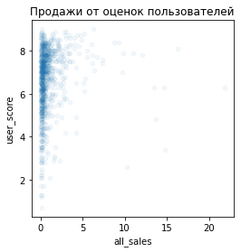

# Исследование данных о продажах игр

# Описание проекта
Сейчас декабрь 2016 г. 

Интернет-магазин «Стримчик» продаёт по всему миру компьютерные игры. Из открытых источников взяты **исторические данные о продажах игр, оценки пользователей и экспертов, жанры и платформы** (например, Xbox или PlayStation) до 2016 года. 

Задача: выявить определяющие успешность игры закономерности. Это позволит сделать ставку на потенциально популярный продукт и спланировать рекламные кампании.

ESRB (Entertainment Software Rating Board) — это ассоциация, определяющая возрастной рейтинг компьютерных игр. ESRB оценивает игровой контент и присваивает ему подходящую возрастную категорию, например, «Для взрослых», «Для детей младшего возраста» или «Для подростков».

<h1>Оглавление<span class="tocSkip"></span></h1>
<div class="toc"><ul class="toc-item"><li><span><a href="#Подготовка-данных" data-toc-modified-id="Подготовка-данных-1"><span class="toc-item-num">1&nbsp;&nbsp;</span>Подготовка данных</a></span><ul class="toc-item"><li><span><a href="#История-платформ" data-toc-modified-id="История-платформ-1.1"><span class="toc-item-num">1.1&nbsp;&nbsp;</span>История платформ</a></span></li><li><span><a href="#check" data-toc-modified-id="check-1.2"><span class="toc-item-num">1.2&nbsp;&nbsp;</span>check</a></span></li></ul></li><li><span><a href="#Исследовательский-анализ-данных" data-toc-modified-id="Исследовательский-анализ-данных-2"><span class="toc-item-num">2&nbsp;&nbsp;</span>Исследовательский анализ данных</a></span><ul class="toc-item"><li><span><a href="#Выпуск-игр-по-годам" data-toc-modified-id="Выпуск-игр-по-годам-2.1"><span class="toc-item-num">2.1&nbsp;&nbsp;</span>Выпуск игр по годам</a></span></li><li><span><a href="#Выпуск-игр-по-платформам" data-toc-modified-id="Выпуск-игр-по-платформам-2.2"><span class="toc-item-num">2.2&nbsp;&nbsp;</span>Выпуск игр по платформам</a></span></li><li><span><a href="#Характерный-срок-платформ" data-toc-modified-id="Характерный-срок-платформ-2.3"><span class="toc-item-num">2.3&nbsp;&nbsp;</span>Характерный срок платформ</a></span></li><li><span><a href="#Влияние-отзывов-на-продажи" data-toc-modified-id="Влияние-отзывов-на-продажи-2.4"><span class="toc-item-num">2.4&nbsp;&nbsp;</span>Влияние отзывов на продажи</a></span></li><li><span><a href="#Портрет-пользователя-каждого-региона" data-toc-modified-id="Портрет-пользователя-каждого-региона-2.5"><span class="toc-item-num">2.5&nbsp;&nbsp;</span>Портрет пользователя каждого региона</a></span><ul class="toc-item"><li><span><a href="#Пропуски-в-rating" data-toc-modified-id="Пропуски-в-rating-2.5.1"><span class="toc-item-num">2.5.1&nbsp;&nbsp;</span>Пропуски в <em>rating</em></a></span></li><li><span><a href="#NA" data-toc-modified-id="NA-2.5.2"><span class="toc-item-num">2.5.2&nbsp;&nbsp;</span>NA</a></span></li><li><span><a href="#JP" data-toc-modified-id="JP-2.5.3"><span class="toc-item-num">2.5.3&nbsp;&nbsp;</span>JP</a></span></li><li><span><a href="#EU" data-toc-modified-id="EU-2.5.4"><span class="toc-item-num">2.5.4&nbsp;&nbsp;</span>EU</a></span></li></ul></li><li><span><a href="#Гипотезы" data-toc-modified-id="Гипотезы-2.6"><span class="toc-item-num">2.6&nbsp;&nbsp;</span>Гипотезы</a></span><ul class="toc-item"><li><span><a href="#Гипотеза-№1" data-toc-modified-id="Гипотеза-№1-2.6.1"><span class="toc-item-num">2.6.1&nbsp;&nbsp;</span>Гипотеза №1</a></span></li><li><span><a href="#Гипотеза-№2" data-toc-modified-id="Гипотеза-№2-2.6.2"><span class="toc-item-num">2.6.2&nbsp;&nbsp;</span>Гипотеза №2</a></span></li></ul></li></ul></li><li><span><a href="#Общий-вывод" data-toc-modified-id="Общий-вывод-3"><span class="toc-item-num">3&nbsp;&nbsp;</span>Общий вывод</a></span></li></ul></div>

## Подготовка данных


```python
# Импорт библиотек
import pandas as pd
import math
import re

# Для моды
import statistics

from scipy import stats as st
import numpy as np

# импорт tqdm для строки прогресса выполнения
from tqdm import tqdm

# импорт matplotlib для построения графиков 
import matplotlib.pyplot as plt
import matplotlib

# импорт seaborn для построения графиков
import seaborn as sns
```


```python
# записываем датафрейм в переменную
try:
    df = pd.read_csv('/datasets/games.csv')
# если не получилось прочитать файл из локальной папки, то загружаем данные из сети
except:
    df = pd.read_csv('datasets/games.csv')
```


```python
df.head(15)
```


<div>
<style scoped>
    .dataframe tbody tr th:only-of-type {
        vertical-align: middle;
    }

    .dataframe tbody tr th {
        vertical-align: top;
    }

    .dataframe thead th {
        text-align: right;
    }
</style>
<table border="1" class="dataframe">
  <thead>
    <tr style="text-align: right;">
      <th></th>
      <th>Name</th>
      <th>Platform</th>
      <th>Year_of_Release</th>
      <th>Genre</th>
      <th>NA_sales</th>
      <th>EU_sales</th>
      <th>JP_sales</th>
      <th>Other_sales</th>
      <th>Critic_Score</th>
      <th>User_Score</th>
      <th>Rating</th>
    </tr>
  </thead>
  <tbody>
    <tr>
      <th>0</th>
      <td>Wii Sports</td>
      <td>Wii</td>
      <td>2006.0</td>
      <td>Sports</td>
      <td>41.36</td>
      <td>28.96</td>
      <td>3.77</td>
      <td>8.45</td>
      <td>76.0</td>
      <td>8</td>
      <td>E</td>
    </tr>
    <tr>
      <th>1</th>
      <td>Super Mario Bros.</td>
      <td>NES</td>
      <td>1985.0</td>
      <td>Platform</td>
      <td>29.08</td>
      <td>3.58</td>
      <td>6.81</td>
      <td>0.77</td>
      <td>NaN</td>
      <td>NaN</td>
      <td>NaN</td>
    </tr>
    <tr>
      <th>2</th>
      <td>Mario Kart Wii</td>
      <td>Wii</td>
      <td>2008.0</td>
      <td>Racing</td>
      <td>15.68</td>
      <td>12.76</td>
      <td>3.79</td>
      <td>3.29</td>
      <td>82.0</td>
      <td>8.3</td>
      <td>E</td>
    </tr>
    <tr>
      <th>3</th>
      <td>Wii Sports Resort</td>
      <td>Wii</td>
      <td>2009.0</td>
      <td>Sports</td>
      <td>15.61</td>
      <td>10.93</td>
      <td>3.28</td>
      <td>2.95</td>
      <td>80.0</td>
      <td>8</td>
      <td>E</td>
    </tr>
    <tr>
      <th>4</th>
      <td>Pokemon Red/Pokemon Blue</td>
      <td>GB</td>
      <td>1996.0</td>
      <td>Role-Playing</td>
      <td>11.27</td>
      <td>8.89</td>
      <td>10.22</td>
      <td>1.00</td>
      <td>NaN</td>
      <td>NaN</td>
      <td>NaN</td>
    </tr>
    <tr>
      <th>5</th>
      <td>Tetris</td>
      <td>GB</td>
      <td>1989.0</td>
      <td>Puzzle</td>
      <td>23.20</td>
      <td>2.26</td>
      <td>4.22</td>
      <td>0.58</td>
      <td>NaN</td>
      <td>NaN</td>
      <td>NaN</td>
    </tr>
    <tr>
      <th>6</th>
      <td>New Super Mario Bros.</td>
      <td>DS</td>
      <td>2006.0</td>
      <td>Platform</td>
      <td>11.28</td>
      <td>9.14</td>
      <td>6.50</td>
      <td>2.88</td>
      <td>89.0</td>
      <td>8.5</td>
      <td>E</td>
    </tr>
    <tr>
      <th>7</th>
      <td>Wii Play</td>
      <td>Wii</td>
      <td>2006.0</td>
      <td>Misc</td>
      <td>13.96</td>
      <td>9.18</td>
      <td>2.93</td>
      <td>2.84</td>
      <td>58.0</td>
      <td>6.6</td>
      <td>E</td>
    </tr>
    <tr>
      <th>8</th>
      <td>New Super Mario Bros. Wii</td>
      <td>Wii</td>
      <td>2009.0</td>
      <td>Platform</td>
      <td>14.44</td>
      <td>6.94</td>
      <td>4.70</td>
      <td>2.24</td>
      <td>87.0</td>
      <td>8.4</td>
      <td>E</td>
    </tr>
    <tr>
      <th>9</th>
      <td>Duck Hunt</td>
      <td>NES</td>
      <td>1984.0</td>
      <td>Shooter</td>
      <td>26.93</td>
      <td>0.63</td>
      <td>0.28</td>
      <td>0.47</td>
      <td>NaN</td>
      <td>NaN</td>
      <td>NaN</td>
    </tr>
    <tr>
      <th>10</th>
      <td>Nintendogs</td>
      <td>DS</td>
      <td>2005.0</td>
      <td>Simulation</td>
      <td>9.05</td>
      <td>10.95</td>
      <td>1.93</td>
      <td>2.74</td>
      <td>NaN</td>
      <td>NaN</td>
      <td>NaN</td>
    </tr>
    <tr>
      <th>11</th>
      <td>Mario Kart DS</td>
      <td>DS</td>
      <td>2005.0</td>
      <td>Racing</td>
      <td>9.71</td>
      <td>7.47</td>
      <td>4.13</td>
      <td>1.90</td>
      <td>91.0</td>
      <td>8.6</td>
      <td>E</td>
    </tr>
    <tr>
      <th>12</th>
      <td>Pokemon Gold/Pokemon Silver</td>
      <td>GB</td>
      <td>1999.0</td>
      <td>Role-Playing</td>
      <td>9.00</td>
      <td>6.18</td>
      <td>7.20</td>
      <td>0.71</td>
      <td>NaN</td>
      <td>NaN</td>
      <td>NaN</td>
    </tr>
    <tr>
      <th>13</th>
      <td>Wii Fit</td>
      <td>Wii</td>
      <td>2007.0</td>
      <td>Sports</td>
      <td>8.92</td>
      <td>8.03</td>
      <td>3.60</td>
      <td>2.15</td>
      <td>80.0</td>
      <td>7.7</td>
      <td>E</td>
    </tr>
    <tr>
      <th>14</th>
      <td>Kinect Adventures!</td>
      <td>X360</td>
      <td>2010.0</td>
      <td>Misc</td>
      <td>15.00</td>
      <td>4.89</td>
      <td>0.24</td>
      <td>1.69</td>
      <td>61.0</td>
      <td>6.3</td>
      <td>E</td>
    </tr>
  </tbody>
</table>
</div>


```python
df.info()
```

    <class 'pandas.core.frame.DataFrame'>
    RangeIndex: 16715 entries, 0 to 16714
    Data columns (total 11 columns):
     #   Column           Non-Null Count  Dtype  
    ---  ------           --------------  -----  
     0   Name             16713 non-null  object 
     1   Platform         16715 non-null  object 
     2   Year_of_Release  16446 non-null  float64
     3   Genre            16713 non-null  object 
     4   NA_sales         16715 non-null  float64
     5   EU_sales         16715 non-null  float64
     6   JP_sales         16715 non-null  float64
     7   Other_sales      16715 non-null  float64
     8   Critic_Score     8137 non-null   float64
     9   User_Score       10014 non-null  object 
     10  Rating           9949 non-null   object 
    dtypes: float64(6), object(5)
    memory usage: 1.4+ MB
    


```python
df.isna().sum()
```


    Name                  2
    Platform              0
    Year_of_Release     269
    Genre                 2
    NA_sales              0
    EU_sales              0
    JP_sales              0
    Other_sales           0
    Critic_Score       8578
    User_Score         6701
    Rating             6766
    dtype: int64


```python
df.isna().value_counts().to_frame()
```


<div>
<style scoped>
    .dataframe tbody tr th:only-of-type {
        vertical-align: middle;
    }

    .dataframe tbody tr th {
        vertical-align: top;
    }

    .dataframe thead th {
        text-align: right;
    }
</style>
<table border="1" class="dataframe">
  <thead>
    <tr style="text-align: right;">
      <th></th>
      <th></th>
      <th></th>
      <th></th>
      <th></th>
      <th></th>
      <th></th>
      <th></th>
      <th></th>
      <th></th>
      <th></th>
      <th>0</th>
    </tr>
    <tr>
      <th>Name</th>
      <th>Platform</th>
      <th>Year_of_Release</th>
      <th>Genre</th>
      <th>NA_sales</th>
      <th>EU_sales</th>
      <th>JP_sales</th>
      <th>Other_sales</th>
      <th>Critic_Score</th>
      <th>User_Score</th>
      <th>Rating</th>
      <th></th>
    </tr>
  </thead>
  <tbody>
    <tr>
      <th rowspan="14" valign="top">False</th>
      <th rowspan="14" valign="top">False</th>
      <th rowspan="3" valign="top">False</th>
      <th rowspan="3" valign="top">False</th>
      <th rowspan="3" valign="top">False</th>
      <th rowspan="3" valign="top">False</th>
      <th rowspan="3" valign="top">False</th>
      <th rowspan="3" valign="top">False</th>
      <th>False</th>
      <th>False</th>
      <th>False</th>
      <td>7878</td>
    </tr>
    <tr>
      <th rowspan="2" valign="top">True</th>
      <th>True</th>
      <th>True</th>
      <td>6534</td>
    </tr>
    <tr>
      <th>False</th>
      <th>False</th>
      <td>1828</td>
    </tr>
    <tr>
      <th rowspan="2" valign="top">True</th>
      <th rowspan="2" valign="top">False</th>
      <th rowspan="2" valign="top">False</th>
      <th rowspan="2" valign="top">False</th>
      <th rowspan="2" valign="top">False</th>
      <th rowspan="2" valign="top">False</th>
      <th>False</th>
      <th>False</th>
      <th>False</th>
      <td>147</td>
    </tr>
    <tr>
      <th>True</th>
      <th>True</th>
      <th>True</th>
      <td>85</td>
    </tr>
    <tr>
      <th rowspan="3" valign="top">False</th>
      <th rowspan="3" valign="top">False</th>
      <th rowspan="3" valign="top">False</th>
      <th rowspan="3" valign="top">False</th>
      <th rowspan="3" valign="top">False</th>
      <th rowspan="3" valign="top">False</th>
      <th>False</th>
      <th>False</th>
      <th>True</th>
      <td>72</td>
    </tr>
    <tr>
      <th rowspan="2" valign="top">True</th>
      <th>False</th>
      <th>True</th>
      <td>61</td>
    </tr>
    <tr>
      <th>True</th>
      <th>False</th>
      <td>38</td>
    </tr>
    <tr>
      <th>True</th>
      <th>False</th>
      <th>False</th>
      <th>False</th>
      <th>False</th>
      <th>False</th>
      <th>True</th>
      <th>False</th>
      <th>False</th>
      <td>25</td>
    </tr>
    <tr>
      <th rowspan="2" valign="top">False</th>
      <th rowspan="2" valign="top">False</th>
      <th rowspan="2" valign="top">False</th>
      <th rowspan="2" valign="top">False</th>
      <th rowspan="2" valign="top">False</th>
      <th rowspan="2" valign="top">False</th>
      <th rowspan="2" valign="top">False</th>
      <th rowspan="2" valign="top">True</th>
      <th>False</th>
      <td>24</td>
    </tr>
    <tr>
      <th>True</th>
      <td>9</td>
    </tr>
    <tr>
      <th rowspan="3" valign="top">True</th>
      <th rowspan="3" valign="top">False</th>
      <th rowspan="3" valign="top">False</th>
      <th rowspan="3" valign="top">False</th>
      <th rowspan="3" valign="top">False</th>
      <th rowspan="3" valign="top">False</th>
      <th>False</th>
      <th>True</th>
      <th>False</th>
      <td>5</td>
    </tr>
    <tr>
      <th>True</th>
      <th>True</th>
      <th>False</th>
      <td>4</td>
    </tr>
    <tr>
      <th>False</th>
      <th>False</th>
      <th>True</th>
      <td>2</td>
    </tr>
    <tr>
      <th>True</th>
      <th>False</th>
      <th>False</th>
      <th>True</th>
      <th>False</th>
      <th>False</th>
      <th>False</th>
      <th>False</th>
      <th>True</th>
      <th>True</th>
      <th>True</th>
      <td>2</td>
    </tr>
    <tr>
      <th>False</th>
      <th>False</th>
      <th>True</th>
      <th>False</th>
      <th>False</th>
      <th>False</th>
      <th>False</th>
      <th>False</th>
      <th>True</th>
      <th>False</th>
      <th>True</th>
      <td>1</td>
    </tr>
  </tbody>
</table>
</div>


Можно сказать, что нет однозначной связи между пропусками нет, <span class="mark">но большая их часть приходится на комбинацию</span> отсутсвия "Critic_Score, User_Score, Rating".


```python
pd.plotting.scatter_matrix(df, figsize=(9, 9));
```


    

    


Переименуем столбцы.


```python
df.columns
```


    Index(['Name', 'Platform', 'Year_of_Release', 'Genre', 'NA_sales', 'EU_sales',
           'JP_sales', 'Other_sales', 'Critic_Score', 'User_Score', 'Rating'],
          dtype='object')


```python
# Приводим названия столбцов к нижнему регистру
df.columns = df.columns.str.lower()
```


```python
df.columns
```


    Index(['name', 'platform', 'year_of_release', 'genre', 'na_sales', 'eu_sales',
           'jp_sales', 'other_sales', 'critic_score', 'user_score', 'rating'],
          dtype='object')


```python
df.shape[0]
```


    16715


```python
# Удаление явных дубликатов
df = df.drop_duplicates().reset_index(drop=True)
df.shape[0]
```


    16715


Преобразуем столбец "year_of_release" в дату.


```python
df['year_of_release'].isna().sum()
```


    269


```python
# Удаление явных дубликатов
df['name'] = df['name'].str.lower()
df['platform'] = df['platform'].str.lower()

df = df.drop_duplicates().reset_index(drop=True)
df.shape[0]
```


    16715


Посмотрим на пропуски в данном столбце.


```python
df.loc[df['year_of_release'].isna()]
```


<div>
<style scoped>
    .dataframe tbody tr th:only-of-type {
        vertical-align: middle;
    }

    .dataframe tbody tr th {
        vertical-align: top;
    }

    .dataframe thead th {
        text-align: right;
    }
</style>
<table border="1" class="dataframe">
  <thead>
    <tr style="text-align: right;">
      <th></th>
      <th>name</th>
      <th>platform</th>
      <th>year_of_release</th>
      <th>genre</th>
      <th>na_sales</th>
      <th>eu_sales</th>
      <th>jp_sales</th>
      <th>other_sales</th>
      <th>critic_score</th>
      <th>user_score</th>
      <th>rating</th>
    </tr>
  </thead>
  <tbody>
    <tr>
      <th>183</th>
      <td>madden nfl 2004</td>
      <td>ps2</td>
      <td>NaN</td>
      <td>Sports</td>
      <td>4.26</td>
      <td>0.26</td>
      <td>0.01</td>
      <td>0.71</td>
      <td>94.0</td>
      <td>8.5</td>
      <td>E</td>
    </tr>
    <tr>
      <th>377</th>
      <td>fifa soccer 2004</td>
      <td>ps2</td>
      <td>NaN</td>
      <td>Sports</td>
      <td>0.59</td>
      <td>2.36</td>
      <td>0.04</td>
      <td>0.51</td>
      <td>84.0</td>
      <td>6.4</td>
      <td>E</td>
    </tr>
    <tr>
      <th>456</th>
      <td>lego batman: the videogame</td>
      <td>wii</td>
      <td>NaN</td>
      <td>Action</td>
      <td>1.80</td>
      <td>0.97</td>
      <td>0.00</td>
      <td>0.29</td>
      <td>74.0</td>
      <td>7.9</td>
      <td>E10+</td>
    </tr>
    <tr>
      <th>475</th>
      <td>wwe smackdown vs. raw 2006</td>
      <td>ps2</td>
      <td>NaN</td>
      <td>Fighting</td>
      <td>1.57</td>
      <td>1.02</td>
      <td>0.00</td>
      <td>0.41</td>
      <td>NaN</td>
      <td>NaN</td>
      <td>NaN</td>
    </tr>
    <tr>
      <th>609</th>
      <td>space invaders</td>
      <td>2600</td>
      <td>NaN</td>
      <td>Shooter</td>
      <td>2.36</td>
      <td>0.14</td>
      <td>0.00</td>
      <td>0.03</td>
      <td>NaN</td>
      <td>NaN</td>
      <td>NaN</td>
    </tr>
    <tr>
      <th>...</th>
      <td>...</td>
      <td>...</td>
      <td>...</td>
      <td>...</td>
      <td>...</td>
      <td>...</td>
      <td>...</td>
      <td>...</td>
      <td>...</td>
      <td>...</td>
      <td>...</td>
    </tr>
    <tr>
      <th>16373</th>
      <td>pdc world championship darts 2008</td>
      <td>psp</td>
      <td>NaN</td>
      <td>Sports</td>
      <td>0.01</td>
      <td>0.00</td>
      <td>0.00</td>
      <td>0.00</td>
      <td>43.0</td>
      <td>tbd</td>
      <td>E10+</td>
    </tr>
    <tr>
      <th>16405</th>
      <td>freaky flyers</td>
      <td>gc</td>
      <td>NaN</td>
      <td>Racing</td>
      <td>0.01</td>
      <td>0.00</td>
      <td>0.00</td>
      <td>0.00</td>
      <td>69.0</td>
      <td>6.5</td>
      <td>T</td>
    </tr>
    <tr>
      <th>16448</th>
      <td>inversion</td>
      <td>pc</td>
      <td>NaN</td>
      <td>Shooter</td>
      <td>0.01</td>
      <td>0.00</td>
      <td>0.00</td>
      <td>0.00</td>
      <td>59.0</td>
      <td>6.7</td>
      <td>M</td>
    </tr>
    <tr>
      <th>16458</th>
      <td>hakuouki: shinsengumi kitan</td>
      <td>ps3</td>
      <td>NaN</td>
      <td>Adventure</td>
      <td>0.01</td>
      <td>0.00</td>
      <td>0.00</td>
      <td>0.00</td>
      <td>NaN</td>
      <td>NaN</td>
      <td>NaN</td>
    </tr>
    <tr>
      <th>16522</th>
      <td>virtua quest</td>
      <td>gc</td>
      <td>NaN</td>
      <td>Role-Playing</td>
      <td>0.01</td>
      <td>0.00</td>
      <td>0.00</td>
      <td>0.00</td>
      <td>55.0</td>
      <td>5.5</td>
      <td>T</td>
    </tr>
  </tbody>
</table>
<p>269 rows × 11 columns</p>
</div>


В некоторых строках в названии игры есть год выпуска.


```python
# Замена по году в названии (могут быть ошибки в 1 год)

с = 0 # счётчик
for new_string in df.loc[df['year_of_release'].isna(), 'name']:
    new_result = re.findall('[0-9]+', new_string)
    if (len(new_result) != 0):
        if (int(math.log10(int(new_result[0])))+1) == 4:
            с += 1
            df.loc[(df['name'].str.contains(new_result[0]) == True), 
                   'year_of_release'] = df[(df['name'].str.contains(new_result[0]) 
                                            == True)]['year_of_release'].fillna(int(new_result[0])-1)    

print('Число замен:', с)
print('Пропуски:', df['year_of_release'].isna().sum())
```

    Число замен: 17
    Пропуски: 252
    


```python
df['platform'].unique()
```


    array(['wii', 'nes', 'gb', 'ds', 'x360', 'ps3', 'ps2', 'snes', 'gba',
           'ps4', '3ds', 'n64', 'ps', 'xb', 'pc', '2600', 'psp', 'xone',
           'wiiu', 'gc', 'gen', 'dc', 'psv', 'sat', 'scd', 'ws', 'ng', 'tg16',
           '3do', 'gg', 'pcfx'], dtype=object)


### История платформ


<span class="mark"><span class="mark"><span class="mark">PS</span></span>2</span> PlayStation 2 (официальное сокр. PS2) О начале разработки было объявлено в марте 1999 г., продажа консоли в Японии началась 4 марта 2000 г., в Северной Америке — 26 октября 2000 г., в Европе — 24 ноября 2000 года, в России — 7 ноября 2002 года.
Игровая приставка стала наиболее быстро продаваемой и самой популярной игровой консолью в истории.


<span class="mark">WII</span> 19 ноября 2006 года вышла игровая приставка Nintendo Wii. 


<span class="mark">NES</span> Впервые консоль появилась на японском рынке в 1983 году под названием. Famicom, а затем, переименованная в NES, вышла в Европе и США в 1985 году.


<span class="mark">GB</span> Nintendo. Первая портативная система семейства Game Boy была впервые выпущена в Японии 21 апреля 1989 года. В конце того же года система была выпущена в Северной Америке, а в конце 1990 года - в Европе.


<span class="mark">DS</span> Оригинальная Nintendo DS (Blue edition). Выпущена 21.11.2004 в Америке, 02.12.2004 в Японии и 11.03.2004 в Европе.


<span class="mark"><span class="mark"><span class="mark">Xbox</span></span> 360</span> была официально анонсирована на канале MTV 12 мая 2005 года, а более детальная информация о приставке была представлена в том же месяце на выставке Electronic Entertainment Expo (E3). Все доступные на время выпуска приставки были успешно проданы в каждой стране, кроме Японии.


<span class="mark">PS3</span> Выход PS3 в Японии состоялся 11 ноября 2006 года, 17 ноября приставка появилась в Северной Америке в первом квартале 2007 года), в марте 2007 года — в Европе, а потом в России.


<span class="mark">SNES</span> Super Nintendo Entertainment System, разработанная Масаюки Уэмурой, создателем Famicom, была выпущена в Японии 21 ноября 1990 года


<span class="mark">GBA</span> Nintendo выпущена 21 марта 2001 года в Японии, 11 июня 2001 года в Северной Америке, 22 июня 2001 года в регионе PAL, и 8 июня 2004 года в материковом Китае под названием iQue Game Boy Advance.


<span class="mark">PS4</span> Официальный анонс PlayStation 4 состоялся на конференции PlayStation Meeting 2013 в феврале 2013 года, продажи начались в ноябре 2013 года в США, Европе, Южной Америке, России и Австралии и в феврале 2014 года в Японии.


<span class="mark">3DS</span> Nintendo 3DS поступила в продажу в Японии 26 февраля 2011 года.


<span class="mark">N64</span> Nintendo 64, также Ultra 64 и N64 - 64-разрядная игровая приставка. Была выпущена в 1996 году и стала ответом на приставки конкурентов Sony PlayStation и Sega Saturn. 


<span class="mark">PS</span> Выход PS приставки состоялся 3 декабря 1994 года в Японии, в США приставка появилась 9 сентября 1995 года, а в Европе - 29 сентября 1995 года.


<span class="mark">Xbox</span> Первая приставка Xbox вышла на рынок 15 ноября 2001 год.


<span class="mark">PC</span> Первые игры на PC появились в 1960-х годах.


<span class="mark">VCS</span> Atari VCS, позже названная Atari 2600, появилась к Рождеству 1977 года и стала доминирующей игровой приставкой конца 1970-х — начала 1980-х.


<span class="mark">PSP</span> первая консоль была продемонстрирована публике 11 мая 2004 года на пресс-конференции, проводимой Sony в рамках E3 2004. Первые продажи консоли были начаты в Японии 12 декабря 2004 года, в Северной Америке 24 марта 2005 года, и в PAL-регионах 1 сентября 2005 года. 


<span class="mark">XOne</span> Xbox One:
Соединённые Штаты Америки 22 ноября 2013;
Европа 22 ноября 2013;
Япония 4 сентября 2014.

<span class="mark">Wii U</span> Название игровой консоли Nintendo, которая является преемником Wii. Система была представлена на пресс-конференции Nintendo 7 июня 2011 года на выставке E3 2011, выпущена в 2012 году.


<span class="mark">GC</span> <span class="mark">NG</span> Nintendo GameCube - GC (официально названная GCN на Западе и NGC в Японии):
Дата выхода	Япония 14 сентября 2001
Соединённые Штаты Америки 18 ноября 2001
Европейский союз 3 мая 2002


<span class="mark">GEN</span> Sega. Приставка была выпущена в 1988 году в Японии как Mega Drive, в 1989 году в США как Genesis и в 1990 году в Европе, Австралии и Бразилии - вновь под названием Mega Drive. 


<span class="mark">DC</span> Домашняя игровая приставка, выпущенная компанией Sega 27 ноября 1998 года в Японии, 9 сентября 1999 года в Северной Америке и 14 октября 1999 года в Европе.


<span class="mark">PSV</span> Выпущена в Японии 17 декабря 2011 года, в Северной Америке и Европе - 22 февраля 2012 года.


<span class="mark">SAT</span> Sega и выпущенная 22 ноября 1994 года в Японии, 11 мая 1995 года в Северной Америке и 8 июля 1995 года в Европе.


<span class="mark">SCD</span> Super CD-ROM развлекательной системы Super Nintendo (также известной как SNES SCD, Super Nintendo SCD и SNES Super CD) дополнение к развлекательной системе Super Nintendo, выпущенное в октябре 1992 года.

<span class="mark">WS</span> WonderSwan - портативная игровая консоль компании Bandai, выпущенная в 1999 году в Японии.

<span class="mark">TG16</span> TurboGrafx-16 известная за пределами Северной Америки как PC Engine дата выхода JP: 30 октября 1987.


<span class="mark">3DO</span> 3DO Interactive Multiplayer — игровая приставка, выпускавшаяся в 1993—1996 годах компаниями Panasonic, Sanyo, Creative и Goldstar.


<span class="mark">PCFX</span> 32-разрядная игровая консоль, разработанная компанией NEC. Преемник предыдущей консоли от этой компании, PC Engine. Выпущена в Японии 23 декабря 1994 года.

Перобразовать столбец "year_of_release" не получится, так как в нем есть пропуски. Проще эти данные исключить, так как их немного (252 шт.).


```python
# Удаляем строки
df = df.loc[~df['year_of_release'].isna()]
```

У нас есть два пропуска среди жанров и имён. Рассмотрим их.


```python
 df.loc[df['name'].isna() | df['genre'].isna()]
```


<div>
<style scoped>
    .dataframe tbody tr th:only-of-type {
        vertical-align: middle;
    }

    .dataframe tbody tr th {
        vertical-align: top;
    }

    .dataframe thead th {
        text-align: right;
    }
</style>
<table border="1" class="dataframe">
  <thead>
    <tr style="text-align: right;">
      <th></th>
      <th>name</th>
      <th>platform</th>
      <th>year_of_release</th>
      <th>genre</th>
      <th>na_sales</th>
      <th>eu_sales</th>
      <th>jp_sales</th>
      <th>other_sales</th>
      <th>critic_score</th>
      <th>user_score</th>
      <th>rating</th>
    </tr>
  </thead>
  <tbody>
    <tr>
      <th>659</th>
      <td>NaN</td>
      <td>gen</td>
      <td>1993.0</td>
      <td>NaN</td>
      <td>1.78</td>
      <td>0.53</td>
      <td>0.00</td>
      <td>0.08</td>
      <td>NaN</td>
      <td>NaN</td>
      <td>NaN</td>
    </tr>
    <tr>
      <th>14244</th>
      <td>NaN</td>
      <td>gen</td>
      <td>1993.0</td>
      <td>NaN</td>
      <td>0.00</td>
      <td>0.00</td>
      <td>0.03</td>
      <td>0.00</td>
      <td>NaN</td>
      <td>NaN</td>
      <td>NaN</td>
    </tr>
  </tbody>
</table>
</div>


```python
print('Всего для платформы "GEN"', df.loc[df['platform'] == "gen"].shape[0], 'игр')
print('Потери составят {:.2%}'.format(df.loc[df['name'].isna() | df['genre'].isna()].shape[0] 
                                      / df.loc[df['platform'] == "gen"].shape[0]))
```

    Всего для платформы "GEN" 29 игр
    Потери составят 6.90%
    

Так как эти пропуски взаимосвязаны и их немного, можно удалить.


```python
# Удаляем строки
df = df.loc[~df['name'].isna()]
df.isna().sum()
```


    name                  0
    platform              0
    year_of_release       0
    genre                 0
    na_sales              0
    eu_sales              0
    jp_sales              0
    other_sales           0
    critic_score       8466
    user_score         6610
    rating             6682
    dtype: int64


Остались только те пропуски, которые запонять нет осбого смысла. Проблема конечно есть - 8466 пропусков среди оценок критиков и 6610 оценок пользователей. Предположительно можно было бы сгруппировать по играм и если есть одинаковые серии игр, при отсутствии оценок у одних, экстраполлировать им от других.

df['user_score'] имеет элементы *tbd* - To Be Determined, то есть "Будет определено".


```python
#df['user_score'] = df['user_score'].astype(float)
df['user_score'].value_counts().head(5).plot(kind='barh', figsize=(3,3), title='5 самых частых оценок');
```


    

    


```python
df.query('user_score == "tbd"')
```


<div>
<style scoped>
    .dataframe tbody tr th:only-of-type {
        vertical-align: middle;
    }

    .dataframe tbody tr th {
        vertical-align: top;
    }

    .dataframe thead th {
        text-align: right;
    }
</style>
<table border="1" class="dataframe">
  <thead>
    <tr style="text-align: right;">
      <th></th>
      <th>name</th>
      <th>platform</th>
      <th>year_of_release</th>
      <th>genre</th>
      <th>na_sales</th>
      <th>eu_sales</th>
      <th>jp_sales</th>
      <th>other_sales</th>
      <th>critic_score</th>
      <th>user_score</th>
      <th>rating</th>
    </tr>
  </thead>
  <tbody>
    <tr>
      <th>119</th>
      <td>zumba fitness</td>
      <td>wii</td>
      <td>2010.0</td>
      <td>Sports</td>
      <td>3.45</td>
      <td>2.59</td>
      <td>0.0</td>
      <td>0.66</td>
      <td>NaN</td>
      <td>tbd</td>
      <td>E</td>
    </tr>
    <tr>
      <th>301</th>
      <td>namco museum: 50th anniversary</td>
      <td>ps2</td>
      <td>2005.0</td>
      <td>Misc</td>
      <td>2.08</td>
      <td>1.35</td>
      <td>0.0</td>
      <td>0.54</td>
      <td>61.0</td>
      <td>tbd</td>
      <td>E10+</td>
    </tr>
    <tr>
      <th>520</th>
      <td>zumba fitness 2</td>
      <td>wii</td>
      <td>2011.0</td>
      <td>Sports</td>
      <td>1.51</td>
      <td>1.03</td>
      <td>0.0</td>
      <td>0.27</td>
      <td>NaN</td>
      <td>tbd</td>
      <td>T</td>
    </tr>
    <tr>
      <th>645</th>
      <td>udraw studio</td>
      <td>wii</td>
      <td>2010.0</td>
      <td>Misc</td>
      <td>1.65</td>
      <td>0.57</td>
      <td>0.0</td>
      <td>0.20</td>
      <td>71.0</td>
      <td>tbd</td>
      <td>E</td>
    </tr>
    <tr>
      <th>718</th>
      <td>just dance kids</td>
      <td>wii</td>
      <td>2010.0</td>
      <td>Misc</td>
      <td>1.52</td>
      <td>0.54</td>
      <td>0.0</td>
      <td>0.18</td>
      <td>NaN</td>
      <td>tbd</td>
      <td>E</td>
    </tr>
    <tr>
      <th>...</th>
      <td>...</td>
      <td>...</td>
      <td>...</td>
      <td>...</td>
      <td>...</td>
      <td>...</td>
      <td>...</td>
      <td>...</td>
      <td>...</td>
      <td>...</td>
      <td>...</td>
    </tr>
    <tr>
      <th>16695</th>
      <td>planet monsters</td>
      <td>gba</td>
      <td>2001.0</td>
      <td>Action</td>
      <td>0.01</td>
      <td>0.00</td>
      <td>0.0</td>
      <td>0.00</td>
      <td>67.0</td>
      <td>tbd</td>
      <td>E</td>
    </tr>
    <tr>
      <th>16697</th>
      <td>bust-a-move 3000</td>
      <td>gc</td>
      <td>2003.0</td>
      <td>Puzzle</td>
      <td>0.01</td>
      <td>0.00</td>
      <td>0.0</td>
      <td>0.00</td>
      <td>53.0</td>
      <td>tbd</td>
      <td>E</td>
    </tr>
    <tr>
      <th>16698</th>
      <td>mega brain boost</td>
      <td>ds</td>
      <td>2008.0</td>
      <td>Puzzle</td>
      <td>0.01</td>
      <td>0.00</td>
      <td>0.0</td>
      <td>0.00</td>
      <td>48.0</td>
      <td>tbd</td>
      <td>E</td>
    </tr>
    <tr>
      <th>16704</th>
      <td>plushees</td>
      <td>ds</td>
      <td>2008.0</td>
      <td>Simulation</td>
      <td>0.01</td>
      <td>0.00</td>
      <td>0.0</td>
      <td>0.00</td>
      <td>NaN</td>
      <td>tbd</td>
      <td>E</td>
    </tr>
    <tr>
      <th>16706</th>
      <td>men in black ii: alien escape</td>
      <td>gc</td>
      <td>2003.0</td>
      <td>Shooter</td>
      <td>0.01</td>
      <td>0.00</td>
      <td>0.0</td>
      <td>0.00</td>
      <td>NaN</td>
      <td>tbd</td>
      <td>T</td>
    </tr>
  </tbody>
</table>
<p>2378 rows × 11 columns</p>
</div>


```python
#df[['critic_score', 'user_score']]

df.query('user_score != "tbd"')['critic_score'].compare(df.query('user_score != "tbd"')['user_score'])
```


<div>
<style scoped>
    .dataframe tbody tr th:only-of-type {
        vertical-align: middle;
    }

    .dataframe tbody tr th {
        vertical-align: top;
    }

    .dataframe thead th {
        text-align: right;
    }
</style>
<table border="1" class="dataframe">
  <thead>
    <tr style="text-align: right;">
      <th></th>
      <th>self</th>
      <th>other</th>
    </tr>
  </thead>
  <tbody>
    <tr>
      <th>0</th>
      <td>76.0</td>
      <td>8</td>
    </tr>
    <tr>
      <th>2</th>
      <td>82.0</td>
      <td>8.3</td>
    </tr>
    <tr>
      <th>3</th>
      <td>80.0</td>
      <td>8</td>
    </tr>
    <tr>
      <th>6</th>
      <td>89.0</td>
      <td>8.5</td>
    </tr>
    <tr>
      <th>7</th>
      <td>58.0</td>
      <td>6.6</td>
    </tr>
    <tr>
      <th>...</th>
      <td>...</td>
      <td>...</td>
    </tr>
    <tr>
      <th>16681</th>
      <td>NaN</td>
      <td>8.1</td>
    </tr>
    <tr>
      <th>16692</th>
      <td>80.0</td>
      <td>7.6</td>
    </tr>
    <tr>
      <th>16696</th>
      <td>61.0</td>
      <td>5.8</td>
    </tr>
    <tr>
      <th>16702</th>
      <td>60.0</td>
      <td>7.2</td>
    </tr>
    <tr>
      <th>16705</th>
      <td>63.0</td>
      <td>5.8</td>
    </tr>
  </tbody>
</table>
<p>7506 rows × 2 columns</p>
</div>


```python
plt.figure().set_figwidth(12)

(df.query('user_score != "tbd"')['critic_score']/10).plot(alpha=0.9)
df.query('user_score != "tbd"')['user_score'].astype(float).plot(alpha=0.4)

plt.title("Сравнение оценок")
plt.show();
```


    

    


В целом, можно сказать, что эти графики близки, поэтому часть *tbd* можно заменить на 

    critic_score/10


```python
# Изменеяем tbd
#df.loc[df['user_score'] == "tbd", 'user_score'] = df.query('user_score == "tbd"')['critic_score']/10
```


```python
# Изменеяем tbd
df.loc[df['user_score'] == "tbd", 'user_score'] = float('nan')
```


```python
df[['critic_score', 'user_score']].isna().sum()
```


    critic_score    8466
    user_score      8988
    dtype: int64


```python
df.loc[(df['critic_score'].isna()) & ~(df['user_score'].isna()), ['critic_score', 'user_score']]
```


<div>
<style scoped>
    .dataframe tbody tr th:only-of-type {
        vertical-align: middle;
    }

    .dataframe tbody tr th {
        vertical-align: top;
    }

    .dataframe thead th {
        text-align: right;
    }
</style>
<table border="1" class="dataframe">
  <thead>
    <tr style="text-align: right;">
      <th></th>
      <th>critic_score</th>
      <th>user_score</th>
    </tr>
  </thead>
  <tbody>
    <tr>
      <th>255</th>
      <td>NaN</td>
      <td>4.8</td>
    </tr>
    <tr>
      <th>263</th>
      <td>NaN</td>
      <td>4.9</td>
    </tr>
    <tr>
      <th>264</th>
      <td>NaN</td>
      <td>4.5</td>
    </tr>
    <tr>
      <th>291</th>
      <td>NaN</td>
      <td>8.2</td>
    </tr>
    <tr>
      <th>359</th>
      <td>NaN</td>
      <td>6.2</td>
    </tr>
    <tr>
      <th>...</th>
      <td>...</td>
      <td>...</td>
    </tr>
    <tr>
      <th>16636</th>
      <td>NaN</td>
      <td>7.5</td>
    </tr>
    <tr>
      <th>16643</th>
      <td>NaN</td>
      <td>6.6</td>
    </tr>
    <tr>
      <th>16654</th>
      <td>NaN</td>
      <td>5.1</td>
    </tr>
    <tr>
      <th>16661</th>
      <td>NaN</td>
      <td>8</td>
    </tr>
    <tr>
      <th>16681</th>
      <td>NaN</td>
      <td>8.1</td>
    </tr>
  </tbody>
</table>
<p>569 rows × 2 columns</p>
</div>


```python
df['critic_score'] = df['critic_score'].astype(float)
df['user_score'] = df['user_score'].astype(float)
```


```python
# Замена части пропусков
df.loc[(df['critic_score'].isna()) 
       & ~(df['user_score'].isna()), 
       'critic_score'] = df.loc[(df['critic_score'].isna()) 
                                & ~(df['user_score'].isna()), 
                                'critic_score']\
.fillna(df.loc[(df['critic_score'].isna()) 
               & ~(df['user_score'].isna()), 
               'user_score']*10)
```


```python
#df[['critic_score', 'user_score']].isna().sum()
```


```python
df[df['critic_score'].isna()][['critic_score', 'user_score', 'rating']].isna().value_counts().to_frame()
```


<div>
<style scoped>
    .dataframe tbody tr th:only-of-type {
        vertical-align: middle;
    }

    .dataframe tbody tr th {
        vertical-align: top;
    }

    .dataframe thead th {
        text-align: right;
    }
</style>
<table border="1" class="dataframe">
  <thead>
    <tr style="text-align: right;">
      <th></th>
      <th></th>
      <th></th>
      <th>0</th>
    </tr>
    <tr>
      <th>critic_score</th>
      <th>user_score</th>
      <th>rating</th>
      <th></th>
    </tr>
  </thead>
  <tbody>
    <tr>
      <th rowspan="2" valign="top">True</th>
      <th rowspan="2" valign="top">True</th>
      <th>True</th>
      <td>6585</td>
    </tr>
    <tr>
      <th>False</th>
      <td>1312</td>
    </tr>
  </tbody>
</table>
</div>


```python
# Проверка уникальных значений
df['critic_score'].unique()
```


    array([76., nan, 82., 80., 89., 58., 87., 91., 61., 97., 95., 77., 88.,
           83., 94., 93., 85., 86., 98., 96., 90., 84., 73., 74., 78., 92.,
           71., 72., 68., 62., 49., 67., 81., 66., 56., 48., 45., 79., 70.,
           59., 64., 75., 60., 63., 42., 69., 32., 50., 25., 44., 55., 47.,
           57., 29., 65., 51., 54., 20., 53., 37., 30., 38., 33., 27., 52.,
           43., 35., 40., 46., 28., 39., 34., 31.,  0., 16., 41., 36., 24.,
           18., 17., 11., 26.,  3., 19., 23.,  7., 13.,  2., 21., 14.,  9.,
           12.,  6.])


```python
# Переведем год в int
df['year_of_release'] = df['year_of_release'].astype(int)
```


```python
df['year_of_release'].unique()
```


    array([2006, 1985, 2008, 2009, 1996, 1989, 1984, 2005, 1999, 2007, 2010,
           2013, 2004, 1990, 1988, 2002, 2001, 2011, 1998, 2015, 2012, 2014,
           1992, 1997, 1993, 1994, 1982, 2016, 2003, 1986, 2000, 1995, 1991,
           1981, 1987, 1980, 1983])


```python
df.columns
```


    Index(['name', 'platform', 'year_of_release', 'genre', 'na_sales', 'eu_sales',
           'jp_sales', 'other_sales', 'critic_score', 'user_score', 'rating'],
          dtype='object')


```python
df['all_sales'] = (df['na_sales'] + df['eu_sales'] + df['jp_sales'] + df['other_sales'])
```


```python
df
```


<div>
<style scoped>
    .dataframe tbody tr th:only-of-type {
        vertical-align: middle;
    }

    .dataframe tbody tr th {
        vertical-align: top;
    }

    .dataframe thead th {
        text-align: right;
    }
</style>
<table border="1" class="dataframe">
  <thead>
    <tr style="text-align: right;">
      <th></th>
      <th>name</th>
      <th>platform</th>
      <th>year_of_release</th>
      <th>genre</th>
      <th>na_sales</th>
      <th>eu_sales</th>
      <th>jp_sales</th>
      <th>other_sales</th>
      <th>critic_score</th>
      <th>user_score</th>
      <th>rating</th>
      <th>all_sales</th>
    </tr>
  </thead>
  <tbody>
    <tr>
      <th>0</th>
      <td>wii sports</td>
      <td>wii</td>
      <td>2006</td>
      <td>Sports</td>
      <td>41.36</td>
      <td>28.96</td>
      <td>3.77</td>
      <td>8.45</td>
      <td>76.0</td>
      <td>8.0</td>
      <td>E</td>
      <td>82.54</td>
    </tr>
    <tr>
      <th>1</th>
      <td>super mario bros.</td>
      <td>nes</td>
      <td>1985</td>
      <td>Platform</td>
      <td>29.08</td>
      <td>3.58</td>
      <td>6.81</td>
      <td>0.77</td>
      <td>NaN</td>
      <td>NaN</td>
      <td>NaN</td>
      <td>40.24</td>
    </tr>
    <tr>
      <th>2</th>
      <td>mario kart wii</td>
      <td>wii</td>
      <td>2008</td>
      <td>Racing</td>
      <td>15.68</td>
      <td>12.76</td>
      <td>3.79</td>
      <td>3.29</td>
      <td>82.0</td>
      <td>8.3</td>
      <td>E</td>
      <td>35.52</td>
    </tr>
    <tr>
      <th>3</th>
      <td>wii sports resort</td>
      <td>wii</td>
      <td>2009</td>
      <td>Sports</td>
      <td>15.61</td>
      <td>10.93</td>
      <td>3.28</td>
      <td>2.95</td>
      <td>80.0</td>
      <td>8.0</td>
      <td>E</td>
      <td>32.77</td>
    </tr>
    <tr>
      <th>4</th>
      <td>pokemon red/pokemon blue</td>
      <td>gb</td>
      <td>1996</td>
      <td>Role-Playing</td>
      <td>11.27</td>
      <td>8.89</td>
      <td>10.22</td>
      <td>1.00</td>
      <td>NaN</td>
      <td>NaN</td>
      <td>NaN</td>
      <td>31.38</td>
    </tr>
    <tr>
      <th>...</th>
      <td>...</td>
      <td>...</td>
      <td>...</td>
      <td>...</td>
      <td>...</td>
      <td>...</td>
      <td>...</td>
      <td>...</td>
      <td>...</td>
      <td>...</td>
      <td>...</td>
      <td>...</td>
    </tr>
    <tr>
      <th>16710</th>
      <td>samurai warriors: sanada maru</td>
      <td>ps3</td>
      <td>2016</td>
      <td>Action</td>
      <td>0.00</td>
      <td>0.00</td>
      <td>0.01</td>
      <td>0.00</td>
      <td>NaN</td>
      <td>NaN</td>
      <td>NaN</td>
      <td>0.01</td>
    </tr>
    <tr>
      <th>16711</th>
      <td>lma manager 2007</td>
      <td>x360</td>
      <td>2006</td>
      <td>Sports</td>
      <td>0.00</td>
      <td>0.01</td>
      <td>0.00</td>
      <td>0.00</td>
      <td>NaN</td>
      <td>NaN</td>
      <td>NaN</td>
      <td>0.01</td>
    </tr>
    <tr>
      <th>16712</th>
      <td>haitaka no psychedelica</td>
      <td>psv</td>
      <td>2016</td>
      <td>Adventure</td>
      <td>0.00</td>
      <td>0.00</td>
      <td>0.01</td>
      <td>0.00</td>
      <td>NaN</td>
      <td>NaN</td>
      <td>NaN</td>
      <td>0.01</td>
    </tr>
    <tr>
      <th>16713</th>
      <td>spirits &amp; spells</td>
      <td>gba</td>
      <td>2003</td>
      <td>Platform</td>
      <td>0.01</td>
      <td>0.00</td>
      <td>0.00</td>
      <td>0.00</td>
      <td>NaN</td>
      <td>NaN</td>
      <td>NaN</td>
      <td>0.01</td>
    </tr>
    <tr>
      <th>16714</th>
      <td>winning post 8 2016</td>
      <td>psv</td>
      <td>2016</td>
      <td>Simulation</td>
      <td>0.00</td>
      <td>0.00</td>
      <td>0.01</td>
      <td>0.00</td>
      <td>NaN</td>
      <td>NaN</td>
      <td>NaN</td>
      <td>0.01</td>
    </tr>
  </tbody>
</table>
<p>16461 rows × 12 columns</p>
</div>


```python
df['rating'].value_counts()
```


    E       3930
    T       2905
    M       1537
    E10+    1394
    EC         8
    K-A        3
    RP         1
    AO         1
    Name: rating, dtype: int64


```python
df['rating'].isna().sum()
```


    6682


Рейтинги:
* E: Everyone can play it.
* M: Mature 17+
* T: For Teens
* K-A: Kids to Adults
* AO: Adults Only
* RP: Ratings are Pending
* E10+: Age of 10+ can play


```python
(df[df['rating'].isna()]
 .groupby('year_of_release')['name']
 .count()
 .plot(kind='bar', title='Количество пропусков по годам', figsize=(12,4))
);
```


    

    


```python
df[df['rating'].isna()]
```


<div>
<style scoped>
    .dataframe tbody tr th:only-of-type {
        vertical-align: middle;
    }

    .dataframe tbody tr th {
        vertical-align: top;
    }

    .dataframe thead th {
        text-align: right;
    }
</style>
<table border="1" class="dataframe">
  <thead>
    <tr style="text-align: right;">
      <th></th>
      <th>name</th>
      <th>platform</th>
      <th>year_of_release</th>
      <th>genre</th>
      <th>na_sales</th>
      <th>eu_sales</th>
      <th>jp_sales</th>
      <th>other_sales</th>
      <th>critic_score</th>
      <th>user_score</th>
      <th>rating</th>
      <th>all_sales</th>
    </tr>
  </thead>
  <tbody>
    <tr>
      <th>1</th>
      <td>super mario bros.</td>
      <td>nes</td>
      <td>1985</td>
      <td>Platform</td>
      <td>29.08</td>
      <td>3.58</td>
      <td>6.81</td>
      <td>0.77</td>
      <td>NaN</td>
      <td>NaN</td>
      <td>NaN</td>
      <td>40.24</td>
    </tr>
    <tr>
      <th>4</th>
      <td>pokemon red/pokemon blue</td>
      <td>gb</td>
      <td>1996</td>
      <td>Role-Playing</td>
      <td>11.27</td>
      <td>8.89</td>
      <td>10.22</td>
      <td>1.00</td>
      <td>NaN</td>
      <td>NaN</td>
      <td>NaN</td>
      <td>31.38</td>
    </tr>
    <tr>
      <th>5</th>
      <td>tetris</td>
      <td>gb</td>
      <td>1989</td>
      <td>Puzzle</td>
      <td>23.20</td>
      <td>2.26</td>
      <td>4.22</td>
      <td>0.58</td>
      <td>NaN</td>
      <td>NaN</td>
      <td>NaN</td>
      <td>30.26</td>
    </tr>
    <tr>
      <th>9</th>
      <td>duck hunt</td>
      <td>nes</td>
      <td>1984</td>
      <td>Shooter</td>
      <td>26.93</td>
      <td>0.63</td>
      <td>0.28</td>
      <td>0.47</td>
      <td>NaN</td>
      <td>NaN</td>
      <td>NaN</td>
      <td>28.31</td>
    </tr>
    <tr>
      <th>10</th>
      <td>nintendogs</td>
      <td>ds</td>
      <td>2005</td>
      <td>Simulation</td>
      <td>9.05</td>
      <td>10.95</td>
      <td>1.93</td>
      <td>2.74</td>
      <td>NaN</td>
      <td>NaN</td>
      <td>NaN</td>
      <td>24.67</td>
    </tr>
    <tr>
      <th>...</th>
      <td>...</td>
      <td>...</td>
      <td>...</td>
      <td>...</td>
      <td>...</td>
      <td>...</td>
      <td>...</td>
      <td>...</td>
      <td>...</td>
      <td>...</td>
      <td>...</td>
      <td>...</td>
    </tr>
    <tr>
      <th>16710</th>
      <td>samurai warriors: sanada maru</td>
      <td>ps3</td>
      <td>2016</td>
      <td>Action</td>
      <td>0.00</td>
      <td>0.00</td>
      <td>0.01</td>
      <td>0.00</td>
      <td>NaN</td>
      <td>NaN</td>
      <td>NaN</td>
      <td>0.01</td>
    </tr>
    <tr>
      <th>16711</th>
      <td>lma manager 2007</td>
      <td>x360</td>
      <td>2006</td>
      <td>Sports</td>
      <td>0.00</td>
      <td>0.01</td>
      <td>0.00</td>
      <td>0.00</td>
      <td>NaN</td>
      <td>NaN</td>
      <td>NaN</td>
      <td>0.01</td>
    </tr>
    <tr>
      <th>16712</th>
      <td>haitaka no psychedelica</td>
      <td>psv</td>
      <td>2016</td>
      <td>Adventure</td>
      <td>0.00</td>
      <td>0.00</td>
      <td>0.01</td>
      <td>0.00</td>
      <td>NaN</td>
      <td>NaN</td>
      <td>NaN</td>
      <td>0.01</td>
    </tr>
    <tr>
      <th>16713</th>
      <td>spirits &amp; spells</td>
      <td>gba</td>
      <td>2003</td>
      <td>Platform</td>
      <td>0.01</td>
      <td>0.00</td>
      <td>0.00</td>
      <td>0.00</td>
      <td>NaN</td>
      <td>NaN</td>
      <td>NaN</td>
      <td>0.01</td>
    </tr>
    <tr>
      <th>16714</th>
      <td>winning post 8 2016</td>
      <td>psv</td>
      <td>2016</td>
      <td>Simulation</td>
      <td>0.00</td>
      <td>0.00</td>
      <td>0.01</td>
      <td>0.00</td>
      <td>NaN</td>
      <td>NaN</td>
      <td>NaN</td>
      <td>0.01</td>
    </tr>
  </tbody>
</table>
<p>6682 rows × 12 columns</p>
</div>


**Вывод по разделу:**
* заменены на *NaN* элементы *tbd*; 
* выполенна проверка на дубликаты;
* рассмотрено распредение пропусков в столбце *rating* по годам - решено отбросить неактуальные значения в ходе исследовательского анализа;
* группировка по возрастному рейтингу не имеет смысла на данном этапе.

## Исследовательский анализ данных

### Выпуск игр по годам


```python
sns.displot(df['year_of_release'], kde = True, height=4, aspect=2.25);
plt.title("Выпуск игр по годам");
plt.grid(visible=True)
plt.ylabel('Количество игр, шт.');
plt.xlabel('Год');
```


    

    


Данные до 2008 года однозначно уже не имеют большой значимости. Пик выпуска игр приходится на 2002-2012 годы.

### Выпуск игр по платформам


```python
df.groupby('platform')['name']\
.count().sort_values(ascending=False)\
.plot(kind='bar', figsize=(12,4), title=('Количество игр по платформам за все время'));
```


    

    


У нас есть платформы с 1-ой игрой, но нас не интересуют настолько "специфичные" платформы. Возьмем те, у которых суммарно количество игр превышает 500 шт.

### Характерный срок платформ


```python
display(df.query('(platform == "ds")&(year_of_release < 2004)').index)
df.query('(platform == "ds")')['name'].count()
```


    Int64Index([15957], dtype='int64')


    2122


```python
df = df.drop(df.query('(platform == "ds")&(year_of_release < 2004)').index)
df.query('(platform == "ds")')['name'].count()
```


    2121


```python
df.info()
```

    <class 'pandas.core.frame.DataFrame'>
    Int64Index: 16460 entries, 0 to 16714
    Data columns (total 12 columns):
     #   Column           Non-Null Count  Dtype  
    ---  ------           --------------  -----  
     0   name             16460 non-null  object 
     1   platform         16460 non-null  object 
     2   year_of_release  16460 non-null  int64  
     3   genre            16460 non-null  object 
     4   na_sales         16460 non-null  float64
     5   eu_sales         16460 non-null  float64
     6   jp_sales         16460 non-null  float64
     7   other_sales      16460 non-null  float64
     8   critic_score     8564 non-null   float64
     9   user_score       7473 non-null   float64
     10  rating           9779 non-null   object 
     11  all_sales        16460 non-null  float64
    dtypes: float64(7), int64(1), object(4)
    memory usage: 1.6+ MB
    


```python
import sys
sys. version
```


    '3.9.5 | packaged by conda-forge | (default, Jun 19 2021, 00:32:32) \n[GCC 9.3.0]'


```python
# Кол-во игр более 500
list_of_platforms = df.groupby('platform')['name'].count().sort_values(ascending=False) >= 500

for platform in list_of_platforms[list_of_platforms == True].index:
    df.query('platform == @platform')\
    .groupby('year_of_release')['name']\
    .count().plot(kind='bar', figsize=(12,3), title=(platform));
    plt.show()
```


    

    


    

    


    

    


    

    


    

    


    

    


    

    


    

    


    

    


    

    


    

    


    

    


Срок популярной жизни игровых платформ 5-9 лет.


```python
# Массив для фильтрации новых платформ
list_of_platforms_delete = ['ps4', 'xone', 'wiiu', 'psv', '3ds']
```


```python
# Крупные платформы

# Кол-во игр более 500
list_of_platforms = df.groupby('platform')['name'].count().sort_values(ascending=False) >= 500

# Массивы для датафрейма
platform_ = []
years_ = []

# Цикл перебора платформ
for platform in tqdm(list_of_platforms[list_of_platforms == True].index):
    mean = (
        df.query('platform == @platform')
    .groupby('year_of_release')['name']
    .count().mean()
    )
    
    quantile = (
        df.query('platform == @platform')
    .groupby('year_of_release')['name']
    .count().quantile(0.25)
               )
    
    years = (
        df.query('platform == @platform')
    .groupby('year_of_release')['name']
    .count() >= (mean - quantile)
    )

    platform_.append(platform)
    years_.append(years.sum())

platform_df = pd.DataFrame(data={'платформа':platform_, 'срок':years_}).sort_values(by='срок', ascending=False)
platform_df = platform_df.query('платформа != @list_of_platforms_delete')
platform_df
```

    100%|██████████| 12/12 [00:00<00:00, 86.82it/s]
    


<div>
<style scoped>
    .dataframe tbody tr th:only-of-type {
        vertical-align: middle;
    }

    .dataframe tbody tr th {
        vertical-align: top;
    }

    .dataframe thead th {
        text-align: right;
    }
</style>
<table border="1" class="dataframe">
  <thead>
    <tr style="text-align: right;">
      <th></th>
      <th>платформа</th>
      <th>срок</th>
    </tr>
  </thead>
  <tbody>
    <tr>
      <th>7</th>
      <td>pc</td>
      <td>13</td>
    </tr>
    <tr>
      <th>2</th>
      <td>ps3</td>
      <td>10</td>
    </tr>
    <tr>
      <th>0</th>
      <td>ps2</td>
      <td>9</td>
    </tr>
    <tr>
      <th>4</th>
      <td>x360</td>
      <td>9</td>
    </tr>
    <tr>
      <th>5</th>
      <td>psp</td>
      <td>8</td>
    </tr>
    <tr>
      <th>6</th>
      <td>ps</td>
      <td>7</td>
    </tr>
    <tr>
      <th>1</th>
      <td>ds</td>
      <td>5</td>
    </tr>
    <tr>
      <th>3</th>
      <td>wii</td>
      <td>5</td>
    </tr>
    <tr>
      <th>8</th>
      <td>gba</td>
      <td>5</td>
    </tr>
    <tr>
      <th>9</th>
      <td>xb</td>
      <td>4</td>
    </tr>
    <tr>
      <th>10</th>
      <td>gc</td>
      <td>4</td>
    </tr>
  </tbody>
</table>
</div>


```python
print('Среднее количество лет:', round(platform_df['срок'].mean(),2))
```

    Среднее количество лет: 7.18
    


```python
# Маленькие платформы

# Массив для выборки
list_of_platforms = df.groupby('platform')['name'].count().sort_values(ascending=False) <= 500

# Массивы для датафрейма
platform_ = []
years_ = []

# Цикл перебора платформ
for platform in tqdm(list_of_platforms[list_of_platforms == True].index):
    mean = (
        df.query('platform == @platform')
    .groupby('year_of_release')['name']
    .count().mean()
    )
    
    quantile = (
        df.query('platform == @platform')
    .groupby('year_of_release')['name']
    .count().quantile(0.25)
               )
    
    years = (
        df.query('platform == @platform')
    .groupby('year_of_release')['name']
    .count() >= (mean - quantile)
    )

    platform_.append(platform)
    years_.append(years.sum())

platform_df = pd.DataFrame(data={'платформа':platform_, 'срок':years_}).sort_values(by='срок', ascending=False)
platform_df = platform_df.query('платформа != @list_of_platforms_delete')
platform_df
```

    100%|██████████| 19/19 [00:00<00:00, 77.73it/s]
    


<div>
<style scoped>
    .dataframe tbody tr th:only-of-type {
        vertical-align: middle;
    }

    .dataframe tbody tr th {
        vertical-align: top;
    }

    .dataframe thead th {
        text-align: right;
    }
</style>
<table border="1" class="dataframe">
  <thead>
    <tr style="text-align: right;">
      <th></th>
      <th>платформа</th>
      <th>срок</th>
    </tr>
  </thead>
  <tbody>
    <tr>
      <th>9</th>
      <td>gb</td>
      <td>10</td>
    </tr>
    <tr>
      <th>8</th>
      <td>nes</td>
      <td>10</td>
    </tr>
    <tr>
      <th>4</th>
      <td>snes</td>
      <td>6</td>
    </tr>
    <tr>
      <th>5</th>
      <td>sat</td>
      <td>5</td>
    </tr>
    <tr>
      <th>2</th>
      <td>n64</td>
      <td>4</td>
    </tr>
    <tr>
      <th>10</th>
      <td>dc</td>
      <td>4</td>
    </tr>
    <tr>
      <th>12</th>
      <td>ng</td>
      <td>4</td>
    </tr>
    <tr>
      <th>7</th>
      <td>2600</td>
      <td>3</td>
    </tr>
    <tr>
      <th>11</th>
      <td>gen</td>
      <td>3</td>
    </tr>
    <tr>
      <th>14</th>
      <td>ws</td>
      <td>3</td>
    </tr>
    <tr>
      <th>13</th>
      <td>scd</td>
      <td>2</td>
    </tr>
    <tr>
      <th>15</th>
      <td>3do</td>
      <td>2</td>
    </tr>
    <tr>
      <th>16</th>
      <td>tg16</td>
      <td>1</td>
    </tr>
    <tr>
      <th>17</th>
      <td>pcfx</td>
      <td>1</td>
    </tr>
    <tr>
      <th>18</th>
      <td>gg</td>
      <td>1</td>
    </tr>
  </tbody>
</table>
</div>


```python
print('Среднее количество лет:', round(platform_df['срок'].mean(),2))
```

    Среднее количество лет: 3.93
    

[Определим **актуальный период**](#plt_life)


```python
df.boxplot('year_of_release', vert=False, figsize=(12,2));
```


    

    


```python
# График
graf = df.query('year_of_release >= 2014').groupby('year_of_release')['name'].count().plot(figsize=(10, 3));

formatter = matplotlib.ticker.FormatStrFormatter('%0.f')
locator = matplotlib.ticker.MaxNLocator(nbins='auto', steps=[1])
graf.xaxis.set_major_locator(locator)
graf.xaxis.set_major_formatter(formatter)

plt.title("Выпуск игр по годам");
plt.grid(visible=True)
plt.ylabel('Количество игр, шт.');
plt.xlabel('Год');
```


    

    


```python
# Функция для отрисовки графика количества платформ в период с .. по ..
def plot_for_years(year1, year2):
    # Массивы для датафрейма
    platform_ = []
    years_ = []
    
    # Цикл для перебора по годам
    for year in df.query('@year1 <= year_of_release <= @year2')['year_of_release'].unique():    
        years_.append(year)
        platform_.append(len(df.query('year_of_release == @year')['platform'].unique()))
    
    # Построение dataframe
    platform_df = pd.DataFrame(
        data={'год':years_, 'количество_платформ':platform_})\
    .sort_values(by='год', ascending=False)
    
    # Вывод графика
    platform_df.plot(x='год', y='количество_платформ', figsize=(10, 6));
    plt.title('Количество активных платформ с {} по {} год'.format(year1, year2));
    plt.grid(visible=True)
    plt.ylabel('Количество платформ, шт.')
    plt.xlabel('Год')
```


```python
plot_for_years(df['year_of_release'].min(), df['year_of_release'].max())
```


    

    


Наблюдается постепенно рост количества активных игровых платформ. В 2015-му году их количество составляло 10 шт. Так как мы будем делать прогноз на 2017-ый год нужно оставить только те платформы, которые есть на данный момент или были в течение 4-х ближайших лет.


```python
plot_for_years(df['year_of_release'].max()-9, df['year_of_release'].max())
```


    

    


```python
# Функция для отрисовки barplot количества игр в период с .. по ..
def plot_for_years_games(year1, year2):
    platform_df=(
        df
     .query('(year_of_release >= @year1)&(year_of_release<=@year2)')
     .pivot_table(index=['year_of_release'], values='platform', aggfunc='count')
    )
        
    # Вывод графика
    platform_df.plot(kind='bar', figsize=(8, 4), legend=False);
    plt.title('Выпущено игр в год с {} по {} год'.format(year1, year2));
    plt.grid(visible=True)
    plt.ylabel('Количество игр, шт.')
    plt.xlabel('Год')
```


```python
plot_for_years_games(df['year_of_release'].max()-9, df['year_of_release'].max())
```


    

    


Данные можно считать пригодными начиная с 2014-го года -  в это время относительно стабильно количество платформ. Остальные использовать не будем.


```python
# Задаём год начала рассмотрения
year_plt = 2014
```


```python
# Количество игр по платформам по годам
(
    df
    .query('year_of_release >= @year_plt')
    .pivot_table(index=['year_of_release','platform'], values='name', aggfunc='count')
    .plot(kind='bar', 
          figsize=(20,6), 
          title='Количество игр по платформам по годам c {} по {}'.format(year_plt, 2016), 
          legend=False, 
          grid=True
         )
);
```


    

    


```python
# Количество выпускаемых игр с ... по 2016-ый по годам
(df
 .query('year_of_release >= @year_plt')
 .pivot_table(index=['platform'], values='name', aggfunc='count')
 .sort_values(by='name', ascending=False)
 .plot(kind='bar', figsize=(12,4), legend=False)
);

plt.title('Количество выпускаемых игр с {} по 2016-ый годы'.format(year_plt));
plt.grid(visible=False)
plt.ylabel('Количество игр, шт.');
plt.xlabel('Платформа');
```


    

    


```python
# Количество проданых игр с ... по 2016-ый годы
(
    df
    .query('year_of_release >= @year_plt')
    .pivot_table(index=['platform'], values='all_sales', aggfunc='sum')
    .sort_values(by='all_sales', ascending=False)
    .plot(kind='bar', 
          figsize=(12,4),
          legend=False
         )
);

plt.title('Количество проданых игр с {} по 2016-ый годы'.format(year_plt));
plt.grid(visible=True)
plt.ylabel('Количество игр, млн.');
plt.xlabel('Платформа');
```


    

    


```python
# Количество выпускаемых игр с ... по 2016-ый по годам
(df
 .query('year_of_release >= @year_plt')
 .pivot_table(index=['platform','year_of_release'], values='name', aggfunc='count')
 .plot(kind='bar', figsize=(12,4), legend=False)
);

plt.title('Количество выпускаемых игр с {} по 2016-ый по платформам'.format(year_plt));
plt.grid(visible=False)
plt.ylabel('Количество игр, шт.');
plt.xlabel('Платформа');
```


    

    


```python
# Количество проданых игр с ... по 2016-ый по годам
(df
    .query('year_of_release >= @year_plt')
    .pivot_table(index=['platform','year_of_release'], values='all_sales', aggfunc='sum')#.sort_values(by='all_sales', ascending=False)
    .plot(kind='bar', 
          figsize=(12,4),
          legend=False
         )
);

plt.title('Количество проданых игр с {} по 2016-ый по платформам'.format(year_plt));
plt.grid(visible=False)
plt.ylabel('Количество игр, млн.');
plt.xlabel('Платформа');
```


    

    


Наиболее популярные платформы по количеству **выпускаемых** игр:
1. PS4;
2. PSV;
4. XOne.

Наиболее популярные платформы по количеству **продаваемых** игр:
1. PS4;
2. XOne;
4. 3DS.

Стоит отметить тенденцию к снижению популярности 3DS, PS3, PSV, X360, Wii U, PSP в то время как **PS4, XOne** набирают популярность.

На всех платформах наблюдается спад в 2016-ом году, сейчас декабрь 2016-го. Если бы были данные поп родажам по месяцам, можно было бы узнать о возможном росте продаж в декабре. Стоит отметить значиетльный спад интереса к X360 и PS3, а также рост XOne и PS4, незначительные колебания платформы PC. Вероятно это связано с постепенным переходам на более новое оборудование и адаптированием игр для новых платформ.

**Вывод:** \
Потенциально прибыльными платформами являются:
- PS4;
- XOne;
- 3DS;
- PC.


```python
# Масштаб для квантилей
col = ['na_sales', 'eu_sales', 'jp_sales', 'other_sales'] #['all_sales', 

# boxplot v.2
for column in col:
    df.query('year_of_release >= @year_plt').boxplot(
        by='platform',
        column=column,
        figsize=(10,8), 
        vert=False
    ).set_xlim([0, 1]);
```


    

    


    

    


    

    


    

    


```python
(df
 .query('year_of_release >= @year_plt')
 .pivot_table(index='platform', 
              values=['all_sales', 'na_sales', 'eu_sales', 'jp_sales', 'other_sales'], 
              aggfunc='median'
             )
).sort_values(by='all_sales', 
              ascending=True
             ).plot(kind='barh', 
                    figsize=(12,6), 
                    title='Медианные значения продаж для каждой платформы'
                   );
```


    

    


```python
print('Медианы продаж: \n',(df
 .query('year_of_release >= @year_plt')
 .pivot_table(index='platform', 
              values=['all_sales', 'na_sales', 'eu_sales', 'jp_sales', 'other_sales'], 
              aggfunc='median')
).median())
```

    Медианы продаж: 
     all_sales      0.1450
    eu_sales       0.0500
    jp_sales       0.0125
    na_sales       0.0300
    other_sales    0.0100
    dtype: float64
    


```python
(df
 .query('year_of_release >= @year_plt')
 .pivot_table(index='platform', 
              values=['all_sales', 'na_sales', 'eu_sales', 'jp_sales', 'other_sales'], 
              aggfunc='sum'
             )
).sort_values(by='all_sales', 
              ascending=True
             ).plot(kind='barh', 
                    figsize=(12,6), 
                    title='Суммарные значения продаж для каждой платформы'
                   );
```


    

    


**Вывод:**

Диаграмма размаха на актуальной выборке с полным перечнем платформ позволяет сравнить ящики всех актуальных платформ по  распределению сырых данных и основных статистик: основные квартили и количество выбросов.

Квартили позволяют понять какие платформы в данных регионах  более популярны, а какие не пользуются популярностью вовсе. Так, 3DS не пользуется спросом в EU.


```python
# Масштаб для 100%
col = ['na_sales', 'eu_sales', 'jp_sales', 'other_sales'] #['all_sales', 

# boxplot v.2
for column in col:
    df.query('year_of_release >= @year_plt').boxplot(
        by='platform',
        column=column,
        figsize=(10,8), 
        vert=False
    );
```


    

    


    

    


    

    


    

    


```python
(df
 .query('year_of_release >= @year_plt')
 .pivot_table(index='platform', 
              values=['na_sales', 'eu_sales', 'jp_sales', 'other_sales'], 
              aggfunc='max'
             )
).sort_values(by='na_sales', 
              ascending=True
             ).plot(kind='barh', 
                    figsize=(12,6), 
                    title='Max значения продаж для каждой платформы'
                   );
```


    

    


**Вывод:**

Платформа PSP можно сказать заканчивает свою жизнь, продажи остались только в Японии.

### Влияние отзывов на продажи

Для исследования возьмем платформу PS3, как одну из наиболее популярных и актуальных и по сей день.


```python
df.loc[:,'critic_score'] = df['critic_score'].astype(float)
df.loc[:,'user_score'] = df['user_score'].astype(float)
# Создадим dataframe для работы
df_PS3 = df.query('platform == "ps3"')
```


```python
df_PS3[['name', 'year_of_release', 'critic_score', 'user_score', 'all_sales']]
```


<div>
<style scoped>
    .dataframe tbody tr th:only-of-type {
        vertical-align: middle;
    }

    .dataframe tbody tr th {
        vertical-align: top;
    }

    .dataframe thead th {
        text-align: right;
    }
</style>
<table border="1" class="dataframe">
  <thead>
    <tr style="text-align: right;">
      <th></th>
      <th>name</th>
      <th>year_of_release</th>
      <th>critic_score</th>
      <th>user_score</th>
      <th>all_sales</th>
    </tr>
  </thead>
  <tbody>
    <tr>
      <th>16</th>
      <td>grand theft auto v</td>
      <td>2013</td>
      <td>97.0</td>
      <td>8.2</td>
      <td>21.05</td>
    </tr>
    <tr>
      <th>34</th>
      <td>call of duty: black ops ii</td>
      <td>2012</td>
      <td>83.0</td>
      <td>5.3</td>
      <td>13.79</td>
    </tr>
    <tr>
      <th>37</th>
      <td>call of duty: modern warfare 3</td>
      <td>2011</td>
      <td>88.0</td>
      <td>3.2</td>
      <td>13.33</td>
    </tr>
    <tr>
      <th>41</th>
      <td>call of duty: black ops</td>
      <td>2010</td>
      <td>88.0</td>
      <td>6.4</td>
      <td>12.63</td>
    </tr>
    <tr>
      <th>54</th>
      <td>gran turismo 5</td>
      <td>2010</td>
      <td>84.0</td>
      <td>7.5</td>
      <td>10.70</td>
    </tr>
    <tr>
      <th>...</th>
      <td>...</td>
      <td>...</td>
      <td>...</td>
      <td>...</td>
      <td>...</td>
    </tr>
    <tr>
      <th>16639</th>
      <td>wsc real 09: world snooker championship</td>
      <td>2009</td>
      <td>NaN</td>
      <td>NaN</td>
      <td>0.01</td>
    </tr>
    <tr>
      <th>16674</th>
      <td>tsukigime ranko's longest day</td>
      <td>2014</td>
      <td>NaN</td>
      <td>NaN</td>
      <td>0.01</td>
    </tr>
    <tr>
      <th>16676</th>
      <td>g1 jockey 4 2008</td>
      <td>2008</td>
      <td>NaN</td>
      <td>NaN</td>
      <td>0.00</td>
    </tr>
    <tr>
      <th>16691</th>
      <td>dynasty warriors: eiketsuden</td>
      <td>2016</td>
      <td>NaN</td>
      <td>NaN</td>
      <td>0.01</td>
    </tr>
    <tr>
      <th>16710</th>
      <td>samurai warriors: sanada maru</td>
      <td>2016</td>
      <td>NaN</td>
      <td>NaN</td>
      <td>0.01</td>
    </tr>
  </tbody>
</table>
<p>1306 rows × 5 columns</p>
</div>


```python
# Пропуски
df_PS3[['critic_score', 'user_score']].isna().value_counts().to_frame()
```


<div>
<style scoped>
    .dataframe tbody tr th:only-of-type {
        vertical-align: middle;
    }

    .dataframe tbody tr th {
        vertical-align: top;
    }

    .dataframe thead th {
        text-align: right;
    }
</style>
<table border="1" class="dataframe">
  <thead>
    <tr style="text-align: right;">
      <th></th>
      <th></th>
      <th>0</th>
    </tr>
    <tr>
      <th>critic_score</th>
      <th>user_score</th>
      <th></th>
    </tr>
  </thead>
  <tbody>
    <tr>
      <th>False</th>
      <th>False</th>
      <td>861</td>
    </tr>
    <tr>
      <th>True</th>
      <th>True</th>
      <td>416</td>
    </tr>
    <tr>
      <th>False</th>
      <th>True</th>
      <td>29</td>
    </tr>
  </tbody>
</table>
</div>


```python
print('Размер выборки:', df_PS3.shape[0])
print('Количество пропусков:', df_PS3['user_score'].isna().sum())

print('Процентное соотношение потери информации: {:.2%}'.format(df_PS3['user_score'].isna().sum()/df_PS3.shape[0]))
```

    Размер выборки: 1306
    Количество пропусков: 445
    Процентное соотношение потери информации: 34.07%
    


```python
df_PS3.loc[df_PS3['user_score'].isna()].query('all_sales < 6.7').sort_values(by='all_sales')
```


<div>
<style scoped>
    .dataframe tbody tr th:only-of-type {
        vertical-align: middle;
    }

    .dataframe tbody tr th {
        vertical-align: top;
    }

    .dataframe thead th {
        text-align: right;
    }
</style>
<table border="1" class="dataframe">
  <thead>
    <tr style="text-align: right;">
      <th></th>
      <th>name</th>
      <th>platform</th>
      <th>year_of_release</th>
      <th>genre</th>
      <th>na_sales</th>
      <th>eu_sales</th>
      <th>jp_sales</th>
      <th>other_sales</th>
      <th>critic_score</th>
      <th>user_score</th>
      <th>rating</th>
      <th>all_sales</th>
    </tr>
  </thead>
  <tbody>
    <tr>
      <th>16676</th>
      <td>g1 jockey 4 2008</td>
      <td>ps3</td>
      <td>2008</td>
      <td>Sports</td>
      <td>0.00</td>
      <td>0.00</td>
      <td>0.00</td>
      <td>0.00</td>
      <td>NaN</td>
      <td>NaN</td>
      <td>NaN</td>
      <td>0.00</td>
    </tr>
    <tr>
      <th>16710</th>
      <td>samurai warriors: sanada maru</td>
      <td>ps3</td>
      <td>2016</td>
      <td>Action</td>
      <td>0.00</td>
      <td>0.00</td>
      <td>0.01</td>
      <td>0.00</td>
      <td>NaN</td>
      <td>NaN</td>
      <td>NaN</td>
      <td>0.01</td>
    </tr>
    <tr>
      <th>15880</th>
      <td>turbo: super stunt squad</td>
      <td>ps3</td>
      <td>2013</td>
      <td>Sports</td>
      <td>0.00</td>
      <td>0.01</td>
      <td>0.00</td>
      <td>0.00</td>
      <td>38.0</td>
      <td>NaN</td>
      <td>E</td>
      <td>0.01</td>
    </tr>
    <tr>
      <th>15891</th>
      <td>rugby league live 3</td>
      <td>ps3</td>
      <td>2015</td>
      <td>Action</td>
      <td>0.00</td>
      <td>0.01</td>
      <td>0.00</td>
      <td>0.00</td>
      <td>NaN</td>
      <td>NaN</td>
      <td>NaN</td>
      <td>0.01</td>
    </tr>
    <tr>
      <th>16104</th>
      <td>nobunaga no yabou online: houou no shou</td>
      <td>ps3</td>
      <td>2012</td>
      <td>Strategy</td>
      <td>0.00</td>
      <td>0.00</td>
      <td>0.01</td>
      <td>0.00</td>
      <td>NaN</td>
      <td>NaN</td>
      <td>NaN</td>
      <td>0.01</td>
    </tr>
    <tr>
      <th>...</th>
      <td>...</td>
      <td>...</td>
      <td>...</td>
      <td>...</td>
      <td>...</td>
      <td>...</td>
      <td>...</td>
      <td>...</td>
      <td>...</td>
      <td>...</td>
      <td>...</td>
      <td>...</td>
    </tr>
    <tr>
      <th>646</th>
      <td>tomb raider (2013)</td>
      <td>ps3</td>
      <td>2013</td>
      <td>Action</td>
      <td>0.60</td>
      <td>1.26</td>
      <td>0.08</td>
      <td>0.48</td>
      <td>NaN</td>
      <td>NaN</td>
      <td>NaN</td>
      <td>2.42</td>
    </tr>
    <tr>
      <th>599</th>
      <td>ratchet &amp; clank future: tools of destruction</td>
      <td>ps3</td>
      <td>2007</td>
      <td>Platform</td>
      <td>0.93</td>
      <td>1.10</td>
      <td>0.08</td>
      <td>0.45</td>
      <td>NaN</td>
      <td>NaN</td>
      <td>NaN</td>
      <td>2.56</td>
    </tr>
    <tr>
      <th>523</th>
      <td>need for speed: most wanted</td>
      <td>ps3</td>
      <td>2012</td>
      <td>Racing</td>
      <td>0.71</td>
      <td>1.46</td>
      <td>0.06</td>
      <td>0.58</td>
      <td>NaN</td>
      <td>NaN</td>
      <td>NaN</td>
      <td>2.81</td>
    </tr>
    <tr>
      <th>180</th>
      <td>minecraft</td>
      <td>ps3</td>
      <td>2014</td>
      <td>Misc</td>
      <td>2.03</td>
      <td>2.37</td>
      <td>0.00</td>
      <td>0.87</td>
      <td>NaN</td>
      <td>NaN</td>
      <td>NaN</td>
      <td>5.27</td>
    </tr>
    <tr>
      <th>122</th>
      <td>fifa 12</td>
      <td>ps3</td>
      <td>2011</td>
      <td>Sports</td>
      <td>0.84</td>
      <td>4.30</td>
      <td>0.11</td>
      <td>1.39</td>
      <td>NaN</td>
      <td>NaN</td>
      <td>NaN</td>
      <td>6.64</td>
    </tr>
  </tbody>
</table>
<p>445 rows × 12 columns</p>
</div>


```python
# Где преобладают пустоты
(df_PS3
 .loc[df_PS3['user_score'].isna()]
 .groupby('all_sales')['all_sales']
 .count()
 .sort_values(ascending=False)
 .plot(kind='bar', 
       figsize=(80,3)
      )
)

plt.ylabel('Количество записей, шт.')
plt.xlabel('Все продажи')
plt.title('Где преобладают пустоты')
plt.show();
```


    

    


Пустоты преобладают в областях с малым количеством продаж


```python
df_PS3.pivot_table(index='user_score').sort_values(by='user_score', ascending=False)
```


<div>
<style scoped>
    .dataframe tbody tr th:only-of-type {
        vertical-align: middle;
    }

    .dataframe tbody tr th {
        vertical-align: top;
    }

    .dataframe thead th {
        text-align: right;
    }
</style>
<table border="1" class="dataframe">
  <thead>
    <tr style="text-align: right;">
      <th></th>
      <th>all_sales</th>
      <th>critic_score</th>
      <th>eu_sales</th>
      <th>jp_sales</th>
      <th>na_sales</th>
      <th>other_sales</th>
      <th>year_of_release</th>
    </tr>
    <tr>
      <th>user_score</th>
      <th></th>
      <th></th>
      <th></th>
      <th></th>
      <th></th>
      <th></th>
      <th></th>
    </tr>
  </thead>
  <tbody>
    <tr>
      <th>9.1</th>
      <td>5.860000</td>
      <td>95.000000</td>
      <td>2.180000</td>
      <td>0.280000</td>
      <td>2.410000</td>
      <td>0.990000</td>
      <td>2013.000000</td>
    </tr>
    <tr>
      <th>9.0</th>
      <td>0.410000</td>
      <td>93.000000</td>
      <td>0.010000</td>
      <td>0.030000</td>
      <td>0.310000</td>
      <td>0.060000</td>
      <td>2013.000000</td>
    </tr>
    <tr>
      <th>8.9</th>
      <td>3.025000</td>
      <td>90.000000</td>
      <td>0.820000</td>
      <td>0.210000</td>
      <td>1.605000</td>
      <td>0.390000</td>
      <td>2009.000000</td>
    </tr>
    <tr>
      <th>8.8</th>
      <td>2.570000</td>
      <td>87.285714</td>
      <td>0.831429</td>
      <td>0.180000</td>
      <td>1.200000</td>
      <td>0.358571</td>
      <td>2009.714286</td>
    </tr>
    <tr>
      <th>8.7</th>
      <td>1.684167</td>
      <td>86.000000</td>
      <td>0.438333</td>
      <td>0.136667</td>
      <td>0.884167</td>
      <td>0.225000</td>
      <td>2010.166667</td>
    </tr>
    <tr>
      <th>...</th>
      <td>...</td>
      <td>...</td>
      <td>...</td>
      <td>...</td>
      <td>...</td>
      <td>...</td>
      <td>...</td>
    </tr>
    <tr>
      <th>1.7</th>
      <td>0.190000</td>
      <td>34.000000</td>
      <td>0.083333</td>
      <td>0.003333</td>
      <td>0.073333</td>
      <td>0.030000</td>
      <td>2010.000000</td>
    </tr>
    <tr>
      <th>1.6</th>
      <td>0.360000</td>
      <td>16.000000</td>
      <td>0.090000</td>
      <td>0.000000</td>
      <td>0.210000</td>
      <td>0.060000</td>
      <td>2014.000000</td>
    </tr>
    <tr>
      <th>1.0</th>
      <td>0.040000</td>
      <td>13.000000</td>
      <td>0.010000</td>
      <td>0.000000</td>
      <td>0.020000</td>
      <td>0.010000</td>
      <td>2013.000000</td>
    </tr>
    <tr>
      <th>0.5</th>
      <td>0.140000</td>
      <td>36.000000</td>
      <td>0.000000</td>
      <td>0.000000</td>
      <td>0.130000</td>
      <td>0.010000</td>
      <td>2010.000000</td>
    </tr>
    <tr>
      <th>0.2</th>
      <td>0.110000</td>
      <td>2.000000</td>
      <td>0.020000</td>
      <td>0.000000</td>
      <td>0.070000</td>
      <td>0.020000</td>
      <td>2016.000000</td>
    </tr>
  </tbody>
</table>
<p>74 rows × 7 columns</p>
</div>


```python
pd.plotting.scatter_matrix(df_PS3, figsize=(12, 12));
```


    

    


```python
# Зависимости
df_PS3.plot(y='user_score', 
            x='all_sales', 
            kind='scatter', 
            alpha=0.05, 
            figsize=(5,5), 
            title='Продажи от оценок пользователей'
           );

df_PS3.plot(y='critic_score', 
            x='all_sales', 
            kind='scatter', 
            alpha=0.05, 
            figsize=(5,5), 
            title='Продажи от оценок критиков'
           );

df_PS3.plot(y='critic_score', 
            x='user_score', 
            kind='scatter', 
            alpha=0.5, 
            figsize=(5,5), 
            title='Оценки пользователей и оценки критиков'
           );
```


    

    


    

    


    

    


```python
df_PS3[['user_score', 'all_sales']].boxplot(vert=False, figsize=(12,3)).set_title('Выбросы');
plt.show()
df_PS3[['critic_score']].boxplot(vert=False, figsize=(12,3)).set_title('Выбросы');
```


    

    


    

    


Видно, что с увеличением оценки увеличивается количество продаж, однако есть и случаи с большим количеством продаж при низких оценках. Низкие оценки практически линейно совпадают с оценками критиков, что несколько странно: высоки оценки пользователей и крайне низкие оценки критиков. В остальном наблюдается слабая положительная корреляция.


```python
# Коэффициенты корреляции Пирсона PS3

#print('Коэффициент корреляции Пирсона по отзывам:', 
#      round(df_PS3['user_score'].corr(df_PS3['critic_score']), 2)
#     )

print('Коэффициент корреляции Пирсона для пользовательских отзывов:', 
      round(df_PS3['user_score'].corr(df_PS3['all_sales']), 2)
     )

print('Коэффициент корреляции Пирсона для отзывов критиков:', 
      round(df_PS3['critic_score'].corr(df_PS3['all_sales']), 2)
     )
```

    Коэффициент корреляции Пирсона для пользовательских отзывов: 0.13
    Коэффициент корреляции Пирсона для отзывов критиков: 0.39
    

Уберем из `all_sales` значения более 5.


```python
# Зависимости PS3
df_PS3.query('all_sales <= 5').plot(y='user_score', 
            x='all_sales', 
            kind='scatter', 
            alpha=0.05, 
            figsize=(4,4), 
            title='Продажи от оценок пользователей'
           );

df_PS3.query('all_sales <= 5').plot(y='critic_score', 
            x='all_sales', 
            kind='scatter', 
            alpha=0.05, 
            figsize=(4,4), 
            title='Продажи от оценок критиков'
           );
```


    

    


    

    


```python
# Коэффициенты корреляции Пирсона PS3

#print('Коэффициент корреляции Пирсона по отзывам:', 
#      round(df_PS3.query('all_sales <= 5')['user_score'].corr(df_PS3.query('all_sales <= 5')['critic_score']), 2)
#     )

print('Коэффициент корреляции Пирсона для пользовательских отзывов:', 
      round(df_PS3.query('all_sales <= 5')['user_score'].corr(df_PS3.query('all_sales <= 5')['all_sales']), 2)
     )

print('Коэффициент корреляции Пирсона для отзывов критиков:', 
      round(df_PS3.query('all_sales <= 5')['critic_score'].corr(df_PS3.query('all_sales <= 5')['all_sales']), 2)
     )
```

    Коэффициент корреляции Пирсона для пользовательских отзывов: 0.24
    Коэффициент корреляции Пирсона для отзывов критиков: 0.43
    

Положительный результат не был получен.

Рассмотрим весь датасет.


```python
# Коэффициенты корреляции Пирсона весь датасет

#print('Коэффициент корреляции Пирсона по отзывам:', 
#      round(df['user_score'].corr(df['critic_score']), 2)
#     )

print('Коэффициент корреляции Пирсона для пользовательских отзывов:', 
      round(df['user_score'].corr(df['all_sales']), 2)
     )

print('Коэффициент корреляции Пирсона для отзывов критиков:', 
      round(df['critic_score'].corr(df['all_sales']), 2)
     )
```

    Коэффициент корреляции Пирсона для пользовательских отзывов: 0.09
    Коэффициент корреляции Пирсона для отзывов критиков: 0.23
    


```python
# Зависимости для весго датасета
df.plot(y='user_score', 
            x='all_sales', 
            kind='scatter', 
            alpha=0.05, 
            figsize=(4,4), 
            title='Продажи от оценок пользователей'
           );

df.plot(y='critic_score', 
            x='all_sales', 
            kind='scatter', 
            alpha=0.05, 
            figsize=(4,4), 
            title='Продажи от оценок критиков'
           );
```


    

    


    

    


Как видно, выборка из одной популярной платформы практически идентична по пользовательским отзывам, и указывает примерное расположение для отзывов критиков.


```python
# Коэффициенты корреляции Пирсона X360

#print('Коэффициент корреляции Пирсона по отзывам:', 
#      round(df.query('platform == "x360"')['user_score'].corr(df.query('platform == "x360"')['critic_score']), 2)
#     )

print('Коэффициент корреляции Пирсона для пользовательских отзывов:', 
      round(df.query('platform == "x360"')['user_score'].corr(df.query('platform == "x360"')['all_sales']), 2)
     )

print('Коэффициент корреляции Пирсона для отзывов критиков:', 
      round(df.query('platform == "x360"')['critic_score'].corr(df.query('platform == "x360"')['all_sales']), 2)
     )
```

    Коэффициент корреляции Пирсона для пользовательских отзывов: 0.11
    Коэффициент корреляции Пирсона для отзывов критиков: 0.37
    


```python
# Зависимости для platform == "x360"
df.query('platform == "x360"').plot(y='user_score', 
            x='all_sales', 
            kind='scatter', 
            alpha=0.05, 
            figsize=(4,4), 
            title='Продажи от оценок пользователей'
           );

df.query('platform == "x360"').plot(y='critic_score', 
            x='all_sales', 
            kind='scatter', 
            alpha=0.05, 
            figsize=(4,4), 
            title='Продажи от оценок критиков'
           );
```


    

    


    

    


Сравнивая две платформы PS3 и Xbox 360 можно прийти к выводу: линейной зависимости между отзывами и продажами нет. Однако, при отывах с оценкой выше (2,5 / 25) баллов наблюдается "сгущение" продаж - то есть **при оценке выше этой игры будут продаваться, если это не протеворечит другим параметрам.**


```python
df.pivot_table(index='genre', aggfunc='mean').sort_values(by='all_sales', ascending=False)
```


<div>
<style scoped>
    .dataframe tbody tr th:only-of-type {
        vertical-align: middle;
    }

    .dataframe tbody tr th {
        vertical-align: top;
    }

    .dataframe thead th {
        text-align: right;
    }
</style>
<table border="1" class="dataframe">
  <thead>
    <tr style="text-align: right;">
      <th></th>
      <th>all_sales</th>
      <th>critic_score</th>
      <th>eu_sales</th>
      <th>jp_sales</th>
      <th>na_sales</th>
      <th>other_sales</th>
      <th>user_score</th>
      <th>year_of_release</th>
    </tr>
    <tr>
      <th>genre</th>
      <th></th>
      <th></th>
      <th></th>
      <th></th>
      <th></th>
      <th></th>
      <th></th>
      <th></th>
    </tr>
  </thead>
  <tbody>
    <tr>
      <th>Platform</th>
      <td>0.940262</td>
      <td>67.765166</td>
      <td>0.227096</td>
      <td>0.148872</td>
      <td>0.506196</td>
      <td>0.058098</td>
      <td>7.305896</td>
      <td>2003.857631</td>
    </tr>
    <tr>
      <th>Shooter</th>
      <td>0.803519</td>
      <td>69.944792</td>
      <td>0.242685</td>
      <td>0.029846</td>
      <td>0.451258</td>
      <td>0.079730</td>
      <td>7.053260</td>
      <td>2006.033179</td>
    </tr>
    <tr>
      <th>Role-Playing</th>
      <td>0.628683</td>
      <td>72.792829</td>
      <td>0.127103</td>
      <td>0.238616</td>
      <td>0.222849</td>
      <td>0.040115</td>
      <td>7.624423</td>
      <td>2007.117488</td>
    </tr>
    <tr>
      <th>Racing</th>
      <td>0.589748</td>
      <td>67.601299</td>
      <td>0.191204</td>
      <td>0.046111</td>
      <td>0.290854</td>
      <td>0.061579</td>
      <td>7.044374</td>
      <td>2004.866558</td>
    </tr>
    <tr>
      <th>Sports</th>
      <td>0.570039</td>
      <td>70.703988</td>
      <td>0.161652</td>
      <td>0.058343</td>
      <td>0.292343</td>
      <td>0.057701</td>
      <td>6.959467</td>
      <td>2005.495686</td>
    </tr>
    <tr>
      <th>Fighting</th>
      <td>0.531814</td>
      <td>69.244656</td>
      <td>0.119356</td>
      <td>0.104153</td>
      <td>0.265012</td>
      <td>0.043294</td>
      <td>7.295949</td>
      <td>2004.653938</td>
    </tr>
    <tr>
      <th>Action</th>
      <td>0.519156</td>
      <td>66.643713</td>
      <td>0.154593</td>
      <td>0.048419</td>
      <td>0.261031</td>
      <td>0.055113</td>
      <td>7.058932</td>
      <td>2008.055640</td>
    </tr>
    <tr>
      <th>Misc</th>
      <td>0.459204</td>
      <td>66.516304</td>
      <td>0.122371</td>
      <td>0.062185</td>
      <td>0.232173</td>
      <td>0.042475</td>
      <td>6.805828</td>
      <td>2007.328298</td>
    </tr>
    <tr>
      <th>Simulation</th>
      <td>0.452695</td>
      <td>68.402597</td>
      <td>0.132264</td>
      <td>0.074259</td>
      <td>0.210502</td>
      <td>0.035671</td>
      <td>7.132153</td>
      <td>2006.647608</td>
    </tr>
    <tr>
      <th>Puzzle</th>
      <td>0.421599</td>
      <td>66.775330</td>
      <td>0.087487</td>
      <td>0.099613</td>
      <td>0.212882</td>
      <td>0.021617</td>
      <td>7.138400</td>
      <td>2005.230228</td>
    </tr>
    <tr>
      <th>Strategy</th>
      <td>0.256419</td>
      <td>72.114551</td>
      <td>0.066553</td>
      <td>0.073254</td>
      <td>0.100669</td>
      <td>0.015944</td>
      <td>7.294426</td>
      <td>2005.618128</td>
    </tr>
    <tr>
      <th>Adventure</th>
      <td>0.180456</td>
      <td>65.477401</td>
      <td>0.048879</td>
      <td>0.040402</td>
      <td>0.078515</td>
      <td>0.012660</td>
      <td>7.139597</td>
      <td>2008.263728</td>
    </tr>
  </tbody>
</table>
</div>


Самые низкие показатели у жанра `Adventure`, он был популярен в 2008-ом году, оценка пользователей близится к 7-ми, в то время как критики ставят около 60-ти баллов.

Наиболее прибыльным оказался жанр `Platform` ("платформер"): оценка критиков 94 из 100, пользователей - 7 баллов, однако этот жанр был наиболее популярен в 2003 году.

Рассмотрим более современную выборку: начиная с 2012-го года.


```python
(
    df
    .query('year_of_release >= 2012')
    .pivot_table(index='genre', aggfunc='mean')
    .sort_values(by='all_sales', ascending=False)
)
```


<div>
<style scoped>
    .dataframe tbody tr th:only-of-type {
        vertical-align: middle;
    }

    .dataframe tbody tr th {
        vertical-align: top;
    }

    .dataframe thead th {
        text-align: right;
    }
</style>
<table border="1" class="dataframe">
  <thead>
    <tr style="text-align: right;">
      <th></th>
      <th>all_sales</th>
      <th>critic_score</th>
      <th>eu_sales</th>
      <th>jp_sales</th>
      <th>na_sales</th>
      <th>other_sales</th>
      <th>user_score</th>
      <th>year_of_release</th>
    </tr>
    <tr>
      <th>genre</th>
      <th></th>
      <th></th>
      <th></th>
      <th></th>
      <th></th>
      <th></th>
      <th></th>
      <th></th>
    </tr>
  </thead>
  <tbody>
    <tr>
      <th>Shooter</th>
      <td>1.296723</td>
      <td>72.065990</td>
      <td>0.482851</td>
      <td>0.039277</td>
      <td>0.616043</td>
      <td>0.158553</td>
      <td>6.435897</td>
      <td>2013.885106</td>
    </tr>
    <tr>
      <th>Platform</th>
      <td>0.717647</td>
      <td>72.626866</td>
      <td>0.251882</td>
      <td>0.101529</td>
      <td>0.298588</td>
      <td>0.065647</td>
      <td>6.806061</td>
      <td>2013.823529</td>
    </tr>
    <tr>
      <th>Sports</th>
      <td>0.675634</td>
      <td>65.263959</td>
      <td>0.257799</td>
      <td>0.029888</td>
      <td>0.304216</td>
      <td>0.083731</td>
      <td>5.455897</td>
      <td>2013.977612</td>
    </tr>
    <tr>
      <th>Role-Playing</th>
      <td>0.521081</td>
      <td>73.128655</td>
      <td>0.131162</td>
      <td>0.176865</td>
      <td>0.172973</td>
      <td>0.040081</td>
      <td>7.258480</td>
      <td>2013.889189</td>
    </tr>
    <tr>
      <th>Racing</th>
      <td>0.465217</td>
      <td>70.397727</td>
      <td>0.237304</td>
      <td>0.021739</td>
      <td>0.149739</td>
      <td>0.056435</td>
      <td>6.151163</td>
      <td>2013.913043</td>
    </tr>
    <tr>
      <th>Misc</th>
      <td>0.442917</td>
      <td>71.558824</td>
      <td>0.137083</td>
      <td>0.066979</td>
      <td>0.198906</td>
      <td>0.039948</td>
      <td>6.938806</td>
      <td>2013.932292</td>
    </tr>
    <tr>
      <th>Simulation</th>
      <td>0.439000</td>
      <td>65.545455</td>
      <td>0.181875</td>
      <td>0.130125</td>
      <td>0.099625</td>
      <td>0.027375</td>
      <td>6.511905</td>
      <td>2013.962500</td>
    </tr>
    <tr>
      <th>Action</th>
      <td>0.427781</td>
      <td>70.259470</td>
      <td>0.154641</td>
      <td>0.051163</td>
      <td>0.172384</td>
      <td>0.049593</td>
      <td>6.828244</td>
      <td>2013.932171</td>
    </tr>
    <tr>
      <th>Fighting</th>
      <td>0.408165</td>
      <td>70.300000</td>
      <td>0.098991</td>
      <td>0.086606</td>
      <td>0.181560</td>
      <td>0.041009</td>
      <td>6.895714</td>
      <td>2013.770642</td>
    </tr>
    <tr>
      <th>Strategy</th>
      <td>0.187887</td>
      <td>71.371429</td>
      <td>0.072817</td>
      <td>0.040563</td>
      <td>0.059577</td>
      <td>0.014930</td>
      <td>6.420000</td>
      <td>2013.901408</td>
    </tr>
    <tr>
      <th>Puzzle</th>
      <td>0.174643</td>
      <td>75.444444</td>
      <td>0.050000</td>
      <td>0.076429</td>
      <td>0.040357</td>
      <td>0.007857</td>
      <td>7.633333</td>
      <td>2013.392857</td>
    </tr>
    <tr>
      <th>Adventure</th>
      <td>0.097450</td>
      <td>71.753425</td>
      <td>0.031325</td>
      <td>0.027285</td>
      <td>0.029536</td>
      <td>0.009305</td>
      <td>7.466667</td>
      <td>2013.973510</td>
    </tr>
  </tbody>
</table>
</div>


У жанра `Adventure` по-прежнему большие проблемы с продажами, однако стоит отметить рост оценки среди пользователей - 2-ое место. На первое место вышел жанр `Shooter`.

Возьмем ещё более свежие данные.


```python
(
    df
    .query('year_of_release >= 2015')
    .pivot_table(index='genre', aggfunc='mean')
    .sort_values(by='all_sales', ascending=False)
)
```


<div>
<style scoped>
    .dataframe tbody tr th:only-of-type {
        vertical-align: middle;
    }

    .dataframe tbody tr th {
        vertical-align: top;
    }

    .dataframe thead th {
        text-align: right;
    }
</style>
<table border="1" class="dataframe">
  <thead>
    <tr style="text-align: right;">
      <th></th>
      <th>all_sales</th>
      <th>critic_score</th>
      <th>eu_sales</th>
      <th>jp_sales</th>
      <th>na_sales</th>
      <th>other_sales</th>
      <th>user_score</th>
      <th>year_of_release</th>
    </tr>
    <tr>
      <th>genre</th>
      <th></th>
      <th></th>
      <th></th>
      <th></th>
      <th></th>
      <th></th>
      <th></th>
      <th></th>
    </tr>
  </thead>
  <tbody>
    <tr>
      <th>Shooter</th>
      <td>1.305309</td>
      <td>73.953125</td>
      <td>0.497284</td>
      <td>0.046790</td>
      <td>0.594815</td>
      <td>0.166420</td>
      <td>6.388710</td>
      <td>2015.580247</td>
    </tr>
    <tr>
      <th>Sports</th>
      <td>0.601215</td>
      <td>60.771084</td>
      <td>0.260000</td>
      <td>0.015421</td>
      <td>0.245888</td>
      <td>0.079907</td>
      <td>5.198780</td>
      <td>2015.448598</td>
    </tr>
    <tr>
      <th>Role-Playing</th>
      <td>0.422879</td>
      <td>77.127273</td>
      <td>0.130379</td>
      <td>0.101591</td>
      <td>0.150152</td>
      <td>0.040758</td>
      <td>7.772727</td>
      <td>2015.409091</td>
    </tr>
    <tr>
      <th>Fighting</th>
      <td>0.334324</td>
      <td>71.434783</td>
      <td>0.100541</td>
      <td>0.041622</td>
      <td>0.149730</td>
      <td>0.042432</td>
      <td>6.886957</td>
      <td>2015.432432</td>
    </tr>
    <tr>
      <th>Platform</th>
      <td>0.331429</td>
      <td>72.047619</td>
      <td>0.114286</td>
      <td>0.050714</td>
      <td>0.135000</td>
      <td>0.031429</td>
      <td>6.245000</td>
      <td>2015.535714</td>
    </tr>
    <tr>
      <th>Racing</th>
      <td>0.258571</td>
      <td>70.333333</td>
      <td>0.155238</td>
      <td>0.006905</td>
      <td>0.067143</td>
      <td>0.029286</td>
      <td>6.610714</td>
      <td>2015.571429</td>
    </tr>
    <tr>
      <th>Action</th>
      <td>0.236961</td>
      <td>70.190722</td>
      <td>0.080789</td>
      <td>0.053480</td>
      <td>0.078144</td>
      <td>0.024548</td>
      <td>6.808290</td>
      <td>2015.412993</td>
    </tr>
    <tr>
      <th>Simulation</th>
      <td>0.228788</td>
      <td>66.750000</td>
      <td>0.113333</td>
      <td>0.058485</td>
      <td>0.041212</td>
      <td>0.015758</td>
      <td>6.515789</td>
      <td>2015.545455</td>
    </tr>
    <tr>
      <th>Misc</th>
      <td>0.199577</td>
      <td>70.800000</td>
      <td>0.060000</td>
      <td>0.044930</td>
      <td>0.078592</td>
      <td>0.016056</td>
      <td>6.658333</td>
      <td>2015.450704</td>
    </tr>
    <tr>
      <th>Adventure</th>
      <td>0.108909</td>
      <td>73.588235</td>
      <td>0.042455</td>
      <td>0.020182</td>
      <td>0.034909</td>
      <td>0.011364</td>
      <td>7.685294</td>
      <td>2015.509091</td>
    </tr>
    <tr>
      <th>Puzzle</th>
      <td>0.102857</td>
      <td>76.000000</td>
      <td>0.018571</td>
      <td>0.074286</td>
      <td>0.008571</td>
      <td>0.001429</td>
      <td>7.766667</td>
      <td>2015.142857</td>
    </tr>
    <tr>
      <th>Strategy</th>
      <td>0.102759</td>
      <td>77.562500</td>
      <td>0.054138</td>
      <td>0.013448</td>
      <td>0.028276</td>
      <td>0.006897</td>
      <td>7.268750</td>
      <td>2015.448276</td>
    </tr>
  </tbody>
</table>
</div>


Жанр `Shooter` по-прежнему лидирует и имеет наибольшие продажи в 2016-ом году, как и в 2015-ом.


```python
# Изобразим графически
(df
 .query('year_of_release >= 2015')
 .pivot_table(index=['year_of_release', 'genre'], values='all_sales')
 .plot(kind='bar', figsize=(12,3))
 .set_title('Продажи по жанрам и годам')
);
```


    

    


```python
# Изобразим графически boxplot
(df
 .query('year_of_release >= 2015')
 .pivot_table(index=['year_of_release', 'genre'], values='all_sales')
 .boxplot(by=['genre'], figsize=(10,6), vert=False)
 .set_title('Продажи по жанрам')
);

plt.ylabel('Жанр');
plt.xlabel('Количество игр, млн.');
```


    

    


```python
# Масштаб для 100%
col = ['na_sales', 'eu_sales', 'jp_sales', 'other_sales'] #['all_sales', 

#f, ax = plt.subplots(3, 2)
#col_ = 0
#str_ = 0

# boxplot v.2
for column in col:
    df.query('year_of_release >= @year_plt').boxplot(
        by='genre',
        column=column,
        figsize=(10,4.5), 
        vert=False,
        #layout= (1, 4) # (rows, columns)
    );
    
    plt.ylabel('Жанр');
    plt.xlabel('Количество игр, млн.');

    #col_ += 1
    #if col_ % 3 == 0:
    #    str_ += 1
    #    col_ = 0
```


    

    


    

    


    

    


    

    


```python
# Масштаб для квантиля
col = ['na_sales', 'eu_sales', 'jp_sales', 'other_sales'] #['all_sales', 

#f, ax = plt.subplots(3, 2)
#col_ = 0
#str_ = 0

# boxplot v.2
for column in col:
    df.query('year_of_release >= @year_plt').boxplot(
        by='genre',
        column=column,
        figsize=(10,4.5), 
        vert=False,
        #layout= (1, 4) # (rows, columns)
    ).set_xlim([0, 0.8]);
    
    plt.ylabel('Жанр');
    plt.xlabel('Количество игр, млн.');

    #col_ += 1
    #if col_ % 3 == 0:
    #    str_ += 1
    #    col_ = 0
```


    

    


    

    


    

    


    

    


Наиболее стабилен и имеет наиболее длинный ряд успешно продающихся игр жанр `shooter`. Худшие показатели показывает жанр `puzzle`, но в Японии ситуация обстоит иначе. Однако жанр `adventure` имеет везде низкие показатели.

### Портрет пользователя каждого региона

Для актуализации данных возьмем период не ранее 2014-го года.


```python
# Гистограмма распределения количества игр по возрастным категориям и жанрам
(df[~df['critic_score'].isna()]
 .query('year_of_release >= 2014')[['genre','rating','name']]
 .groupby(['genre','rating'])
 .count()
 .sort_values(by='name', ascending=True)
 .plot(kind='barh', 
       figsize=(3,12),
       color='green',
       title=('Количество игр по возрастным категориям и жанрам'),
       legend=False
      )
);

plt.xlabel('Количество игр');
plt.ylabel('Жанр, рейтинг ESRB');
```


    

    


```python
# Гистограмма распределения количества игр по возрастным категориям и жанрам
df[~df['critic_score'].isna()].query('year_of_release >= 2014').pivot_table(index=['genre','rating'], 
                  values='user_score', 
                  aggfunc='count'
                 ).plot(kind='bar', 
                        color='green', 
                        figsize=(12,3),
                        title=('Распределение рейтингов внутри жанров'),
                        legend=False
                       );
plt.ylabel('Количество игр');
plt.xlabel('Жанр, рейтинг ESRB');
```


    

    


#### Пропуски в *rating*
Попытаемся поработать над [пропусками в рейтингах](#comment_1).


```python
df.info()
```

    <class 'pandas.core.frame.DataFrame'>
    Int64Index: 16460 entries, 0 to 16714
    Data columns (total 12 columns):
     #   Column           Non-Null Count  Dtype  
    ---  ------           --------------  -----  
     0   name             16460 non-null  object 
     1   platform         16460 non-null  object 
     2   year_of_release  16460 non-null  int64  
     3   genre            16460 non-null  object 
     4   na_sales         16460 non-null  float64
     5   eu_sales         16460 non-null  float64
     6   jp_sales         16460 non-null  float64
     7   other_sales      16460 non-null  float64
     8   critic_score     8564 non-null   float64
     9   user_score       7473 non-null   float64
     10  rating           9779 non-null   object 
     11  all_sales        16460 non-null  float64
    dtypes: float64(7), int64(1), object(4)
    memory usage: 1.6+ MB
    


```python
df['rating'].isna().sum()
```


    6681


```python
df[df['rating'].isna()].isna().value_counts().to_frame()
```


<div>
<style scoped>
    .dataframe tbody tr th:only-of-type {
        vertical-align: middle;
    }

    .dataframe tbody tr th {
        vertical-align: top;
    }

    .dataframe thead th {
        text-align: right;
    }
</style>
<table border="1" class="dataframe">
  <thead>
    <tr style="text-align: right;">
      <th></th>
      <th></th>
      <th></th>
      <th></th>
      <th></th>
      <th></th>
      <th></th>
      <th></th>
      <th></th>
      <th></th>
      <th></th>
      <th></th>
      <th>0</th>
    </tr>
    <tr>
      <th>name</th>
      <th>platform</th>
      <th>year_of_release</th>
      <th>genre</th>
      <th>na_sales</th>
      <th>eu_sales</th>
      <th>jp_sales</th>
      <th>other_sales</th>
      <th>critic_score</th>
      <th>user_score</th>
      <th>rating</th>
      <th>all_sales</th>
      <th></th>
    </tr>
  </thead>
  <tbody>
    <tr>
      <th rowspan="3" valign="top">False</th>
      <th rowspan="3" valign="top">False</th>
      <th rowspan="3" valign="top">False</th>
      <th rowspan="3" valign="top">False</th>
      <th rowspan="3" valign="top">False</th>
      <th rowspan="3" valign="top">False</th>
      <th rowspan="3" valign="top">False</th>
      <th rowspan="3" valign="top">False</th>
      <th>True</th>
      <th>True</th>
      <th>True</th>
      <th>False</th>
      <td>6584</td>
    </tr>
    <tr>
      <th rowspan="2" valign="top">False</th>
      <th>False</th>
      <th>True</th>
      <th>False</th>
      <td>84</td>
    </tr>
    <tr>
      <th>True</th>
      <th>True</th>
      <th>False</th>
      <td>13</td>
    </tr>
  </tbody>
</table>
</div>


Пропуски в `genrer` отсутствуют, значит по жанру можно предположительно "проставить" рейтинг, как типовой (мода).


```python
col
```


    ['na_sales', 'eu_sales', 'jp_sales', 'other_sales']


```python
# Гистограмма распределения количества игр по возрастным категориям и жанрам
for col_ in col:
    (df
     .query('year_of_release >= 2014')[['genre','rating','name', col_]]
     .groupby(['rating'])[col_]
     .sum()
     .sort_values(ascending=True).head(8)
     .plot(kind='barh', 
           figsize=(3,3),
           color='green',
           title=('Количество игр по возрастным категориям в '+col_),
           legend=False
          )
    );

    plt.xlabel('Продажи игр в '+col_);
    plt.ylabel('Жанр, рейтинг ESRB');
    plt.show()
```


    

    


    

    


    

    


    

    


```python
df['rating'] = df['rating'].fillna('unknown')
```


```python
df['rating'].isna().sum()
```


    0


#### NA


```python
def sales_info(sales):
    print('\n', 'Регион', sales, '\n')
    
    # Создадим adtaframe для работы
    df_sales = (df[['name', 'platform', 'year_of_release', 
     'genre', sales, 'critic_score', 
     'user_score', 'rating'#,'all_sales'
    ]].sort_values(sales, ascending=False)
    )
    
    # С фильтром пропусков
    #df_sales = df_sales[~df_sales['critic_score'].isna()].query('year_of_release >= 2014')
    
    # Без фильтра пропусков
    df_sales = df_sales.query('year_of_release >= 2014')
    
    # Суммарные продажи по платформам
    print('\n', 'Самые популярные платформы (топ-5)')
    print('\n', 'По продажам (топ-5)')
    tabl = (df_sales
            .pivot_table(index='platform',values=sales,aggfunc='sum')
            .sort_values(sales, ascending=False)
            #.rename(columns={str(sales):'количество'})
            .head()
            
           )
    
    # Отображаем таблицу
    display(tabl.rename(columns={sales:'продажи, млн.'}))
    
    # Выводим диаграмму
    tabl.sort_values(sales, 
                     ascending=True
                    ).plot(kind='barh', 
                           figsize=(4,3), 
                           legend=False
                          );
    
    plt.ylabel('Платформа');
    plt.xlabel('Количество продаж, млн.');
    plt.title('Популярные платформы в ' + sales);
    plt.show();
    
    #print('\n', 'По числу выпущенных игр (топ-5)')
    
    # Число выпущенных игр по платформам
    #display(df_sales
    #        .pivot_table(index='platform', values='name', aggfunc='count')
    #        .sort_values('name', ascending=False)
    #        .rename(columns={'name':'количество'})
    #        .head()
    #        
    #       )
    
    #print('\n', 'Количество выпущенных игр по жанрам (топ-5)')
     
    # Количество выпущенных игр по жанрам
    #display(df_sales
    # .groupby('genre')['rating']
    # .count()
    # .to_frame()
    # .sort_values(by='rating', ascending=False)
    # .rename(columns={'rating':'количество'})
    # .head()       
    #)
    
    
    # Суммарные продажи по жанрам
    print('\n', 'Самые популярные жанры (топ-5)')
    #display(df_sales
    #        .pivot_table(index='genre',values=sales,aggfunc='sum')
    #        .sort_values(sales, ascending=False)
    #        .head()
    #       )
    
    # Узнаем наиболее встречаемый рейтинг
    gen_df = []
    rat_df = []

    for gen in df_sales['genre'].unique():
        gen_df.append(gen)
        rat_df.append(statistics.mode(df_sales.query('genre == @gen')['rating']))

        
    #pd.DataFrame(data={'genre':gen_df, 'Рейтинг':rat_df})
    
    # Присоединяем к таблице с жанрами рейтинг
    tabl = (df_sales
     .pivot_table(index='genre',values=sales,aggfunc='sum')
     .sort_values(sales, ascending=False)
     .head()
     .merge(pd.DataFrame(data={'genre':gen_df, 
                               'Рейтинг ESRB (мода)':rat_df}
                        ), on='genre'
           )
    )
    
    # Отображаем таблицу
    display(tabl)
    
    # Выводим диаграмму
    tabl.sort_values(sales, 
                     ascending=True
                    ).plot(kind='barh', 
                           x='genre', 
                           figsize=(4,3), 
                           legend=False
                          );
    plt.ylabel('Жанр');
    plt.xlabel('Количество продаж, млн.');
    plt.title('Популярные жанры в ' + sales);
    plt.show();
```


```python
sales_info('na_sales')
```

    
     Регион na_sales 
    
    
     Самые популярные платформы (топ-5)
    
     По продажам (топ-5)
    


<div>
<style scoped>
    .dataframe tbody tr th:only-of-type {
        vertical-align: middle;
    }

    .dataframe tbody tr th {
        vertical-align: top;
    }

    .dataframe thead th {
        text-align: right;
    }
</style>
<table border="1" class="dataframe">
  <thead>
    <tr style="text-align: right;">
      <th></th>
      <th>продажи, млн.</th>
    </tr>
    <tr>
      <th>platform</th>
      <th></th>
    </tr>
  </thead>
  <tbody>
    <tr>
      <th>ps4</th>
      <td>98.61</td>
    </tr>
    <tr>
      <th>xone</th>
      <td>81.27</td>
    </tr>
    <tr>
      <th>x360</th>
      <td>28.30</td>
    </tr>
    <tr>
      <th>3ds</th>
      <td>22.64</td>
    </tr>
    <tr>
      <th>ps3</th>
      <td>22.05</td>
    </tr>
  </tbody>
</table>
</div>


    

    


    
     Самые популярные жанры (топ-5)
    


<div>
<style scoped>
    .dataframe tbody tr th:only-of-type {
        vertical-align: middle;
    }

    .dataframe tbody tr th {
        vertical-align: top;
    }

    .dataframe thead th {
        text-align: right;
    }
</style>
<table border="1" class="dataframe">
  <thead>
    <tr style="text-align: right;">
      <th></th>
      <th>genre</th>
      <th>na_sales</th>
      <th>Рейтинг ESRB (мода)</th>
    </tr>
  </thead>
  <tbody>
    <tr>
      <th>0</th>
      <td>Shooter</td>
      <td>79.02</td>
      <td>M</td>
    </tr>
    <tr>
      <th>1</th>
      <td>Action</td>
      <td>72.53</td>
      <td>unknown</td>
    </tr>
    <tr>
      <th>2</th>
      <td>Sports</td>
      <td>46.13</td>
      <td>E</td>
    </tr>
    <tr>
      <th>3</th>
      <td>Role-Playing</td>
      <td>33.47</td>
      <td>unknown</td>
    </tr>
    <tr>
      <th>4</th>
      <td>Misc</td>
      <td>15.05</td>
      <td>unknown</td>
    </tr>
  </tbody>
</table>
</div>


    

    


<b> ВЫВОДЫ: </b>

Наибольшей популярностью в с 2014-го года пользуются:
1. PS4;
2. XOne;
3. X360;
4. 3DS;
5. PS3.

Наибольшей популярностью в с 2014-го года пользуются:
1. Shooter;
2. Action;
3. Sports;
4. Role-Playing;
5. Misc.

Наиболее популярны игры с рейтингом M и unknown.

#### JP


```python
(
        df
            .query('year_of_release >= 2014')
            .pivot_table(index='platform',values= 'jp_sales', aggfunc='sum')
            .sort_values('jp_sales', ascending=False)
            .head()
)
```


<div>
<style scoped>
    .dataframe tbody tr th:only-of-type {
        vertical-align: middle;
    }

    .dataframe tbody tr th {
        vertical-align: top;
    }

    .dataframe thead th {
        text-align: right;
    }
</style>
<table border="1" class="dataframe">
  <thead>
    <tr style="text-align: right;">
      <th></th>
      <th>jp_sales</th>
    </tr>
    <tr>
      <th>platform</th>
      <th></th>
    </tr>
  </thead>
  <tbody>
    <tr>
      <th>3ds</th>
      <td>44.24</td>
    </tr>
    <tr>
      <th>ps4</th>
      <td>15.02</td>
    </tr>
    <tr>
      <th>psv</th>
      <td>14.54</td>
    </tr>
    <tr>
      <th>ps3</th>
      <td>11.22</td>
    </tr>
    <tr>
      <th>wiiu</th>
      <td>7.31</td>
    </tr>
  </tbody>
</table>
</div>


```python
sales_info('jp_sales')
```

    
     Регион jp_sales 
    
    
     Самые популярные платформы (топ-5)
    
     По продажам (топ-5)
    


<div>
<style scoped>
    .dataframe tbody tr th:only-of-type {
        vertical-align: middle;
    }

    .dataframe tbody tr th {
        vertical-align: top;
    }

    .dataframe thead th {
        text-align: right;
    }
</style>
<table border="1" class="dataframe">
  <thead>
    <tr style="text-align: right;">
      <th></th>
      <th>продажи, млн.</th>
    </tr>
    <tr>
      <th>platform</th>
      <th></th>
    </tr>
  </thead>
  <tbody>
    <tr>
      <th>3ds</th>
      <td>44.24</td>
    </tr>
    <tr>
      <th>ps4</th>
      <td>15.02</td>
    </tr>
    <tr>
      <th>psv</th>
      <td>14.54</td>
    </tr>
    <tr>
      <th>ps3</th>
      <td>11.22</td>
    </tr>
    <tr>
      <th>wiiu</th>
      <td>7.31</td>
    </tr>
  </tbody>
</table>
</div>


    

    


    
     Самые популярные жанры (топ-5)
    


<div>
<style scoped>
    .dataframe tbody tr th:only-of-type {
        vertical-align: middle;
    }

    .dataframe tbody tr th {
        vertical-align: top;
    }

    .dataframe thead th {
        text-align: right;
    }
</style>
<table border="1" class="dataframe">
  <thead>
    <tr style="text-align: right;">
      <th></th>
      <th>genre</th>
      <th>jp_sales</th>
      <th>Рейтинг ESRB (мода)</th>
    </tr>
  </thead>
  <tbody>
    <tr>
      <th>0</th>
      <td>Role-Playing</td>
      <td>31.16</td>
      <td>unknown</td>
    </tr>
    <tr>
      <th>1</th>
      <td>Action</td>
      <td>29.58</td>
      <td>unknown</td>
    </tr>
    <tr>
      <th>2</th>
      <td>Fighting</td>
      <td>6.37</td>
      <td>T</td>
    </tr>
    <tr>
      <th>3</th>
      <td>Misc</td>
      <td>5.61</td>
      <td>unknown</td>
    </tr>
    <tr>
      <th>4</th>
      <td>Shooter</td>
      <td>4.87</td>
      <td>M</td>
    </tr>
  </tbody>
</table>
</div>


    

    


<b> ВЫВОДЫ: </b>

Наибольшей популярностью в с 2014-го года пользуются:
1. 3DS;
2. PS4;
3. PSV;
4. PS3;
5. Wii U.

Наибольшей популярностью в с 2014-го года пользуются:
1. Role-Playing;
2. Action;
3. Fighting;
4. Misc;
5. Shooter.

Наиболее популярны игры с рейтингом unknown.

#### EU


```python
sales_info('eu_sales')
```

    
     Регион eu_sales 
    
    
     Самые популярные платформы (топ-5)
    
     По продажам (топ-5)
    


<div>
<style scoped>
    .dataframe tbody tr th:only-of-type {
        vertical-align: middle;
    }

    .dataframe tbody tr th {
        vertical-align: top;
    }

    .dataframe thead th {
        text-align: right;
    }
</style>
<table border="1" class="dataframe">
  <thead>
    <tr style="text-align: right;">
      <th></th>
      <th>продажи, млн.</th>
    </tr>
    <tr>
      <th>platform</th>
      <th></th>
    </tr>
  </thead>
  <tbody>
    <tr>
      <th>ps4</th>
      <td>130.04</td>
    </tr>
    <tr>
      <th>xone</th>
      <td>46.25</td>
    </tr>
    <tr>
      <th>ps3</th>
      <td>25.54</td>
    </tr>
    <tr>
      <th>pc</th>
      <td>17.97</td>
    </tr>
    <tr>
      <th>3ds</th>
      <td>16.12</td>
    </tr>
  </tbody>
</table>
</div>


    

    


    
     Самые популярные жанры (топ-5)
    


<div>
<style scoped>
    .dataframe tbody tr th:only-of-type {
        vertical-align: middle;
    }

    .dataframe tbody tr th {
        vertical-align: top;
    }

    .dataframe thead th {
        text-align: right;
    }
</style>
<table border="1" class="dataframe">
  <thead>
    <tr style="text-align: right;">
      <th></th>
      <th>genre</th>
      <th>eu_sales</th>
      <th>Рейтинг ESRB (мода)</th>
    </tr>
  </thead>
  <tbody>
    <tr>
      <th>0</th>
      <td>Action</td>
      <td>74.68</td>
      <td>unknown</td>
    </tr>
    <tr>
      <th>1</th>
      <td>Shooter</td>
      <td>65.52</td>
      <td>M</td>
    </tr>
    <tr>
      <th>2</th>
      <td>Sports</td>
      <td>45.73</td>
      <td>E</td>
    </tr>
    <tr>
      <th>3</th>
      <td>Role-Playing</td>
      <td>28.17</td>
      <td>unknown</td>
    </tr>
    <tr>
      <th>4</th>
      <td>Racing</td>
      <td>14.13</td>
      <td>E</td>
    </tr>
  </tbody>
</table>
</div>


    

    


<b> ВЫВОДЫ: </b>

Наибольшей популярностью в с 2014-го года пользуются:
1. PS4;
2. XOne;
3. PS3;
4. PC;
5. 3DS.

Наибольшей популярностью в с 2014-го года пользуются:
1. Action;
2. Shooter;
3. Sports;
4. Role-Playing;
5. Racing.

Наиболее популярны игры с рейтингами unknown и M.

**<span class="mark">ОБЩИЙ ВЫВОД:</span>** 

Различия в долях продаж разных платформ зависят скорее всего от местого рынка производства. Так, в США и Евросоюзе есть и свои производства и схожие интересы в играх, в то время как в Японии предпочтение Nintendo 3DS, так как эта система была разработана в Японии.

Также влияет и "жизненный цикл" этих платформ. X360 начал сдавать свои позиции, в то время как XOne начал их только завоевывать, также как PS3 и PS4.


```python
# Графики

# Функция для процентов на графике
def my_fmt(x):
        #print(x)
        return '{:.1f}%'.format(x, abs(df_NA[sales1].sum())*x/100)


# Графики
f, ax = plt.subplots(1, 3)

i = 0

for sales1 in ['na_sales', 'eu_sales', 'jp_sales']:
      
    df_NA = (df[['name', 'platform', 'year_of_release', 
     'genre', sales1, 'critic_score', 
     'user_score', 'rating'
    ]].sort_values(sales1, ascending=False)
    )


    # Без фильтра пропусков
    df_NA = df_NA.query('year_of_release >= 2014')
    
    df_NA = (df_NA
        .pivot_table(index='platform', values=sales1, aggfunc='sum')
        .sort_values(sales1, ascending=False)
    )

    df_NA2 = (df_NA
        .pivot_table(index='platform', values=sales1, aggfunc='sum')
        .sort_values(sales1, ascending=False)
        .head()
          )

    df_NA2.loc['другие'] = abs(df_NA[sales1].sum()-df_NA2[sales1].sum())
    #display(df2)
    
    ax[i].pie(df_NA2[sales1], labels = df_NA2.index, autopct=my_fmt, wedgeprops={'lw':2,'edgecolor':"white"})
    ax[i].set_title('Популярность платформ в {}'.format(sales1),fontsize = 10)
    i += 1

    
f.suptitle('Обзор рынка платформ (портрет покупателя)',
                 y = 1,
                 fontsize = 20)
f.set_size_inches(12, 4)    
plt.show()
```


    

    


### Гипотезы

#### Гипотеза №1
Предположим, что `средние пользовательские рейтинги платформ Xbox One и PC одинаковые`.

**Нулевая гипотеза:** \
Если средние значения пользвательских рейтингов равны, то рейтинги платформ Xbox One и PC одинаковые.

**Альтернативная гипотеза:**\
Рейтинги платформ Xbox One и PC разные.

`alpha = 0.05 = 5%`


```python
df.columns
```


    Index(['name', 'platform', 'year_of_release', 'genre', 'na_sales', 'eu_sales',
           'jp_sales', 'other_sales', 'critic_score', 'user_score', 'rating',
           'all_sales'],
          dtype='object')


```python
alpha = 0.05 # уровень статистической значимости
# если p-value окажется меньше него, отвергнем гипотезу
```


```python
# Массивы для сравнения
df_XBOX = df[~df['user_score'].isna()].query('(platform == "xone")&(year_of_release >= 2014)')['user_score']
df_XBOX = df_XBOX[len(df_XBOX)-100:len(df_XBOX)]
print('Размер df_XBOX:', df_XBOX.shape[0])
print('Среднее df_XBOX:', df_XBOX.mean())

print()

df_PC = df[~df['user_score'].isna()].query('(platform == "pc")&(year_of_release >= 2014)')['user_score']
df_PC = df_PC[len(df_PC)-100:len(df_PC)]
print('Размер df_PC:', df_PC.shape[0])
print('Среднее df_PC:', df_PC.mean())
```

    Размер df_XBOX: 100
    Среднее df_XBOX: 6.605000000000001
    
    Размер df_PC: 100
    Среднее df_PC: 6.281999999999999
    


```python
# check

df[~df['user_score'].isna()].query('(platform == "xone")').year_of_release.unique()
```


    array([2014, 2015, 2013, 2016])


```python
df[~df['user_score'].isna()].query('(platform == "pc")').year_of_release.unique()
```


    array([2009, 2004, 2012, 2010, 1997, 2007, 2011, 2002, 2014, 2000, 2001,
           1998, 2003, 2013, 1996, 2008, 2015, 2005, 2016, 2006, 1999, 1985,
           1992, 1988])


```python
# Сравнение массивов
display(
    df[~df['user_score'].isna()].query('(platform == "xone")&(year_of_release >= 2014)').year_of_release.unique()
)
df[~df['user_score'].isna()].query('(platform == "pc")&(year_of_release >= 2014)').year_of_release.unique()
```


    array([2014, 2015, 2016])


    array([2014, 2015, 2016])


```python
# Проверка гипотезы
results = st.ttest_ind(df_XBOX, df_PC, equal_var = False)

print('p-значение: {:0.3%}'.format(results.pvalue))

if results.pvalue < alpha:
    print('Отвергаем нулевую гипотезу')
else:
    print('Не получилось отвергнуть нулевую гипотезу')
```

    p-значение: 16.017%
    Не получилось отвергнуть нулевую гипотезу
    

**Вывод:** \
Мы пришли к **нулевой** гипотезе: <span class="girk"> рейтинги платформ Xbox One и PC одинаковые</span>.


```python
# Если средние значения пользвательских рейтингов равны, то рейтинги жанров Action и Sports одинаковые.
# Средние пользовательские рейтинги жанров Action и Sports не равны.
```

#### Гипотеза №2
Предположим, что `средние пользовательские рейтинги жанров Action и Sports разные`.

**Нулевая гипотеза:** \
Средние пользовательские рейтинги жанров Action и Sports равны.

**Альтернативная гипотеза:**\
Рейтинги жанров Action и Sports не равны.

`alpha = 0.01 = 1%`


```python
alpha = .01 # уровень статистической значимости
# если p-value окажется меньше него, отвергнем гипотезу
```


```python
# Массивы для сравнения
df_act = df[~df['user_score'].isna()].query('(genre == "Action")')['user_score']
df_act = df_act[0:1000]
print('Размер df_act:', df_act.shape[0])
print('Среднее df_act:', df_act.mean())

print()

df_sport = df[~df['user_score'].isna()].query('(genre == "Sports")')['user_score']
df_sport = df_sport[0:1000]
print('Размер df_sport:', df_sport.shape[0])
print('Среднее df_sport:', df_sport.mean())
```

    Размер df_act: 1000
    Среднее df_act: 7.231700000000001
    
    Размер df_sport: 1000
    Среднее df_sport: 7.0085999999999995
    


```python
# Проверка гипотезы
results = st.ttest_ind(df_act, df_sport, equal_var = True)

print('p-значение: {:0.3%}'.format(results.pvalue))
print('p-значение:', results.pvalue)

if results.pvalue < alpha:
    print('Отвергаем нулевую гипотезу')
else:
    print('Не получилось отвергнуть нулевую гипотезу')
```

    p-значение: 0.061%
    p-значение: 0.0006145041917623065
    Отвергаем нулевую гипотезу
    

**Вывод:** \
Мы пришли к альтернативной гипотезе: <span class="girk">средние пользовательские рейтинги жанров Action и Sports не равны</span>.

## Общий вывод

Декабрь 2016 г.

Были проанализивароны исторические данные из открытого источника о продажах игр, оценки пользователей и экспертов, жанры и платформы. 

Задача: необходимо выяснить закономерности, определяющие успешность игры, позволяющие сделать ставку на потенциально популярный продукт и спланировать рекламные кампании.

<center><b>ВЫПУСК ИГР</b></center>

Стоит отметить снижение количества выпускаемых игр за год при общем росте количества платформ для разработке игр.


* <a id='plt_life'>Среднее количество лет</a> жизни крупной платформы: 7,18.
* Среднее количество лет жизни маленькой платформы: 3,93.

Так, платформы DS, PS2 уже закончили свой срок "популярной жизни", а PS3 и Xbox 360 "идут в закат". На место этих платформ приходят PS4 и Xbox One. Стабильную нишу занимают компьютерные игры (PC) - в последние годы несильно меняются значения продаж.


Для поддержания актуальности данных был рассмотрен период 2014-2016 годы.

Наиболее популярные платформы по количеству **выпускаемых** игр:
1. PS4;
2. PSV;
4. XOne.

Наиболее популярные платформы по количеству **продаваемых** игр:
1. PS4;
2. XOne;
4. 3DS.

Стоит отметить тенденцию к снижению популярности 3DS, PS3, PSV, X360, Wii U, PSP в то время как **PS4, XOne** набирают популярность.

На всех платформах наблюдается спад в 2016-ом году, сейчас декабрь 2016-го. Если бы были данные по продажам по месяцам, можно было бы узнать о возможном росте продаж в декабре. Стоит отметить значительный спад интереса к X360 и PS3, а также рост XOne и PS4, незначительные колебания платформы PC. Вероятно это связано с постепенным переходом на более новое оборудование и адаптированием игр для новых платформ.

**Вывод:** \
Потенциально прибыльными платформами являются:
- PS4;
- XOne;
- 3DS;
- PC.

<center><b>ПРИБЫЛЬНОСТЬ ЖАНРОВ НА ДИАГРАММЕ РАЗМАХА</b></center>

Наиболее стабилен и имеет наиболее длинный ряд успешно продающихся игр жанр `shooter`. Худшие показатели показывает жанр `puzzle`, но в Японии ситуация обстоит иначе. Однако жанр `adventure` имеет везде низкие показатели.

Стабильные в США:
1. shooter;
2. platform;
3. sport.

Стабильные в EU:
1. shooter;
2. sports;
3. racing.

Стабильные в JP:
1. role-playing;
2. fighting;
3. puzzle.

<center><b>ВЛИЯНИЕ ОТЗЫВОВ</b></center>

Было рассмотрено влияние отзывов на продаваемость игр. 


Сравнивая две платформы PS3 и Xbox 360 можно прийти к выводу: линейной зависимости между отзывами и продажами нет. Однако, при отывах с оценкой выше (2,5 / 25) баллов наблюдается "сгущение" продаж - то есть при оценке выше этой игры будут продаваться, если это не протеворечит другим параметрам.

<center><b>ПОРТРЕТ ПОЛЬЗОВАТЕЛЯ ПО РЕГИОНАМ</b></center>


**США**

Наибольшей популярностью в с 2014-го года пользуются:
1. PS4;
2. XOne;
3. X360;
4. 3DS;
5. PS3.

Наибольшей популярностью в с 2014-го года пользуются:
1. Shooter;
2. Action;
3. Sports;
4. Role-Playing;
5. Misc.

Наиболее популярны игры с рейтингом M и unknown

**Япония**

Наибольшей популярностью в с 2014-го года пользуются:
1. 3DS;
2. PS4;
3. PSV;
4. PS3;
5. Wii U.

Наибольшей популярностью в с 2014-го года пользуются:
1. Role-Playing;
2. Action;
3. Fighting;
4. Misc;
5. Shooter.

Наиболее популярны игры с рейтингами unknown.

**Евросоюз**

Наибольшей популярностью в с 2014-го года пользуются:
1. PS4;
2. XOne;
3. PS3;
4. PC;
5. 3DS.

Наибольшей популярностью в с 2014-го года пользуются:
1. Action;
2. Shooter;
3. Sports;
4. Role-Playing;
5. Racing.

Наиболее популярны игры с рейтингом unknown и M.


**ВЫВОД:**

Различия в долях продаж разных платформ зависят скорее всего от местого рынка производства. Так, в США и Евросоюзе есть и свои производства и схожие интересы в играх, в то время как в Японии предпочтение Nintendo 3DS, так как эта система была разработана в Японии.

Также влияет и "жизненный цикл" этих платформ. X360 начал сдавать свои позиции, в то время как XOne начал их только завоевывать, также как PS3 и PS4.

<center><b>ГИПОТЕЗЫ</b></center>

Выводы по гипотезам:
* **№1 Рейтинги платформ Xbox One и PC одинаковые** - отвергнуть гипотезу не удалось;
* **№2 Средние пользовательские рейтинги жанров Action и Sports одинаковые**: наблюдается значимое различие. С вероятностью в 0.061% такое или большее различие в средних пользовательских рейтингах жанров можно получить случайно, что показывает крайне маловероятные результаты Н0. Отвергаем нулевую гипотезу. Средние пользовательские рейтинги жанров Action и Sports разные.
