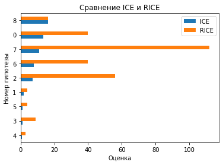
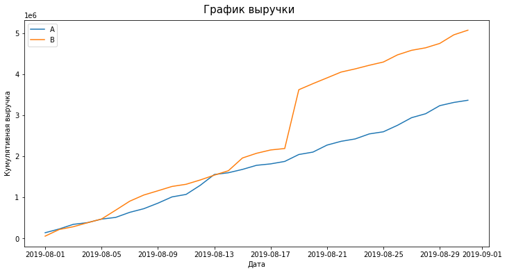
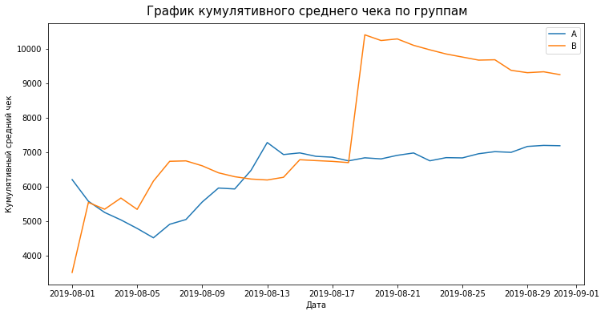
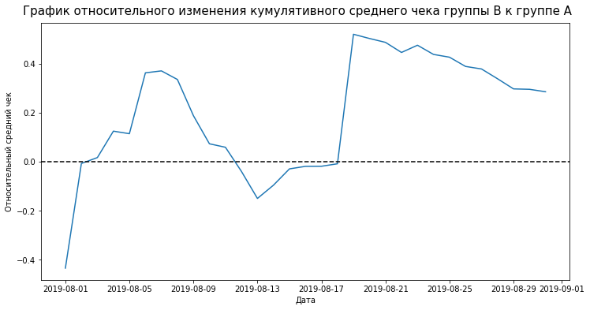
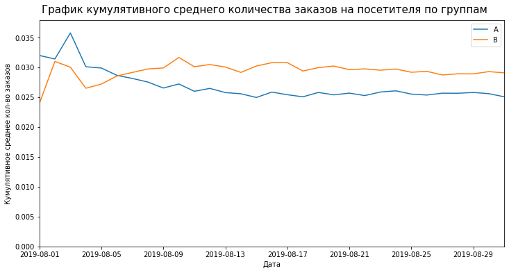
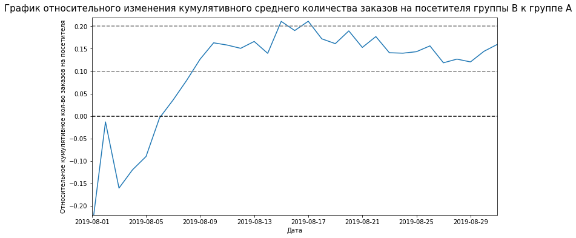
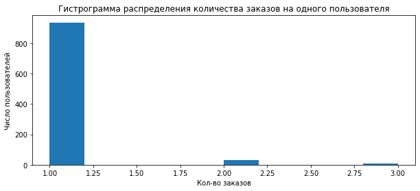
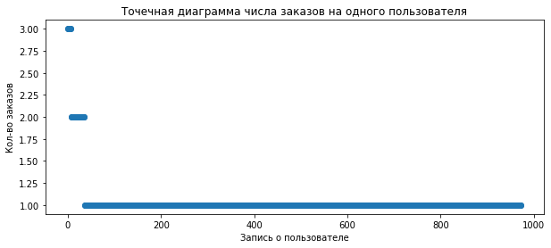
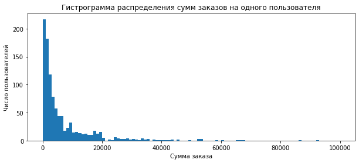
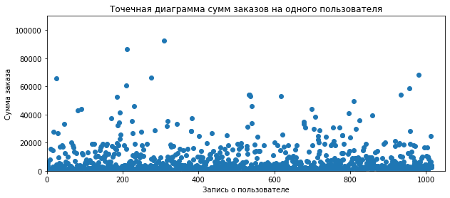

# Проект: "Принятие решений в бизнесе"

# Описание проекта
**Интернет-магазин:** </br>
Вместе с отделом маркетинга подготовлен список гипотез для увеличения выручки, были получены результаты A/B-теста.

**Задачи:**
- приоритизировать гипотезы; 
- запустить A/B-тест;
- проанализировать результаты.

<h1>Оглавление<span class="tocSkip"></span></h1>
<div class="toc"><ul class="toc-item"><li><span><a href="#Часть-1.-Приоритизация-гипотез" data-toc-modified-id="Часть-1.-Приоритизация-гипотез-1"><span class="toc-item-num">1&nbsp;&nbsp;</span>Часть 1. Приоритизация гипотез</a></span><ul class="toc-item"><li><span><a href="#Метод-ICE" data-toc-modified-id="Метод-ICE-1.1"><span class="toc-item-num">1.1&nbsp;&nbsp;</span>Метод ICE</a></span></li><li><span><a href="#Метод-RICE" data-toc-modified-id="Метод-RICE-1.2"><span class="toc-item-num">1.2&nbsp;&nbsp;</span>Метод RICE</a></span></li></ul></li><li><span><a href="#Часть-2.-Анализ-A/B-теста" data-toc-modified-id="Часть-2.-Анализ-A/B-теста-2"><span class="toc-item-num">2&nbsp;&nbsp;</span>Часть 2. Анализ A/B-теста</a></span><ul class="toc-item"><li><span><a href="#График-кумулятивной-выручки-по-группам" data-toc-modified-id="График-кумулятивной-выручки-по-группам-2.1"><span class="toc-item-num">2.1&nbsp;&nbsp;</span>График кумулятивной выручки по группам</a></span></li><li><span><a href="#График-кумулятивного-среднего-чека-по-группам" data-toc-modified-id="График-кумулятивного-среднего-чека-по-группам-2.2"><span class="toc-item-num">2.2&nbsp;&nbsp;</span>График кумулятивного среднего чека по группам</a></span></li><li><span><a href="#График-относительного-изменения-кумулятивного-среднего-чека-группы-B-к-группе-A" data-toc-modified-id="График-относительного-изменения-кумулятивного-среднего-чека-группы-B-к-группе-A-2.3"><span class="toc-item-num">2.3&nbsp;&nbsp;</span>График относительного изменения кумулятивного среднего чека группы B к группе A</a></span></li><li><span><a href="#График-кумулятивного-среднего-количества-заказов-на-посетителя-по-группам" data-toc-modified-id="График-кумулятивного-среднего-количества-заказов-на-посетителя-по-группам-2.4"><span class="toc-item-num">2.4&nbsp;&nbsp;</span>График кумулятивного среднего количества заказов на посетителя по группам</a></span></li><li><span><a href="#График-относительного-изменения-кумулятивного-среднего-количества-заказов-на-посетителя-группы-B-к-группе-A" data-toc-modified-id="График-относительного-изменения-кумулятивного-среднего-количества-заказов-на-посетителя-группы-B-к-группе-A-2.5"><span class="toc-item-num">2.5&nbsp;&nbsp;</span>График относительного изменения кумулятивного среднего количества заказов на посетителя группы B к группе A</a></span></li><li><span><a href="#Точечный-график-количества-заказов-по-пользователям" data-toc-modified-id="Точечный-график-количества-заказов-по-пользователям-2.6"><span class="toc-item-num">2.6&nbsp;&nbsp;</span>Точечный график количества заказов по пользователям</a></span></li><li><span><a href="#95-й-и-99-й-перцентили-количества-заказов-на-пользователя.-Выбор-границы-для-определения-аномальных-пользователей" data-toc-modified-id="95-й-и-99-й-перцентили-количества-заказов-на-пользователя.-Выбор-границы-для-определения-аномальных-пользователей-2.7"><span class="toc-item-num">2.7&nbsp;&nbsp;</span>95-й и 99-й перцентили количества заказов на пользователя. Выбор границы для определения аномальных пользователей</a></span></li><li><span><a href="#Точечный-график-стоимостей-заказов" data-toc-modified-id="Точечный-график-стоимостей-заказов-2.8"><span class="toc-item-num">2.8&nbsp;&nbsp;</span>Точечный график стоимостей заказов</a></span></li><li><span><a href="#95-й-и-99-й-перцентили-стоимости-заказов.-Выбор-границ-для-определения-аномальных-заказов" data-toc-modified-id="95-й-и-99-й-перцентили-стоимости-заказов.-Выбор-границ-для-определения-аномальных-заказов-2.9"><span class="toc-item-num">2.9&nbsp;&nbsp;</span>95-й и 99-й перцентили стоимости заказов. Выбор границ для определения аномальных заказов</a></span></li><li><span><a href="#Статистическая-значимость-различий-в-среднем-количестве-заказов-на-посетителя-между-группами-по-«сырым»-данным" data-toc-modified-id="Статистическая-значимость-различий-в-среднем-количестве-заказов-на-посетителя-между-группами-по-«сырым»-данным-2.10"><span class="toc-item-num">2.10&nbsp;&nbsp;</span>Статистическая значимость различий в среднем количестве заказов на посетителя между группами по «сырым» данным</a></span></li><li><span><a href="#Статистическая-значимость-различий-в-среднем-чеке-заказа-между-группами-по-«сырым»-данным" data-toc-modified-id="Статистическая-значимость-различий-в-среднем-чеке-заказа-между-группами-по-«сырым»-данным-2.11"><span class="toc-item-num">2.11&nbsp;&nbsp;</span>Статистическая значимость различий в среднем чеке заказа между группами по «сырым» данным</a></span></li><li><span><a href="#Статистическая-значимость-различий-в-среднем-количестве-заказов-на-посетителя-между-группами-по-«очищенным»-данным" data-toc-modified-id="Статистическая-значимость-различий-в-среднем-количестве-заказов-на-посетителя-между-группами-по-«очищенным»-данным-2.12"><span class="toc-item-num">2.12&nbsp;&nbsp;</span>Статистическая значимость различий в среднем количестве заказов на посетителя между группами по «очищенным» данным</a></span></li><li><span><a href="#Статистическая-значимость-различий-в-среднем-чеке-заказа-между-группами-по-«очищенным»-данным" data-toc-modified-id="Статистическая-значимость-различий-в-среднем-чеке-заказа-между-группами-по-«очищенным»-данным-2.13"><span class="toc-item-num">2.13&nbsp;&nbsp;</span>Статистическая значимость различий в среднем чеке заказа между группами по «очищенным» данным</a></span></li><li><span><a href="#Решение-по-результатам-теста" data-toc-modified-id="Решение-по-результатам-теста-2.14"><span class="toc-item-num">2.14&nbsp;&nbsp;</span>Решение по результатам теста</a></span></li></ul></li></ul></div>

## Часть 1. Приоритизация гипотез
**Задачи:**
1. Применить фреймворк ICE для приоритизации гипотез.
2. Применить фреймворк RICE для приоритизации гипотез.
3. Указать, как изменилась приоритизация гипотез при применении RICE вместо ICE.

**Файл `hypothesis.csv`:**
- `Hypothesis` — краткое описание гипотезы;
- `Reach` — охват пользователей по 10-балльной шкале;
- `Impact` — влияние на пользователей по 10-балльной шкале;
- `Confidence` — уверенность в гипотезе по 10-балльной шкале;
- `Efforts` — затраты ресурсов на проверку гипотезы по 10-балльной шкале. Чем больше значение Efforts, тем дороже проверка гипотезы.


```python
# Импорт библиотек
import pandas as pd
import scipy.stats as stats
import datetime as dt
import numpy as np
import matplotlib.pyplot as plt
import seaborn as sns
```


```python
# Чтение файлов
try:
    df = pd.read_csv('/datasets/hypothesis.csv')
# если не получилось прочитать файл из локальной папки, то загружаем данные из сети
except:
    df = pd.read_csv('datasets/hypothesis.csv')
```


```python
# Снимаем ограничение на вывод всех символов в записях
pd.set_option('display.max_colwidth', None)
```


```python
df
```


<div>
<style scoped>
    .dataframe tbody tr th:only-of-type {
        vertical-align: middle;
    }

    .dataframe tbody tr th {
        vertical-align: top;
    }

    .dataframe thead th {
        text-align: right;
    }
</style>
<table border="1" class="dataframe">
  <thead>
    <tr style="text-align: right;">
      <th></th>
      <th>Hypothesis</th>
      <th>Reach</th>
      <th>Impact</th>
      <th>Confidence</th>
      <th>Efforts</th>
    </tr>
  </thead>
  <tbody>
    <tr>
      <th>0</th>
      <td>Добавить два новых канала привлечения трафика, что позволит привлекать на 30% больше пользователей</td>
      <td>3</td>
      <td>10</td>
      <td>8</td>
      <td>6</td>
    </tr>
    <tr>
      <th>1</th>
      <td>Запустить собственную службу доставки, что сократит срок доставки заказов</td>
      <td>2</td>
      <td>5</td>
      <td>4</td>
      <td>10</td>
    </tr>
    <tr>
      <th>2</th>
      <td>Добавить блоки рекомендаций товаров на сайт интернет магазина, чтобы повысить конверсию и средний чек заказа</td>
      <td>8</td>
      <td>3</td>
      <td>7</td>
      <td>3</td>
    </tr>
    <tr>
      <th>3</th>
      <td>Изменить структура категорий, что увеличит конверсию, т.к. пользователи быстрее найдут нужный товар</td>
      <td>8</td>
      <td>3</td>
      <td>3</td>
      <td>8</td>
    </tr>
    <tr>
      <th>4</th>
      <td>Изменить цвет фона главной страницы, чтобы увеличить вовлеченность пользователей</td>
      <td>3</td>
      <td>1</td>
      <td>1</td>
      <td>1</td>
    </tr>
    <tr>
      <th>5</th>
      <td>Добавить страницу отзывов клиентов о магазине, что позволит увеличить количество заказов</td>
      <td>3</td>
      <td>2</td>
      <td>2</td>
      <td>3</td>
    </tr>
    <tr>
      <th>6</th>
      <td>Показать на главной странице баннеры с актуальными акциями и распродажами, чтобы увеличить конверсию</td>
      <td>5</td>
      <td>3</td>
      <td>8</td>
      <td>3</td>
    </tr>
    <tr>
      <th>7</th>
      <td>Добавить форму подписки на все основные страницы, чтобы собрать базу клиентов для email-рассылок</td>
      <td>10</td>
      <td>7</td>
      <td>8</td>
      <td>5</td>
    </tr>
    <tr>
      <th>8</th>
      <td>Запустить акцию, дающую скидку на товар в день рождения</td>
      <td>1</td>
      <td>9</td>
      <td>9</td>
      <td>5</td>
    </tr>
  </tbody>
</table>
</div>


### Метод ICE
<div>

</div>


```python
# Создаем копию df для работы
df_ice = df[['Hypothesis', 'Impact','Confidence','Efforts']].copy()
```


```python
# Расчёт ICE
df_ice['ICE'] = round(df_ice['Impact'] * df_ice['Confidence'] / df_ice['Efforts'], 2)

# Сортировка по ICE
df_ice = df_ice.sort_values(by='ICE', ascending=False)

# Вывод df_ice
df_ice
```


<div>
<style scoped>
    .dataframe tbody tr th:only-of-type {
        vertical-align: middle;
    }

    .dataframe tbody tr th {
        vertical-align: top;
    }

    .dataframe thead th {
        text-align: right;
    }
</style>
<table border="1" class="dataframe">
  <thead>
    <tr style="text-align: right;">
      <th></th>
      <th>Hypothesis</th>
      <th>Impact</th>
      <th>Confidence</th>
      <th>Efforts</th>
      <th>ICE</th>
    </tr>
  </thead>
  <tbody>
    <tr>
      <th>8</th>
      <td>Запустить акцию, дающую скидку на товар в день рождения</td>
      <td>9</td>
      <td>9</td>
      <td>5</td>
      <td>16.20</td>
    </tr>
    <tr>
      <th>0</th>
      <td>Добавить два новых канала привлечения трафика, что позволит привлекать на 30% больше пользователей</td>
      <td>10</td>
      <td>8</td>
      <td>6</td>
      <td>13.33</td>
    </tr>
    <tr>
      <th>7</th>
      <td>Добавить форму подписки на все основные страницы, чтобы собрать базу клиентов для email-рассылок</td>
      <td>7</td>
      <td>8</td>
      <td>5</td>
      <td>11.20</td>
    </tr>
    <tr>
      <th>6</th>
      <td>Показать на главной странице баннеры с актуальными акциями и распродажами, чтобы увеличить конверсию</td>
      <td>3</td>
      <td>8</td>
      <td>3</td>
      <td>8.00</td>
    </tr>
    <tr>
      <th>2</th>
      <td>Добавить блоки рекомендаций товаров на сайт интернет магазина, чтобы повысить конверсию и средний чек заказа</td>
      <td>3</td>
      <td>7</td>
      <td>3</td>
      <td>7.00</td>
    </tr>
    <tr>
      <th>1</th>
      <td>Запустить собственную службу доставки, что сократит срок доставки заказов</td>
      <td>5</td>
      <td>4</td>
      <td>10</td>
      <td>2.00</td>
    </tr>
    <tr>
      <th>5</th>
      <td>Добавить страницу отзывов клиентов о магазине, что позволит увеличить количество заказов</td>
      <td>2</td>
      <td>2</td>
      <td>3</td>
      <td>1.33</td>
    </tr>
    <tr>
      <th>3</th>
      <td>Изменить структура категорий, что увеличит конверсию, т.к. пользователи быстрее найдут нужный товар</td>
      <td>3</td>
      <td>3</td>
      <td>8</td>
      <td>1.12</td>
    </tr>
    <tr>
      <th>4</th>
      <td>Изменить цвет фона главной страницы, чтобы увеличить вовлеченность пользователей</td>
      <td>1</td>
      <td>1</td>
      <td>1</td>
      <td>1.00</td>
    </tr>
  </tbody>
</table>
</div>


<div class="alert alert-info">
<font size="4", color = "black"><b>ВЫВОД:</b></font>
    <br /> 
    <font size="3", color = "black">
Фреймворк ICE рекомендует начинать с 8-ой гипотезы. Последней рассматривается 4-ая.

### Метод RICE
<div>

</div>


```python
# Создаем копию df для работы
df_rice = df.copy()
```


```python
# Расчёт RICE
df_rice['RICE'] = df_rice['Reach'] * df_rice['Impact'] * df_rice['Confidence'] / df_rice['Efforts']

# Сортировка по RICE
df_rice = df_rice.sort_values(by='RICE', ascending=False)

# Вывод df_rice
df_rice
```


<div>
<style scoped>
    .dataframe tbody tr th:only-of-type {
        vertical-align: middle;
    }

    .dataframe tbody tr th {
        vertical-align: top;
    }

    .dataframe thead th {
        text-align: right;
    }
</style>
<table border="1" class="dataframe">
  <thead>
    <tr style="text-align: right;">
      <th></th>
      <th>Hypothesis</th>
      <th>Reach</th>
      <th>Impact</th>
      <th>Confidence</th>
      <th>Efforts</th>
      <th>RICE</th>
    </tr>
  </thead>
  <tbody>
    <tr>
      <th>7</th>
      <td>Добавить форму подписки на все основные страницы, чтобы собрать базу клиентов для email-рассылок</td>
      <td>10</td>
      <td>7</td>
      <td>8</td>
      <td>5</td>
      <td>112.0</td>
    </tr>
    <tr>
      <th>2</th>
      <td>Добавить блоки рекомендаций товаров на сайт интернет магазина, чтобы повысить конверсию и средний чек заказа</td>
      <td>8</td>
      <td>3</td>
      <td>7</td>
      <td>3</td>
      <td>56.0</td>
    </tr>
    <tr>
      <th>0</th>
      <td>Добавить два новых канала привлечения трафика, что позволит привлекать на 30% больше пользователей</td>
      <td>3</td>
      <td>10</td>
      <td>8</td>
      <td>6</td>
      <td>40.0</td>
    </tr>
    <tr>
      <th>6</th>
      <td>Показать на главной странице баннеры с актуальными акциями и распродажами, чтобы увеличить конверсию</td>
      <td>5</td>
      <td>3</td>
      <td>8</td>
      <td>3</td>
      <td>40.0</td>
    </tr>
    <tr>
      <th>8</th>
      <td>Запустить акцию, дающую скидку на товар в день рождения</td>
      <td>1</td>
      <td>9</td>
      <td>9</td>
      <td>5</td>
      <td>16.2</td>
    </tr>
    <tr>
      <th>3</th>
      <td>Изменить структура категорий, что увеличит конверсию, т.к. пользователи быстрее найдут нужный товар</td>
      <td>8</td>
      <td>3</td>
      <td>3</td>
      <td>8</td>
      <td>9.0</td>
    </tr>
    <tr>
      <th>1</th>
      <td>Запустить собственную службу доставки, что сократит срок доставки заказов</td>
      <td>2</td>
      <td>5</td>
      <td>4</td>
      <td>10</td>
      <td>4.0</td>
    </tr>
    <tr>
      <th>5</th>
      <td>Добавить страницу отзывов клиентов о магазине, что позволит увеличить количество заказов</td>
      <td>3</td>
      <td>2</td>
      <td>2</td>
      <td>3</td>
      <td>4.0</td>
    </tr>
    <tr>
      <th>4</th>
      <td>Изменить цвет фона главной страницы, чтобы увеличить вовлеченность пользователей</td>
      <td>3</td>
      <td>1</td>
      <td>1</td>
      <td>1</td>
      <td>3.0</td>
    </tr>
  </tbody>
</table>
</div>


<div class="alert alert-info">
<font size="4", color = "black"><b>ВЫВОД:</b></font>
    <br /> 
    <font size="3", color = "black">

Фреймворк RICE рекомендует начинать с 7-ой гипотезы. Последней рассматривается 4-ая.

Соединим таблицы


```python
# Объединение таблиц
df_ice.merge(df_rice)[['Hypothesis','ICE','RICE']]\
.set_axis(df_ice.index)\
.sort_values(by=['ICE','RICE'], ascending=False)
```


<div>
<style scoped>
    .dataframe tbody tr th:only-of-type {
        vertical-align: middle;
    }

    .dataframe tbody tr th {
        vertical-align: top;
    }

    .dataframe thead th {
        text-align: right;
    }
</style>
<table border="1" class="dataframe">
  <thead>
    <tr style="text-align: right;">
      <th></th>
      <th>Hypothesis</th>
      <th>ICE</th>
      <th>RICE</th>
    </tr>
  </thead>
  <tbody>
    <tr>
      <th>8</th>
      <td>Запустить акцию, дающую скидку на товар в день рождения</td>
      <td>16.20</td>
      <td>16.2</td>
    </tr>
    <tr>
      <th>0</th>
      <td>Добавить два новых канала привлечения трафика, что позволит привлекать на 30% больше пользователей</td>
      <td>13.33</td>
      <td>40.0</td>
    </tr>
    <tr>
      <th>7</th>
      <td>Добавить форму подписки на все основные страницы, чтобы собрать базу клиентов для email-рассылок</td>
      <td>11.20</td>
      <td>112.0</td>
    </tr>
    <tr>
      <th>6</th>
      <td>Показать на главной странице баннеры с актуальными акциями и распродажами, чтобы увеличить конверсию</td>
      <td>8.00</td>
      <td>40.0</td>
    </tr>
    <tr>
      <th>2</th>
      <td>Добавить блоки рекомендаций товаров на сайт интернет магазина, чтобы повысить конверсию и средний чек заказа</td>
      <td>7.00</td>
      <td>56.0</td>
    </tr>
    <tr>
      <th>1</th>
      <td>Запустить собственную службу доставки, что сократит срок доставки заказов</td>
      <td>2.00</td>
      <td>4.0</td>
    </tr>
    <tr>
      <th>5</th>
      <td>Добавить страницу отзывов клиентов о магазине, что позволит увеличить количество заказов</td>
      <td>1.33</td>
      <td>4.0</td>
    </tr>
    <tr>
      <th>3</th>
      <td>Изменить структура категорий, что увеличит конверсию, т.к. пользователи быстрее найдут нужный товар</td>
      <td>1.12</td>
      <td>9.0</td>
    </tr>
    <tr>
      <th>4</th>
      <td>Изменить цвет фона главной страницы, чтобы увеличить вовлеченность пользователей</td>
      <td>1.00</td>
      <td>3.0</td>
    </tr>
  </tbody>
</table>
</div>


```python
df_ice.merge(df_rice)[['Hypothesis','ICE','RICE']]\
.set_axis(df_ice.index)\
.sort_values(by=['ICE','RICE'], ascending=True).plot(kind='barh', title='Сравнение ICE и RICE');
plt.xlabel("Оценка")
plt.ylabel("Номер гипотезы");
```


    

    


<div style="border:solid green 2px; padding: 10px">
<font size="4", color = "black"><b>Выводы:</b></font> <br/>
            
Два фреймворка производят приоритизацию по-разному. Вариант RICE учитывает охват пользователей (REACH) - данный показатель поднимает оценки показателей (в данном случае).

Если есть возможноть оценить охват пользователей, то оптимальнее использовать RICE, однако, при одинаковом охвате достаточно ICE.

## Часть 2. Анализ A/B-теста
**Задача:**

Проанализировать A/B-тест.

Файл `/datasets/orders.csv`:
- `transactionId` — идентификатор заказа;
- `visitorId` — идентификатор пользователя, совершившего заказ;
- `date` — дата, когда был совершён заказ;
- `revenue` — выручка заказа;
- `group` — группа A/B-теста, в которую попал заказ.

Файл `/datasets/visitors.csv`:
- `date` — дата;
- `group` — группа A/B-теста;
- `visitors` — количество пользователей в указанную дату в указанной группе A/B-теста.


```python
# Чтение файлов
try:
    orders = pd.read_csv('/datasets/orders.csv')
    visitors = pd.read_csv('/datasets/visitors.csv')
# если не получилось прочитать файл из локальной папки, то загружаем данные из сети
except:
    orders = pd.read_csv('datasets/orders.csv')
    visitors = pd.read_csv('datasets/visitors.csv')
```

Выполним предобработку данных:


```python
orders.info()
```

    <class 'pandas.core.frame.DataFrame'>
    RangeIndex: 1197 entries, 0 to 1196
    Data columns (total 5 columns):
     #   Column         Non-Null Count  Dtype 
    ---  ------         --------------  ----- 
     0   transactionId  1197 non-null   int64 
     1   visitorId      1197 non-null   int64 
     2   date           1197 non-null   object
     3   revenue        1197 non-null   int64 
     4   group          1197 non-null   object
    dtypes: int64(3), object(2)
    memory usage: 46.9+ KB
    


```python
visitors.info()
```

    <class 'pandas.core.frame.DataFrame'>
    RangeIndex: 62 entries, 0 to 61
    Data columns (total 3 columns):
     #   Column    Non-Null Count  Dtype 
    ---  ------    --------------  ----- 
     0   date      62 non-null     object
     1   group     62 non-null     object
     2   visitors  62 non-null     int64 
    dtypes: int64(1), object(2)
    memory usage: 1.6+ KB
    


```python
orders.duplicated().sum()
```


    0


```python
visitors.duplicated().sum()
```


    0


Полных дубликатов нет


```python
orders.nunique()
```


    transactionId    1197
    visitorId        1031
    date               31
    revenue           713
    group               2
    dtype: int64


```python
visitors.nunique()
```


    date        31
    group        2
    visitors    58
    dtype: int64


```python
print('Начало теста:', orders['date'].min())
print('Конец теста:', orders['date'].max())
```

    Начало теста: 2019-08-01
    Конец теста: 2019-08-31
    


```python
# Число ошибочных распределений
orders\
.pivot_table(index=['visitorId'], 
             values=['group','revenue'], 
             aggfunc='nunique'
            )\
.pivot_table(index=['group'], 
             values=['revenue'], 
             aggfunc='count'
            )
```


<div>
<style scoped>
    .dataframe tbody tr th:only-of-type {
        vertical-align: middle;
    }

    .dataframe tbody tr th {
        vertical-align: top;
    }

    .dataframe thead th {
        text-align: right;
    }
</style>
<table border="1" class="dataframe">
  <thead>
    <tr style="text-align: right;">
      <th></th>
      <th>revenue</th>
    </tr>
    <tr>
      <th>group</th>
      <th></th>
    </tr>
  </thead>
  <tbody>
    <tr>
      <th>1</th>
      <td>973</td>
    </tr>
    <tr>
      <th>2</th>
      <td>58</td>
    </tr>
  </tbody>
</table>
</div>


```python
# id "дефектных" пользователей
index_ord = orders.pivot_table(index=['visitorId'], 
             values=['group'], 
             aggfunc='nunique'
            )\
.query('group == 2').index
```


```python
orders.query('visitorId in @index_ord').sort_values(by='visitorId')
```


<div>
<style scoped>
    .dataframe tbody tr th:only-of-type {
        vertical-align: middle;
    }

    .dataframe tbody tr th {
        vertical-align: top;
    }

    .dataframe thead th {
        text-align: right;
    }
</style>
<table border="1" class="dataframe">
  <thead>
    <tr style="text-align: right;">
      <th></th>
      <th>transactionId</th>
      <th>visitorId</th>
      <th>date</th>
      <th>revenue</th>
      <th>group</th>
    </tr>
  </thead>
  <tbody>
    <tr>
      <th>703</th>
      <td>4293855558</td>
      <td>8300375</td>
      <td>2019-08-07</td>
      <td>1790</td>
      <td>A</td>
    </tr>
    <tr>
      <th>71</th>
      <td>3679129301</td>
      <td>8300375</td>
      <td>2019-08-01</td>
      <td>10510</td>
      <td>B</td>
    </tr>
    <tr>
      <th>823</th>
      <td>2971973105</td>
      <td>199603092</td>
      <td>2019-08-27</td>
      <td>2790</td>
      <td>A</td>
    </tr>
    <tr>
      <th>246</th>
      <td>437656952</td>
      <td>199603092</td>
      <td>2019-08-02</td>
      <td>3488</td>
      <td>B</td>
    </tr>
    <tr>
      <th>26</th>
      <td>2223239646</td>
      <td>199603092</td>
      <td>2019-08-15</td>
      <td>3488</td>
      <td>A</td>
    </tr>
    <tr>
      <th>...</th>
      <td>...</td>
      <td>...</td>
      <td>...</td>
      <td>...</td>
      <td>...</td>
    </tr>
    <tr>
      <th>187</th>
      <td>2048878902</td>
      <td>4256040402</td>
      <td>2019-08-17</td>
      <td>1550</td>
      <td>A</td>
    </tr>
    <tr>
      <th>114</th>
      <td>1120327437</td>
      <td>4256040402</td>
      <td>2019-08-01</td>
      <td>5800</td>
      <td>A</td>
    </tr>
    <tr>
      <th>60</th>
      <td>1421016313</td>
      <td>4256040402</td>
      <td>2019-08-16</td>
      <td>56650</td>
      <td>B</td>
    </tr>
    <tr>
      <th>662</th>
      <td>1811671147</td>
      <td>4266935830</td>
      <td>2019-08-29</td>
      <td>78990</td>
      <td>A</td>
    </tr>
    <tr>
      <th>682</th>
      <td>1216533772</td>
      <td>4266935830</td>
      <td>2019-08-29</td>
      <td>78990</td>
      <td>B</td>
    </tr>
  </tbody>
</table>
<p>181 rows × 5 columns</p>
</div>


<div style="border:solid orange 2px; padding: 10px">
<font size="4", color = "black"><b>Итоги:</b></font> <br/>

- есть повторяющиеся клиенты;
- групп в тесте 2;
- 31 день: с 01/08/2019 по 31/08/2019;
- в двух группах находятся 58 покупателей;
- "дефектные" покупатели занимают 181 запись.

Так как в данных не должно быть покупателей, которые попадают в обе группы, то удалим их.


```python
print('Кол-во "дефектных" записей в группе A:', 
      orders.query('visitorId in @index_ord & group == "A"')['visitorId'].count()
     )

print('Кол-во "дефектных" записей в группе B:', 
      orders.query('visitorId in @index_ord & group == "B"')['visitorId'].count()
     )
```

    Кол-во "дефектных" записей в группе A: 89
    Кол-во "дефектных" записей в группе B: 92
    


```python
print('Кол-во записей в группе A:', 
      orders.query('group == "A"')['visitorId'].count()
     )

print('Кол-во записей в группе B:', 
      orders.query('group == "B"')['visitorId'].count()
     )
```

    Кол-во записей в группе A: 557
    Кол-во записей в группе B: 640
    


```python
print('Потери записей в группе A после очистки:', 
      round((1 - (orders.query('group == "A"')['visitorId'].count()
      - orders.query('visitorId in @index_ord & group == "A"')['visitorId'].count())
      /orders.query('group == "A"')['visitorId'].count()) * 100, 2),
      '%'
     )

print('Потери записей в группе B после очистки:', 
      round((1 - (orders.query('group == "B"')['visitorId'].count()
      - orders.query('visitorId in @index_ord & group == "B"')['visitorId'].count())
      / orders.query('group == "B"')['visitorId'].count()) * 100, 2),
      '%'
     )
```

    Потери записей в группе A после очистки: 15.98 %
    Потери записей в группе B после очистки: 14.38 %
    


```python
# Данные для вычитания из visitors
delete_visit = orders.query('visitorId in @index_ord').pivot_table(index=['date','group'], values='revenue', aggfunc='count')
```


```python
orders.head()
```


<div>
<style scoped>
    .dataframe tbody tr th:only-of-type {
        vertical-align: middle;
    }

    .dataframe tbody tr th {
        vertical-align: top;
    }

    .dataframe thead th {
        text-align: right;
    }
</style>
<table border="1" class="dataframe">
  <thead>
    <tr style="text-align: right;">
      <th></th>
      <th>transactionId</th>
      <th>visitorId</th>
      <th>date</th>
      <th>revenue</th>
      <th>group</th>
    </tr>
  </thead>
  <tbody>
    <tr>
      <th>0</th>
      <td>3667963787</td>
      <td>3312258926</td>
      <td>2019-08-15</td>
      <td>1650</td>
      <td>B</td>
    </tr>
    <tr>
      <th>1</th>
      <td>2804400009</td>
      <td>3642806036</td>
      <td>2019-08-15</td>
      <td>730</td>
      <td>B</td>
    </tr>
    <tr>
      <th>2</th>
      <td>2961555356</td>
      <td>4069496402</td>
      <td>2019-08-15</td>
      <td>400</td>
      <td>A</td>
    </tr>
    <tr>
      <th>3</th>
      <td>3797467345</td>
      <td>1196621759</td>
      <td>2019-08-15</td>
      <td>9759</td>
      <td>B</td>
    </tr>
    <tr>
      <th>4</th>
      <td>2282983706</td>
      <td>2322279887</td>
      <td>2019-08-15</td>
      <td>2308</td>
      <td>B</td>
    </tr>
  </tbody>
</table>
</div>


```python
delete_visit.head()
```


<div>
<style scoped>
    .dataframe tbody tr th:only-of-type {
        vertical-align: middle;
    }

    .dataframe tbody tr th {
        vertical-align: top;
    }

    .dataframe thead th {
        text-align: right;
    }
</style>
<table border="1" class="dataframe">
  <thead>
    <tr style="text-align: right;">
      <th></th>
      <th></th>
      <th>revenue</th>
    </tr>
    <tr>
      <th>date</th>
      <th>group</th>
      <th></th>
    </tr>
  </thead>
  <tbody>
    <tr>
      <th rowspan="2" valign="top">2019-08-01</th>
      <th>A</th>
      <td>1</td>
    </tr>
    <tr>
      <th>B</th>
      <td>4</td>
    </tr>
    <tr>
      <th rowspan="2" valign="top">2019-08-02</th>
      <th>A</th>
      <td>1</td>
    </tr>
    <tr>
      <th>B</th>
      <td>1</td>
    </tr>
    <tr>
      <th>2019-08-03</th>
      <th>B</th>
      <td>2</td>
    </tr>
  </tbody>
</table>
</div>


```python
visitors.head()
```


<div>
<style scoped>
    .dataframe tbody tr th:only-of-type {
        vertical-align: middle;
    }

    .dataframe tbody tr th {
        vertical-align: top;
    }

    .dataframe thead th {
        text-align: right;
    }
</style>
<table border="1" class="dataframe">
  <thead>
    <tr style="text-align: right;">
      <th></th>
      <th>date</th>
      <th>group</th>
      <th>visitors</th>
    </tr>
  </thead>
  <tbody>
    <tr>
      <th>0</th>
      <td>2019-08-01</td>
      <td>A</td>
      <td>719</td>
    </tr>
    <tr>
      <th>1</th>
      <td>2019-08-02</td>
      <td>A</td>
      <td>619</td>
    </tr>
    <tr>
      <th>2</th>
      <td>2019-08-03</td>
      <td>A</td>
      <td>507</td>
    </tr>
    <tr>
      <th>3</th>
      <td>2019-08-04</td>
      <td>A</td>
      <td>717</td>
    </tr>
    <tr>
      <th>4</th>
      <td>2019-08-05</td>
      <td>A</td>
      <td>756</td>
    </tr>
  </tbody>
</table>
</div>


```python
# Вычитаем из общего кол-ва посетителей число "дефектных"
for visitor_ind in visitors.index:
    # Попытка вычитания
    try:
        dt = visitors.loc[visitor_ind, 'date']
        gr = visitors.loc[visitor_ind, 'group']
        
        visitors.loc[visitor_ind, 'visitors'] = visitors.loc[visitor_ind, 'visitors'] - delete_visit.loc[dt, gr]['revenue']
    # если не получилось, выводи дату
    except:
        print(visitors.loc[visitor_ind, 'date'])
```

    2019-08-03
    2019-08-13
    2019-08-16
    2019-08-26
    2019-08-19
    2019-08-20
    


```python
visitors.head()
```


<div>
<style scoped>
    .dataframe tbody tr th:only-of-type {
        vertical-align: middle;
    }

    .dataframe tbody tr th {
        vertical-align: top;
    }

    .dataframe thead th {
        text-align: right;
    }
</style>
<table border="1" class="dataframe">
  <thead>
    <tr style="text-align: right;">
      <th></th>
      <th>date</th>
      <th>group</th>
      <th>visitors</th>
    </tr>
  </thead>
  <tbody>
    <tr>
      <th>0</th>
      <td>2019-08-01</td>
      <td>A</td>
      <td>718</td>
    </tr>
    <tr>
      <th>1</th>
      <td>2019-08-02</td>
      <td>A</td>
      <td>618</td>
    </tr>
    <tr>
      <th>2</th>
      <td>2019-08-03</td>
      <td>A</td>
      <td>507</td>
    </tr>
    <tr>
      <th>3</th>
      <td>2019-08-04</td>
      <td>A</td>
      <td>712</td>
    </tr>
    <tr>
      <th>4</th>
      <td>2019-08-05</td>
      <td>A</td>
      <td>753</td>
    </tr>
  </tbody>
</table>
</div>


```python
# Удаляем проблемный записи
orders = orders.query('visitorId not in @index_ord').sort_values(by='visitorId')
print('Кол-во записей в orders после очистки:', orders.shape[0])
```

    Кол-во записей в orders после очистки: 1016
    

### График кумулятивной выручки по группам


```python
# Создаем массив уникальных пар значений дат и групп теста
datesGroups = orders[['date','group']].drop_duplicates()

# Получаем агрегированные кумулятивные по дням данные о заказах
ordersAggregated = datesGroups\
.apply(lambda x: orders[np.logical_and(orders['date'] <= x['date'], orders['group'] == x['group'])]\
       .agg({'date': 'max', 'group': 'max', 'transactionId': 'nunique', 'visitorId': 'nunique', 'revenue': 'sum'}), axis=1)\
.sort_values(by=['date','group'])

# Получаем агрегированные кумулятивные по дням данные о посетителях интернет-магазина 
visitorsAggregated = datesGroups\
.apply(lambda x: visitors[np.logical_and(visitors['date'] <= x['date'], visitors['group'] == x['group'])]\
       .agg({'date': 'max', 'group': 'max', 'visitors': 'sum'}), axis=1)\
.sort_values(by=['date','group'])

# Объединяем кумулятивные данные в одной таблице и присваиваем ее столбцам понятные названия
cumulativeData = ordersAggregated.merge(visitorsAggregated, left_on=['date', 'group'], right_on=['date', 'group'])
cumulativeData.columns = ['date', 'group', 'orders', 'buyers', 'revenue', 'visitors']

cumulativeData.head(5)
```


<div>
<style scoped>
    .dataframe tbody tr th:only-of-type {
        vertical-align: middle;
    }

    .dataframe tbody tr th {
        vertical-align: top;
    }

    .dataframe thead th {
        text-align: right;
    }
</style>
<table border="1" class="dataframe">
  <thead>
    <tr style="text-align: right;">
      <th></th>
      <th>date</th>
      <th>group</th>
      <th>orders</th>
      <th>buyers</th>
      <th>revenue</th>
      <th>visitors</th>
    </tr>
  </thead>
  <tbody>
    <tr>
      <th>0</th>
      <td>2019-08-01</td>
      <td>A</td>
      <td>23</td>
      <td>19</td>
      <td>142779</td>
      <td>718</td>
    </tr>
    <tr>
      <th>1</th>
      <td>2019-08-01</td>
      <td>B</td>
      <td>17</td>
      <td>17</td>
      <td>59758</td>
      <td>709</td>
    </tr>
    <tr>
      <th>2</th>
      <td>2019-08-02</td>
      <td>A</td>
      <td>42</td>
      <td>36</td>
      <td>234381</td>
      <td>1336</td>
    </tr>
    <tr>
      <th>3</th>
      <td>2019-08-02</td>
      <td>B</td>
      <td>40</td>
      <td>39</td>
      <td>221801</td>
      <td>1289</td>
    </tr>
    <tr>
      <th>4</th>
      <td>2019-08-03</td>
      <td>A</td>
      <td>66</td>
      <td>60</td>
      <td>346854</td>
      <td>1843</td>
    </tr>
  </tbody>
</table>
</div>


```python
# Перевод в тип даты
cumulativeData['date'] = pd.to_datetime(cumulativeData['date'])
```


```python
# Датафрейм с кумулятивным количеством заказов и кумулятивной выручкой по дням в группе А 
cumulativeRevenueA = cumulativeData[cumulativeData['group']=='A'][['date','revenue', 'orders']]

# Датафрейм с кумулятивным количеством заказов и кумулятивной выручкой по дням в группе B
cumulativeRevenueB = cumulativeData[cumulativeData['group']=='B'][['date','revenue', 'orders']]

# Размер поля построения
plt.figure(figsize=(12, 6))

# Строим график выручки группы А
plt.plot(cumulativeRevenueA['date'], cumulativeRevenueA['revenue'], label='A')

# Строим график выручки группы B
plt.plot(cumulativeRevenueB['date'], cumulativeRevenueB['revenue'], label='B')
plt.legend()
plt.ylabel("Кумулятивная выручка")
plt.xlabel("Дата")
plt.suptitle('График выручки', x=0.5, y=0.93, fontsize=15);
```


    

    


<div class="alert alert-info">
<font size="4", color = "black"><b>Выводы:</b></font>

Изначально результаты групп были близкими, однако с 18-го августа наблюдается скачок группы B, после чего графики идут практически параллельно. 

***Заметка:*** *необходимо понять причину скачка*

### График кумулятивного среднего чека по группам


```python
# Размер поля построения
plt.figure(figsize=(12, 6))

plt.plot(cumulativeRevenueA['date'], cumulativeRevenueA['revenue']/cumulativeRevenueA['orders'], label='A')
plt.plot(cumulativeRevenueB['date'], cumulativeRevenueB['revenue']/cumulativeRevenueB['orders'], label='B')
plt.legend()
plt.ylabel("Кумулятивный средний чек")
plt.xlabel("Дата")
plt.suptitle('График кумулятивного среднего чека по группам', x=0.5, y=0.93, fontsize=15);
```


    

    


<div class="alert alert-info">
<font size="4", color = "black"><b>Выводы:</b></font>
    
Наблюдается скачок в величине среднего чека около 18-го числа. Вероятно, кто-то произвел крупную покупку, что отобразилось на среднем чеке - **аномалия?**


```python
# Создадим таблицу
combo_rev = cumulativeRevenueA.merge(cumulativeRevenueB, on='date')\
.rename(columns={'revenue_x':'revenue_A',
                 'revenue_y':'revenue_B', 
                 'orders_x':'orders_A', 
                 'orders_y':'orders_B'}
       )
```


```python
# Доп. колонки =  delta
combo_rev['d_rev'] = combo_rev['revenue_B'] - combo_rev['revenue_A']
combo_rev['d_ord'] = combo_rev['orders_B'] - combo_rev['orders_A']
```


```python
# Выведем таблицу
combo_rev.style.background_gradient(cmap='RdYlGn')
```


<style  type="text/css" >
#T_3b4d8_row0_col1,#T_3b4d8_row0_col2,#T_3b4d8_row0_col3,#T_3b4d8_row0_col4,#T_3b4d8_row0_col5,#T_3b4d8_row2_col6{
            background-color:  #a50026;
            color:  #f1f1f1;
        }#T_3b4d8_row0_col6,#T_3b4d8_row2_col1,#T_3b4d8_row3_col3{
            background-color:  #c41e27;
            color:  #f1f1f1;
        }#T_3b4d8_row1_col1{
            background-color:  #b30d26;
            color:  #f1f1f1;
        }#T_3b4d8_row1_col2,#T_3b4d8_row1_col5{
            background-color:  #b91326;
            color:  #f1f1f1;
        }#T_3b4d8_row1_col3,#T_3b4d8_row3_col6{
            background-color:  #b50f26;
            color:  #f1f1f1;
        }#T_3b4d8_row1_col4,#T_3b4d8_row2_col3,#T_3b4d8_row3_col5{
            background-color:  #bb1526;
            color:  #f1f1f1;
        }#T_3b4d8_row1_col6,#T_3b4d8_row5_col6{
            background-color:  #d93429;
            color:  #f1f1f1;
        }#T_3b4d8_row2_col2,#T_3b4d8_row3_col4{
            background-color:  #d42d27;
            color:  #f1f1f1;
        }#T_3b4d8_row2_col4{
            background-color:  #c62027;
            color:  #f1f1f1;
        }#T_3b4d8_row2_col5{
            background-color:  #ab0626;
            color:  #f1f1f1;
        }#T_3b4d8_row3_col1{
            background-color:  #ca2427;
            color:  #f1f1f1;
        }#T_3b4d8_row3_col2{
            background-color:  #dd3d2d;
            color:  #f1f1f1;
        }#T_3b4d8_row4_col1{
            background-color:  #d83128;
            color:  #f1f1f1;
        }#T_3b4d8_row4_col2,#T_3b4d8_row6_col3{
            background-color:  #eb5a3a;
            color:  #000000;
        }#T_3b4d8_row4_col3{
            background-color:  #ce2827;
            color:  #f1f1f1;
        }#T_3b4d8_row4_col4{
            background-color:  #e14430;
            color:  #f1f1f1;
        }#T_3b4d8_row4_col5{
            background-color:  #bd1726;
            color:  #f1f1f1;
        }#T_3b4d8_row4_col6{
            background-color:  #af0926;
            color:  #f1f1f1;
        }#T_3b4d8_row5_col1{
            background-color:  #db382b;
            color:  #f1f1f1;
        }#T_3b4d8_row5_col2{
            background-color:  #f47044;
            color:  #000000;
        }#T_3b4d8_row5_col3{
            background-color:  #de402e;
            color:  #f1f1f1;
        }#T_3b4d8_row5_col4{
            background-color:  #ed5f3c;
            color:  #000000;
        }#T_3b4d8_row5_col5{
            background-color:  #e34933;
            color:  #f1f1f1;
        }#T_3b4d8_row6_col1{
            background-color:  #e65036;
            color:  #000000;
        }#T_3b4d8_row6_col2,#T_3b4d8_row9_col3{
            background-color:  #f8864f;
            color:  #000000;
        }#T_3b4d8_row6_col4,#T_3b4d8_row8_col3,#T_3b4d8_row17_col5{
            background-color:  #f67a49;
            color:  #000000;
        }#T_3b4d8_row6_col5{
            background-color:  #f36b42;
            color:  #000000;
        }#T_3b4d8_row6_col6,#T_3b4d8_row10_col5{
            background-color:  #ef633f;
            color:  #000000;
        }#T_3b4d8_row7_col1{
            background-color:  #ee613e;
            color:  #000000;
        }#T_3b4d8_row7_col2,#T_3b4d8_row7_col6,#T_3b4d8_row9_col1,#T_3b4d8_row11_col3{
            background-color:  #fa9b58;
            color:  #000000;
        }#T_3b4d8_row7_col3,#T_3b4d8_row14_col5{
            background-color:  #f46d43;
            color:  #000000;
        }#T_3b4d8_row7_col4{
            background-color:  #fa9656;
            color:  #000000;
        }#T_3b4d8_row7_col5{
            background-color:  #f7814c;
            color:  #000000;
        }#T_3b4d8_row8_col1{
            background-color:  #f67c4a;
            color:  #000000;
        }#T_3b4d8_row8_col2,#T_3b4d8_row12_col3{
            background-color:  #fcaa5f;
            color:  #000000;
        }#T_3b4d8_row8_col4{
            background-color:  #fdad60;
            color:  #000000;
        }#T_3b4d8_row8_col5{
            background-color:  #f57547;
            color:  #000000;
        }#T_3b4d8_row8_col6,#T_3b4d8_row11_col1{
            background-color:  #feca79;
            color:  #000000;
        }#T_3b4d8_row9_col2{
            background-color:  #fdbd6d;
            color:  #000000;
        }#T_3b4d8_row9_col4{
            background-color:  #fdc372;
            color:  #000000;
        }#T_3b4d8_row9_col5{
            background-color:  #f16640;
            color:  #000000;
        }#T_3b4d8_row9_col6,#T_3b4d8_row12_col4{
            background-color:  #feeb9d;
            color:  #000000;
        }#T_3b4d8_row10_col1{
            background-color:  #fca85e;
            color:  #000000;
        }#T_3b4d8_row10_col2{
            background-color:  #fec877;
            color:  #000000;
        }#T_3b4d8_row10_col3{
            background-color:  #f98e52;
            color:  #000000;
        }#T_3b4d8_row10_col4{
            background-color:  #fece7c;
            color:  #000000;
        }#T_3b4d8_row10_col6,#T_3b4d8_row11_col6{
            background-color:  #feefa3;
            color:  #000000;
        }#T_3b4d8_row11_col2{
            background-color:  #fede89;
            color:  #000000;
        }#T_3b4d8_row11_col4,#T_3b4d8_row15_col3{
            background-color:  #fee08b;
            color:  #000000;
        }#T_3b4d8_row11_col5{
            background-color:  #dc3b2c;
            color:  #f1f1f1;
        }#T_3b4d8_row12_col1{
            background-color:  #feec9f;
            color:  #000000;
        }#T_3b4d8_row12_col2{
            background-color:  #fee999;
            color:  #000000;
        }#T_3b4d8_row12_col5{
            background-color:  #b71126;
            color:  #f1f1f1;
        }#T_3b4d8_row12_col6,#T_3b4d8_row15_col1{
            background-color:  #fbfdba;
            color:  #000000;
        }#T_3b4d8_row13_col1{
            background-color:  #fff0a6;
            color:  #000000;
        }#T_3b4d8_row13_col2{
            background-color:  #fff5ae;
            color:  #000000;
        }#T_3b4d8_row13_col3{
            background-color:  #fdb768;
            color:  #000000;
        }#T_3b4d8_row13_col4{
            background-color:  #fff3ac;
            color:  #000000;
        }#T_3b4d8_row13_col5{
            background-color:  #c82227;
            color:  #f1f1f1;
        }#T_3b4d8_row13_col6,#T_3b4d8_row14_col1{
            background-color:  #fff8b4;
            color:  #000000;
        }#T_3b4d8_row14_col2{
            background-color:  #fffcba;
            color:  #000000;
        }#T_3b4d8_row14_col3{
            background-color:  #fed683;
            color:  #000000;
        }#T_3b4d8_row14_col4{
            background-color:  #fafdb8;
            color:  #000000;
        }#T_3b4d8_row14_col6,#T_3b4d8_row15_col6{
            background-color:  #bfe47a;
            color:  #000000;
        }#T_3b4d8_row15_col2{
            background-color:  #f4fab0;
            color:  #000000;
        }#T_3b4d8_row15_col4,#T_3b4d8_row16_col2{
            background-color:  #eef8a8;
            color:  #000000;
        }#T_3b4d8_row15_col5{
            background-color:  #f57245;
            color:  #000000;
        }#T_3b4d8_row16_col1{
            background-color:  #f7fcb4;
            color:  #000000;
        }#T_3b4d8_row16_col3{
            background-color:  #fee695;
            color:  #000000;
        }#T_3b4d8_row16_col4,#T_3b4d8_row17_col2{
            background-color:  #e3f399;
            color:  #000000;
        }#T_3b4d8_row16_col5{
            background-color:  #f7844e;
            color:  #000000;
        }#T_3b4d8_row16_col6,#T_3b4d8_row22_col6{
            background-color:  #93d168;
            color:  #000000;
        }#T_3b4d8_row17_col1{
            background-color:  #f1f9ac;
            color:  #000000;
        }#T_3b4d8_row17_col3{
            background-color:  #fee797;
            color:  #000000;
        }#T_3b4d8_row17_col4{
            background-color:  #dff293;
            color:  #000000;
        }#T_3b4d8_row17_col6,#T_3b4d8_row18_col6,#T_3b4d8_row19_col4,#T_3b4d8_row20_col1{
            background-color:  #b9e176;
            color:  #000000;
        }#T_3b4d8_row18_col1{
            background-color:  #dcf08f;
            color:  #000000;
        }#T_3b4d8_row18_col2{
            background-color:  #cfeb85;
            color:  #000000;
        }#T_3b4d8_row18_col3,#T_3b4d8_row21_col2,#T_3b4d8_row22_col1{
            background-color:  #a0d669;
            color:  #000000;
        }#T_3b4d8_row18_col4{
            background-color:  #cdea83;
            color:  #000000;
        }#T_3b4d8_row18_col5,#T_3b4d8_row27_col2{
            background-color:  #138c4a;
            color:  #000000;
        }#T_3b4d8_row19_col1{
            background-color:  #d5ed88;
            color:  #000000;
        }#T_3b4d8_row19_col2{
            background-color:  #c3e67d;
            color:  #000000;
        }#T_3b4d8_row19_col3,#T_3b4d8_row23_col6{
            background-color:  #8ccd67;
            color:  #000000;
        }#T_3b4d8_row19_col5,#T_3b4d8_row23_col5{
            background-color:  #06733d;
            color:  #f1f1f1;
        }#T_3b4d8_row19_col6,#T_3b4d8_row28_col6{
            background-color:  #78c565;
            color:  #000000;
        }#T_3b4d8_row20_col2,#T_3b4d8_row21_col1{
            background-color:  #abdb6d;
            color:  #000000;
        }#T_3b4d8_row20_col3{
            background-color:  #7ac665;
            color:  #000000;
        }#T_3b4d8_row20_col4,#T_3b4d8_row20_col6{
            background-color:  #addc6f;
            color:  #000000;
        }#T_3b4d8_row20_col5{
            background-color:  #0b7d42;
            color:  #f1f1f1;
        }#T_3b4d8_row21_col3,#T_3b4d8_row24_col4,#T_3b4d8_row27_col6{
            background-color:  #69be63;
            color:  #000000;
        }#T_3b4d8_row21_col4{
            background-color:  #96d268;
            color:  #000000;
        }#T_3b4d8_row21_col5,#T_3b4d8_row29_col1,#T_3b4d8_row29_col2{
            background-color:  #04703b;
            color:  #f1f1f1;
        }#T_3b4d8_row21_col6,#T_3b4d8_row24_col2{
            background-color:  #63bc62;
            color:  #000000;
        }#T_3b4d8_row22_col2{
            background-color:  #82c966;
            color:  #000000;
        }#T_3b4d8_row22_col3,#T_3b4d8_row25_col1{
            background-color:  #5db961;
            color:  #000000;
        }#T_3b4d8_row22_col4{
            background-color:  #87cb67;
            color:  #000000;
        }#T_3b4d8_row22_col5,#T_3b4d8_row30_col5{
            background-color:  #016a38;
            color:  #f1f1f1;
        }#T_3b4d8_row23_col1{
            background-color:  #89cc67;
            color:  #000000;
        }#T_3b4d8_row23_col2,#T_3b4d8_row24_col6{
            background-color:  #70c164;
            color:  #000000;
        }#T_3b4d8_row23_col3{
            background-color:  #4eb15d;
            color:  #000000;
        }#T_3b4d8_row23_col4{
            background-color:  #75c465;
            color:  #000000;
        }#T_3b4d8_row24_col1{
            background-color:  #7dc765;
            color:  #000000;
        }#T_3b4d8_row24_col3{
            background-color:  #42ac5a;
            color:  #000000;
        }#T_3b4d8_row24_col5{
            background-color:  #026c39;
            color:  #f1f1f1;
        }#T_3b4d8_row25_col2,#T_3b4d8_row25_col4{
            background-color:  #48ae5c;
            color:  #000000;
        }#T_3b4d8_row25_col3{
            background-color:  #279f53;
            color:  #000000;
        }#T_3b4d8_row25_col5,#T_3b4d8_row30_col1,#T_3b4d8_row30_col2,#T_3b4d8_row30_col3,#T_3b4d8_row30_col4,#T_3b4d8_row30_col6{
            background-color:  #006837;
            color:  #f1f1f1;
        }#T_3b4d8_row25_col6{
            background-color:  #3faa59;
            color:  #000000;
        }#T_3b4d8_row26_col1{
            background-color:  #30a356;
            color:  #000000;
        }#T_3b4d8_row26_col2,#T_3b4d8_row28_col5{
            background-color:  #219c52;
            color:  #000000;
        }#T_3b4d8_row26_col3,#T_3b4d8_row27_col4,#T_3b4d8_row29_col6{
            background-color:  #199750;
            color:  #000000;
        }#T_3b4d8_row26_col4{
            background-color:  #39a758;
            color:  #000000;
        }#T_3b4d8_row26_col5,#T_3b4d8_row28_col1{
            background-color:  #0a7b41;
            color:  #f1f1f1;
        }#T_3b4d8_row26_col6{
            background-color:  #9bd469;
            color:  #000000;
        }#T_3b4d8_row27_col1{
            background-color:  #1b9950;
            color:  #000000;
        }#T_3b4d8_row27_col3{
            background-color:  #15904c;
            color:  #000000;
        }#T_3b4d8_row27_col5{
            background-color:  #0f8446;
            color:  #f1f1f1;
        }#T_3b4d8_row28_col2,#T_3b4d8_row29_col5{
            background-color:  #097940;
            color:  #f1f1f1;
        }#T_3b4d8_row28_col3{
            background-color:  #108647;
            color:  #000000;
        }#T_3b4d8_row28_col4{
            background-color:  #128a49;
            color:  #000000;
        }#T_3b4d8_row29_col3{
            background-color:  #05713c;
            color:  #f1f1f1;
        }#T_3b4d8_row29_col4{
            background-color:  #08773f;
            color:  #f1f1f1;
        }</style><table id="T_3b4d8_" ><thead>    <tr>        <th class="blank level0" ></th>        <th class="col_heading level0 col0" >date</th>        <th class="col_heading level0 col1" >revenue_A</th>        <th class="col_heading level0 col2" >orders_A</th>        <th class="col_heading level0 col3" >revenue_B</th>        <th class="col_heading level0 col4" >orders_B</th>        <th class="col_heading level0 col5" >d_rev</th>        <th class="col_heading level0 col6" >d_ord</th>    </tr></thead><tbody>
                <tr>
                        <th id="T_3b4d8_level0_row0" class="row_heading level0 row0" >0</th>
                        <td id="T_3b4d8_row0_col0" class="data row0 col0" >2019-08-01 00:00:00</td>
                        <td id="T_3b4d8_row0_col1" class="data row0 col1" >142779</td>
                        <td id="T_3b4d8_row0_col2" class="data row0 col2" >23</td>
                        <td id="T_3b4d8_row0_col3" class="data row0 col3" >59758</td>
                        <td id="T_3b4d8_row0_col4" class="data row0 col4" >17</td>
                        <td id="T_3b4d8_row0_col5" class="data row0 col5" >-83021</td>
                        <td id="T_3b4d8_row0_col6" class="data row0 col6" >-6</td>
            </tr>
            <tr>
                        <th id="T_3b4d8_level0_row1" class="row_heading level0 row1" >1</th>
                        <td id="T_3b4d8_row1_col0" class="data row1 col0" >2019-08-02 00:00:00</td>
                        <td id="T_3b4d8_row1_col1" class="data row1 col1" >234381</td>
                        <td id="T_3b4d8_row1_col2" class="data row1 col2" >42</td>
                        <td id="T_3b4d8_row1_col3" class="data row1 col3" >221801</td>
                        <td id="T_3b4d8_row1_col4" class="data row1 col4" >40</td>
                        <td id="T_3b4d8_row1_col5" class="data row1 col5" >-12580</td>
                        <td id="T_3b4d8_row1_col6" class="data row1 col6" >-2</td>
            </tr>
            <tr>
                        <th id="T_3b4d8_level0_row2" class="row_heading level0 row2" >2</th>
                        <td id="T_3b4d8_row2_col0" class="data row2 col0" >2019-08-03 00:00:00</td>
                        <td id="T_3b4d8_row2_col1" class="data row2 col1" >346854</td>
                        <td id="T_3b4d8_row2_col2" class="data row2 col2" >66</td>
                        <td id="T_3b4d8_row2_col3" class="data row2 col3" >288850</td>
                        <td id="T_3b4d8_row2_col4" class="data row2 col4" >54</td>
                        <td id="T_3b4d8_row2_col5" class="data row2 col5" >-58004</td>
                        <td id="T_3b4d8_row2_col6" class="data row2 col6" >-12</td>
            </tr>
            <tr>
                        <th id="T_3b4d8_level0_row3" class="row_heading level0 row3" >3</th>
                        <td id="T_3b4d8_row3_col0" class="data row3 col0" >2019-08-04 00:00:00</td>
                        <td id="T_3b4d8_row3_col1" class="data row3 col1" >388030</td>
                        <td id="T_3b4d8_row3_col2" class="data row3 col2" >77</td>
                        <td id="T_3b4d8_row3_col3" class="data row3 col3" >385740</td>
                        <td id="T_3b4d8_row3_col4" class="data row3 col4" >68</td>
                        <td id="T_3b4d8_row3_col5" class="data row3 col5" >-2290</td>
                        <td id="T_3b4d8_row3_col6" class="data row3 col6" >-9</td>
            </tr>
            <tr>
                        <th id="T_3b4d8_level0_row4" class="row_heading level0 row4" >4</th>
                        <td id="T_3b4d8_row4_col0" class="data row4 col0" >2019-08-05 00:00:00</td>
                        <td id="T_3b4d8_row4_col1" class="data row4 col1" >474413</td>
                        <td id="T_3b4d8_row4_col2" class="data row4 col2" >99</td>
                        <td id="T_3b4d8_row4_col3" class="data row4 col3" >475648</td>
                        <td id="T_3b4d8_row4_col4" class="data row4 col4" >89</td>
                        <td id="T_3b4d8_row4_col5" class="data row4 col5" >1235</td>
                        <td id="T_3b4d8_row4_col6" class="data row4 col6" >-10</td>
            </tr>
            <tr>
                        <th id="T_3b4d8_level0_row5" class="row_heading level0 row5" >5</th>
                        <td id="T_3b4d8_row5_col0" class="data row5 col0" >2019-08-06 00:00:00</td>
                        <td id="T_3b4d8_row5_col1" class="data row5 col1" >515332</td>
                        <td id="T_3b4d8_row5_col2" class="data row5 col2" >114</td>
                        <td id="T_3b4d8_row5_col3" class="data row5 col3" >690490</td>
                        <td id="T_3b4d8_row5_col4" class="data row5 col4" >112</td>
                        <td id="T_3b4d8_row5_col5" class="data row5 col5" >175158</td>
                        <td id="T_3b4d8_row5_col6" class="data row5 col6" >-2</td>
            </tr>
            <tr>
                        <th id="T_3b4d8_level0_row6" class="row_heading level0 row6" >6</th>
                        <td id="T_3b4d8_row6_col0" class="data row6 col0" >2019-08-07 00:00:00</td>
                        <td id="T_3b4d8_row6_col1" class="data row6 col1" >638580</td>
                        <td id="T_3b4d8_row6_col2" class="data row6 col2" >130</td>
                        <td id="T_3b4d8_row6_col3" class="data row6 col3" >909654</td>
                        <td id="T_3b4d8_row6_col4" class="data row6 col4" >135</td>
                        <td id="T_3b4d8_row6_col5" class="data row6 col5" >271074</td>
                        <td id="T_3b4d8_row6_col6" class="data row6 col6" >5</td>
            </tr>
            <tr>
                        <th id="T_3b4d8_level0_row7" class="row_heading level0 row7" >7</th>
                        <td id="T_3b4d8_row7_col0" class="data row7 col0" >2019-08-08 00:00:00</td>
                        <td id="T_3b4d8_row7_col1" class="data row7 col1" >727219</td>
                        <td id="T_3b4d8_row7_col2" class="data row7 col2" >144</td>
                        <td id="T_3b4d8_row7_col3" class="data row7 col3" >1059795</td>
                        <td id="T_3b4d8_row7_col4" class="data row7 col4" >157</td>
                        <td id="T_3b4d8_row7_col5" class="data row7 col5" >332576</td>
                        <td id="T_3b4d8_row7_col6" class="data row7 col6" >13</td>
            </tr>
            <tr>
                        <th id="T_3b4d8_level0_row8" class="row_heading level0 row8" >8</th>
                        <td id="T_3b4d8_row8_col0" class="data row8 col0" >2019-08-09 00:00:00</td>
                        <td id="T_3b4d8_row8_col1" class="data row8 col1" >861456</td>
                        <td id="T_3b4d8_row8_col2" class="data row8 col2" >155</td>
                        <td id="T_3b4d8_row8_col3" class="data row8 col3" >1162961</td>
                        <td id="T_3b4d8_row8_col4" class="data row8 col4" >176</td>
                        <td id="T_3b4d8_row8_col5" class="data row8 col5" >301505</td>
                        <td id="T_3b4d8_row8_col6" class="data row8 col6" >21</td>
            </tr>
            <tr>
                        <th id="T_3b4d8_level0_row9" class="row_heading level0 row9" >9</th>
                        <td id="T_3b4d8_row9_col0" class="data row9 col0" >2019-08-10 00:00:00</td>
                        <td id="T_3b4d8_row9_col1" class="data row9 col1" >1013731</td>
                        <td id="T_3b4d8_row9_col2" class="data row9 col2" >170</td>
                        <td id="T_3b4d8_row9_col3" class="data row9 col3" >1268123</td>
                        <td id="T_3b4d8_row9_col4" class="data row9 col4" >198</td>
                        <td id="T_3b4d8_row9_col5" class="data row9 col5" >254392</td>
                        <td id="T_3b4d8_row9_col6" class="data row9 col6" >28</td>
            </tr>
            <tr>
                        <th id="T_3b4d8_level0_row10" class="row_heading level0 row10" >10</th>
                        <td id="T_3b4d8_row10_col0" class="data row10 col0" >2019-08-11 00:00:00</td>
                        <td id="T_3b4d8_row10_col1" class="data row10 col1" >1074396</td>
                        <td id="T_3b4d8_row10_col2" class="data row10 col2" >181</td>
                        <td id="T_3b4d8_row10_col3" class="data row10 col3" >1321183</td>
                        <td id="T_3b4d8_row10_col4" class="data row10 col4" >210</td>
                        <td id="T_3b4d8_row10_col5" class="data row10 col5" >246787</td>
                        <td id="T_3b4d8_row10_col6" class="data row10 col6" >29</td>
            </tr>
            <tr>
                        <th id="T_3b4d8_level0_row11" class="row_heading level0 row11" >11</th>
                        <td id="T_3b4d8_row11_col0" class="data row11 col0" >2019-08-12 00:00:00</td>
                        <td id="T_3b4d8_row11_col1" class="data row11 col1" >1294788</td>
                        <td id="T_3b4d8_row11_col2" class="data row11 col2" >200</td>
                        <td id="T_3b4d8_row11_col3" class="data row11 col3" >1425237</td>
                        <td id="T_3b4d8_row11_col4" class="data row11 col4" >229</td>
                        <td id="T_3b4d8_row11_col5" class="data row11 col5" >130449</td>
                        <td id="T_3b4d8_row11_col6" class="data row11 col6" >29</td>
            </tr>
            <tr>
                        <th id="T_3b4d8_level0_row12" class="row_heading level0 row12" >12</th>
                        <td id="T_3b4d8_row12_col0" class="data row12 col0" >2019-08-13 00:00:00</td>
                        <td id="T_3b4d8_row12_col1" class="data row12 col1" >1558426</td>
                        <td id="T_3b4d8_row12_col2" class="data row12 col2" >214</td>
                        <td id="T_3b4d8_row12_col3" class="data row12 col3" >1542928</td>
                        <td id="T_3b4d8_row12_col4" class="data row12 col4" >249</td>
                        <td id="T_3b4d8_row12_col5" class="data row12 col5" >-15498</td>
                        <td id="T_3b4d8_row12_col6" class="data row12 col6" >35</td>
            </tr>
            <tr>
                        <th id="T_3b4d8_level0_row13" class="row_heading level0 row13" >13</th>
                        <td id="T_3b4d8_row13_col0" class="data row13 col0" >2019-08-14 00:00:00</td>
                        <td id="T_3b4d8_row13_col1" class="data row13 col1" >1601692</td>
                        <td id="T_3b4d8_row13_col2" class="data row13 col2" >231</td>
                        <td id="T_3b4d8_row13_col3" class="data row13 col3" >1650268</td>
                        <td id="T_3b4d8_row13_col4" class="data row13 col4" >263</td>
                        <td id="T_3b4d8_row13_col5" class="data row13 col5" >48576</td>
                        <td id="T_3b4d8_row13_col6" class="data row13 col6" >32</td>
            </tr>
            <tr>
                        <th id="T_3b4d8_level0_row14" class="row_heading level0 row14" >14</th>
                        <td id="T_3b4d8_row14_col0" class="data row14 col0" >2019-08-15 00:00:00</td>
                        <td id="T_3b4d8_row14_col1" class="data row14 col1" >1682569</td>
                        <td id="T_3b4d8_row14_col2" class="data row14 col2" >241</td>
                        <td id="T_3b4d8_row14_col3" class="data row14 col3" >1960427</td>
                        <td id="T_3b4d8_row14_col4" class="data row14 col4" >289</td>
                        <td id="T_3b4d8_row14_col5" class="data row14 col5" >277858</td>
                        <td id="T_3b4d8_row14_col6" class="data row14 col6" >48</td>
            </tr>
            <tr>
                        <th id="T_3b4d8_level0_row15" class="row_heading level0 row15" >15</th>
                        <td id="T_3b4d8_row15_col0" class="data row15 col0" >2019-08-16 00:00:00</td>
                        <td id="T_3b4d8_row15_col1" class="data row15 col1" >1782420</td>
                        <td id="T_3b4d8_row15_col2" class="data row15 col2" >259</td>
                        <td id="T_3b4d8_row15_col3" class="data row15 col3" >2074677</td>
                        <td id="T_3b4d8_row15_col4" class="data row15 col4" >307</td>
                        <td id="T_3b4d8_row15_col5" class="data row15 col5" >292257</td>
                        <td id="T_3b4d8_row15_col6" class="data row15 col6" >48</td>
            </tr>
            <tr>
                        <th id="T_3b4d8_level0_row16" class="row_heading level0 row16" >16</th>
                        <td id="T_3b4d8_row16_col0" class="data row16 col0" >2019-08-17 00:00:00</td>
                        <td id="T_3b4d8_row16_col1" class="data row16 col1" >1817160</td>
                        <td id="T_3b4d8_row16_col2" class="data row16 col2" >265</td>
                        <td id="T_3b4d8_row16_col3" class="data row16 col3" >2155542</td>
                        <td id="T_3b4d8_row16_col4" class="data row16 col4" >320</td>
                        <td id="T_3b4d8_row16_col5" class="data row16 col5" >338382</td>
                        <td id="T_3b4d8_row16_col6" class="data row16 col6" >55</td>
            </tr>
            <tr>
                        <th id="T_3b4d8_level0_row17" class="row_heading level0 row17" >17</th>
                        <td id="T_3b4d8_row17_col0" class="data row17 col0" >2019-08-18 00:00:00</td>
                        <td id="T_3b4d8_row17_col1" class="data row17 col1" >1876741</td>
                        <td id="T_3b4d8_row17_col2" class="data row17 col2" >278</td>
                        <td id="T_3b4d8_row17_col3" class="data row17 col3" >2190865</td>
                        <td id="T_3b4d8_row17_col4" class="data row17 col4" >327</td>
                        <td id="T_3b4d8_row17_col5" class="data row17 col5" >314124</td>
                        <td id="T_3b4d8_row17_col6" class="data row17 col6" >49</td>
            </tr>
            <tr>
                        <th id="T_3b4d8_level0_row18" class="row_heading level0 row18" >18</th>
                        <td id="T_3b4d8_row18_col0" class="data row18 col0" >2019-08-19 00:00:00</td>
                        <td id="T_3b4d8_row18_col1" class="data row18 col1" >2044934</td>
                        <td id="T_3b4d8_row18_col2" class="data row18 col2" >299</td>
                        <td id="T_3b4d8_row18_col3" class="data row18 col3" >3620785</td>
                        <td id="T_3b4d8_row18_col4" class="data row18 col4" >348</td>
                        <td id="T_3b4d8_row18_col5" class="data row18 col5" >1575851</td>
                        <td id="T_3b4d8_row18_col6" class="data row18 col6" >49</td>
            </tr>
            <tr>
                        <th id="T_3b4d8_level0_row19" class="row_heading level0 row19" >19</th>
                        <td id="T_3b4d8_row19_col0" class="data row19 col0" >2019-08-20 00:00:00</td>
                        <td id="T_3b4d8_row19_col1" class="data row19 col1" >2103613</td>
                        <td id="T_3b4d8_row19_col2" class="data row19 col2" >309</td>
                        <td id="T_3b4d8_row19_col3" class="data row19 col3" >3768059</td>
                        <td id="T_3b4d8_row19_col4" class="data row19 col4" >368</td>
                        <td id="T_3b4d8_row19_col5" class="data row19 col5" >1664446</td>
                        <td id="T_3b4d8_row19_col6" class="data row19 col6" >59</td>
            </tr>
            <tr>
                        <th id="T_3b4d8_level0_row20" class="row_heading level0 row20" >20</th>
                        <td id="T_3b4d8_row20_col0" class="data row20 col0" >2019-08-21 00:00:00</td>
                        <td id="T_3b4d8_row20_col1" class="data row20 col1" >2273782</td>
                        <td id="T_3b4d8_row20_col2" class="data row20 col2" >329</td>
                        <td id="T_3b4d8_row20_col3" class="data row20 col3" >3908406</td>
                        <td id="T_3b4d8_row20_col4" class="data row20 col4" >380</td>
                        <td id="T_3b4d8_row20_col5" class="data row20 col5" >1634624</td>
                        <td id="T_3b4d8_row20_col6" class="data row20 col6" >51</td>
            </tr>
            <tr>
                        <th id="T_3b4d8_level0_row21" class="row_heading level0 row21" >21</th>
                        <td id="T_3b4d8_row21_col0" class="data row21 col0" >2019-08-22 00:00:00</td>
                        <td id="T_3b4d8_row21_col1" class="data row21 col1" >2366147</td>
                        <td id="T_3b4d8_row21_col2" class="data row21 col2" >339</td>
                        <td id="T_3b4d8_row21_col3" class="data row21 col3" >4050134</td>
                        <td id="T_3b4d8_row21_col4" class="data row21 col4" >401</td>
                        <td id="T_3b4d8_row21_col5" class="data row21 col5" >1683987</td>
                        <td id="T_3b4d8_row21_col6" class="data row21 col6" >62</td>
            </tr>
            <tr>
                        <th id="T_3b4d8_level0_row22" class="row_heading level0 row22" >22</th>
                        <td id="T_3b4d8_row22_col0" class="data row22 col0" >2019-08-23 00:00:00</td>
                        <td id="T_3b4d8_row22_col1" class="data row22 col1" >2424010</td>
                        <td id="T_3b4d8_row22_col2" class="data row22 col2" >359</td>
                        <td id="T_3b4d8_row22_col3" class="data row22 col3" >4127403</td>
                        <td id="T_3b4d8_row22_col4" class="data row22 col4" >414</td>
                        <td id="T_3b4d8_row22_col5" class="data row22 col5" >1703393</td>
                        <td id="T_3b4d8_row22_col6" class="data row22 col6" >55</td>
            </tr>
            <tr>
                        <th id="T_3b4d8_level0_row23" class="row_heading level0 row23" >23</th>
                        <td id="T_3b4d8_row23_col0" class="data row23 col0" >2019-08-24 00:00:00</td>
                        <td id="T_3b4d8_row23_col1" class="data row23 col1" >2546023</td>
                        <td id="T_3b4d8_row23_col2" class="data row23 col2" >372</td>
                        <td id="T_3b4d8_row23_col3" class="data row23 col3" >4215269</td>
                        <td id="T_3b4d8_row23_col4" class="data row23 col4" >428</td>
                        <td id="T_3b4d8_row23_col5" class="data row23 col5" >1669246</td>
                        <td id="T_3b4d8_row23_col6" class="data row23 col6" >56</td>
            </tr>
            <tr>
                        <th id="T_3b4d8_level0_row24" class="row_heading level0 row24" >24</th>
                        <td id="T_3b4d8_row24_col0" class="data row24 col0" >2019-08-25 00:00:00</td>
                        <td id="T_3b4d8_row24_col1" class="data row24 col1" >2597907</td>
                        <td id="T_3b4d8_row24_col2" class="data row24 col2" >380</td>
                        <td id="T_3b4d8_row24_col3" class="data row24 col3" >4294526</td>
                        <td id="T_3b4d8_row24_col4" class="data row24 col4" >440</td>
                        <td id="T_3b4d8_row24_col5" class="data row24 col5" >1696619</td>
                        <td id="T_3b4d8_row24_col6" class="data row24 col6" >60</td>
            </tr>
            <tr>
                        <th id="T_3b4d8_level0_row25" class="row_heading level0 row25" >25</th>
                        <td id="T_3b4d8_row25_col0" class="data row25 col0" >2019-08-26 00:00:00</td>
                        <td id="T_3b4d8_row25_col1" class="data row25 col1" >2755121</td>
                        <td id="T_3b4d8_row25_col2" class="data row25 col2" >396</td>
                        <td id="T_3b4d8_row25_col3" class="data row25 col3" >4467965</td>
                        <td id="T_3b4d8_row25_col4" class="data row25 col4" >462</td>
                        <td id="T_3b4d8_row25_col5" class="data row25 col5" >1712844</td>
                        <td id="T_3b4d8_row25_col6" class="data row25 col6" >66</td>
            </tr>
            <tr>
                        <th id="T_3b4d8_level0_row26" class="row_heading level0 row26" >26</th>
                        <td id="T_3b4d8_row26_col0" class="data row26 col0" >2019-08-27 00:00:00</td>
                        <td id="T_3b4d8_row26_col1" class="data row26 col1" >2940471</td>
                        <td id="T_3b4d8_row26_col2" class="data row26 col2" >419</td>
                        <td id="T_3b4d8_row26_col3" class="data row26 col3" >4579312</td>
                        <td id="T_3b4d8_row26_col4" class="data row26 col4" >473</td>
                        <td id="T_3b4d8_row26_col5" class="data row26 col5" >1638841</td>
                        <td id="T_3b4d8_row26_col6" class="data row26 col6" >54</td>
            </tr>
            <tr>
                        <th id="T_3b4d8_level0_row27" class="row_heading level0 row27" >27</th>
                        <td id="T_3b4d8_row27_col0" class="data row27 col0" >2019-08-28 00:00:00</td>
                        <td id="T_3b4d8_row27_col1" class="data row27 col1" >3036933</td>
                        <td id="T_3b4d8_row27_col2" class="data row27 col2" >434</td>
                        <td id="T_3b4d8_row27_col3" class="data row27 col3" >4640510</td>
                        <td id="T_3b4d8_row27_col4" class="data row27 col4" >495</td>
                        <td id="T_3b4d8_row27_col5" class="data row27 col5" >1603577</td>
                        <td id="T_3b4d8_row27_col6" class="data row27 col6" >61</td>
            </tr>
            <tr>
                        <th id="T_3b4d8_level0_row28" class="row_heading level0 row28" >28</th>
                        <td id="T_3b4d8_row28_col0" class="data row28 col0" >2019-08-29 00:00:00</td>
                        <td id="T_3b4d8_row28_col1" class="data row28 col1" >3233233</td>
                        <td id="T_3b4d8_row28_col2" class="data row28 col2" >451</td>
                        <td id="T_3b4d8_row28_col3" class="data row28 col3" >4746610</td>
                        <td id="T_3b4d8_row28_col4" class="data row28 col4" >510</td>
                        <td id="T_3b4d8_row28_col5" class="data row28 col5" >1513377</td>
                        <td id="T_3b4d8_row28_col6" class="data row28 col6" >59</td>
            </tr>
            <tr>
                        <th id="T_3b4d8_level0_row29" class="row_heading level0 row29" >29</th>
                        <td id="T_3b4d8_row29_col0" class="data row29 col0" >2019-08-30 00:00:00</td>
                        <td id="T_3b4d8_row29_col1" class="data row29 col1" >3311413</td>
                        <td id="T_3b4d8_row29_col2" class="data row29 col2" >460</td>
                        <td id="T_3b4d8_row29_col3" class="data row29 col3" >4955833</td>
                        <td id="T_3b4d8_row29_col4" class="data row29 col4" >531</td>
                        <td id="T_3b4d8_row29_col5" class="data row29 col5" >1644420</td>
                        <td id="T_3b4d8_row29_col6" class="data row29 col6" >71</td>
            </tr>
            <tr>
                        <th id="T_3b4d8_level0_row30" class="row_heading level0 row30" >30</th>
                        <td id="T_3b4d8_row30_col0" class="data row30 col0" >2019-08-31 00:00:00</td>
                        <td id="T_3b4d8_row30_col1" class="data row30 col1" >3364656</td>
                        <td id="T_3b4d8_row30_col2" class="data row30 col2" >468</td>
                        <td id="T_3b4d8_row30_col3" class="data row30 col3" >5068972</td>
                        <td id="T_3b4d8_row30_col4" class="data row30 col4" >548</td>
                        <td id="T_3b4d8_row30_col5" class="data row30 col5" >1704316</td>
                        <td id="T_3b4d8_row30_col6" class="data row30 col6" >80</td>
            </tr>
    </tbody></table>


<div class="alert alert-info">
<font size="4", color = "black"><b>Выводы:</b></font>
    
В целом, наблюдаются лучшие показатели у группы B, но нужно внимательнее рассмотреть 19-ое число, так как они могут изменить картину.

### График относительного изменения кумулятивного среднего чека группы B к группе A


```python
# Размер поля построения
plt.figure(figsize=(12, 6))

# Собираем данные в одном датафрейме
mergedCumulativeRevenue = cumulativeRevenueA.merge(cumulativeRevenueB, 
                                                   left_on='date', 
                                                   right_on='date', 
                                                   how='left', 
                                                   suffixes=['A', 'B']
                                                  )

# Строим отношение средних чеков
plt.plot(mergedCumulativeRevenue['date'], 
         (mergedCumulativeRevenue['revenueB'] / mergedCumulativeRevenue['ordersB'])\
         / (mergedCumulativeRevenue['revenueA'] / mergedCumulativeRevenue['ordersA']) - 1)

# Добавляем ось X
plt.axhline(y=0, color='black', linestyle='--') 

plt.suptitle('График относительного изменения кумулятивного среднего чека группы B к группе A', 
             x=0.5, 
             y=0.93, 
             fontsize=15
            )

plt.ylabel("Относительный средний чек")
plt.xlabel("Дата");
```


    

    


<div class="alert alert-info">
<font size="4", color = "black"><b>Выводы:</b></font>
    
Рост, падение, малый рост, скачок, плавный спуск - скачок 19-го числа. Установившегося нет.

### График кумулятивного среднего количества заказов на посетителя по группам


```python
import datetime as dt

# Размер поля построения
plt.figure(figsize=(12, 6))

# Считаем кумулятивную конверсию
cumulativeData['conversion'] = cumulativeData['orders'] / cumulativeData['visitors']
# Отделяем данные по группе A
cumulativeDataA = cumulativeData[cumulativeData['group'] == 'A']
# Отделяем данные по группе B
cumulativeDataB = cumulativeData[cumulativeData['group'] == 'B']
# Строим графики 
plt.plot(cumulativeDataA['date'], cumulativeDataA['conversion'], label = 'A')
plt.plot(cumulativeDataB['date'], cumulativeDataB['conversion'], label = 'B')
plt.legend()

# Задаем масштаб осей
plt.axis([dt.date(2019, 8, 1), dt.date(2019, 8, 31), 0, 0.038])

# Название
plt.suptitle('График кумулятивного среднего количества заказов на посетителя по группам', 
             x=0.5, 
             y=0.93, 
             fontsize=15
            )

plt.ylabel("Кумулятивное среднее кол-во заказов")
plt.xlabel("Дата");
```


    

    


<div class="alert alert-info">
<font size="4", color = "black"><b>Выводы:</b></font>
    
Количество заказов в группе B стабильно больше, чем в группе A, начиная с 9-го числа.
   
График количества заказов уже больше половины месяца похож на прямую, не имеет резких изменений. Количество заказов можно считать стабилизировавшимся. 

(Конечно, дальше сентябрь, а это август - предшкольная пора, вероятно, дальше будет *синхронный* спуск).

### График относительного изменения кумулятивного среднего количества заказов на посетителя группы B к группе A


```python
# Размер поля построения
plt.figure(figsize = (12, 6))

mergedCumulativeConversions = cumulativeDataA[['date','conversion']]\
.merge(cumulativeDataB[['date','conversion']], 
       left_on='date', 
       right_on='date', 
       how='left', 
       suffixes=['A', 'B']
      )

plt.plot(mergedCumulativeConversions['date'], 
         mergedCumulativeConversions['conversionB']/mergedCumulativeConversions['conversionA']-1, 
         label="Относительный прирост конверсии группы B относительно группы A"
        )

plt.axhline(y=0, color='black', linestyle='--')
plt.axhline(y=0.1, color='grey', linestyle='--')
plt.axhline(y=0.2, color='grey', linestyle='--')

plt.axis([dt.date(2019, 8, 1), dt.date(2019, 8, 31), -0.22, 0.22]) 

# Название
plt.suptitle('График относительного изменения кумулятивного среднего количества заказов на посетителя группы B к группе A', 
             x=0.5, 
             y=0.93, 
             fontsize=15
            )

plt.ylabel("Относительное кумулятивное кол-во заказов на посетителя")
plt.xlabel("Дата");
```


    

    


<div class="alert alert-info">
<font size="4", color = "black"><b>Выводы:</b></font>
    
Подтверждает предыдущий вывод: \
`Количество заказов в группе B стабильно больше, чем в группе A, начиная с 9-го числа.`

### Точечный график количества заказов по пользователям


```python
# Массив для анализа
ordersByUsers = orders.groupby('visitorId', as_index = False)\
.agg({'transactionId':'nunique'})\
.sort_values(by='transactionId', ascending = False) # для удобства

ordersByUsers.columns = ['visitorId', 'orders']
```


```python
# Размер поля построения
plt.figure(figsize=(10,4))

plt.hist(ordersByUsers['orders'], bins = 10)
plt.title('Гистрограмма распределения количества заказов на одного пользователя')
plt.ylabel("Число пользователей")
plt.xlabel("Кол-во заказов")
plt.show();
```


    

    


```python
# Размер поля построения
plt.figure(figsize=(10,4))

x_values = pd.Series(range(0, len(ordersByUsers)))
plt.scatter(x_values, ordersByUsers['orders'])
plt.title('Точечная диаграмма числа заказов на одного пользователя')
plt.ylabel("Кол-во заказов")
plt.xlabel("Запись о пользователе")
plt.show()
```


    

    


<div class="alert alert-info">
<font size="4", color = "black"><b>Выводы:</b></font>
    
Большинство совершило 1 или 2 заказа.

### 95-й и 99-й перцентили количества заказов на пользователя. Выбор границы для определения аномальных пользователей


```python
print('Перцентили количества заказов на пользователя [95, 99]:', 
      np.percentile(ordersByUsers['orders'], [95, 99]) 
     )
```

    Перцентили количества заказов на пользователя [95, 99]: [1. 2.]
    

<div class="alert alert-info">
<font size="4", color = "black"><b>Выводы:</b></font>

Не более 1% пользователей оформляли больше 2-ух заказов - выберем это значение в качестве границы аномальных пользоваетелей.

### Точечный график стоимостей заказов


```python
# Размер поля построения
plt.figure(figsize=(10,4))

plt.hist(orders['revenue'], range=(0,100000), bins = 100)
plt.title('Гистрограмма распределения сумм заказов на одного пользователя')
plt.ylabel("Число пользователей")
plt.xlabel("Сумма заказа")
plt.show()
```


    

    


```python
x_values = pd.Series(range(0, len(orders)))

# Размер поля построения
plt.figure(figsize=(10,4))

plt.scatter(x_values, orders['revenue'])
plt.title('Точечная диаграмма сумм заказов на одного пользователя')
plt.axis([0, 1050, 0, 110000])
plt.ylabel("Сумма заказа")
plt.xlabel("Запись о пользователе")
plt.show()
```


    

    


<div class="alert alert-info">
<font size="4", color = "black"><b>Выводы:</b></font>

В подовляющем большинстве суммы заказов не превышали 30 000 ₽.

### 95-й и 99-й перцентили стоимости заказов. Выбор границ для определения аномальных заказов


```python
print('Перцентили количества заказов на пользователя [95, 99]:', 
      np.percentile(orders['revenue'], [95, 99]) 
     )
```

    Перцентили количества заказов на пользователя [95, 99]: [26785. 53904.]
    

<div class="alert alert-info">
<font size="4", color = "black"><b>Выводы:</b></font>

У не более 5% пользователей стоимость заказа была более 26 785 ₽ - будем считать границей. 

### Статистическая значимость различий в среднем количестве заказов на посетителя между группами по «сырым» данным


```python
# Информация о группах
ordersByUsersA = orders[orders['group']=='A'].groupby('visitorId', as_index=False).agg({'transactionId':'nunique'})
ordersByUsersA.columns = ['visitorId', 'orders']
ordersByUsersB = orders[orders['group']=='B'].groupby('visitorId', as_index=False).agg({'transactionId':'nunique'})
ordersByUsersB.columns = ['visitorId', 'orders']

print('Кол-во покупателей в группе A: {}'.format(len(ordersByUsersA)))
print('Кол-во покупок в группе А: {}'.format(ordersByUsersA['orders'].sum()))
print('Кол-во посетителей в группе A: {}\n'.format(visitors[visitors['group']=='A']['visitors'].sum()))

print('Кол-во покупателей в группе B: {}'.format(len(ordersByUsersB)))
print('Кол-во покупок в группе B: {}'.format(ordersByUsersB['orders'].sum()))
print('Кол-во посетителей в группе B: {}'.format(visitors[visitors['group']=='B']['visitors'].sum()))
```

    Кол-во покупателей в группе A: 445
    Кол-во покупок в группе А: 468
    Кол-во посетителей в группе A: 18647
    
    Кол-во покупателей в группе B: 528
    Кол-во покупок в группе B: 548
    Кол-во посетителей в группе B: 18824
    

<div style="border:solid green 2px; padding: 10px">
<font size="4", color = "black"><b>Гипотезы</b></font> <br/>
Согласно рейтингу ICE была принята к проверке гипотеза:
    
`Запустить акцию, дающую скидку на товар в день рождения`
  
Для проверки применим статистический критерий Манна-Уитни к полученным выборкам, `alpha = 5%`.

<div style="border:solid green 2px; padding: 10px">
<font size="4", color = "black"><b>Провека №1</b></font> <br/>
Относительный прирост конверсии группы B по отношению к группе A:
    
    H₀: Запуск акции, дающей скидку на товар в день рождения вызовет прирост консверсии.
    H₁: Запуск акции, дающей скидку на товар в день рождения не изменит консверсию.


```python
# Составим списки кол-ва заказов sampleA и sampleB со всеми пользователями (+ без покупок) по группам
list_orders_1 = []
for i in range(0,(visitors[visitors['group'] == 'A']['visitors'].sum() - len(ordersByUsersA))):
    list_orders_1.append(0)
orders_by_non_purchased_users_A = pd.Series(data = list_orders_1, name = 'orders')

list_orders_2 = []
for i in range(0,(visitors[visitors['group'] == 'B']['visitors'].sum()-len(ordersByUsersB))):
    list_orders_2.append(0)
orders_by_non_purchased_users_B = pd.Series(data = list_orders_2, name = 'orders')

sampleA = pd.concat([ordersByUsersA['orders'], orders_by_non_purchased_users_A], axis=0)
sampleB = pd.concat([ordersByUsersB['orders'], orders_by_non_purchased_users_B], axis=0)
print('Относительный прирост конверсии группы B по отношению к группе A: {:.3f}'.format(sampleB.mean()/sampleA.mean()-1))

alpha = 0.05 # выбранный уровень
results = stats.mannwhitneyu(sampleA, sampleB) # тест

print('P-value: {}'.format(results.pvalue), '\n')

if results.pvalue < alpha:
    print('Вывод:')
    print('Различие в количестве заказов СТАТИСТИЧЕСКИ ЗНАЧИМО')
else:
    print('Вывод:')
    print('Различие в количестве заказов нельзя считать значимым')
```

    Относительный прирост конверсии группы B по отношению к группе A: 0.160
    P-value: 0.0109567830835148 
    
    Вывод:
    Различие в количестве заказов СТАТИСТИЧЕСКИ ЗНАЧИМО
    

<div class="alert alert-info">
<font size="4", color = "black"><b>Выводы:</b></font>
    
С учетом пользователей без покупок различие в среднем количестве заказов по «сырым» данным является **статистически значимым**.

### Статистическая значимость различий в среднем чеке заказа между группами по «сырым» данным

<div style="border:solid green 2px; padding: 10px">
<font size="4", color = "black"><b>Провека №2</b></font> <br/>
Относительное изменение среднего чека в группе B по отношению группы A:
    
    H₀: Запуск акции, дающей скидку на товар в день рождения увеличит средний чек заказа.
    H₁: Запуск акции, дающей скидку на товар в день рождения не изменит средний чек заказа.


```python
print(
    'Относительное изменение среднего чека в группе B по отношению группы A: {:.3f}'
      .format(
          orders[orders['group'] == 'B']['revenue'].mean() / orders[orders['group'] == 'A']['revenue'].mean()-1
      )
)

results = stats.mannwhitneyu(
    orders[orders['group'] == 'A']['revenue'], orders[orders['group'] == 'B']['revenue']
)

print('P-value: {}'.format(results.pvalue), '\n')

if results.pvalue < alpha:
    print('Вывод:')
    print('Различия в среднем чеке заказа СТАТИСТИЧЕСКИ ЗНАЧИМЫ')
else:
    print('Вывод:') 
    print('Различия в среднем чеке заказа нельзя считать статистически значимыми')
```

    Относительное изменение среднего чека в группе B по отношению группы A: 0.287
    P-value: 0.8294908998149533 
    
    Вывод:
    Различия в среднем чеке заказа нельзя считать статистически значимыми
    

<div class="alert alert-info">
<font size="4", color = "black"><b>Выводы:</b></font>

Статистическую значимость **различий в среднем чеке** заказа между группами по «сырым» **нельзя считать значимой**.

### Статистическая значимость различий в среднем количестве заказов на посетителя между группами по «очищенным» данным


```python
# Пределы для аномалий
limit_orders = 2
limit_revenue = 26785
```


```python
# Кол-во пользователей с аномалиями
usersWithManyOrders = pd.concat([ordersByUsersA[ordersByUsersA['orders']>limit_orders]['visitorId'], 
                                ordersByUsersB[ordersByUsersB['orders']>limit_orders]['visitorId']], 
                                axis = 0
                               )

usersWithExpensiveOrders = orders[orders['revenue'] > limit_revenue]['visitorId']

abnormalUsers = pd.concat([usersWithManyOrders, 
                           usersWithExpensiveOrders], 
                          axis = 0
                         ).drop_duplicates().sort_values()

print('Кол-во пользователей с аномалиями: {}'
      .format(len(abnormalUsers)),
      'шт.'
     )
```

    Кол-во пользователей с аномалиями: 58 шт.
    

<div style="border:solid green 2px; padding: 10px">
<font size="4", color = "black"><b>Провека №3</b></font> <br/>
Относительный прирост конверсии группы B по отношению к группе A:
    
    H₀: Запуск акции, дающей скидку на товар в день рождения вызовет прирост консверсии.
    H₁: Запуск акции, дающей скидку на товар в день рождения не изменит консверсию.


```python
sampleAFiltered = pd.concat([
    ordersByUsersA[np.logical_not(ordersByUsersA['visitorId'].isin(abnormalUsers))]['orders'],
    orders_by_non_purchased_users_A
], axis = 0
)

sampleBFiltered = pd.concat([
    ordersByUsersB[np.logical_not(ordersByUsersB['visitorId'].isin(abnormalUsers))]['orders'],
    orders_by_non_purchased_users_B
], axis = 0
)

print('Относительный прирост конверсии группы B по отношению к группе A после очистки данных: {:.3f}'
      .format(sampleBFiltered.mean() / sampleAFiltered.mean() - 1))

results = stats.mannwhitneyu(sampleAFiltered, 
                             sampleBFiltered
                            )

print('P-value: {}'.format(results.pvalue), '\n')

if results.pvalue < alpha:
    print('Вывод:')
    print('В среднем количестве заказов на посетителя РАЗНИЦА СТАТИСТИЧЕСКИ ЗНАЧИМА')
else:
    print('Вывод:')
    print('В среднем количестве заказов на посетителя разницу нелльзя считать значимой')
```

    Относительный прирост конверсии группы B по отношению к группе A после очистки данных: 0.182
    P-value: 0.012285273602771688 
    
    Вывод:
    В среднем количестве заказов на посетителя РАЗНИЦА СТАТИСТИЧЕСКИ ЗНАЧИМА
    

<div class="alert alert-info">
<font size="4", color = "black"><b>Выводы:</b></font>

Статистическая значимость **различий в среднем количестве заказов** на посетителя между группами по «очищенным» данным **СТАТИСТИЧЕСКИ ЗНАЧИМА**.
    
Запуск акции, дающей скидку на товар в день рождения вызвал прирост консверсии. Группа B на 18,9% лучше A.

### Статистическая значимость различий в среднем чеке заказа между группами по «очищенным» данным

<div style="border:solid green 2px; padding: 10px">
<font size="4", color = "black"><b>Провека №4</b></font> <br/>
Относительное изменение среднего чека в группе B по отношению группы A:
    
    H₀: Запуск акции, дающей скидку на товар в день рождения увеличит средний чек заказа.
    H₁: Запуск акции, дающей скидку на товар в день рождения не изменит средний чек заказа.


```python
print('Относительное изменение среднего чека в группе B по отношению группы A после очистки данных: {:.3f}'
      .format(
orders[np.logical_and(orders['group'] == 'B', np.logical_not(orders['visitorId']
                                                             .isin(abnormalUsers)
                                                            )
                     )]['revenue'].mean()\
/ orders[np.logical_and(orders['group'] == 'A', 
                       np.logical_not(orders['visitorId'].isin(abnormalUsers))
                      )]['revenue'].mean() - 1
      )
     )
       
       
results = stats.mannwhitneyu(orders[np.logical_and(orders['group'] == 'A', 
                                                   np.logical_not(orders['visitorId'].isin(abnormalUsers))
                                                  )]['revenue'],
                             orders[np.logical_and(orders['group'] == 'B', 
                                                   np.logical_not(orders['visitorId'].isin(abnormalUsers))
                                                  )]['revenue'])

print('P-value: {}'.format(results.pvalue), '\n')

if results.pvalue < alpha:
    print('Вывод:')
    print('Различия в среднем чеке заказа СТАТИСТИЧЕСКИ ЗНАЧИМЫ')
else:
    print('Вывод:')
    print('Различия в среднем чеке заказа нельзя считать статистически значимыми')
```

    Относительное изменение среднего чека в группе B по отношению группы A после очистки данных: -0.048
    P-value: 0.6458964038091206 
    
    Вывод:
    Различия в среднем чеке заказа нельзя считать статистически значимыми
    

<div class="alert alert-info">
<font size="4", color = "black"><b>Выводы:</b></font>

Статистическую значимость **различий в среднем чеке** заказа между группами по «очищенным» данным **нельзя считать статистически значимой**.
    
запуск акции, дающей скидку на товар в день рождения не изменил средний чек заказа.
</br>
--------</br>
До очистки 0.287, после -0.022. Это говорит о значительном влиянии аномалий.

### Решение по результатам теста

<div style="border:solid green 2px; padding: 10px">
<font size="4", color = "black"><b>Выводы</b></font> <br/>
    
- **Различия в количестве** заказов между группами по «сырым» и по «очищенным» отсутствуют. Между группами A и B они **статистически значимы**.

- **Различия в среднем чеке** заказа между группами по «сырым» и по «очищенным» отсутствуют. Между группами A и B их нельзя считать статистически значимыми.

- График различия среднего количества заказов между группами сообщает, что результаты группы B лучше группы A, кол-во заказов продолжает расти.

`"Количество заказов в группе B стабильно больше, чем в группе A, начиная с 9-го числа"`

<div>

</div>


- График различия среднего чека говорит о том, что результаты группы B лучше результатов группы A:

<div>

</div>

В кумулятивных метриках наблюдается лидерство группы B, однако были обнаружены "всплески" на графиках выше. Была проведена очистка аномалий, после которой различия между группами уменьшились.

До очистки показатель конверсии 16,0%, а после 18,9% - разница в 2,9%.

Исходя из обнаруженных фактов, тест *можно* остановить и стоит **признать победу группы B**.

-------
**Заметки для других отделов:**
    
Также стоит отметить, что в данных были обнаружены пользователи, которые попали в обе группы тестирования - они были удалены, однако стоит рассмотреть механизм распределения, так как он может в дальнейшем повлиять на другие тесты. Ниже предствалены даты, в которых нет "проблемных" пользователей.

<div>

</div>
